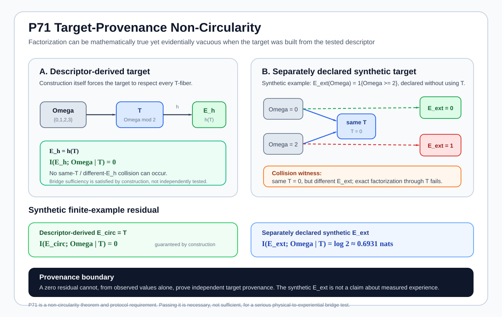
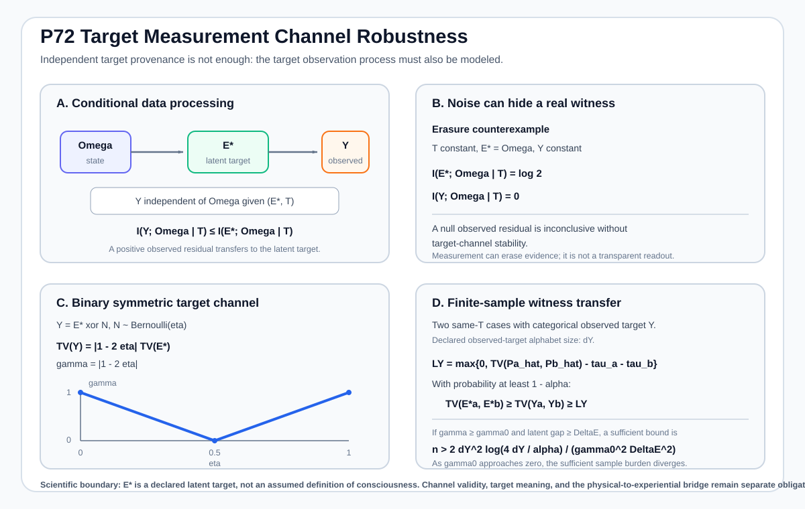
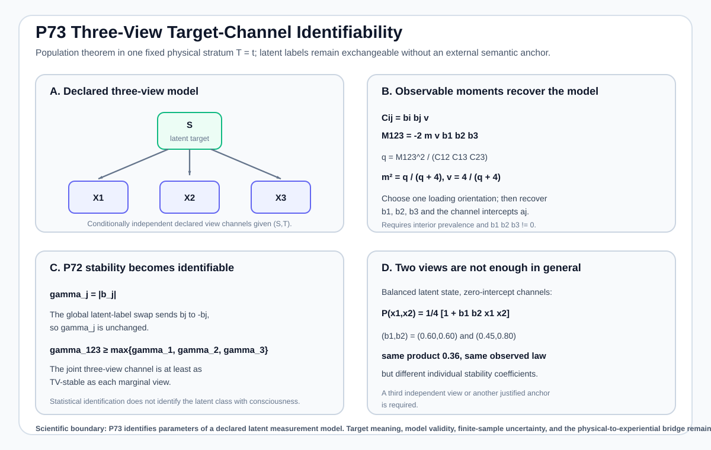
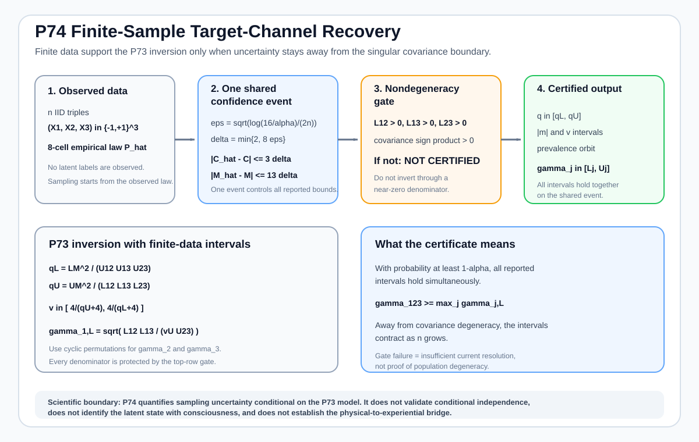
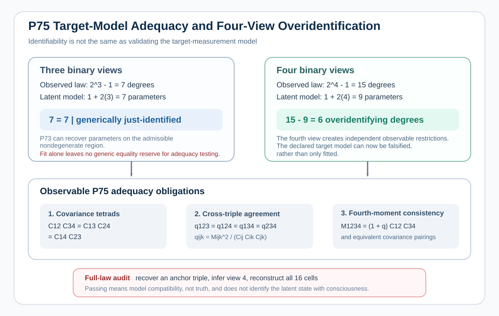
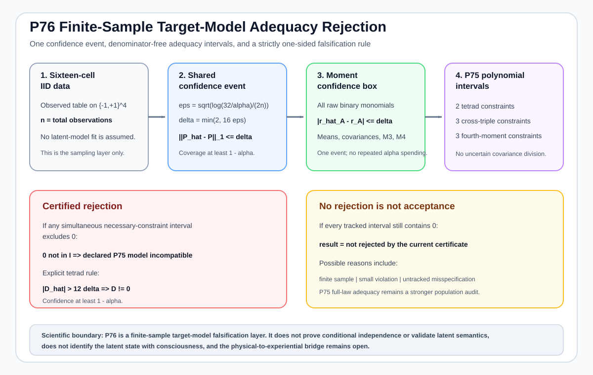
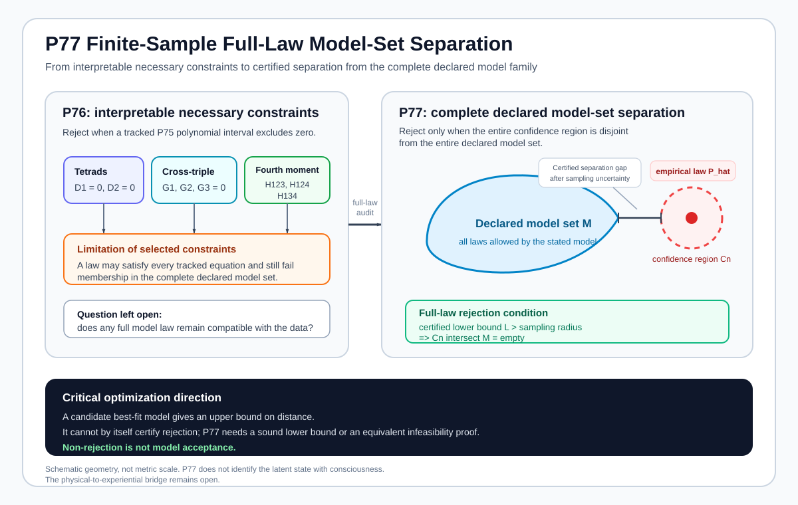
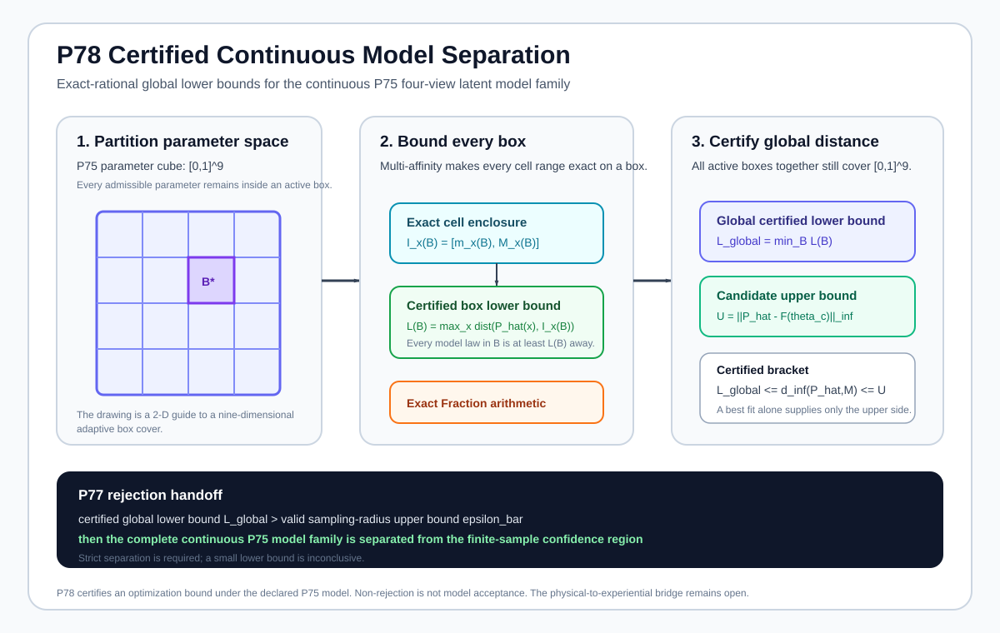

# Mathematical Consciousness Bridge

[](https://github.com/MahsaKeikha/mathematical-consciousness-bridge/actions/workflows/test.yml)
[](CITATION.cff)
[](LICENSE)

**Mahsa Keikha, PhD**

> **What mathematical and physical conditions would be required for a complete physical description of a system to support a scientifically testable claim about consciousness?**

This repository is a mathematical-physics research program for the **physical-to-experiential bridge problem**. It does not begin by assuming what consciousness is. It asks what must be true before any proposed physical description can legitimately be called sufficient for an independently specified experiential target, how that sufficiency can be falsified, and how finite experiments can distinguish a real bridge from correlation, representation choice, coarse-graining, target circularity, target-measurement error, unidentified target-channel reliability, or statistical noise.


**Figure 1. Scientific architecture of the project.** The research moves from physical dynamics to operationally measurable structure, then to mathematical sufficiency tests, target-side validity, finite-data certification, experimental design, and finally the still-open physical-to-experiential bridge. The arrows are logical dependencies, not claims that one layer has already been identified with consciousness.

---

# What this project is trying to achieve, in plain language

The question behind this project is simple to state, even though answering it rigorously is difficult: **if science could describe the physical state and behavior of a system in complete detail, would that description also be enough to determine what, if anything, is experienced by that system?**

Modern physics and neuroscience give us extraordinarily powerful ways to describe what physical systems are doing. We can measure electrical activity, chemistry, blood flow, behavior, responses to stimulation, information flow, causal influence, and many other properties. Quantum mechanics gives us an even more fundamental language for physical states, transformations, and measurement probabilities. These descriptions can tell us an enormous amount about structure and behavior. But none of them, by itself, establishes why a particular physical condition should correspond to a particular experience, or whether the physical description we chose contains every distinction that would matter for experience. That missing connection is what this project calls the **physical-to-experiential bridge**.

The purpose of this research is to study that missing connection without assuming the answer in advance. It does not begin by selecting one number, neural pattern, information measure, field, quantum effect, level of complexity, or other physical quantity and declaring that quantity to be consciousness. Instead, it treats every proposed connection between physical description and experience as a scientific claim that has to earn its validity step by step.

The first requirement is to define the physical side clearly. What exactly are we claiming to know about the system? Which variables, measurements, interventions, time scales, spatial scales, and physical relationships are included? The project then asks whether that description remains meaningful when we change coordinates, describe the same system at a different level of detail, examine it over time, or actively intervene on it. A serious bridge claim should not depend on an arbitrary representation, and it should not quietly lose important information when the system is coarse-grained or viewed at another scale.

The second requirement is to define the experiential target independently. If we want to test whether a physical description is sufficient for some distinction that is intended to represent experience, that distinction cannot simply be manufactured from the same physical data and then used as evidence that the physical data explain it. P71 formalizes this circularity problem. It shows why a target derived from the physical descriptor being tested can make a bridge appear successful even when the conclusion was built into the target from the beginning.

The third requirement is to ask how that target is actually observed. Experience is not a laboratory instrument reading that we can simply assume to be perfect. Reports can be incomplete, behavioral responses can fail, clinical judgments can be noisy, and any measurement process can lose or distort information. P72 therefore separates the underlying target from the way it is observed. Its broader lesson is important: a measurement process can weaken or even erase a real distinction. Failing to observe a difference is not automatically evidence that no difference exists.

The fourth requirement is to justify the reliability of the measurement itself. P73 asks when that reliability can be learned from several imperfect observations rather than simply assumed. In one deliberately restricted model, three conditionally independent binary views can identify the hidden measurement model and the reliability of the individual views, up to an unavoidable relabeling of the hidden states, provided the model is nondegenerate. Two views are not enough in general. The larger lesson is not that three measurements solve the consciousness problem. It is that **before a measurement is used as evidence for a physical-to-experiential claim, its reliability must itself be identifiable, independently calibrated, or honestly left uncertain.** Agreement between measurements is not enough if they can share the same bias or if the assumptions connecting them are wrong.

P74 asks the practical follow-up: **when those observations come from a finite experiment, are the data strong enough to trust the recovered measurement model?** It surrounds the recovered target-channel quantities with explicit uncertainty bounds and refuses to claim recovery when the data lie too close to a mathematically unstable boundary. When the data do support recovery under the declared model, P74 certifies not only measurement stability but also the underlying binary measurement-channel probabilities, while preserving the unavoidable ambiguity about which hidden label should receive which semantic meaning. In plain language, P73 asks when recovery is possible in principle; P74 asks when the available finite data justify trusting that recovery.

P75 asks whether successful recovery also validates the measurement model itself. It shows why the answer cannot be assumed from three binary views alone: that model is generically just-identified, so fitting it does not leave a generic independent equality check. A fourth binary view creates additional observable constraints. If those constraints fail, the target-measurement model is inadequate even if a three-view recovery looked mathematically well behaved. Passing the new checks means only that the data are compatible with the declared model, not that the model is uniquely true or that the latent state has been identified with consciousness.

P76 asks the next practical question: **if those model checks are applied to finite data, is an apparent failure large enough to distinguish from ordinary sampling noise?** It places the complete sixteen-cell observed table inside one shared confidence event and carries that uncertainty into the P75 adequacy constraints. If a required constraint is separated from zero even after uncertainty is included, the declared measurement model can be rejected with controlled confidence. If the data do not reject it, P76 deliberately does not call the model validated: non-rejection is not model acceptance. The sample may simply be too small, the violation may be too subtle, or the failure may lie outside the particular constraints being tested. In plain language, P75 explains what a valid four-view model must satisfy at the population level; P76 asks when finite data are strong enough to demonstrate that one of those requirements has genuinely failed.

P77 closes the next logical gap. P76 can reject the measurement model when one of its tracked mathematical requirements fails, but a model can in principle pass those selected checks and still fail to reproduce the complete pattern of observed outcomes. P77 therefore asks a stronger question: **after finite-sample uncertainty is included, is there any distribution allowed by the entire declared measurement model that is still compatible with the data?** If the whole confidence region around the observed distribution is separated from the whole model family, the model can be rejected. If the regions still overlap, the result remains inconclusive. P77 also makes a computational safeguard explicit: finding one imperfect best-fitting model is not enough to prove separation from every model in the family. A rejection requires a mathematically certified lower bound on the distance to the model set, or an equivalent certified proof that no admissible model lies inside the confidence region. In plain language, P76 tests interpretable necessary requirements; P77 defines the stronger full-distribution standard that a complete finite-data adequacy test must satisfy.

P78 addresses the computational problem that P77 deliberately leaves open for the continuous four-view target model. The P75 model does not contain a finite list of candidate distributions; it contains a continuous family generated by nine parameters. Testing a few parameter choices, or even finding an excellent numerical fit, cannot prove that every allowed model is far from the data. P78 therefore partitions the entire parameter region into boxes and computes a mathematically guaranteed lower bound for every box. Because those boxes still cover every allowed parameter choice, the smallest box bound is a genuine lower bound on the distance to the whole continuous model family. At the same time, any explicit candidate model supplies an upper bound. Refining the boxes narrows the gap between the two. The implementation keeps the empirical count law and the adaptive box boundaries in exact rational arithmetic so the global optimization certificate is not created by rounding a local floating-point optimizer. When the certified global lower bound is larger than a separately valid upper bound on the P77 sampling radius, the full continuous model family is rejected with the P77 statistical guarantee. A small lower bound remains inconclusive; P78 does not turn failure to reject into model validation.

Only after the physical description, the target, and the way the target is measured are all scientifically defensible does the central bridge question become meaningful: **does the physical description actually contain enough information to account for the target distinction?** One of the clearest ways to challenge a proposed bridge is to find two cases that are indistinguishable according to the declared physical description but remain distinguishable according to the independently justified target. Such a result would show that the declared physical description is not sufficient for that target.

That conclusion must also be interpreted carefully. Showing that one physical description is insufficient would not automatically prove that consciousness lies outside physics. The description may be too coarse, may omit a relevant physical variable, may use the wrong system boundary or scale, may rely on an inadequate measurement process, or may assume a bridge rule that is too restrictive. The aim is to identify exactly which assumption fails rather than turning one failed model into a metaphysical conclusion.

The opposite result also requires caution. If the physical description appears to predict the target perfectly, that is not automatically proof of a complete bridge. The target may have been defined circularly, the measurements may share hidden biases, the experiment may not have explored the cases that would separate competing explanations, or finite data may make two genuinely different situations look the same. A convincing positive result therefore has to survive attempts to expose these alternatives.

This is why the project treats uncertainty and falsification as part of the science rather than as afterthoughts. Real experiments contain finite data, noisy measurements, imperfect reconstructions, adaptive decisions, and competing explanations. The mathematics in the repository asks when an apparent result is strong enough to survive those uncertainties and when the scientifically correct conclusion is simply that the evidence is not yet sufficient. The same discipline applies to the quantum part of the project. A complete quantum description of a declared experiment is still not, by itself, a theory of experience. The additional connection between the physical description and the experiential target still has to be stated, justified, and tested.

The many equations, theorems, simulations, figures, and optimization results in this repository therefore serve one larger purpose. They are not separate attempts to invent a formula for consciousness. They are pieces of a scientific **test architecture**. Some results establish what a valid physical description must preserve. Some determine whether a target has been defined circularly. Some quantify what noisy observation can hide. Some ask whether measurement reliability can be identified. P74 adds the requirement that such recovery survive finite-data uncertainty. P75 then asks whether the recovered target-measurement model survives independent adequacy checks rather than merely fitting the observations used to identify it. P76 adds the requirement that an apparent adequacy failure survive finite-sample uncertainty before it is called a model rejection. P77 then asks the stronger full-law question: whether the complete finite-sample confidence region is separated from the entire declared target-measurement model, while refusing to treat an uncertified local best fit as proof of global incompatibility. P78 supplies a certified continuous-family lower-bound procedure for the specific P75 model by exploiting its multi-affine parameterization and exact-rational box refinement. Others examine changes of physical scale, test quantum descriptions, design experiments, protect validity under adaptive sampling, or make experiments more efficient. Together they are intended to remove hidden assumptions one by one.

A successful outcome would therefore not be a single impressive equation labeled "consciousness." It would be a defensible chain of inference: a clearly specified physical system, a physical description that is operationally meaningful and robust to representation and scale, an independently justified experiential target, a trustworthy and reliability-characterized way of observing that target, a bridge rule that survives uncertainty and competing explanations, and experiments capable of proving that rule wrong if it is false. A strong negative result would be equally valuable if it showed precisely where a proposed physical description or bridge fails.

That is the purpose of the **Mathematical Consciousness Bridge**: **to transform the broad question of how physical reality relates to experience into a sequence of precise scientific obligations that can be examined, tested, falsified, and improved one by one, without hiding the hardest part of the problem inside an assumption.**

The research currently contains **78 proposition-level results** and **66 equation-driven quantitative figures**. The theorem frontier is P78. These results build the test architecture and close specific mathematical gaps, but the physical-to-experiential bridge itself remains open.

This project continues [Spatiotemporal Observer Mathematics](https://github.com/MahsaKeikha/spatiotemporal-observer-math), which addresses the prior physical problem of identifying a persistent moving subsystem from measured dynamics.

---

# Abstract

Let $\Omega$ denote the physically admissible state or history space, let $T:\Omega\to\mathcal T$ be a declared physical descriptor, and let $E:\Omega\to\mathcal E$ be an independently specified target representing the distinctions a proposed bridge claims to explain. The deterministic bridge question is whether there exists a map $B$ such that $E=B\circ T$. The stochastic version asks whether the conditional target law factors through $T$, equivalently whether the residual $I(E;\Omega\mid T)$ vanishes under the declared probabilistic model. The smooth version yields a differential rank obstruction.

The program then develops the structures required to make those tests scientifically meaningful: intervention-conditioned response laws, causal influence, temporal continuation, composition defects, coarse-graining and reconstruction bounds, multiscale operational quotients, finite-sample confidence certificates, quantum-state model-set tests, adaptive experiment design, scheduling, and certified resource allocation.

P71 adds a non-circularity theorem: if a target is constructed as $E=h(T)$, or through a descriptor-only stochastic channel, successful factorization is guaranteed by construction and has no independent evidential force. P72 adds a target-measurement theorem. If an independently justified latent target $E^\star$ is observed as $Y$ through a declared nondifferential channel satisfying $Y\perp\!\!\!\perp\Omega\mid(E^\star,T)$, then

$$
\boxed{I(Y;\Omega\mid T)\le I(E^\star;\Omega\mid T).}
$$

Target measurement can therefore attenuate or erase a genuine population witness, but under that model it cannot create a positive observed residual from a latent target already screened off by $T$. P72 also gives total-variation witness bounds, an exact binary symmetric attenuation factor, and a conservative finite-sample target-separation certificate.

P73 addresses the channel-identification problem. In one fixed physical stratum, let a binary latent target $S\in\{-1,+1\}$ generate three conditionally independent binary target views with $\mathbb E[X_j\mid S]=a_j+b_jS$. Under interior prevalence and nonzero loadings, observable pair covariances and the third centered moment identify the latent prevalence and all three view channels up to a common latent-label swap. The P72 single-view stability coefficients are $\gamma_j=|b_j|$ and are invariant under that swap. P73 also gives an exact two-view counterexample showing that individual channel reliabilities are not generally identifiable from only two views.

P74 adds finite-sample certification to the P73 inversion. One simultaneous Hoeffding event for the eight-cell observed law yields conservative bounds on means, pair covariances, and the third centered moment. A nondegeneracy gate refuses inversion when covariance confidence intervals reach zero. When the gate passes and the P73 sign structure is compatible, the same confidence event propagates to the latent-prevalence orbit, all three stability coefficients, channel offsets, and the full binary target-view channels reported up to the unavoidable common latent-label swap. P74 is conditional on the P73 model and IID sampling; it does not validate conditional independence or the semantic meaning of the latent target.

P75 separates identifiability from target-model adequacy. Three binary views and one binary latent state have equal generic continuous dimension, so successful P73 recovery does not by itself provide an independent equality-based goodness-of-fit test. A fourth binary view creates six generic overidentifying degrees of freedom. P75 derives covariance tetrads, cross-triple latent-imbalance consistency, a fourth-centered-moment relation, and a full sixteen-cell reconstruction audit. These are conditional statistical model checks, not an experiential ontology.

P76 adds finite-sample target-model rejection. From one IID sample of the sixteen-cell four-view law, a shared Hoeffding event controls the full empirical distribution and every binary raw moment simultaneously. The theorem propagates that event to covariance tetrads and to denominator-free polynomial forms of the P75 cross-triple and fourth-moment constraints. If any necessary-constraint interval excludes zero, the declared P75 target-measurement model is rejected with confidence at least $1-\alpha$. Non-rejection remains inconclusive and is not model acceptance.

P77 strengthens that finite-data adequacy layer from selected necessary constraints to the complete declared observed-law model set. For a finite alphabet of size $K$, one simultaneous empirical-law event gives $\|\widehat P-P\|_\infty\le\varepsilon_{n,K}$ and $\|\widehat P-P\|_1\le\delta_{n,K}$ with probability at least $1-\alpha$. If the corresponding confidence region is disjoint from the declared model family $\mathcal M$, equivalently if a sound lower bound on empirical distance to $\mathcal M$ exceeds the sampling radius, the model is rejected at the same confidence level. A numerical candidate fit supplies only an upper bound on distance and cannot by itself certify rejection of a continuous model family.

P78 supplies a certified continuous-family lower bound for the P75 four-view binary latent model. Its sixteen observed cell probabilities are multi-affine functions of nine parameters. On every axis-aligned parameter box, exact coordinatewise cell ranges give a rigorous lower bound $L_\infty(B;\widehat P)$ on the distance from the empirical law to every model law generated in that box. For any finite box partition $\mathcal B$ of the complete parameter cube, $L_{\mathcal B}=\min_{B\in\mathcal B}L_\infty(B;\widehat P)$ is therefore a valid global lower bound on $d_\infty(\widehat P,\mathcal M_{4,2})$. An explicit parameter point gives an upper bound, and a parameter-space Lipschitz argument gives the mesh guarantee $0\le d_\infty-L_{\mathcal B}\le\eta(\mathcal B)$. The implementation uses exact rational arithmetic for empirical counts and dyadic box refinement. P78 is a computational certification theorem under the declared P75 model, not an experiential ontology.

These results establish a rigorous **test architecture**, not a completed ontology of consciousness.

---

# Scientific status discipline

| Status | Meaning in this project |
| --- | --- |
| **Definition** | A mathematical object introduced for the framework. |
| **Proved** | A theorem derived from explicit assumptions. |
| **Implemented** | Executable code mirrors a stated theorem or procedure. |
| **Numerically verified** | A simulation or computation checks an implementation or example. |
| **Empirically supported** | The statement depends on external published experimental evidence. |
| **Synthetic example** | A controlled example used to expose logic, failure modes, or calibration behavior. |
| **Hypothesis** | A scientifically motivated proposal not yet established by theorem or experiment. |
| **Open bridge problem** | A physical-to-experiential identification has not been derived. |

This distinction is central. The repository **does not assume that a physical quantity is consciousness**. It does not identify consciousness with entropy, integration, complexity, synchronization, entanglement, coherence, measurement, a state of matter, or an additional spacetime coordinate.

**Quantum mechanics does not by itself imply consciousness.** A complete quantum state specifies the outcome statistics of declared measurements, but an experiential conclusion requires an additional bridge statement unless that bridge is independently derived.

Likewise, a latent target symbol such as $E^\star$ or $S$ is not a declaration of experiential ground truth. P71-P78 formalize separate requirements on target provenance, observation, channel identifiability, finite-data recovery, model adequacy, and finite-sample model rejection before such a target can carry bridge evidence.

---

# The core scientific thesis in one view

A descriptor $T$ partitions the admissible physical domain into fibers

$$
[\omega]_T=\{\omega'\in\Omega:T(\omega')=T(\omega)\}.
$$

A deterministic bridge through $T$ can exist only if the target is constant on every fiber:

$$
\boxed{
T(\omega_1)=T(\omega_2),
\quad
E(\omega_1)\ne E(\omega_2)
\quad\Longrightarrow\quad
E\ne B\circ T.
}
$$

The stochastic analogue uses

$$
\boxed{R_{\mathrm{stoch}}(T)=I(E;\Omega\mid T).}
$$

But those equations have evidential content only after additional target-side questions are answered: Was $E$ constructed independently of the factorization being tested? If $E$ is latent, does the observation process preserve its distinctions rather than manufacture or erase them? Is the reliability of that observation channel identified, externally calibrated, or merely assumed? If it is estimated from data, is that recovery itself certified under finite uncertainty?

| Layer | Mathematical object | Scientific question | Failure witness |
| --- | --- | --- | --- |
| Physical description | $T(\omega)$ | Is the declared physics represented without arbitrary coordinate dependence? | Representation or identifiability failure |
| Operational structure | response laws and causal geometry | Do interventions expose physically meaningful distinctions? | Collision or missing causal distinction |
| Target provenance | target-construction protocol | Was the target defined independently of the tested descriptor? | Descriptor-derived target, P71 |
| Target measurement | $K_t(y\mid e)$ | Does noisy observation preserve the relevant target distinctions? | Erasure or differential measurement, P72 |
| Target-channel identification | multi-view target law | Is target reliability identified rather than assumed? | Nonidentifiability or model degeneracy, P73 |
| Finite target-channel recovery | confidence set for latent and channel parameters | Are the recovered target-channel quantities supported away from the inversion singularity? | Nondegeneracy gate failure or model incompatibility, P74 |
| Target-model adequacy | four-view latent-model restrictions | Does the identified target-measurement model survive independent observable constraints? | Tetrad, cross-triple, fourth-moment, or full-law reconstruction failure, P75 |
| Finite target-model adequacy | simultaneous P75 constraint intervals | Is an apparent adequacy failure larger than finite-sample uncertainty? | Any necessary-constraint interval excludes zero, P76 |
| Bridge sufficiency | $E=B\circ T$ | Is the target constant on physical fibers? | Same $T$, different $E$ |
| Stochastic sufficiency | $I(E;\Omega\mid T)$ | Is target-relevant information left outside $T$? | Certified positive residual |
| Scale stability | coarse-graining plus reconstruction | Does relevant physical structure survive a change of resolution? | Uncontrolled reconstruction or distortion |
| Quantum sufficiency | $\rho$, channels, measurement statistics | Does the target factor through the declared operational quantum state? | Regularity-aware non-factorization witness |
| Finite experiment | confidence regions and stopping rules | Can a witness survive uncertainty and adaptive sampling? | Confidence or design assumptions fail |

This is the scientific contribution of the project at its current stage: **a bridge claim is decomposed into separately auditable mathematical obligations instead of being hidden inside a single proposed consciousness quantity.**

---

# How to read this study

The main page is organized as a scientific argument rather than a chronological project log. Detailed proposition chronology and downstream calibration mathematics are linked separately.

| Reader question | Main entry point |
| --- | --- |
| What is the scientific problem? | [Abstract](#abstract) and [Section 1](#1-mathematical-formulation-of-the-bridge-problem) |
| What is being measured? | [Section 2](#2-from-physical-dynamics-to-operational-structure) and [measurement map](docs/figures/conscious_state_measurement_map.svg) |
| How do we avoid circular targets? | [P71](docs/proposition_71_target_provenance_noncircularity.md) |
| How do noisy target measurements affect evidence? | [P72](docs/proposition_72_target_measurement_channel_robustness.md) |
| When can target-channel reliability be identified? | [P73](docs/proposition_73_target_channel_identifiability.md) |
| When is finite-sample target-channel recovery trustworthy? | [P74](docs/proposition_74_finite_sample_target_channel_recovery.md) |
| How is the target-measurement model itself tested? | [P75](docs/proposition_75_target_model_adequacy_overidentification.md) |
| When can finite data actually reject that target model? | [P76](docs/proposition_76_finite_sample_target_model_adequacy.md) |
| What has been proved? | [Theorem roadmap](docs/theorem_roadmap.md) and [What has actually been established](#what-has-actually-been-established) |
| What remains unknown? | [What remains open](#what-remains-open), [Research navigation](docs/research_navigation.md), and [Detailed proposition record](docs/detailed_proposition_record.md) |
| What would falsify a candidate bridge? | [Falsification logic](#falsification-logic) |
| Where is the downstream calibration mathematics? | [Calibration and Optimization Frontier](docs/calibration_optimization_frontier_p61_p70.md) |


**Figure 2. Scientific proof ladder.** A credible consciousness bridge must pass distinct layers: physical well-definedness, experiential well-definedness, non-circular bridge premises, representation invariance, physical-feature sufficiency, experimental recoverability, competing-theory discrimination, finite-data support, and explicit falsification. The figure is a requirements map, not a claim that every layer has already been closed.

---

# Research at a glance

| Stage | Results | Scientific question | Status | Main entry point |
| --- | --- | --- | --- | --- |
| 1. Foundations and identifiability | **P1-P10** | What must be invariant, distinguishable, recoverable, and statistically testable? | Proved / implemented / tested | [Theorem roadmap](docs/theorem_roadmap.md) |
| 2. Causal, temporal, compositional, and scale structure | **P11-P18** | Which physical distinctions survive interventions, time, composition, and coarse-graining? | Proved / implemented / tested | [Quantitative atlas](docs/quantitative_physics_mathematics_atlas.md) |
| 3. Bridge sufficiency and target validity | **P19-P24, P71-P78** | Does an independently justified, adequately measured, reliability-characterized, and finite-data-certified target factor through the physical descriptor? | Proved under declared models | [Research navigation](docs/research_navigation.md) |
| 4. Multiscale operational structure | **P25-P37** | Which causal and response structures survive node, state, intervention, and delay quotients? | Proved / implemented / tested | [Theorem roadmap](docs/theorem_roadmap.md) |
| 5. Quantum sufficiency and falsification | **P38-P44** | What follows from a declared operational quantum description, and what does not? | Conditional tests proved; ontology open | [Quantum foundations](docs/quantum_foundations_and_bridge_test.md) |
| 6. Adaptive experiment design and scheduling | **P45-P60** | How should evidence gathering, stopping, service allocation, switching, and calibration be organized? | Proved / implemented / tested | [Equation and citation map](docs/equation_and_citation_map.md) |
| 7. Calibration and integer optimization | **P61-P70** | How should downstream finite calibration resources be allocated and certified? | Proved / implemented / tested | [Calibration and Optimization Frontier](docs/calibration_optimization_frontier_p61_p70.md) |

The dependency-oriented theorem map covers **P1 through P78 with explicit dependency branches**.


**Figure 3. Theorem dependency map.** Proposition numbers preserve development order, while the dependency map shows scientific order. P71-P78 return to the P19 target-sufficiency lineage; P61-P70 remains a separate downstream optimization branch.

---

# 1. Mathematical formulation of the bridge problem

## 1.1 Physical states, descriptors, and targets

Let

$$
\Omega=\{\text{physically admissible states or histories}\},
\qquad
T:\Omega\to\mathcal T.
$$

Independently, let

$$
E:\Omega\to\mathcal E
$$

represent the target distinctions the proposed bridge claims to determine.

| Symbol | Role | Scientific requirement |
| --- | --- | --- |
| $\Omega$ | admissible states or histories | declared relative to a physical model and experiment class |
| $T$ | physical descriptor | operationally defined, representation-aware, and recoverable |
| $E$ | target | justified independently enough to avoid definitional circularity |
| $E^\star$ | latent target in P72 | not assumed to be consciousness; its provenance and measurement must be justified |
| $Y$ | observed target measurement | related to $E^\star$ through an explicit observation model |
| $S$ | binary latent target in P73-P76 | statistical latent variable whose semantic meaning requires independent justification |
| $X_j$ | target view in P73-P76 | one of the declared binary observations used to identify, certify, and test target-channel models under explicit assumptions |
| $B$ | candidate bridge law | maps physical equivalence classes to target distinctions |

The target is intentionally not equated with verbal report or overt responsiveness. Dreaming, anesthesia, perturbational complexity, and covert command-related brain activation motivate keeping behavior, report, neural evidence, and experiential inference distinct.


**Figure 4. Measurement and dissociation map.** Behavioral responsiveness, subjective report, perturbational complexity, and command-related brain activation are different evidence channels. A bridge theory must state which observable pattern it predicts and what target those observations are claimed to measure.

## 1.2 Exact deterministic sufficiency

The physical descriptor is exactly sufficient for the target if

$$
\boxed{E=B\circ T.}
$$

Equivalently,

$$
\boxed{
T(\omega_1)=T(\omega_2)
\Longrightarrow
E(\omega_1)=E(\omega_2).
}
$$

One exact same-$T$/different-$E$ pair rules out factorization through the declared descriptor.

## 1.3 Stochastic sufficiency

For finite stochastic variables,

$$
\boxed{R_{\mathrm{stoch}}(T)=I(E;\Omega\mid T).}
$$

If $T_f$ refines $T_c$ through $T_c=c\circ T_f$, P21 gives

$$
\boxed{
R_{\mathrm{stoch}}(T_c)-R_{\mathrm{stoch}}(T_f)
=I(E;T_f\mid T_c).
}
$$

## 1.4 Smooth differential obstruction

If a differentiable local bridge exists, then

$$
dE_x=dB_{T(x)}\circ dT_x,
$$

so

$$
\boxed{\operatorname{rank}(dE_x)\le\operatorname{rank}(dT_x).}
$$

A positive rank excess supplies a local obstruction to the declared smooth factorization.


**Figure 5. The logical gap being tested.** Fundamental physical theory determines physical structure and operational predictions. A consciousness theory still requires a justified map from physical equivalence classes to target equivalence classes.

## 1.5 P71: target provenance cannot be circular

If the target is defined from the tested descriptor,

$$
E_h=h(T),
$$

then

$$
E_h=h\circ T,
\qquad
I(E_h;\Omega\mid T)=0
$$

hold by construction. A held-out learned rule $h_D(T)$ remains descriptor-derived after training. P71 also proves that an observed zero residual cannot, from the joint law alone, establish that the target had independent provenance.



**Figure 6. P71 non-circularity theorem.** A descriptor-derived target automatically respects descriptor fibers, whereas a separately declared synthetic target can expose same-descriptor/different-target collisions. The synthetic example illustrates theorem logic; it is not claimed to be an experiential variable.

Direct proof: [Proposition 71](docs/proposition_71_target_provenance_noncircularity.md).

## 1.6 P72: noisy target observation is a separate scientific layer

Let $E^\star$ be a latent target that has passed the P71 provenance requirement and let $Y$ be its observation. Under

$$
\boxed{Y\perp\!\!\!\perp\Omega\mid(E^\star,T),}
$$

P72 proves

$$
\boxed{I(Y;\Omega\mid T)\le I(E^\star;\Omega\mid T).}
$$

Thus a certified positive observed population residual transfers to the latent target under the measurement model. A zero observed residual does not transfer in the opposite direction because an erasing channel can hide a positive latent residual.

For a finite target channel $K_t$, P72 defines a stability coefficient $\gamma_t$ and obtains a two-sided total-variation stability relation. For binary symmetric measurement noise with error rate $\eta$,

$$
\boxed{\gamma=|1-2\eta|.}
$$



**Figure 7. P72 target-measurement theorem.** Nondifferential target noise can attenuate or erase a real bridge witness, but cannot create a positive population residual from a screened-off latent target. The binary channel exposes the exact erasure point, and the finite-data panel shows how measurement stability enters the sample burden.

Direct proof: [Proposition 72](docs/proposition_72_target_measurement_channel_robustness.md). Equation classification: [P72 provenance record](docs/p72_equation_provenance.md).

## 1.7 P73: target-channel reliability can sometimes be identified

P72's stability coefficient is useful only if it is scientifically justified. P73 gives an explicit population-identification result for one deliberately narrow model. In a fixed physical stratum $T=t$, let $S\in\{-1,+1\}$ be a binary latent target and let $X_1,X_2,X_3$ be three binary views that are conditionally independent given $S$. Write

$$
\mathbb E[X_j\mid S]=a_j+b_jS.
$$

With $m=\mathbb E[S]$ and $v=1-m^2$, the observable moments obey

$$
\boxed{C_{ij}=b_ib_jv,}
\qquad
\boxed{M_{123}=-2mv\,b_1b_2b_3.}
$$

For nonzero loadings and interior prevalence,

$$
q=\frac{M_{123}^2}{C_{12}C_{13}C_{23}},
\qquad
\boxed{m^2=\frac{q}{q+4},\quad v=\frac4{q+4}.}
$$

The remaining channel parameters are recovered after choosing one algebraic latent-label orientation. The common label swap remains observationally invisible, but the P72 stability coefficients do not depend on that orientation:

$$
\boxed{\gamma_j=|b_j|.}
$$

P73 also proves that two views are not enough in general. Under balanced prevalence and zero-intercept channels, the complete two-view law depends only on $b_1b_2$, so different individual reliabilities can generate exactly the same observed law.



**Figure 8. P73 target-channel identifiability theorem.** Three nondegenerate conditionally independent binary views identify the declared latent-channel model up to a common label swap and identify the P72 stability quantities exactly at the population level. The two-view panel shows the constructive non-identifiability boundary. Statistical recovery does not identify the latent class with consciousness.

Direct proof: [Proposition 73](docs/proposition_73_target_channel_identifiability.md). Equation and literature classification: [P73 provenance record](docs/p73_equation_provenance.md).

## 1.8 P74: finite samples must certify target-channel recovery

P73 is a population theorem. P74 asks whether its nonlinear recovery can be trusted from a finite IID sample of the three observed views. Let $\widehat P$ be the empirical law on the eight possible binary triples. P74 builds one simultaneous confidence event for the complete observed law and derives conservative moment radii, including

$$
\boxed{|\widehat C_{ij}-C_{ij}|\le3\delta_n,}
\qquad
\boxed{|\widehat M_{123}-M_{123}|\le13\delta_n.}
$$

The theorem does not invert P73 whenever the empirical covariances merely happen to be nonzero. It requires lower confidence margins on all three absolute pair covariances to remain strictly positive. If that gate fails, the result is **not certified by the current data**, rather than an extrapolation through a singular inverse problem.

When the gate passes, P74 propagates the same confidence event through the P73 inversion to obtain simultaneous intervals for the latent-prevalence orbit and all three stability coefficients. It also uses

$$
\boxed{b_jm=-\frac{M_{123}}{2C_{k\ell}}}
$$

for the complementary pair $k,\ell$ to recover the label-invariant product $b_jm$, then the channel offset $a_j=\mu_j-b_jm$. Together with $\gamma_j=|b_j|$, this yields a confidence set for the full binary target-view channel as an unordered pair of latent-conditioned response probabilities. The unordered form preserves the P73 global label-swap symmetry instead of inventing a semantic orientation.



**Figure 9. P74 finite-sample recovery certificate.** A single empirical-law confidence event feeds a covariance nondegeneracy gate and then the P73 inversion. Certified outputs include latent-prevalence, stability, channel-offset, and binary-channel probability intervals. Failure of the gate means the current finite data do not safely support inversion; it is not evidence that the true population is degenerate.

Direct proof: [Proposition 74](docs/proposition_74_finite_sample_target_channel_recovery.md). Equation classification: [P74 provenance record](docs/p74_equation_provenance.md).

## 1.9 P75: identifiability does not by itself validate the target model

P73 identifies a nondegenerate three-view binary latent model, and P74 asks when finite data certify that recovery. P75 asks the logically separate adequacy question: does a recovered model satisfy observable constraints that were not already consumed by identification?

For \(k\) binary observed target views, the complete observed law has

$$
d_{\mathrm{obs}}(k)=2^k-1
$$

free probabilities. One binary latent state with \(k\) binary view channels has

$$
d_{\mathrm{model}}(k)=1+2k
$$

continuous parameters. Therefore

$$
\boxed{d_{\mathrm{obs}}(3)=7=d_{\mathrm{model}}(3),}
$$

so the nondegenerate three-view model is generically just-identified. This does not mean every three-view probability law belongs to the real stochastic model. Positivity, nondegeneracy, and valid-channel restrictions still matter. It means successful three-view parameter recovery does not generically leave an independent equality constraint with which to validate the conditional-independence assumption.

A fourth binary view changes the dimension count to

$$
\boxed{15-9=6}
$$

generic overidentifying degrees of freedom. Under the declared conditional-independence model, observable pair covariances must satisfy

$$
\boxed{C_{12}C_{34}=C_{13}C_{24}=C_{14}C_{23}.}
$$

Every nondegenerate three-view subset must also recover the same latent-imbalance ratio,

$$
\boxed{
q_{ijk}=\frac{M_{ijk}^2}{C_{ij}C_{ik}C_{jk}}
=\frac{4m^2}{1-m^2},
}
$$

and the fourth centered moment must satisfy

$$
\boxed{M_{1234}=(1+q)C_{12}C_{34}}
$$

with the equivalent covariance pairings.

The executable P75 audit is stricter than checking only those displayed moment identities. It recovers an anchor P73 triple, infers the fourth binary channel, reconstructs all sixteen cells of the four-view observable law, and compares that complete reconstruction with the observed law. A synthetic residual-dependence perturbation is required to fail the audit.



**Figure 10. P75 target-model adequacy theorem.** Three binary views are generically just-identified under the declared latent model. A fourth view creates six generic overidentifying degrees of freedom and observable adequacy obligations. Passing means compatibility with the declared model, not proof that the model is uniquely true, and not identification of the latent state with consciousness.

Direct proof: [Proposition 75](docs/proposition_75_target_model_adequacy_overidentification.md). Equation and literature classification: [P75 provenance record](docs/p75_equation_provenance.md).

## 1.10 P76: finite data must separate model failure from sampling noise

P75 gives population-level restrictions. P76 asks when a finite IID sample is already strong enough to reject the declared four-view target-measurement model.

For the empirical sixteen-cell law $\widehat P$, define

$$
\varepsilon_n(\alpha)=\sqrt{\frac{\log(32/\alpha)}{2n}},
\qquad
\boxed{\delta_n(\alpha)=\min\{2,16\varepsilon_n(\alpha)\}.}
$$

With probability at least $1-\alpha$, the same event controls every binary raw monomial moment. In particular, every pair covariance satisfies

$$
\boxed{|\widehat C_{ij}-C_{ij}|\le3\delta_n.}
$$

For either P75 tetrad residual $D$, P76 obtains

$$
\boxed{|\widehat D-D|\le12\delta_n.}
$$

Therefore

$$
\boxed{|\widehat D|>12\delta_n\quad\Longrightarrow\quad D\ne0}
$$

on the shared confidence event, which certifies incompatibility with the declared P75 model. P76 also rewrites the P75 cross-triple and fourth-moment consistency conditions as denominator-free polynomials and propagates the same empirical-law event through interval arithmetic. This avoids unstable division by uncertain covariance products.



**Figure 11. P76 finite-sample adequacy rejection.** One simultaneous sixteen-cell confidence event controls the raw moments and the P75 polynomial constraints. Excluding zero from any necessary-constraint interval certifies model incompatibility. If no interval excludes zero, the result remains inconclusive; it is not model acceptance and does not identify the latent state with consciousness.

Direct proof: [Proposition 76](docs/proposition_76_finite_sample_target_model_adequacy.md). Equation and literature classification: [P76 provenance record](docs/p76_equation_provenance.md).

## 1.11 P77: full-law confidence regions can reject the complete declared model set

P76 tests a transparent family of necessary P75 polynomial constraints. P77 asks the stronger finite-data question: does the complete confidence region for the observed law intersect the complete declared model family at all?

For a finite alphabet of size $K$, define

$$
\boxed{\varepsilon_{n,K}(\alpha)=\sqrt{\frac{\log(2K/\alpha)}{2n}}}
$$

and

$$
\boxed{\delta_{n,K}(\alpha)=\min\{2,K\varepsilon_{n,K}(\alpha)\}.}
$$

With probability at least $1-\alpha$,

$$
\|\widehat P-P\|_\infty\le\varepsilon_{n,K},
\qquad
\|\widehat P-P\|_1\le\delta_{n,K}.
$$

Let $\mathcal M$ be the complete declared observed-law model set. P77 gives the full-law rejection rule

$$
\boxed{\mathcal C_n(\widehat P)\cap\mathcal M=\varnothing
\quad\Longrightarrow\quad
P\notin\mathcal M.}
$$

Equivalently, if a mathematically certified lower bound on $d(\widehat P,\mathcal M)$ exceeds the sampling radius in the same norm, the model is rejected on the shared confidence event. Distance to a nonempty set is 1-Lipschitz, so the same event also transports empirical model distance into a confidence interval for population distance to the model family.

The optimization direction is scientifically important. A candidate best-fit model $Q^\star\in\mathcal M$ gives $d(\widehat P,\mathcal M)\le\|\widehat P-Q^\star\|$, which is an upper bound on the unknown minimum distance. It cannot by itself certify rejection. P77 requires a sound lower bound or an equivalent certified feasibility result before declaring a continuous model family incompatible.



**Figure 12. P77 full-law model-set separation.** P76 provides interpretable finite-sample rejection through selected necessary constraints. P77 defines the stronger full-law criterion: the entire confidence region must be separated from the entire declared model set. An ordinary best-fit candidate is not a rejection certificate because it gives an upper bound on model distance.

Direct proof: [Proposition 77](docs/proposition_77_full_law_model_set_separation.md). Equation and literature classification: [P77 provenance record](docs/p77_equation_provenance.md). Implementation: [`full_law_model_set_separation.py`](src/consciousness_bridge/full_law_model_set_separation.py). Tests: [`test_full_law_model_set_separation.py`](tests/test_full_law_model_set_separation.py).

## 1.12 P78: certified continuous separation for the P75 model family

P77 says that full-law rejection requires a sound lower bound on distance to the complete declared model set. P78 constructs such a bound for the continuous P75 four-view binary latent family.

Let

$$
\theta=(\pi,q_{1,-},q_{1,+},\ldots,q_{4,-},q_{4,+})\in[0,1]^9
$$

parameterize the P75 model law $F(\theta)$. Every observed cell probability is multi-affine in these nine parameters. For an axis-aligned parameter box $B$, P78 computes the exact cell interval

$$
I_x(B)=[m_x(B),M_x(B)]
$$

and defines

$$
\boxed{L_\infty(B;\widehat P)=\max_x\operatorname{dist}(\widehat P(x),I_x(B)).}
$$

For every $\theta\in B$,

$$
\|\widehat P-F(\theta)\|_\infty\ge L_\infty(B;\widehat P).
$$

If $\mathcal B$ is any finite partition of the complete parameter cube, then

$$
\boxed{L_{\mathcal B}(\widehat P):=\min_{B\in\mathcal B}L_\infty(B;\widehat P)\le d_\infty(\widehat P,\mathcal M_{4,2}).}
$$

Any explicit admissible parameter vector supplies an upper bound on the same minimum distance. In addition, every cell map is 1-Lipschitz with respect to parameter $L^1$, giving the mesh certificate

$$
\boxed{0\le d_\infty(\widehat P,\mathcal M_{4,2})-L_{\mathcal B}(\widehat P)\le\eta(\mathcal B),}
$$

where $\eta(\mathcal B)$ is the largest summed side width among active boxes. Refinement therefore closes the certified optimization gap.

The implementation uses exact `Fraction` arithmetic for empirical count laws and dyadic branch points. This protects the optimization lower-bound direction from ordinary floating-point local-fit claims. Statistical rejection still requires a separately valid upper bound on the P77 sampling radius.



**Figure 13. P78 certified continuous model separation.** The complete nine-parameter P75 cube is covered by adaptive boxes. Exact multi-affine cell enclosures produce boxwise lower bounds, their minimum is a global lower bound, and explicit admissible parameters supply upper bounds. P77 rejection is triggered only when the certified global lower bound exceeds a valid sampling-radius upper bound.

Direct proof: [Proposition 78](docs/proposition_78_certified_continuous_model_separation.md). Equation and literature classification: [P78 provenance record](docs/p78_equation_provenance.md). Implementation: [`certified_continuous_model_separation.py`](src/consciousness_bridge/certified_continuous_model_separation.py). Tests: [`test_certified_continuous_model_separation.py`](tests/test_certified_continuous_model_separation.py).


---

# 2. From physical dynamics to operational structure

A useful bridge test cannot depend only on coordinates or passive correlations. P11 builds an intervention-resolved physical candidate from response geometry, directed influence, and partition irreducibility.


**Figure 14. Anatomy of the operational physical candidate.** Controlled interventions generate response distributions. Distances define response geometry; matched perturbations define directed influence; comparisons with partition-product nulls expose irreducibility. These are physical candidates to be tested for sufficiency, not definitions of consciousness.


**Figure 15. Response laws as a physical geometry.** Parameterized intervention-conditioned probability laws can be studied using operational distances and local statistical geometry. An experiential geometry would still require a separately justified bridge.

P12 then uses constructive collisions to show why compressed components or attractive scalars cannot simply be assumed sufficient.


**Figure 16. Constructive collision tests.** A compressed physical feature must earn sufficiency by factorization or reconstruction, not by visual plausibility or correlation.

---

# 3. Time, composition, and scale cannot be ignored

P14 treats temporal continuation as a path property rather than endpoint identity.


**Figure 17. Temporal continuation.** Representation-equivalent descriptions are quotiented out while local structural changes are accumulated along a trajectory. Endpoint equality alone cannot certify a continuous physical history.

For deterministic coarse observation, total variation contracts. P18 adds an approximate reconstruction condition that bounds the distortion of the relevant response geometry.


**Figure 18. Scale sufficiency logic.** Coarse-graining can erase distinctions, but reconstruction control bounds how much declared response geometry was lost.


**Figure 19. Multiscale hierarchy.** A scientifically credible descriptor must state which objects survive changes of scale, which require compatibility conditions, and which acquire bounded distortion.

---

# 4. Turning a population theorem into a finite experiment

Exact mathematical insufficiency becomes scientifically useful only when finite observations support it with controlled error.

P20 constructs a finite-sample confidence interval for the P19 conditional-information residual under a declared finite-alphabet IID model. P22-P24 extend the same discipline across refinement families, adaptive selection, repeated looks, and finite stopping times.


**Figure 20. From exact factorization to finite-data evidence.** A bridge claim is rejected only when a confidence-controlled lower bound remains positive under the declared sampling assumptions.

P72 applies the same philosophy on the target side. P73 establishes population identifiability for its declared three-view model, and P74 propagates finite empirical-law uncertainty through that nonlinear inversion. P75 then makes the conditional-independence model itself falsifiable at population level by adding a fourth view and overidentifying restrictions. P76 adds a simultaneous finite-sample rejection certificate for the tracked P75 polynomial constraints. P77 upgrades the finite-data target to the complete declared observed-law model set through confidence-region separation. P78 then supplies an exact-rational branch-and-bound lower-bound certificate for the continuous P75 latent family. The remaining challenges are faster and tighter global certification, sharper power, and broader dependent-view alternatives.

---

# 4.4 Fundamental theory / Theory-of-Everything interface

The bridge framework remains compatible with future changes in fundamental physics. There is currently no experimentally established Theory of Everything that has separately been shown to determine experiential variables.

For bookkeeping, a broad physical descriptor may be written schematically as

$$
\boxed{T(\Omega)=\bigl(G(\Omega),Q(\Omega),C(\Omega)\bigr),}
$$

where $G$ denotes geometric information, $Q$ quantum-operational information, and $C$ effective causal or classical structure under the declared model. This notation is an interface, not a claim that these components are fundamental or complete.

Thomas W. Campbell's *My Big TOE* and similar consciousness-first proposals are treated, if mentioned, only as speculative falsifiable antecedents, not as established premises in the theorem chain.


**Figure 21. Research handoff.** The preceding observer-mathematics project identifies and statistically certifies a physical subsystem. This repository begins after that physical object is declared and asks what additional physical, target, and bridge conditions are required. No experiential property is inserted at the handoff.

---

# 5. Quantum mechanics enters as a physical description, not as an assumption about consciousness

For a finite-dimensional quantum system, a state is represented by a density operator $\rho$. A POVM $\{M_a\}$ gives

$$
\boxed{p(a\mid M)=\operatorname{Tr}(\rho M_a).}
$$

The bridge question is whether an independently justified target factors through the declared operational quantum state under an explicitly declared bridge class.


**Figure 22. Quantum completeness versus experiential completeness.** Tomographic completeness closes the declared operational quantum description. It does not automatically close the physical-to-experiential map.


**Figure 23. P38 quantum sufficiency test.** Equal declared quantum descriptors with unequal independently defined targets give an exact non-factorization witness. Finite data require uncertainty-aware replacements for exact equality.

P40 proves that finite sampled-state injectivity alone permits unrestricted lookup-table factorization, so meaningful continuous-region non-factorization requires a declared regularity class.


**Figure 24. Finite-data quantum envelope.** Quantum-state confidence regions and target uncertainty are propagated into an end-to-end regularity obstruction. The scientific conclusion is conditional on tomography coverage, the target measurement model, and the declared bridge regularity.

For the complete QM01-QM18 visual sequence, see [Quantum foundations and bridge test](docs/quantum_foundations_and_bridge_test.md).

---

# 6. Adaptive experiment design: collecting evidence without invalidating it

P45-P58 develop shared preparation graphs, time-uniform confidence sequences, adaptive sampling, safe pruning, stopping complexity, service allocation, switching costs, and finite-data transition uncertainty. P59-P60 begin the transition-calibration branch.


**Figure 25. Adaptive evidence collection.** The experiment may choose what to sample next based on previous observations, but validity is protected by a shared time-uniform confidence event.

---

# 7. Calibration and optimization as a downstream experimental layer

The detailed P61-P70 sequence belongs to the experimental implementation layer. It allocates and certifies finite calibration resources after the bridge hypothesis, physical descriptor, target protocol, witness family, uncertainty model, and experimental constraints have been declared.

**[Read the complete Calibration and Optimization Frontier: P61-P70](docs/calibration_optimization_frontier_p61_p70.md).**

This branch remains intentionally separate from P71-P78. Better optimization can make an experiment more efficient; it cannot rescue a circular target, an invalid target-measurement channel, a nonidentified reliability model, a finite-data recovery whose nondegeneracy gate has failed, or a target model rejected by finite-sample adequacy evidence.

---

# What has actually been established

The strongest current conclusions are methodological and conditional:

1. Exact physical sufficiency is equivalent to constancy of the target on descriptor fibers.
2. Stochastic insufficiency can be quantified with $I(E;\Omega\mid T)$ under a declared model.
3. Smooth factorization has a local rank obstruction.
4. Operational physical structure can include intervention response, directed influence, irreducibility, temporal continuation, composition, and scale.
5. Coarse-graining loss can be bounded under explicit reconstruction assumptions.
6. Finite-data uncertainty can be propagated into bridge tests.
7. Adaptive evidence collection can remain valid under declared non-anticipating procedures.
8. Quantum operational completeness can be separated from experiential completeness.
9. P71 proves that descriptor-derived targets cannot independently validate sufficiency of the same descriptor.
10. P72 proves that, under a nondifferential target channel, $I(Y;\Omega\mid T)\le I(E^\star;\Omega\mid T)$, while an erasing channel can hide a positive latent residual.
11. P72 also provides target-TV contraction, a channel-stability lower bound, exact binary-symmetric attenuation, and a finite-sample target-separation certificate.
12. P73 proves population identifiability of a nondegenerate binary latent target and three conditionally independent binary target channels up to a global latent-label swap, with explicit recovery of the P72 stability coefficients.
13. P73 gives a constructive two-view non-identifiability theorem showing that two target views do not generally determine individual channel reliabilities.
14. P74 supplies one simultaneous finite-sample confidence construction for the P73 inversion, with an explicit covariance nondegeneracy gate rather than unstable plug-in recovery.
15. P74 certifies the latent-prevalence orbit, stability coefficients, channel offsets, and unordered latent-conditioned binary response probabilities under the declared P73 model.
16. P75 proves that the three-view binary latent model is generically just-identified, while a fourth binary view creates six generic overidentifying degrees of freedom.
17. P75 derives observable tetrad, cross-triple, and fourth-moment adequacy constraints and implements a full sixteen-cell reconstruction audit for the declared four-view model.
18. P76 turns the tracked P75 population constraints into simultaneous finite-sample rejection intervals from one sixteen-cell Hoeffding event, while keeping non-rejection explicitly inconclusive.
19. P77 strengthens finite-sample adequacy to the complete declared observed-law model set: confidence-region/model-set separation certifies rejection, but only when model distance or infeasibility is lower-bounded soundly.
20. P78 supplies a certified global L-infinity lower bound for the continuous P75 family by exact-rational multi-affine box refinement, with an explicit mesh-gap guarantee and a direct P77 rejection handoff.
21. The experiment-design branch provides scheduling, stopping, calibration, integer optimization, and primal-dual certification without promoting those results into consciousness ontology.

These statements do **not** prove that consciousness is reducible to the current physical descriptors, irreducible to physics, quantum, non-quantum, a field, a state of matter, or an additional dimension.

---

# What remains open

The central bridge remains open. Before a strong bridge claim can be made, the project still needs to close several distinct gaps:

- define experiential variables independently enough to satisfy P71;
- justify how those latent targets are observed and whether the P72 channel premise is defensible;
- extend P78's certified continuous-family computation with tighter pruning, sharper relaxations, and power-aware stopping criteria;
- develop diagnostics or alternative designs for correlated target-view errors and model misspecification;
- provide an independent semantic anchor when latent-label orientation matters scientifically;
- determine how target channels change across people, time, physical strata, interventions, and contexts;
- identify which physical descriptor is justified by experiment rather than convenience;
- test target distinctions across interventions, time, scale, and composition;
- sharpen finite-sample power and uncertainty control for broader dependent-view and learned target-measurement models;
- specify the regularity or structural class of admissible bridge laws;
- design decisive experiments for competing bridge theories.

The most immediate target-side problem after P78 is **tighter certified computation and power for full-law adequacy**. P78 supplies a rigorous exact-rational branch-and-bound lower bound for the continuous P75 family, but the nine-dimensional search can be expensive. The next methodological target is stronger certified pruning or relaxation, potentially using interval tightening or polynomial moment-SOS lower bounds, together with sharper power analysis and broader target-view dependence models.

A claim of non-reducibility would require a valid obstruction relative to a sufficiently complete physical description, a scientifically defensible target, a controlled and reliability-characterized measurement channel, and an admissible bridge class. Failure of one coarse descriptor is not failure of physics.

---

# Falsification logic

| Claim being tested | What would count against it? | What would not be enough? |
| --- | --- | --- |
| Descriptor $T$ is exactly sufficient for $E$ | Same $T$, different independently justified $E$ | Mere correlation |
| Descriptor $T$ is stochastically sufficient | Certified positive $I(E;\Omega\mid T)$ | Positive empirical estimate without uncertainty control |
| Target is independently evidential | Provenance shows it was not constructed from tested $T$ | Train/test separation alone |
| Observed target faithfully supports latent witness | Channel premise or stability fails | Treating a report or label as transparent ground truth |
| Target-channel reliability is identified | Multi-view model is degenerate or observationally nonidentifiable | Agreement between only two uncalibrated views |
| Finite target-channel recovery is certified | P74 covariance gate fails, sign structure is incompatible, or confidence sets remain too wide | Nonzero plug-in covariance or a precise-looking point estimate |
| Target-measurement model is adequate | P75 tetrad, cross-triple, fourth-moment, or full-law reconstruction constraints fail | Successful three-view parameter recovery by itself |
| Finite data reject the target model | A P76 simultaneous necessary-constraint interval excludes zero | Treating non-rejection as model acceptance |
| Full-law finite data reject the target model | A P77 confidence region is certified disjoint from the complete declared model set | Treating a local best-fit optimizer value as a certified global distance lower bound |
| Continuous P75 full-law separation is certified | A P78 global lower bound exceeds a valid P77 sampling-radius upper bound | Treating an incomplete parameter search or ordinary floating approximation as a formal certificate |
| Coarse scale preserves relevant structure | Reconstruction/distortion bounds fail | Visual similarity |
| Quantum descriptor is sufficient under class $\mathcal B$ | Certified target separation exceeds every admissible bridge image from the quantum confidence region | Numerically close tomography estimates |
| Adaptive experiment is valid | Confidence or non-anticipation assumptions are violated | Adaptivity by itself |
| Integer calibration candidate is optimal | Better feasible allocation or exact solver disproves it | Failure of a sufficient certificate alone |


**Figure 26. Common interface for competing theory families.** Existing consciousness theories and the repository's intervention-resolved physical candidate can be compared through physical feature family, bridge architecture, target construction, measurement interface, and discriminating experiment rather than by assuming one theory is the default answer.

See the [Falsification program](docs/falsification_program.md) for explicit repository-level failure conditions.

---

# Evidence, references, and provenance

The repository keeps standard mathematics, physical theory, empirical evidence, repository-original derivations, and speculative antecedents distinct.

| Resource | Purpose |
| --- | --- |
| [Equation and citation map](docs/equation_and_citation_map.md) | Standard versus repository-derived equations and theorem lineage |
| [P72 equation and provenance record](docs/p72_equation_provenance.md) | Target-measurement theorem equation classification and external context |
| [P73 equation and provenance record](docs/p73_equation_provenance.md) | Three-view latent-channel equation classification, literature context, and P72 stability connection |
| [P74 equation and provenance record](docs/p74_equation_provenance.md) | Finite-sample concentration, nondegeneracy, full-channel interval recovery, and equation classification |
| [P75 equation and provenance record](docs/p75_equation_provenance.md) | Just-identification, four-view overidentification, model-invariant context, moment consistency, and full-law reconstruction provenance |
| [P76 equation and provenance record](docs/p76_equation_provenance.md) | Sixteen-cell concentration, denominator-free polynomial intervals, and finite-sample adequacy rejection provenance |
| [P77 equation and provenance record](docs/p77_equation_provenance.md) | Full-law confidence-region inversion, model-set distance transport, and certified lower-bound rejection provenance |
| [P78 equation and provenance record](docs/p78_equation_provenance.md) | Multi-affine box enclosures, global branch-and-bound lower bounds, mesh-gap certification, and P77 handoff provenance |
| [Foundational physics and mathematics bibliography](docs/foundational_physics_mathematics_bibliography.md) | Mathematics, physics, information theory, and causal inference sources |
| [Literature map](docs/literature_map.md) | Consciousness theory and empirical comparison literature |
| [`fundamental_theory_references.bib`](docs/fundamental_theory_references.bib) | Machine-readable fundamental-physics references |
| [Reference audit](docs/reference_audit.md) | Evidence-role and metadata audit |
| [Citation and reference policy](docs/citation_and_reference_policy.md) | Attribution and scientific sourcing rules |

Selected foundations include Shannon (1948), Cover and Thomas (2006), Pearl (2009), Lee (2013), Amari (2016), Landauer (1961), Casali et al. (2013), Tegmark (2015), Seth and Bayne (2022), Cogitate Consortium et al. (2025), Luppi et al. (2026), Siclari et al. (2017), Sarasso et al. (2015), and Claassen et al. (2019). Dawid and Skene (1979) and Allman, Matias, and Rhodes (2009) provide methodological context for latent observer-error models and latent-structure identifiability. Garcia, Stillman, and Sturmfels (2005) and Drton, Sturmfels, and Sullivant (2009) provide algebraic-statistics context for hidden-variable model constraints and invariants. Their general results are not claimed as repository-original contributions.

---

# Complete visual evidence without front-page overload

The main page shows only the figures needed to recover the scientific argument. The complete visual record remains available separately.

| Visual collection | What it contains |
| --- | --- |
| [Visual atlas](website/visual-atlas.html) | Browser-oriented gallery of scientific figures |
| [Quantitative physics and mathematics atlas](docs/quantitative_physics_mathematics_atlas.md) | Full Q01-Q40 classical/statistical/causal sequence |
| [Quantum foundations and bridge test](docs/quantum_foundations_and_bridge_test.md) | Full QM01-QM18 quantum sequence plus P38-P44 |
| [Theorem roadmap](docs/theorem_roadmap.md) | Proposition dependencies and proof links |
| [Equation evidence map](docs/figures/equation_evidence_map.svg) | Visual provenance from equations to assumptions and evidence |


**Figure 27. Evidence provenance.** A mathematical identity, a theorem under assumptions, a numerical result, an empirical observation, and a target-measurement premise are different kinds of evidence. The project keeps those routes explicit.

---

# Numerical validation facts

The repository is executable rather than purely expository. The numerical layer verifies algorithms, finite examples, geometry, and regression behavior; it is not treated as empirical proof of a consciousness theory.

The reproducibility surface includes Python 3.10, 3.11, and 3.12 CI coverage, theorem-specific tests, figure geometry tests, link integrity tests, publication-integration guards, and source implementations under [`src/consciousness_bridge/`](src/consciousness_bridge/).

A passing test proves only that the declared code and repository invariants behave as tested. It does not convert a mathematical or synthetic result into biological evidence.

---

# Reproducibility and audit path

```bash
git clone https://github.com/MahsaKeikha/mathematical-consciousness-bridge.git
cd mathematical-consciousness-bridge
python -m venv .venv
source .venv/bin/activate
python -m pip install -e ".[dev]"
pytest
```

For scientific auditing, use the shortest route appropriate to the question: the [Theorem roadmap](docs/theorem_roadmap.md) for dependencies, [Research navigation](docs/research_navigation.md) for topic-oriented entry points, [Equation and citation map](docs/equation_and_citation_map.md) for provenance, [Visual atlas](website/visual-atlas.html) for figures, and the source/tests directories for executable contracts.

<details>
<summary><strong>Permanent proof, figure, code, and test index: P39-P60</strong></summary>

This compact index preserves direct traceability for the quantum and experiment-design continuation. The P61-P70 calibration frontier is documented on its dedicated page.

- **Proposition 39**: [figure](docs/figures/p39_finite_data_quantum_nonfactorization.svg), [`code`](src/consciousness_bridge/finite_data_quantum_nonfactorization.py), [`tests`](tests/test_finite_data_quantum_nonfactorization.py).
- **Proposition 40**: [figure](docs/figures/p40_continuous_quantum_region_regularity.svg), [`code`](src/consciousness_bridge/continuous_quantum_region_regularity.py), [`tests`](tests/test_continuous_quantum_region_regularity.py).
- **Proposition 41**: [figure](docs/figures/p41_trace_ball_quantum_envelope.svg), [`code`](src/consciousness_bridge/trace_ball_quantum_envelope.py), [`tests`](tests/test_trace_ball_quantum_envelope.py).
- **Proposition 42**: [figure](docs/figures/p42_quantum_regular_bridge_sample_complexity.svg), [`code`](src/consciousness_bridge/quantum_regular_bridge_sample_complexity.py), [`tests`](tests/test_quantum_regular_bridge_sample_complexity.py).
- **Proposition 43**: [figure](docs/figures/p43_optimal_quantum_target_allocation.svg), [`code`](src/consciousness_bridge/optimal_quantum_target_allocation.py), [`tests`](tests/test_optimal_quantum_target_allocation.py).
- **Proposition 44**: [figure](docs/figures/p44_pair_adaptive_sample_allocation.svg), [`code`](src/consciousness_bridge/pair_adaptive_sample_allocation.py), [`tests`](tests/test_pair_adaptive_sample_allocation.py).
- **Proposition 45**: [figure](docs/figures/p45_shared_preparation_graph_allocation.svg), [`code`](src/consciousness_bridge/shared_preparation_graph_allocation.py), [`tests`](tests/test_shared_preparation_graph_allocation.py).
- **Proposition 46**: [figure](docs/figures/p46_budget_constrained_witness_graph.svg), [`code`](src/consciousness_bridge/budget_constrained_witness_graph.py), [`tests`](tests/test_budget_constrained_witness_graph.py).
- **Proposition 47**: [figure](docs/figures/p47_sequential_graph_refinement.svg), [`code`](src/consciousness_bridge/sequential_witness_graph.py), [`tests`](tests/test_sequential_witness_graph.py).
- **Proposition 48**: [figure](docs/figures/p48_gap_dependent_stopping_complexity.svg), [`code`](src/consciousness_bridge/gap_stopping_complexity.py), [`tests`](tests/test_gap_stopping_complexity.py).
- **Proposition 49**: [figure](docs/figures/p49_dyadic_stopping_overhead.svg), [`code`](src/consciousness_bridge/dyadic_stopping_overhead.py), [`tests`](tests/test_dyadic_stopping_overhead.py).
- **Proposition 50**: [figure](docs/figures/p50_bounded_starvation_asynchronous_sampling.svg), [`code`](src/consciousness_bridge/bounded_starvation_sampling.py), [`tests`](tests/test_bounded_starvation_sampling.py).
- **Proposition 51**: [figure](docs/figures/p51_heterogeneous_service_rate_stopping.svg), [`code`](src/consciousness_bridge/heterogeneous_service_stopping.py), [`tests`](tests/test_heterogeneous_service_stopping.py).
- **Proposition 52**: [figure](docs/figures/p52_capacity_optimal_service_allocation.svg), [`code`](src/consciousness_bridge/capacity_optimal_service_allocation.py), [`tests`](tests/test_capacity_optimal_service_allocation.py).
- **Proposition 53**: [figure](docs/figures/p53_residual_demand_reoptimization.svg), [`code`](src/consciousness_bridge/residual_demand_reoptimization.py), [`tests`](tests/test_residual_demand_reoptimization.py).
- **Proposition 54**: [figure](docs/figures/p54_metric_switching_cost_residual_scheduling.svg), [`code`](src/consciousness_bridge/metric_switching_residual_schedule.py), [`tests`](tests/test_metric_switching_residual_schedule.py).
- **Proposition 55**: [figure](docs/figures/p55_pruning_aware_switching_monotonicity.svg), [`code`](src/consciousness_bridge/pruning_aware_switching_monotonicity.py), [`tests`](tests/test_pruning_aware_switching_monotonicity.py).
- **Proposition 56**: [figure](docs/figures/p56_moving_start_metric_reoptimization_stability.svg), [`code`](src/consciousness_bridge/moving_start_metric_reoptimization.py), [`tests`](tests/test_moving_start_metric_reoptimization.py).
- **Proposition 57**: [figure](docs/figures/p57_switching_metric_perturbation.svg), [`code`](src/consciousness_bridge/switching_metric_perturbation.py), [`tests`](tests/test_switching_metric_perturbation.py).
- **Proposition 58**: [figure](docs/figures/p58_finite_data_metric_uncertainty.svg), [`code`](src/consciousness_bridge/finite_data_metric_uncertainty.py), [`tests`](tests/test_finite_data_metric_uncertainty.py).
- **Proposition 59**: [figure](docs/figures/p59_optimal_transition_calibration.svg), [`code`](src/consciousness_bridge/optimal_transition_calibration.py), [`tests`](tests/test_optimal_transition_calibration.py).
- **Proposition 60**: [figure](docs/figures/p60_integer_transition_calibration.svg), [`code`](src/consciousness_bridge/integer_transition_calibration.py), [`tests`](tests/test_integer_transition_calibration.py).

</details>

---

# Detailed proposition record

The proposition-by-proposition development history is intentionally kept off the main scientific reading path.

**[Read the complete P1 to P78 detailed proposition record](docs/detailed_proposition_record.md).**

---

# Current scientific status

| Item | Current state |
| --- | --- |
| Public theorem frontier | **P78** |
| Documented version | **v0.78.0** |
| Proposition-level results | **78** |
| Equation-driven quantitative figures | **66** |
| Target-provenance guard | **P71 proved under declared construction model** |
| Target-measurement robustness | **P72 proved under declared nondifferential channel model** |
| Target-channel identifiability | **P73 proved at population level under declared nondegenerate binary three-view model** |
| Finite-sample target-channel recovery | **P74 proved under the P73 model plus IID sampling, with explicit nondegeneracy gating** |
| Target-model adequacy | **P75 proved at population level for the declared binary four-view extension, with six generic overidentifying degrees of freedom and full-law reconstruction** |
| Finite-sample target-model adequacy | **P76 proved under IID sampling as a simultaneous one-sided rejection certificate for tracked P75 necessary constraints** |
| Full-law finite-sample target-model adequacy | **P77 proved as a confidence-region/model-set separation theorem, conditional on a sound distance lower bound or equivalent certified feasibility result** |
| Continuous-family full-law optimization certificate | **P78 proved for the P75 four-view binary latent family using exact-rational multi-affine box lower bounds and an explicit mesh-gap guarantee** |
| Physical-to-experiential bridge | **Open physical-to-experiential bridge** |
| Quantum ontology claim | **Not assumed** |
| Consciousness identified with a scalar, state of matter, or spacetime coordinate | **Not claimed** |
| Reproducibility | Python 3.10, 3.11, and 3.12 test matrix plus theorem-specific regression guards |

The scientific target is precise: continue reducing ambiguity in the physical description, target provenance, target measurement, channel identifiability, finite-data recovery, target-model adequacy, finite-sample adequacy, full-law model-set separation, certified continuous model separation, admissible bridge class, and experiment until either a bridge is derived and survives falsification or a valid obstruction demonstrates exactly where the declared description is insufficient.

---

# Navigation

| If you want to... | Go here |
| --- | --- |
| Understand theorem dependencies | [Theorem roadmap](docs/theorem_roadmap.md) |
| Read the proposition chronology | [Detailed proposition record](docs/detailed_proposition_record.md) |
| Inspect target non-circularity | [P71](docs/proposition_71_target_provenance_noncircularity.md) |
| Inspect noisy target measurement | [P72](docs/proposition_72_target_measurement_channel_robustness.md) |
| Inspect population target-channel identifiability | [P73](docs/proposition_73_target_channel_identifiability.md) |
| Inspect finite-sample target-channel recovery | [P74](docs/proposition_74_finite_sample_target_channel_recovery.md) |
| Inspect target-model adequacy and four-view overidentification | [P75](docs/proposition_75_target_model_adequacy_overidentification.md) |
| Inspect finite-sample target-model adequacy rejection | [P76](docs/proposition_76_finite_sample_target_model_adequacy.md) |
| Inspect finite-sample full-law model-set separation | [P77](docs/proposition_77_full_law_model_set_separation.md) |
| Inspect certified continuous P75 model separation | [P78](docs/proposition_78_certified_continuous_model_separation.md) |
| Audit P72 equations | [P72 equation and provenance record](docs/p72_equation_provenance.md) |
| Audit P73 equations and latent-class context | [P73 equation and provenance record](docs/p73_equation_provenance.md) |
| Audit P74 finite-data recovery equations | [P74 equation and provenance record](docs/p74_equation_provenance.md) |
| Audit P75 model-adequacy equations | [P75 equation and provenance record](docs/p75_equation_provenance.md) |
| Audit P76 finite-sample adequacy equations | [P76 equation and provenance record](docs/p76_equation_provenance.md) |
| Audit P77 full-law separation equations | [P77 equation and provenance record](docs/p77_equation_provenance.md) |
| Audit P78 continuous-separation equations | [P78 equation and provenance record](docs/p78_equation_provenance.md) |
| Inspect P61-P70 calibration | [Calibration and Optimization Frontier](docs/calibration_optimization_frontier_p61_p70.md) |
| Follow work by scientific question | [Research navigation](docs/research_navigation.md) |
| Audit equations and citations | [Equation and citation map](docs/equation_and_citation_map.md) |
| Inspect classical quantitative figures | [Quantitative physics and mathematics atlas](docs/quantitative_physics_mathematics_atlas.md) |
| Inspect the quantum branch | [Quantum foundations and bridge test](docs/quantum_foundations_and_bridge_test.md) |
| Inspect falsification conditions | [Falsification program](docs/falsification_program.md) |
| Browse the website | [Website entry point](website/index.html) |
| Browse every visual | [Visual atlas](website/visual-atlas.html) |
| Audit code and tests | [`src/consciousness_bridge/`](src/consciousness_bridge/) and [`tests/`](tests/) |
| Cite the research | [Citation guide](CITATION.md), [`CITATION.cff`](CITATION.cff), and [`CITATION.bib`](CITATION.bib) |

---

## Scope statement

This repository is an ongoing research program. Its purpose is to make physical-to-experiential claims harder to state vaguely and easier to test rigorously. It should be read as a sequence of explicit mathematical conditions, counterexample constructions, finite-data certificates, target-validity requirements, and experimental design tools. The final bridge remains a scientific target, not a conclusion assumed in advance.

---

# Citation

If this research program, one of its propositions, figures, algorithms, or implementations contributes to your work, please cite it. When a specific theorem or artifact is central to an argument, cite both the overall research program and the proposition or artifact used.

## Preferred scholarly citation

> **Keikha, M. (2026). *Mathematical Consciousness Bridge: A Mathematical-Physics Test Architecture for the Physical-to-Experiential Bridge Problem* (Version 0.78.0). GitHub research repository. https://github.com/MahsaKeikha/mathematical-consciousness-bridge**

## BibTeX

```bibtex
@misc{keikha2026mathematicalconsciousnessbridge,
  author       = {Keikha, Mahsa},
  title        = {Mathematical Consciousness Bridge: A Mathematical-Physics Test Architecture for the Physical-to-Experiential Bridge Problem},
  year         = {2026},
  version      = {0.78.0},
  howpublished = {GitHub research repository},
  url          = {https://github.com/MahsaKeikha/mathematical-consciousness-bridge},
  note         = {Ongoing research program. Current documented theorem frontier: P78.}
}
```

For theorem-level attribution, identify the proposition explicitly and preserve its declared assumptions. Because the repository evolves, reproducible citations should include the documented version and, when relevant, the exact Git commit SHA. No DOI is currently asserted.

Citation resources: **[full citation guide](CITATION.md)** | **[machine-readable CFF](CITATION.cff)** | **[BibTeX](CITATION.bib)**