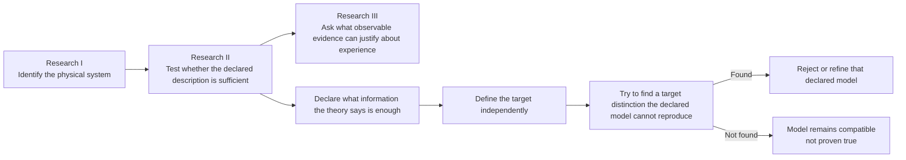

# Mathematical Consciousness Bridge

**Mahsa Keikha, PhD**

> ## The question
>
> **Can a physical description ever be enough to explain a difference related to experience?**

Science is extraordinarily good at describing what physical systems do. We can measure activity, structure, behavior, dynamics, responses to stimulation, information flow, and many other physical properties.

This project asks a different question: **how would we know whether a physical description is actually enough to account for a distinction related to experience, rather than merely being correlated with it?**

The repository does not begin by declaring a brain pattern, information measure, quantum effect, hidden variable, or mathematical object to be consciousness. Instead, it builds a framework for testing proposed connections carefully enough that they can fail.

**[Start here](START_HERE.md)** · **[Research II in plain language](docs/research_ii_in_plain_language.md)** · **[Research map](docs/research_map.md)** · **[Visual atlas](docs/figure_catalog.md)** · **[Technical record](docs/detailed_proposition_record.md)** · **[Reproduce the work](docs/reproducibility.md)**

---

## The idea in one minute

A scientific claim linking physics to experience should survive a few basic questions:

| Question | In plain language | Go deeper |
| --- | --- | --- |
| **What are we describing?** | Be clear about which physical information is actually included. | [Research map](docs/research_map.md) |
| **Could something important be missing?** | A useful physical description may still leave out a distinction that matters to the target we care about. | [Bridge problem](docs/bridge_problem.md) |
| **Can we trust what we observe?** | Reports, labels, behavior, and other measurements can be incomplete or noisy. | [Start Here](START_HERE.md) |
| **Can the proposed model be wrong?** | A serious model must make predictions or constraints that can fail. | [Falsification program](docs/falsification_program.md) |
| **Does the result survive real uncertainty?** | Apparent patterns should remain meaningful when finite data and numerical uncertainty are taken seriously. | [Reproducibility guide](docs/reproducibility.md) |

That is the core of the project. The mathematics behind each question is available one layer deeper for readers who want to inspect it.

---

## Research II in plain language

Research II asks one central question:

> **If a theory says that a particular physical or computational description contains everything needed for a target, does that target really depend only on that description?**

A simple way to see the logic is to imagine two cases that are identical according to the description a theory says is sufficient. If an independently measured target can still differ in a way the model forbids, then that declared description is not sufficient for that target.

The repository turns this simple idea into a complete testing pipeline:

1. **Declare the description.** State exactly what physical or computational information the theory claims is enough.
2. **Define the target independently.** Do not build the target from the same variables and then use that circular construction as evidence.
3. **Try to falsify the sufficiency claim.** Look for target-relevant distinctions the declared description cannot reproduce.
4. **Test the complete model family.** Do not confuse one good parameter fit with compatibility of the full declared model.
5. **Account for finite data and dependence.** Separate genuine model incompatibility from sampling noise, dependence, or drift.
6. **Protect adaptive analysis.** Keep evidence valid when models are selected from data, folds are reused appropriately, or fresh rounds are inspected sequentially.

The current record contains **100 proposition-level results through P100**. They are not one hundred claims that consciousness has been solved. They are a linked mathematical and computational program for making sufficiency claims precise, testable, and auditable.

**[Read the full plain-language Research II guide](docs/research_ii_in_plain_language.md)**

---

## Why this matters

The difficult part of consciousness research is not only collecting more measurements. It is knowing **what those measurements would have to establish** before a physical description could legitimately be said to explain a distinction related to experience.

This repository tries to make that logic explicit. It separates the scientific question into smaller pieces that can be tested, challenged, reproduced, and improved independently.

The goal is not to make the strongest possible claim. It is to make strong claims **hard to make casually and easy to audit carefully**.

---

## What has been built

The repository contains a mathematical and computational research program covering physical description, sufficiency, measurement, model testing, reasoning with finite data, and reproducibility.

You do **not** need to read the propositions in order to understand the project.

At the center is P19, which states the exact deterministic and stochastic conditions under which an independently defined target can depend only on a declared physical descriptor. P71-P95 then make that question scientifically harder to game by checking target provenance, measurement quality, full model-family adequacy, finite-data uncertainty, dependence, and drift. P96-P100 protect the evidence when analysis becomes adaptive, selected, cross-fitted, aggregated, and sequential.

If you want the complete theorem record, including assumptions, proofs, implementations, tests, figures, and scientific boundaries, use the **[Detailed Proposition Record](docs/detailed_proposition_record.md)** or the **[Theorem Roadmap](docs/theorem_roadmap.md)**.

The current public theorem frontier is **P100**. The formal release remains **v0.82.0**.

**[Read the current frontier](docs/proposition_100_anytime_sequential_eprocess.md)**

---

## Visual architecture without the dense diagram

The first-time-reader view is deliberately simple. The technical architecture and theorem figures remain available in the Visual Atlas.

**Figure 1. Scientific architecture of the project.** The research moves from physical dynamics to operationally measurable structure, then to mathematical sufficiency tests, target-side validity, finite-data certification, experimental design, and finally the still-open physical-to-experiential bridge. The arrows are logical dependencies, not claims that one layer has already been identified with consciousness.

**How to read this diagram.** Research II is not trying to derive consciousness from a box of equations. It asks whether a specific claimed description is sufficient for a separately defined target. A failure tells us that the declared model is missing something relevant under its assumptions. It does not tell us automatically what the missing ingredient is.

For the full technical architecture, see the [Visual Atlas](docs/figure_catalog.md) and [Technical Research Architecture](docs/research_architecture.md).

### Current theorem frontier

The current technical endpoint is P100. It addresses a late-stage statistical problem: how to accumulate evidence across genuinely fresh certification rounds while still allowing the next plan to adapt to past results and allowing the analyst to inspect the evidence after every round.

At the exact 95 percent checkpoint, a moderate P99 round has `E_t = 25/2 = 12.5`, below the single-round threshold 20. With `eta_t = 1/2`, the factor is `27/4 = 6.75`. Two fresh rounds produce `M_2 = 729/16 = 45.5625 > 20`. The inherited mathematical crossing is 3774 observations per regime, exact denominator-24 replication is 3792, one round uses 15096 / 15168 unique observations, and the two-round crossing uses **30192 / 30336**.

P100 uses standard e-process, supermartingale, predictable-stake, and Ville-inequality machinery. The repository-specific result is the exact integration with P92-P99, explicit current-round predictability and freshness guards, exact-rational bookkeeping, and the reproducible two-round crossing. It does not validate reused-data relabeling, current-round leakage, model acceptance, consciousness identification, nonphysicality, or completion of the physical-to-experiential bridge.

The full P100 theorem figure is kept in the [Visual Atlas](docs/figure_catalog.md) rather than forcing a first-time reader to decode it here.

### Immediate predecessor: P99

[P99: Cross-Fitted E-Value Aggregation](docs/proposition_99_cross_fitted_evalue_aggregation.md) is the immediate fixed-round evidence predecessor to P100. P99 aggregates valid cross-fitted evidence within one certification round; P100 adds the outer sequential layer across fresh rounds.

## Choose your path

| If you want to... | Start here |
| --- | --- |
| Understand the project without technical background | **[Start Here](START_HERE.md)** |
| Understand exactly what Research II is doing | **[Research II in Plain Language](docs/research_ii_in_plain_language.md)** |
| See how the scientific questions fit together | **[Research Map](docs/research_map.md)** |
| Explore the project visually | **[Figure Catalog](docs/figure_catalog.md)** |
| Move into the formal architecture | **[Technical Research Architecture](docs/research_architecture.md)** |
| Follow the complete mathematical development | **[Theorem Roadmap](docs/theorem_roadmap.md)** |
| Find every proposition and its technical record | **[Detailed Proposition Record](docs/detailed_proposition_record.md)** |
| Check equations and sources | **[Equation and Citation Map](docs/equation_and_citation_map.md)** |
| Run the code and verification yourself | **[Reproducibility Guide](docs/reproducibility.md)** |
| Look up terminology | **[Glossary](docs/glossary.md)** |

---

## What this project does not claim

This repository does **not** claim that:

- a particular equation or hidden variable has been identified as consciousness;
- a model that survives one test is therefore uniquely correct;
- rejection of one physical model proves that consciousness is nonphysical;
- mathematical proof under stated assumptions makes those assumptions true in nature;
- the final bridge from physical description to experience has been solved.

The bridge remains an open scientific problem.

---

## Related physical foundation

This work follows the separate project **[Spatiotemporal Observer Mathematics](https://github.com/MahsaKeikha/spatiotemporal-observer-math)**, which studies how a persistent physical subsystem can be identified from measured dynamics.

That project asks **which physical system is being tracked**. This repository asks the next question: **what would be required before a physical description of that system could support a scientifically testable claim about experience?**

---

## Runtime and reproducibility note

The local reference interpreter remains pinned in `.python-version` to **Python 3.12.14** because that is the exact reproducibility environment currently used by the project. The broader package supports Python 3.10 and later, and permanent CI tests multiple supported interpreters. Runtime upgrades are treated as compatibility migrations rather than cosmetic metadata changes.

---

## Citation and license

For scholarly citation, see **[CITATION.md](CITATION.md)** and **[CITATION.cff](CITATION.cff)**.

MIT License. See **[LICENSE](LICENSE)**.

**Public theorem frontier:** P100  
**Formal release:** v0.82.0  
**Final bridge from physical description to experience:** open
