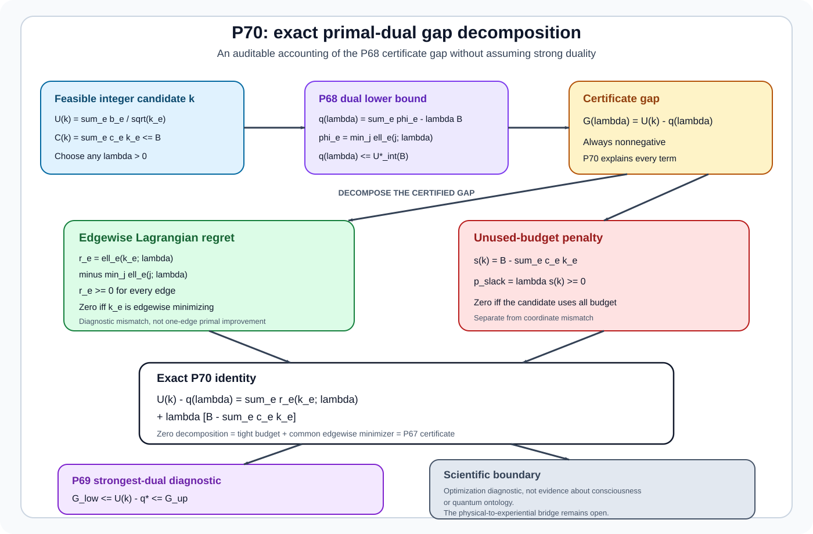

# Mathematical Consciousness Bridge

[](https://github.com/MahsaKeikha/mathematical-consciousness-bridge/actions/workflows/test.yml)
[](CITATION.cff)
[](LICENSE)

**Mahsa Keikha, PhD**

> **What mathematical and physical conditions would be required for a complete physical description of a system to support a scientifically testable claim about consciousness?**

This repository is a mathematical-physics research program for the **physical-to-experiential bridge problem**. It does not begin by assuming what consciousness is. It asks what must be true before any proposed physical description can legitimately be called sufficient for an independently specified experiential target, how that sufficiency can be falsified, and how finite experiments can distinguish a real bridge from correlation, representation choice, coarse-graining, or statistical noise.


**Figure 1. Scientific architecture of the project.** The research moves from physical dynamics to operationally measurable structure, then to mathematical sufficiency tests, finite-data certification, experimental design, and finally the still-open physical-to-experiential bridge. The arrows are logical dependencies, not claims that one layer has already been identified with consciousness.

---

# What this project is trying to achieve, in plain language

Physics can tell us how a system changes. Neuroscience can measure electrical, chemical, hemodynamic, behavioral, and perturbational responses. Information theory can quantify dependence. Causal inference can distinguish observation from intervention. Quantum mechanics can specify states, channels, and measurement statistics. None of these facts, by themselves, tell us whether a physical description contains **all and only the distinctions required to determine an experiential variable**.

The central problem is therefore not to search for a visually impressive scalar and label it consciousness. It is to ask a stricter question:

> Given a declared physical description, can an independently defined experiential target be determined from it, or can we construct a counterexample showing that physically indistinguishable cases remain experientially distinguishable?

The repository turns that question into mathematics, statistics, and experiment design. A successful bridge theory must survive representation changes, controlled interventions, time, composition, scale changes, finite measurement error, and independently specified falsification tests.

The working chain is

$$
\boxed{
\text{physical dynamics}
\to
\text{operational structure}
\to
\text{sufficiency / insufficiency test}
\to
\text{finite-data certificate}
\to
\text{experimental discrimination}
\to
\text{bridge law or falsification}
}
$$

The research currently contains **70 proposition-level results** and **61 equation-driven quantitative figures**. The theorem frontier is P70. The physical-to-experiential bridge itself remains open.

This project continues [Spatiotemporal Observer Mathematics](https://github.com/MahsaKeikha/spatiotemporal-observer-math), which addresses the prior physical problem of identifying a persistent moving subsystem from measured dynamics.

---

# Abstract

Let $\Omega$ denote the physically admissible state or history space, let $T:\Omega\to\mathcal T$ be a declared physical descriptor, and let $E:\Omega\to\mathcal E$ be an independently specified target representing the experiential distinctions a proposed theory claims to explain. The deterministic bridge question is whether there exists a map $B$ such that $E=B\circ T$. The stochastic version asks whether the conditional target law factors through $T$, equivalently whether the residual $I(E;\Omega\mid T)$ vanishes under the declared probabilistic model. The smooth version yields a differential obstruction through rank. These statements make physical sufficiency and insufficiency mathematically testable without assuming that any particular physical quantity is consciousness.

The program then develops the structures required to make those tests physically meaningful: intervention-conditioned response laws, causal influence, temporal continuation, composition defects, coarse-graining and reconstruction bounds, multiscale operational quotients, finite-sample confidence certificates, sequential and adaptive inference, quantum-state model-set tests, experiment scheduling, and certified resource allocation. The quantum branch asks what evidence would be required to reject factorization through a tomographically complete quantum description; it does not assume that consciousness is quantum or that quantum mechanics is incomplete.

The current results establish a rigorous **test architecture** for bridge claims, not a completed ontology of consciousness. Every result is labeled by whether it is a definition, theorem, implementation, numerical verification, empirical input, hypothesis, or open theorem target.

---

# Scientific status discipline

A reader should know the epistemic status of every object before reading the equations. The repository uses the following discipline throughout.

| Status | Meaning in this project |
| --- | --- |
| **Definition** | A mathematical object introduced for the framework. |
| **Proved** | A theorem derived from explicit assumptions. |
| **Implemented** | Executable code mirrors a stated theorem or procedure. |
| **Numerically verified** | A simulation or computation checks the implementation or an example. |
| **Empirically supported** | The statement depends on external published experimental evidence. |
| **Synthetic example** | A controlled example used to expose logic, failure modes, or calibration behavior. |
| **Hypothesis** | A scientifically motivated proposal not yet established by theorem or experiment. |
| **Open bridge problem** | A physical-to-experiential identification has not been derived. |

This distinction is central. The repository **does not assume that a physical quantity is consciousness**. It does not identify consciousness with entropy, integration, complexity, synchronization, entanglement, coherence, measurement, a state of matter, or an additional spacetime coordinate. Those possibilities require separate derivation and evidence.

**Quantum mechanics does not by itself imply consciousness.** A complete quantum state specifies the outcome statistics of declared measurements, but an experiential conclusion requires an additional bridge statement unless that bridge is independently derived.

---

# Research at a glance

The full program can be read as seven scientific stages. This table is the shortest complete map of the repository.

| Stage | Results | Scientific question | Status | Main entry point |
| --- | --- | --- | --- | --- |
| 1. Foundations and identifiability | **P1-P10** | What must be invariant, distinguishable, recoverable, and statistically testable before a physical descriptor can support a bridge claim? | Proved / implemented / tested | [Theorem roadmap](docs/theorem_roadmap.md) |
| 2. Causal, temporal, compositional, and scale structure | **P11-P18** | Which structured physical distinctions survive interventions, time, composition, and coarse-graining? | Proved / implemented / tested | [Quantitative physics and mathematics atlas](docs/quantitative_physics_mathematics_atlas.md) |
| 3. Bridge factorization and finite-data inference | **P19-P24** | Does an independently declared target factor through the physical descriptor, and can insufficiency be certified with finite data and repeated looks? | Proved under declared models | [Research navigation](docs/research_navigation.md) |
| 4. Multiscale operational structure | **P25-P37** | Which causal and response structures survive node, state, intervention, and delay quotients, and how much distortion is introduced? | Proved / implemented / tested | [Theorem roadmap](docs/theorem_roadmap.md) |
| 5. Quantum sufficiency and falsification | **P38-P44** | What follows from a declared tomographically complete quantum description, and what would count as evidence against factorization through it? | Conditional tests proved; ontology open | [Quantum foundations and bridge test](docs/quantum_foundations_and_bridge_test.md) |
| 6. Adaptive experiment design and scheduling | **P45-P58** | How should evidence gathering, stopping, service allocation, switching, and noisy transition measurement be organized while preserving statistical validity? | Proved / implemented / tested | [Equation and citation map](docs/equation_and_citation_map.md) |
| 7. Transition calibration and integer optimization | **P59-P70** | How should finite calibration resources be allocated and certified under discrete counts and heterogeneous costs? | Proved / implemented / tested | [P70 proposition](docs/proposition_70_primal_dual_gap_decomposition.md) |

The dependency-oriented theorem map covers **P1 through P70 with explicit dependency branches**.


**Figure 2. Theorem dependency map.** Read from foundational identifiability toward the bridge tests and experimental-design branches. A later optimization theorem does not strengthen an earlier ontology claim. It solves the experimental problem stated at its own layer.

---

# 1. Mathematical formulation of the bridge problem

## 1.1 Physical states, descriptors, and targets

Let

$$
\Omega = \{\text{physically admissible states or histories}\}.
$$

A proposed physical theory chooses a descriptor

$$
T:\Omega\to\mathcal T.
$$

Examples of $T$ might include an intervention-response structure, a multiscale causal descriptor, a complete classical state under declared assumptions, or a tomographically reconstructed quantum state. The framework does not privilege one choice in advance.

Independently, let

$$
E:\Omega\to\mathcal E
$$

represent the target distinctions the proposed bridge claims to determine. The independence requirement matters: if $E$ is defined from $T$, factorization becomes circular and cannot test the physical description.

## 1.2 Exact deterministic sufficiency

The physical descriptor is exactly sufficient for the target if there exists a bridge map $B$ such that

$$
\boxed{E=B\circ T.}
$$

This is equivalent to the fiber condition

$$
\boxed{
T(\omega_1)=T(\omega_2)
\Longrightarrow
E(\omega_1)=E(\omega_2).
}
$$

Therefore an exact counterexample has a simple form:

$$
T(\omega_1)=T(\omega_2),
\qquad
E(\omega_1)\ne E(\omega_2).
$$

One such pair is enough to show that the declared $T$ is insufficient for the declared $E$. This is the core logic behind the exact factorization branch formalized in Proposition 19.

## 1.3 Stochastic sufficiency

When the target is probabilistic, the relevant residual is

$$
\boxed{
R_{\mathrm{stoch}}(T)
=I(E;\Omega\mid T).
}
$$

Under the declared probabilistic model,

$$
R_{\mathrm{stoch}}(T)=0
$$

means that $T$ contains all target-relevant information available in $\Omega$. A positive residual means that target-relevant information remains outside the descriptor.

If $T_f$ refines $T_c$ through $T_c=c\circ T_f$, Proposition 21 gives the exact identity

$$
\boxed{
R_{\mathrm{stoch}}(T_c)-R_{\mathrm{stoch}}(T_f)
=I(E;T_f\mid T_c).
}
$$

This quantifies how much target-relevant information is gained by the refinement rather than merely stating that a finer representation is better.

## 1.4 Smooth differential obstruction

For smooth manifolds and differentiable maps, exact factorization implies

$$
dE_x=dB_{T(x)}\circ dT_x.
$$

Hence

$$
\boxed{
\operatorname{rank}(dE_x)
\le
\operatorname{rank}(dT_x).
}
$$

If the target varies locally in more independent directions than the proposed physical descriptor can represent, no smooth bridge of the declared form can exist near that point. The underlying differential-topology machinery is standard; the use of the rank condition as a bridge obstruction is part of the repository's P19 formulation. See Lee's *Introduction to Smooth Manifolds* for the mathematical background and the [equation provenance map](docs/equation_and_citation_map.md) for the repository-specific statement.


**Figure 3. The logical gap being tested.** Fundamental physical theory determines physical structure and operational predictions. A consciousness theory still needs a justified map from physical equivalence classes to experiential equivalence classes. The purpose of the project is to make the required bridge and its possible failure conditions explicit.

---

# 2. From physical dynamics to operational structure

A useful bridge test cannot depend only on coordinates or passive correlations. It should be built from physically meaningful distinctions that can, at least in principle, be interrogated experimentally.

## 2.1 Intervention-conditioned response laws

For subsystem or node $i$, delay $\ell$, and intervention $do(u)$, define an operational response law

$$
R_i^{(\ell)}(\cdot\mid do(u)).
$$

The P11 structured candidate collects three complementary objects:

$$
\boxed{
\mathcal C(S)
=
(\mathcal R,\mathcal I,\mathcal O),
}
$$

where $\mathcal R$ is response geometry, $\mathcal I$ measures irreducibility relative to declared partition-product null models, and $\mathcal O$ represents directed intervention influence.

This is deliberately richer than a scalar. Two systems can have similar entropy, complexity, or average activity while differing in which interventions affect which targets, over what delays, and with what response geometry.


**Figure 4. Anatomy of the operational physical candidate.** Controlled interventions generate response distributions. Distances among those distributions define response geometry; comparisons across sources define directed influence; comparisons with partitioned null models expose irreducibility. These are physical candidates to be tested for sufficiency, not definitions of consciousness.

The intervention language is grounded in the causal distinction between observation and intervention developed in Pearl's causal framework. Empirically, perturbational approaches such as Casali et al. motivate direct probing of distributed neural response rather than relying only on passive correlation.

---

# 3. Time, composition, and scale cannot be ignored

A bridge that works only for one arbitrary representation or one resolution is scientifically fragile. The physical structure must be tracked through temporal continuation, subsystem composition, and coarse-graining.

## 3.1 Coarse-graining and data processing

If a fine response law is mapped deterministically to a coarse observable, total variation cannot increase:

$$
\boxed{
\operatorname{TV}(K_\#P,K_\#Q)
\le
\operatorname{TV}(P,Q).
}
$$

This is a data-processing fact, not a consciousness result. Its role is to tell us what operational distinctions can disappear under coarse observation.

## 3.2 Approximate reconstruction as a scale certificate

Contraction alone is not enough. If a coarse representation can approximately reconstruct the relevant fine distributions with uniform error $\varepsilon$, Proposition 18 bounds the distortion of total-variation geometry:

$$
\boxed{
|D_f-D_c|\le 2\varepsilon.
}
$$

This converts a vague claim such as "the coarse scale preserves the important structure" into a quantitative condition that can be checked.


**Figure 5. Scale sufficiency logic.** Coarse-graining can erase distinctions, but approximate reconstruction controls how much declared response geometry was lost. This provides a quantitative route to compare neural, subsystem, or experimental resolutions without pretending that all scales are equivalent.

The subsequent P25-P37 branch extends this logic to changing node sets, intervention labels, delays, partition structure, directed influence, and joint operational quotients.


**Figure 6. Multiscale hierarchy.** A scientifically credible descriptor must state which objects survive a change of scale, which require compatibility conditions, and which acquire bounded distortion. Zero numerical error cannot rescue a semantically invalid quotient.

---

# 4. Turning a population theorem into a finite experiment

Exact mathematical insufficiency is useful only if finite observations can support or reject it with controlled error.

Let $\widehat P$ denote an empirical law and $P$ the underlying population law. The finite-sample branch builds confidence events of the form

$$
\mathcal A_n
=
\left\{
\|P-\widehat P\|_{\mathrm{TV}}
\le \tau_n(\alpha)
\right\},
\qquad
\Pr(\mathcal A_n)\ge1-\alpha.
$$

On that event, the population bridge residual can be bounded from empirical data. Proposition 20 gives a finite-sample certificate for the P19 stochastic residual under the declared finite-alphabet IID model. Propositions 22 and 23 extend validity across refinement families and data-dependent selection. Proposition 24 allocates error over repeated looks to obtain an anytime-valid certificate.


**Figure 7. From exact factorization to finite-data evidence.** The theoretical residual is not replaced by a point estimate. The experiment produces an uncertainty set, and a bridge claim is rejected only when the certified lower bound remains positive under the declared statistical assumptions.

This distinction is essential: numerical closeness is not exact equality, and an apparent residual is not evidence of non-reducibility until estimation uncertainty has been propagated through the bridge test.

---

# 5. Quantum mechanics enters as a physical description, not as an assumption about consciousness

For a finite-dimensional quantum system, a state is represented by a density operator $\rho$. A POVM $\{M_a\}$ gives

$$
\boxed{
p(a\mid M)=\operatorname{Tr}(\rho M_a).
}
$$

Admissible dynamics are represented by completely positive trace-preserving maps, and composite systems by density operators on tensor-product spaces. These are standard quantum-mechanical structures.

The bridge question is then sharpened:

> If the declared quantum descriptor is operationally complete for the chosen preparation, channels, and measurements, does an independently defined experiential target factor through that descriptor?

Proposition 38 states the exact non-factorization witness for a tomographically complete quantum descriptor. Proposition 39 propagates finite tomography and target uncertainty. Proposition 40 proves an important limitation: on a finite sampled set, an injective descriptor always permits an unrestricted lookup-table factorization. Therefore a meaningful continuous-region obstruction requires an explicit regularity class for the bridge. Propositions 41-44 make this program computable through trace-distance uncertainty regions, sample-complexity bounds, optimal quantum-versus-target allocation, and simultaneous candidate-pair validity.


**Figure 8. What quantum completeness does and does not establish.** Tomographic completeness closes the declared operational description of the quantum state. It does not automatically close the physical-to-experiential map. The open question is whether the independently specified target factors through that operational state under a scientifically justified bridge class.


**Figure 9. P38 quantum sufficiency test.** Equal declared quantum descriptors with unequal independently defined targets give an exact non-factorization witness. When descriptors are only approximately known, P39-P44 replace exact equality with uncertainty regions and regularity-aware inequalities.


**Figure 10. Finite-data quantum envelope.** Quantum-state confidence regions and target uncertainty are propagated into an end-to-end obstruction. The scientific conclusion is conditional on the tomography model, confidence coverage, and declared regularity of the candidate bridge.

For the complete quantum visual sequence, including Bloch geometry, channels, entanglement, decoherence, tomography, contextuality, and open-system maps, see the [Quantum foundations and bridge test](docs/quantum_foundations_and_bridge_test.md) and the [Visual atlas](website/visual-atlas.html).

---

# 6. Adaptive experiment design: collecting the evidence without invalidating it

Once a family of possible bridge witnesses is declared, the next problem is experimental: which preparations should be sampled, when can a candidate be pruned, and when is there enough evidence to stop?

P45 converts pairwise witness requirements into a shared preparation graph, where one preparation-level sample stream can improve every incident candidate edge. P47 then combines time-uniform confidence sequences into a shared event that remains valid under non-anticipating adaptive sampling, graph refinement, witness selection, safe pruning, and stopping. P48-P53 turn those validity statements into stopping-time and service-allocation results. P54-P58 incorporate setup motion, switching costs, metric perturbation, and finite-data uncertainty in the switching metric itself.


**Figure 11. Adaptive evidence collection.** The experiment may choose what to sample next based on previous observations, but validity is protected by a shared time-uniform confidence event. Adaptation changes efficiency, not the declared error guarantee.

This branch matters because a bridge theory should not depend on an unrealistic fixed experiment. It should specify how evidence can be gathered efficiently without turning optional stopping or data-dependent witness selection into hidden statistical bias.

---

# 7. Calibration and optimization: the current theorem frontier

The P59-P70 branch addresses a narrower but necessary experimental question: once transition or switching uncertainties matter to a robust experiment, how should finite calibration resources be allocated?

For effective edge coefficient $b_e>0$ and sample count $n_e$, the continuous equal-cost surrogate is

$$
U(n)=\sum_e\frac{b_e}{\sqrt{n_e}}.
$$

With heterogeneous per-observation costs $c_e>0$ and budget $B$,

$$
\min_{n_e>0}\sum_e\frac{b_e}{\sqrt{n_e}}
\quad\text{subject to}\quad
\sum_e c_en_e=B.
$$

The P62 optimum has the scaling

$$
\boxed{
n_e^*\propto b_e^{2/3}c_e^{-2/3}.
}
$$

The subsequent results handle whole measurements, lower bounds, fast approximations, baseline constraints, residual exact improvement, Lagrangian certificates, and dual optimization.

## Latest proved extension: P70 exact primal-dual gap decomposition

For a feasible integer candidate $k$ and multiplier $\lambda>0$, P70 decomposes the candidate-to-dual certificate gap into edgewise nonnegative Lagrangian regrets plus a nonnegative unused-budget penalty. Symbolically,

$$
\boxed{
U(k)-q(\lambda)
=
\sum_e r_e(k_e;\lambda)
+
\lambda\left(B-\sum_ec_ek_e\right).
}
$$

The decomposition explains *why* a candidate fails to close the dual gap: because particular edges are not Lagrangian minimizers, because budget is unused, or both. The zero-gap case recovers the sufficient P67 global-optimality conditions.



**Figure 12. Current theorem frontier.** P70 turns a single scalar optimality gap into a diagnostic decomposition. This is an optimization result for experimental calibration. It is not evidence that the calibration objective is consciousness and it does not strengthen the open physical-to-experiential bridge.

### Compact record of the calibration frontier

The table keeps recent proof, visual, code, and test surfaces visible without reproducing every derivation on the front page.

| Result | Role | Proof / visual / implementation |
| --- | --- | --- |
| **P59 optimal transition calibration** | Continuous equal-cost allocation | [proof](docs/proposition_59_optimal_transition_calibration.md) / [figure](docs/figures/p59_optimal_transition_calibration.svg) / [`optimal_transition_calibration.py`](src/consciousness_bridge/optimal_transition_calibration.py) |
| **P60 integer transition calibration** | Certified whole-count rounding | [proof](docs/proposition_60_integer_transition_calibration.md) / [figure](docs/figures/p60_integer_transition_calibration.svg) / [`integer_transition_calibration.py`](src/consciousness_bridge/integer_transition_calibration.py) |
| **P61 exact integer calibration** | Exact equal-cost whole-count optimum | [proof](docs/proposition_61_exact_integer_transition_calibration.md) / [figure](docs/figures/p61_exact_integer_transition_calibration.svg) / [`exact_integer_transition_calibration.py`](src/consciousness_bridge/exact_integer_transition_calibration.py) / [`test_exact_integer_transition_calibration.py`](tests/test_exact_integer_transition_calibration.py) |
| **P62 heterogeneous-cost calibration** | Continuous unequal-cost allocation | [proof](docs/proposition_62_heterogeneous_cost_transition_calibration.md) / [figure](docs/figures/p62_heterogeneous_cost_transition_calibration.svg) / [`heterogeneous_cost_transition_calibration.py`](src/consciousness_bridge/heterogeneous_cost_transition_calibration.py) / [`test_heterogeneous_cost_transition_calibration.py`](tests/test_heterogeneous_cost_transition_calibration.py) |
| **P63 exact unequal-cost integer calibration** | Exact heterogeneous integer allocation | [proof](docs/proposition_63_exact_heterogeneous_integer_calibration.md) / [figure](docs/figures/p63_exact_heterogeneous_integer_calibration.svg) / [`exact_heterogeneous_integer_calibration.py`](src/consciousness_bridge/exact_heterogeneous_integer_calibration.py) / [`test_exact_heterogeneous_integer_calibration.py`](tests/test_exact_heterogeneous_integer_calibration.py) |
| **P64 fast certified integer approximation** | Scalable certified approximation | [proof](docs/proposition_64_fast_heterogeneous_integer_approximation.md) / [figure](docs/figures/p64_fast_heterogeneous_integer_approximation.svg) / [`fast_heterogeneous_integer_approximation.py`](src/consciousness_bridge/fast_heterogeneous_integer_approximation.py) |
| **Proposition 65: lower-bounded heterogeneous calibration** | Baseline-safe continuous water filling and certified integer floor | [proof](docs/proposition_65_lower_bounded_heterogeneous_calibration.md) / [figure](docs/figures/p65_lower_bounded_heterogeneous_calibration.svg) |
| **Proposition 66: residual-exact calibration augmentation** | Exact improvement inside the floor-dominating class | [proof](docs/proposition_66_residual_exact_calibration_augmentation.md) / [figure](docs/figures/p66_residual_exact_calibration_augmentation.svg) |
| **Proposition 67: global integer optimality certificate** | Sufficient common-multiplier certificate | [proof](docs/proposition_67_global_integer_optimality_certificate.md) / [figure](docs/figures/p67_global_integer_optimality_certificate.svg) |
| **Proposition 68: Lagrangian optimality gap certificate** | Rigorous lower bound and candidate gap | [proof](docs/proposition_68_lagrangian_optimality_gap.md) / [figure](docs/figures/p68_lagrangian_optimality_gap.svg) |
| **Proposition 69: certified dual-optimal multiplier search** | Strongest certified lower bound inside the declared dual family | [proof](docs/proposition_69_dual_optimal_multiplier.md) / [figure](docs/figures/p69_dual_optimal_multiplier.svg) |
| **Proposition 70: exact primal-dual gap decomposition** | Diagnostic decomposition of the P68/P69 gap | [proof](docs/proposition_70_primal_dual_gap_decomposition.md) / [figure](docs/figures/p70_primal_dual_gap_decomposition.svg) / [`primal_dual_gap_decomposition.py`](src/consciousness_bridge/primal_dual_gap_decomposition.py) / [`test_primal_dual_gap_decomposition.py`](tests/test_primal_dual_gap_decomposition.py) |

---

# What has actually been established

The project has established mathematical and computational machinery for testing a bridge claim without silently assuming the bridge. The strongest conclusions are methodological and conditional:

1. **Physical descriptors can be tested for exact sufficiency.** Exact factorization is equivalent to constancy of the target on physical-descriptor fibers.
2. **Stochastic insufficiency can be quantified.** Conditional mutual information measures target-relevant information left outside a descriptor under the declared model.
3. **Smooth factorization can fail for rank reasons.** The differential obstruction supplies a local no-go test.
4. **Operational structure can be made richer than a scalar.** Intervention response, directed influence, irreducibility, temporal continuation, composition, and scale can be treated explicitly.
5. **Coarse-graining losses can be bounded.** Reconstruction assumptions give quantitative scale certificates rather than qualitative claims.
6. **Finite-data uncertainty can be propagated into bridge tests.** Exact equalities are not replaced by numerical approximations without confidence control.
7. **Adaptive experiments can remain statistically valid.** Candidate selection, pruning, repeated looks, and stopping are handled on shared confidence events under declared assumptions.
8. **Quantum-state completeness can be separated from experiential completeness.** A complete operational quantum descriptor can be tested for target factorization without assuming the answer.
9. **Experimental resources can be optimized and certified.** The P45-P70 branches give increasingly realistic allocation, scheduling, calibration, and optimality guarantees.

These statements do **not** prove that consciousness is reducible to the current physical descriptors, irreducible to physics, quantum, non-quantum, a field, a state of matter, or an additional dimension.

---

# What remains open

The central open theorem is still the bridge itself.

Suppose a physical description $T$ is complete relative to a declared physical theory and an independently defined experiential target $E$ is scientifically measurable. Then one of the following must eventually be supported:

$$
\boxed{
E=B\circ T
}
$$

for a scientifically justified bridge class $B$, or a reproducible obstruction must show that no bridge in that class can explain the declared target distinctions.

The open work is therefore not "find a mysterious consciousness number." It is to close the following scientific gaps:

- define experiential variables independently enough to avoid circularity;
- identify which physical descriptor is justified by experiment rather than convenience;
- test whether target distinctions factor through that descriptor across interventions, time, scale, and composition;
- quantify uncertainty strongly enough to rule out estimation artifacts;
- specify the regularity or structural class of admissible bridge laws;
- design decisive experiments for cases where competing bridge theories make different predictions.

A claim of non-reducibility would require a valid obstruction relative to a sufficiently complete physical description and a scientifically defensible bridge class. Failure of one coarse descriptor is not failure of physics.

---

# Falsification logic

The framework is designed so that each scientific layer has a failure condition.

| Claim being tested | What would count against it? | What would *not* be enough? |
| --- | --- | --- |
| Descriptor $T$ is exactly sufficient for $E$ | Same $T$, different independently measured $E$ | Mere correlation between $T$ and $E$ |
| Descriptor $T$ is stochastically sufficient | Certified positive $I(E;\Omega\mid T)$ | Positive empirical estimate without uncertainty control |
| Coarse scale preserves relevant response structure | Reconstruction or distortion bounds fail | Visual similarity of coarse and fine plots |
| Quantum descriptor is sufficient under bridge class $\mathcal B$ | Certified target separation exceeds what every admissible $B\in\mathcal B$ can map from the quantum uncertainty region | Two numerically close tomography estimates |
| Adaptive experiment is valid | Confidence event or non-anticipation assumptions are violated | Choosing samples adaptively by itself |
| Integer calibration candidate is optimal | A better feasible allocation is found or the exact solver disproves it | Failure of a sufficient certificate alone |

This is the intended scientific discipline: every positive claim should bring its own way of being wrong.

---

# Evidence, references, and provenance

The repository keeps mathematics, physical background, empirical evidence, and speculative antecedents distinct. The main provenance resources are:

| Resource | Purpose |
| --- | --- |
| [Equation and citation map](docs/equation_and_citation_map.md) | States which equations are standard, derived here, or dependent on external results. |
| [Foundational physics and mathematics bibliography](docs/foundational_physics_mathematics_bibliography.md) | Physics, information theory, causal inference, differential topology, thermodynamics, and empirical measurement sources. |
| [Literature map](docs/literature_map.md) | Consciousness-theory and empirical comparison literature. |
| [`fundamental_theory_references.bib`](docs/fundamental_theory_references.bib) | Machine-readable reference file for the fundamental-physics branch. |
| [Reference audit](docs/reference_audit.md) | Separates peer-reviewed evidence, mathematical background, and speculative antecedents. |
| [Citation and reference policy](docs/citation_and_reference_policy.md) | Rules for how repository-original results and external sources are attributed. |

## Selected scientific references

1. C. E. Shannon, "A Mathematical Theory of Communication," *Bell System Technical Journal* 27 (1948), 379-423 and 623-656. [DOI 10.1002/j.1538-7305.1948.tb01338.x](https://doi.org/10.1002/j.1538-7305.1948.tb01338.x).
2. T. M. Cover and J. A. Thomas, *Elements of Information Theory*, 2nd ed., Wiley, 2006. [DOI 10.1002/047174882X](https://doi.org/10.1002/047174882X).
3. J. Pearl, *Causality: Models, Reasoning, and Inference*, 2nd ed., Cambridge University Press, 2009.
4. J. M. Lee, *Introduction to Smooth Manifolds*, 2nd ed., Springer, 2013. [DOI 10.1007/978-1-4419-9982-5](https://doi.org/10.1007/978-1-4419-9982-5).
5. S. Amari, *Information Geometry and Its Applications*, Springer, 2016. [DOI 10.1007/978-4-431-55978-8](https://doi.org/10.1007/978-4-431-55978-8).
6. R. Landauer, "Irreversibility and Heat Generation in the Computing Process," *IBM Journal of Research and Development* 5(3) (1961), 183-191. [DOI 10.1147/rd.53.0183](https://doi.org/10.1147/rd.53.0183).
7. A. G. Casali et al., "A theoretically based index of consciousness independent of sensory processing and behavior," *Science Translational Medicine* 5(198) (2013), 198ra105. [DOI 10.1126/scitranslmed.3006294](https://doi.org/10.1126/scitranslmed.3006294).
8. M. Tegmark, "Consciousness as a State of Matter," *Chaos, Solitons & Fractals* 76 (2015), 238-270. [DOI 10.1016/j.chaos.2015.03.014](https://doi.org/10.1016/j.chaos.2015.03.014). This is treated as conceptual physics lineage, not as an established bridge theorem.
9. A. K. Seth and T. Bayne, "Theories of consciousness," *Nature Reviews Neuroscience* 23 (2022), 439-452. [DOI 10.1038/s41583-022-00587-4](https://doi.org/10.1038/s41583-022-00587-4).
10. Cogitate Consortium et al., "Adversarial testing of global neuronal workspace and integrated information theories of consciousness," *Nature* 642 (2025), 133-142. [DOI 10.1038/s41586-025-08888-1](https://doi.org/10.1038/s41586-025-08888-1).
11. A. I. Luppi et al., "Convergent transcriptomic and connectomic controllers of information integration and its anaesthetic breakdown across mammalian brains," *Nature Human Behaviour* 10 (2026), 777-802. [DOI 10.1038/s41562-025-02381-5](https://doi.org/10.1038/s41562-025-02381-5).

The complete bibliography is maintained in the dedicated reference documents above so this page can remain readable while every major scientific dependency stays auditable.

---

# Complete visual evidence without front-page overload

The main page intentionally shows the figures needed to understand the argument. The complete visual record remains available without forcing a first-time reader through every calibration plot.

| Visual collection | What it contains |
| --- | --- |
| [Visual atlas](website/visual-atlas.html) | Browser-oriented gallery of the repository's scientific figures. |
| [Quantitative physics and mathematics atlas](docs/quantitative_physics_mathematics_atlas.md) | Full equation-driven classical, statistical, causal, dynamical, and multiscale sequence, including Q01-Q40. |
| [Quantum foundations and bridge test](docs/quantum_foundations_and_bridge_test.md) | Full QM01-QM18 quantum sequence plus P38-P44 bridge tests. |
| [Theorem roadmap](docs/theorem_roadmap.md) | Proposition dependencies and proof links. |
| [Equation evidence map](docs/figures/equation_evidence_map.svg) | Visual provenance from equations to assumptions, evidence, and theorem status. |


**Figure 13. Evidence provenance.** A mathematical identity, a theorem under assumptions, a numerical result, and an empirical observation are different kinds of evidence. The project keeps those routes explicit so a reader can see what supports each scientific claim.

---

# Numerical validation facts

The repository is executable rather than purely expository. The numerical layer is used to verify algorithms, finite examples, geometry, and regression behavior; it is not treated as empirical proof of a consciousness theory.

The current reproducibility surface includes:

- Python 3.10, 3.11, and 3.12 CI coverage;
- theorem-specific unit and regression tests;
- geometry tests for publication figures;
- documentation and local-link integrity tests;
- explicit publication-integration tests for the current proposition frontier;
- source implementations under [`src/consciousness_bridge/`](src/consciousness_bridge/).

A passing test proves only that the declared code and repository invariants behave as tested. It does not convert a mathematical or synthetic result into biological evidence.

---

# Reproducibility and audit path

A reader who wants to reproduce the code can use the repository directly:

```bash
git clone https://github.com/MahsaKeikha/mathematical-consciousness-bridge.git
cd mathematical-consciousness-bridge
python -m venv .venv
source .venv/bin/activate
python -m pip install -e ".[dev]"
pytest
```

For scientific auditing, use the shortest route appropriate to the question:

1. **Understand the argument:** read this README from top to bottom.
2. **Inspect dependencies:** open the [Theorem roadmap](docs/theorem_roadmap.md).
3. **Audit a derivation:** use the [Equation and citation map](docs/equation_and_citation_map.md) and the linked proposition document.
4. **Audit code:** follow the proof-to-implementation link into [`src/consciousness_bridge/`](src/consciousness_bridge/) and the corresponding test.
5. **Inspect every figure:** use the [Visual atlas](website/visual-atlas.html).
6. **Inspect external evidence:** use the [Foundational bibliography](docs/foundational_physics_mathematics_bibliography.md), [Literature map](docs/literature_map.md), and [Reference audit](docs/reference_audit.md).

---

# Detailed proposition record

The full chronological development history is intentionally kept off the main scientific reading path.

**[Read the complete P1 to P70 detailed proposition record](docs/detailed_proposition_record.md).**

The dedicated record preserves the complete lineage from P1 through P70, while this page is organized by scientific dependency rather than by the order in which results were developed.

---

# Current scientific status

| Item | Current state |
| --- | --- |
| Public theorem frontier | **P70** |
| Documented release | **v0.70.0** |
| Proposition-level results | **70** |
| Equation-driven quantitative figures | **61** |
| Physical-to-experiential bridge | **Open physical-to-experiential bridge** |
| Quantum ontology claim | **Not assumed** |
| Consciousness identified with a scalar, state of matter, or spacetime coordinate | **Not claimed** |
| Reproducibility | Python 3.10, 3.11, and 3.12 test matrix plus theorem-specific regression guards |

The scientific target is therefore precise: continue reducing ambiguity in the physical description, the experiential target, the admissible bridge class, and the experiment until either a bridge is derived and survives falsification or a valid obstruction demonstrates exactly where the declared physical description is insufficient.

---

# Navigation

| If you want to... | Go here |
| --- | --- |
| Understand the complete dependency structure | [Theorem roadmap](docs/theorem_roadmap.md) |
| Read the proposition chronology | [Detailed proposition record](docs/detailed_proposition_record.md) |
| Follow work by scientific question | [Research navigation](docs/research_navigation.md) |
| Audit equations and citations | [Equation and citation map](docs/equation_and_citation_map.md) |
| Inspect all quantitative classical figures | [Quantitative physics and mathematics atlas](docs/quantitative_physics_mathematics_atlas.md) |
| Inspect the quantum branch | [Quantum foundations and bridge test](docs/quantum_foundations_and_bridge_test.md) |
| Inspect falsification conditions | [Falsification program](docs/falsification_program.md) |
| Browse the public research website | [Website entry point](website/index.html) |
| Browse every visual | [Visual atlas](website/visual-atlas.html) |
| Audit code and tests | [`src/consciousness_bridge/`](src/consciousness_bridge/) and [`tests/`](tests/) |
| Cite the project | [`CITATION.cff`](CITATION.cff) |

---

## Scope statement

This repository is an ongoing research program. Its purpose is to make physical-to-experiential claims harder to state vaguely and easier to test rigorously. It should be read as a sequence of explicit mathematical conditions, counterexample constructions, finite-data certificates, and experimental design tools. The final bridge remains a scientific target, not a conclusion assumed in advance.
