# Mathematical Consciousness Bridge

[](https://github.com/MahsaKeikha/mathematical-consciousness-bridge/actions/workflows/test.yml)
[](CITATION.cff)
[](LICENSE)

**Mahsa Keikha, PhD**

> **What mathematical and physical conditions would be required for a complete physical description of a system to support a scientifically testable claim about consciousness?**

# What this project is trying to achieve, in plain language

The question behind this repository is simple to say, even though it is extremely difficult to answer:

> **Can we build a scientifically testable path from what the brain and body physically do to what a person actually experiences?**

Science is already very good at describing the physical world. We can measure electrical activity, chemical changes, brain signals, behavior, information flow, quantum states, cause and effect, and how physical systems change over time. But none of those measurements, by themselves, tell us why there is a subjective experience at all, why one experience differs from another, or which physical differences truly matter for experience.

The purpose of this project is to make that gap precise enough that it can be studied scientifically instead of discussed only philosophically.

In practical terms, we are trying to build a rigorous framework that can answer questions such as:

- What physical information would we actually need to measure if we wanted to make a testable statement about experience?
- How can we tell whether two physically different systems should count as the same or different for the purpose of an experiential theory?
- How can we distinguish a real physical signature from a quantity that only happens to correlate with consciousness?
- How can we design experiments that could prove a proposed physical description is insufficient?
- How much data would be needed before such a conclusion is statistically reliable?
- How can the same reasoning remain valid when measurements are noisy, incomplete, collected over time, or performed at different physical scales?
- If ordinary or quantum physics already contains all the relevant physical information, what additional mathematical bridge would still be required to connect that information to experience?

The long-term goal is **not to force consciousness into a favorite equation**. It is to identify the exact mathematical and experimental conditions that any serious physical theory of consciousness would have to satisfy.

That means the repository is building something closer to a **scientific test framework** than a single proposed answer. The equations, proofs, simulations, figures, and code below are tools for making the central question precise, checking what can and cannot be inferred from physical measurements, and designing experiments that could eventually discriminate between competing explanations.

A successful outcome would be a framework in which a researcher could take a proposed physical explanation of consciousness and ask, in a reproducible way:

> **Does this physical description actually contain enough information to determine the experiential distinctions the theory claims it determines, or can we construct an experiment showing that something is still missing?**

If something is missing, the framework should help identify **where the missing information must enter**. If nothing is missing, it should help specify **what bridge law would still be required** to connect the complete physical description to an experiential prediction.

So the larger objective is to move the consciousness problem from vague statements such as "this brain property is consciousness" toward a much stricter scientific standard:

\[
\boxed{
\text{measure the physical system}
\;\longrightarrow\;
\text{identify what information is actually preserved}
\;\longrightarrow\;
\text{test whether it is sufficient}
\;\longrightarrow\;
\text{quantify uncertainty}
\;\longrightarrow\;
\text{state exactly what additional bridge is required}.
}
\]

This repository does **not** claim that consciousness has already been mathematically derived, that consciousness is a quantum phenomenon, or that consciousness is a new dimension of spacetime. It is building the mathematical and experimental machinery needed to determine what evidence would be required before claims of that kind could be scientifically justified.

---

This repository develops a formal mathematical-physics research program for the **physical-to-experiential bridge problem**. The work starts from ordinary and quantum physical descriptions, passes through experimentally identifiable response structure, finite-data certification, temporal continuation, composition and scale, and asks what additional theorem would be required before a physical structure could legitimately support an experiential conclusion.

The repository does **not** assume that a physical quantity is consciousness. It does not identify consciousness with entropy, integration, complexity, synchronization, entanglement, coherence, measurement, a state of matter, or an extra spacetime coordinate. Those would require independent derivation and empirical support.

The working scientific chain is

\[
\boxed{
\text{physical dynamics}
\longrightarrow
\text{quantum/classical operational structure}
\longrightarrow
\text{controlled interventions}
\longrightarrow
\text{response geometry and causal structure}
\longrightarrow
\text{temporal + compositional + scale certification}
\longrightarrow
\text{finite-data discrimination}
\longrightarrow
\text{physical-to-experiential bridge test}.
}
\]

This project continues **[Spatiotemporal Observer Mathematics](https://github.com/MahsaKeikha/spatiotemporal-observer-math)**, which addresses the prior physical problem of identifying a persistent moving subsystem from measured dynamics.

---

# Abstract

Physics can describe states, fields, probability amplitudes, density operators, spacetime, Hamiltonians, open-system dynamics, thermodynamics, interventions, measurements, and statistical predictions without by itself defining subjective experience. A mathematically serious consciousness theory therefore requires a separately specified bridge between physically meaningful equivalence classes and formally defined experiential equivalence classes.

The program here makes that bridge itself an object of mathematics. Propositions **P1-P10** establish representation invariance, empirical theory identifiability, observational equivalence, discriminating experiment design, feature sufficiency, canonical bridge completeness, experimental recoverability, finite-error recovery, sample complexity, and robust protocol design. **P11** introduces intervention-resolved causal structure as a structured physical candidate rather than a scalar. **P12-P13** prove constructive insufficiency and component irredundancy results. **P14-P15** formalize temporal continuation and finite-error temporal certification. **P16** gives an independent-composition null model and response-level coupling defect. **P17** proves total-variation contraction and exact refinement ambiguity under deterministic coarse-graining. **P18** proves a quantitative scale-sufficiency certificate based on approximate reconstruction. **P19** proves exact deterministic and stochastic criteria for whether an independently defined target factors through a declared physical descriptor, together with a differential no-go test. **P20** converts the P19 stochastic population residual into an explicit finite-sample confidence certificate under a declared finite-alphabet IID model. **P21** then proves how that residual behaves under nested physical-descriptor refinement: unresolved deterministic collisions can only disappear, while the stochastic residual decreases by exactly the target-relevant information supplied by the added physical detail. **P22** gives a simultaneous finite-sample certificate for the entire declared refinement chain from one shared confidence event on the empirical physical-target law. **P23** proves that the same shared base confidence event also supports fixed-sample data-dependent selection among admissible deterministic refinements, together with an explicit near-optimality bound for the selected refinement. **P24** converts that fixed-sample result into an anytime-valid certificate by allocating the total error budget across all positive sample sizes, giving simultaneous repeated-look and finite stopping-time validity under the declared finite-alphabet IID model. **P25** returns to the P11 physical candidate and proves a directed-influence scale theorem: deterministic target coarse observation cannot increase matched-intervention influence, and P18 reconstruction defect bounds the loss by twice the uniform reconstruction error. **P26** extends the same physical scale program to P11 partition irreducibility: block-compatible coarse observation cannot increase the distance from the declared partition-product null, and P18 reconstruction separately controls the actual response law and its factorized reference. **P27** then allows the node set itself to change: a fine partition descends through a surjective node aggregation exactly when it is saturated by the aggregation fibers, the surviving partitions form a lattice isomorphic to the coarse partition lattice, and P18 controls any remaining irreducibility loss under an aggregation-compatible state map. **P28** transports the P11 directed-influence branch through the same changing node set by giving an exact compatibility criterion for matched intervention-pair source labels, pooling only inherited comparisons within each aggregate source, and applying P25/P18 control to the full fine target fiber before target-state aggregation. **P29** transports the complete P11 response geometry on a fixed intervention-delay grid: every pairwise total-variation response distance contracts under node aggregation, while P18 reconstruction bounds the sup-norm distortion of the entire indexed geometry by twice the uniform reconstruction defect. **P30** then assembles the P27 partition, P28 directed-influence, and P29 response-geometry branches under one shared node quotient, experiment grid, state map, and reconstruction declaration, yielding a simultaneous P11 distortion certificate while proving that zero numerical distortion cannot compensate for failed semantic compatibility. **P31** formalizes intervention-label quotienting itself: a many-to-one intervention map defines a unique coarse response law exactly when every retained response law is constant on each intervention fiber, and the quotient ambiguity defect quantifies representative dependence when exact descent fails. **P32** gives the corresponding exact delay quotient. **P33** proves joint intervention-delay quotient descent and the additive ambiguity bound. **P34** assembles node, state, intervention, and delay scale maps under one declared transformation. **P35** proves approximate directed-influence stability. **P36** propagates response ambiguity through partition-product irreducibility. **P37** combines all three P11 branches into one complete approximate operational-scale certificate. **P38** then specializes the physical-sufficiency program to a tomographically complete finite-dimensional quantum state descriptor and states the exact quantum non-factorization witness. **P39** converts that exact population criterion into a finite-data model-set certificate that carries tomography-model uncertainty and target-distribution uncertainty without treating numerical closeness as exact quantum-state equality. **P40** proves the corresponding continuous-region limitation: an injective finite quantum descriptor always permits unrestricted factorization on the sampled preparations, while a valid continuous-region obstruction requires an explicit bridge regularity class and compares target separation against the largest quantum separation allowed anywhere in the confidence region. **P41** makes that continuous-region theorem directly computable for trace-distance tomography balls, converting per-preparation quantum and target confidence radii into an end-to-end regularity obstruction and an explicit uncertainty budget. **P42** derives explicit finite-sample radii for a fixed informationally complete measurement and categorical target model, then solves for sufficient quantum and target sample sizes needed to resolve a positive population regularity gap. **P43** removes the arbitrary P42 quantum-versus-target uncertainty split and proves the unique cube-root allocation that minimizes a declared weighted sampling cost, including an explicit integer-rounding overhead bound. **P44** extends the finite-sample design from one preselected preparation pair to a finite predeclared family, proves simultaneous family coverage, and shows that any measurable data-dependent witness selector remains valid on that shared confidence event. **P45** then moves the resource-allocation problem from independent candidate pairs to a shared preparation graph: one preparation-level sample stream can tighten every incident candidate edge, the resulting inverse-square design problem is strictly convex, and the unique optimum obeys an incidence-weighted cube-root KKT law. **P46** adds the hard-budget discrete layer: it proves the induced witness value is monotone and supermodular, proves the general budgeted selection problem is NP-hard by reduction from CLIQUE, and gives a computable weighted-degree relaxation that certifies an upper bound on the unknown optimum. **P47** closes the adaptive-sampling validity gap: preparation-level time-uniform confidence sequences are combined into one finite-family event that remains valid under non-anticipating adaptive preparation sampling, graph refinement, witness selection, safe pruning, and stopping. **P48** converts that qualitative eventual-detection result into an explicit gap-dependent stopping bound under a declared logarithmic confidence-sequence envelope, including positive-witness, all-negative, zero-gap, and acquisition-cost cases. **P49** proves that full graph certification need only be evaluated at dyadic sample counts: the first checkpoint above any finite P48 threshold is strictly below twice that threshold, while the number of complete certification looks grows only logarithmically. **P50** converts P48 local thresholds into finite global-round bounds for asynchronous priority sampling under an explicit bounded-starvation condition, while proving that no finite global-time guarantee follows from P47 validity alone if a required preparation can be ignored indefinitely. **P51** sharpens the common starvation factor into preparation-specific finite-window service guarantees, producing an exact endpoint bottleneck time and instance-dependent positive/all-negative global stopping bounds. **P52** then solves the downstream capacity-allocation problem exactly: once finite local demands are declared, the unique minimax continuous service shares are proportional to those demands, with a matching exact unit-capacity discrete quota bound. **P53** makes that optimum sequential: after additional samples or P47-safe edge pruning, the residual vertex demands decrease componentwise, and the exact optimal remaining time decreases by the released total residual demand divided by capacity. **P54** adds metric preparation-switching costs and proves that an optimal residual schedule can batch every positive-demand preparation into one contiguous block, reducing the switching term exactly to a shortest Hamiltonian path problem. **P55** proves that this metric execution optimum remains monotone under componentwise residual decrease: acquisition savings are exact, support deletion cannot increase the shortest switching route, and old-route shortcutting gives a computable lower bound on additional route savings. **P56** removes the fixed-start restriction: the optimal metric route is 1-Lipschitz in the setup origin, so moving the apparatus from s to s' can erode a P55 saving by at most the metric displacement c(s,s'). **P57** removes the fixed-metric restriction: if two declared switching metrics differ uniformly by at most delta, the exact P54 route optimum changes by at most q(S;s) delta, and this sharp perturbation term composes with P55 residual release and P56 setup motion into one strict-decrease certificate. **P58** removes the known-metric restriction: bounded noisy pairwise transition measurements generate simultaneous edge-confidence intervals, whose lower and upper route envelopes bracket the unknown true P54 optimum without requiring the empirical center itself to satisfy the triangle inequality. The upper-envelope minimizer is a robust route, and the envelope width certifies its worst-case regret on the shared confidence event. **P59** solves the next calibration-design layer exactly for a declared inverse-square-root uncertainty surrogate: under a fixed total transition-measurement budget, the unique continuous optimum allocates effort in proportion to the two-thirds power of each edge's combined uncertainty coefficient and sensitivity weight, with closed-form optimal uncertainty and target-budget formulas. **P60** converts that fractional design into whole measurement counts under a hard integer budget: reserving one rounding unit per calibrated edge, solving P59 on the remaining budget, and rounding upward yields a feasible integer allocation whose uncertainty is at most the continuous full-budget optimum multiplied by sqrt(B/(B-m)).

A new quantum-foundations layer now asks a sharper question. Suppose the declared quantum description is operationally complete with respect to the state, admissible channels, and all declared measurement statistics. What exact mathematical evidence would be required to show that an independently defined experiential variable does **not** factor through that quantum operational state? This is formulated as an open non-reducibility theorem target. It is not an assumption that consciousness is quantum or that quantum theory is incomplete.

The public research record now contains **60 proposition-level results, 59 equation-driven quantitative figures, quantum and classical physical maps, reproducible numerical examples, counterexamples, and a multi-version Python test matrix**.

---

# Scientific status discipline

| Status | Meaning |
| --- | --- |
| **Definition** | mathematical object introduced by the framework |
| **Proved** | theorem derived from explicit assumptions |
| **Identifiability / no-go result** | theorem about what observations or compressed descriptions can or cannot determine |
| **Candidate physical signature** | physical structure proposed for testing, not an experiential conclusion |
| **Finite-error certificate** | conclusion guaranteed under declared estimation-error bounds |
| **Synthetic example** | controlled mathematical or numerical illustration, not empirical evidence |
| **Empirical result** | evidence reported by an external experiment or dataset |
| **Standard physical law** | established physical or mathematical relation used as foundation |
| **Open bridge problem** | unresolved relation between physical and experiential equivalence structure |
| **Open theorem target** | precisely stated mathematical objective not yet established |

Quantum mechanics does not by itself imply consciousness. Entanglement, coherence, decoherence, interference, quantum entropy, and measurement are physical structures. Any experiential interpretation requires an additional independently justified bridge.

---

# Citation, provenance, and writing standard

Scientific provenance is part of the argument, not an afterthought. Standard equations, external empirical findings, repository-original propositions, and speculative antecedents are labeled separately. The main provenance resources are the [Equation and Citation Map](docs/equation_and_citation_map.md), the [Foundational Bibliography](docs/foundational_physics_mathematics_bibliography.md), the [Literature Map](docs/literature_map.md), the machine-readable [Fundamental Theory References](docs/fundamental_theory_references.bib), and the [Reference Audit](docs/reference_audit.md). The complete citation rules are documented in the [Citation and Reference Policy](docs/citation_and_reference_policy.md).

The writing style is deliberately direct and technical. En dashes and em dashes are not used in prose. External claims are kept within the scope of the cited source, and repository results are identified by proposition number rather than presented as literature-derived facts.

---

# Reader navigation

A reader should not need to search the repository to understand the argument. The [Research Navigation](docs/research_navigation.md) page provides the complete reading order and direct links to every proposition. The most important paths are also available here:

| What you want to inspect | Direct link | What is there |
| --- | --- | --- |
| complete theorem chain | [Theorem Roadmap](docs/theorem_roadmap.md) | P1 through P60 with explicit dependency branches |
| equation provenance | [Equation and Citation Map](docs/equation_and_citation_map.md) | standard results, repository definitions, proofs, and external sources separated explicitly |
| population physical-sufficiency theorem | [Proposition 19](docs/proposition_19_fundamental_physical_sufficiency.md) | deterministic factorization, stochastic sufficiency, and local rank obstruction |
| finite-sample residual theorem | [Proposition 20](docs/proposition_20_finite_sample_residual_certification.md) | confidence interval for the P19 conditional-information residual |
| physical-refinement theorem | [Proposition 21](docs/proposition_21_descriptor_refinement_residual_persistence.md) | omitted-physics residual trajectory and exact refinement gain |
| simultaneous refinement-chain theorem | [Proposition 22](docs/proposition_22_simultaneous_refinement_chain_certification.md) | one confidence event controlling the full residual-and-gain trajectory |
| adaptive refinement-selection theorem | [Proposition 23](docs/proposition_23_adaptive_descriptor_selection_certification.md) | fixed-sample post-selection validity and refinement-regret control |
| anytime refinement theorem | [Proposition 24](docs/proposition_24_anytime_adaptive_refinement_certification.md) | repeated-look, adaptive-selection, and finite stopping-time validity |
| directed-influence scale theorem | [Proposition 25](docs/proposition_25_directed_influence_scale_certification.md) | P11 directed influence under P18 reconstruction-controlled target coarse observation |
| partition-irreducibility scale theorem | [Proposition 26](docs/proposition_26_partition_irreducibility_scale_certification.md) | P11 partition irreducibility under block-compatible observation with P18 reconstruction control |
| partition-lattice node-aggregation theorem | [Proposition 27](docs/proposition_27_partition_lattice_node_aggregation.md) | exact partition descent, lattice transport, and P18-controlled irreducibility under changing node sets |
| intervention node-aggregation theorem | [Proposition 28](docs/proposition_28_intervention_node_aggregation_compatibility.md) | source-label descent and directed-influence certification across aggregate source and target nodes |
| response-geometry node-aggregation theorem | [Proposition 29](docs/proposition_29_response_geometry_node_aggregation.md) | complete intervention-delay response pseudometric under node aggregation with P18 distortion control |
| full P11 scale-compatibility theorem | [Proposition 30](docs/proposition_30_full_p11_scale_compatibility.md) | simultaneous G/A/K transport under one shared scale declaration with a no-semantic-compensation guard |
| intervention-quotient theorem | [Proposition 31](docs/proposition_31_intervention_quotient_compatibility.md) | exact intervention-label descent, quotient ambiguity defect, and representative-stability bound |
| delay-quotient theorem | [Proposition 32](docs/proposition_32_delay_quotient_compatibility.md) | exact temporal-label descent and delay-fiber ambiguity control |
| joint operational quotient | [Proposition 33](docs/proposition_33_joint_operational_quotient.md) | product-fiber descent and additive intervention-time ambiguity |
| joint P11 operational scale | [Proposition 34](docs/proposition_34_joint_p11_operational_scale.md) | simultaneous node/state/intervention/time scale declaration |
| directed-influence quotient stability | [Proposition 35](docs/proposition_35_approximate_directed_influence_operational_quotient.md) | approximate influence and threshold-edge stability |
| partition quotient stability | [Proposition 36](docs/proposition_36_partition_irreducibility_operational_quotient.md) | product-reference perturbation and irreducibility stability |
| complete approximate P11 scale | [Proposition 37](docs/proposition_37_complete_approximate_p11_operational_scale.md) | one quantitative distortion budget for G, A, and K |
| quantum operational sufficiency | [Proposition 38](docs/proposition_38_quantum_operational_sufficiency.md) | exact factorization and non-factorization criterion for a tomographically complete quantum descriptor |
| finite-data quantum non-factorization | [Proposition 39](docs/proposition_39_finite_data_quantum_nonfactorization.md) | confidence-set rejection of declared quantum state-fiber models with explicit target uncertainty |
| continuous quantum-region regularity | [Proposition 40](docs/proposition_40_continuous_quantum_region_regularity.md) | injective-descriptor no-go plus modulus-of-continuity obstruction over a continuous confidence region |
| trace-ball quantum envelope | [Proposition 41](docs/proposition_41_trace_ball_quantum_envelope.md) | analytic pairwise quantum envelope and end-to-end Lipschitz obstruction from simultaneous trace-distance and target-TV balls |
| quantum regular-bridge sample complexity | [Proposition 42](docs/proposition_42_quantum_regular_bridge_sample_complexity.md) | explicit IC-tomography and categorical-target sample sizes for resolving a positive Lipschitz regularity gap |
| optimal quantum-target allocation | [Proposition 43](docs/proposition_43_optimal_quantum_target_allocation.md) | closed-form cube-root allocation minimizing weighted P42 sampling cost with integer-rounding control |
| pair-adaptive finite-family certification | [Proposition 44](docs/proposition_44_pair_adaptive_sample_allocation.md) | simultaneous family confidence and valid post-data witness selection for a finite predeclared candidate set |
| shared-preparation graph allocation | [Proposition 45](docs/proposition_45_shared_preparation_graph_allocation.md) | unique minimum-cost preparation-level allocation for overlapping candidate edges with an incidence-weighted KKT characterization |
| budget-constrained witness graph | [Proposition 46](docs/proposition_46_budget_constrained_witness_graph.md) | hard-budget preparation selection, NP-hardness, weighted-degree upper bound, and exact small-instance solver |
| anytime sequential witness graph | [Proposition 47](docs/proposition_47_anytime_sequential_witness_graph.md) | time-uniform adaptive preparation sampling, safe pruning, post-selection, and stopping under one simultaneous family event |
| gap-dependent sequential stopping complexity | [Proposition 48](docs/proposition_48_gap_dependent_stopping_complexity.md) | explicit nonzero-margin local sample bound, positive/all-negative stopping epochs, zero-gap boundary, and pruning-aware acquisition-cost control |
| dyadic certification schedule | [Proposition 49](docs/proposition_49_dyadic_stopping_overhead.md) | logarithmic full-graph certification looks with strictly less than twofold sample-threshold and linear-cost overhead |
| bounded-starvation asynchronous sampling | [Proposition 50](docs/proposition_50_bounded_starvation_asynchronous_sampling.md) | priority-based one-preparation-at-a-time sampling with H-fair progress, finite global-round stopping bounds, and a no-fairness impossibility result |
| heterogeneous finite-window service-rate stopping | [Proposition 51](docs/proposition_51_heterogeneous_service_rate_stopping.md) | preparation-specific service windows and quotas with endpoint-bottleneck global stopping bounds |
| capacity-optimal service allocation | [Proposition 52](docs/proposition_52_capacity_optimal_service_allocation.md) | exact minimax service shares for finite vertex demands, capacity lower bound, uniqueness, and discrete quota optimality |
| residual-demand reoptimization | [Proposition 53](docs/proposition_53_residual_demand_reoptimization.md) | exact remaining threshold demand after sampling and safe pruning, monotonicity, and released-time identity |
| metric switching-cost residual scheduling | [Proposition 54](docs/proposition_54_metric_switching_cost_residual_scheduling.md) | metric batching, exact acquisition-routing decomposition, and Held-Karp shortest-path audit |
| pruning-aware metric switching-cost monotonicity | [Proposition 55](docs/proposition_55_pruning_aware_switching_monotonicity.md) | exact acquisition-plus-route release under residual decrease, support-deletion monotonicity, and shortcut certificate |
| moving-start metric reoptimization stability | [Proposition 56](docs/proposition_56_moving_start_metric_reoptimization_stability.md) | sharp start-state Lipschitz control and residual reoptimization bound under setup displacement |
| switching-metric perturbation stability | [Proposition 57](docs/proposition_57_switching_metric_perturbation.md) | sharp sup-norm metric-drift bound, combined residual/start/geometry certificate, and old-route reuse bound |
| finite-data switching-metric uncertainty | [Proposition 58](docs/proposition_58_finite_data_metric_uncertainty.md) | simultaneous pairwise confidence envelopes, robust route optimization, route-regret control, and robust old/new cost comparison |
| optimal transition-calibration allocation | [Proposition 59](docs/proposition_59_optimal_transition_calibration.md) | exact two-thirds-power allocation of a fixed calibration budget for the P58 inverse-square-root uncertainty surrogate |
| integer transition-calibration allocation | [Proposition 60](docs/proposition_60_integer_transition_calibration.md) | hard-budget whole-measurement construction with explicit rounding overhead and target-budget guarantee |
| fundamental-theory program | [Fundamental Theory to Consciousness](docs/fundamental_theory_consciousness_program.md) | candidate fundamental state, physical quotients, experiential quotient, and falsifiable bridge program |
| stochastic extension | [Stochastic Fundamental Bridge](docs/stochastic_fundamental_bridge.md) | Markov-kernel and conditional-information formulation |
| empirical falsification | [Falsification Program](docs/falsification_program.md) | conditions that would weaken or defeat a bridge claim |
| source standards | [Citation and Reference Policy](docs/citation_and_reference_policy.md) | citation, DOI, attribution, evidence-class, and prose rules |
| high-impact source audit | [Reference Audit](docs/reference_audit.md) | publication metadata and evidential role of major sources |
| quantitative physics | [Quantitative Physics and Mathematics Atlas](docs/quantitative_physics_mathematics_atlas.md) | Q01 through Q40 with equations and reproducible figures |
| implementation of P19 | [fundamental_physical_sufficiency.py](src/consciousness_bridge/fundamental_physical_sufficiency.py) | executable factorization and population conditional-information utilities |
| implementation of P20 | [finite_sample_residual_certification.py](src/consciousness_bridge/finite_sample_residual_certification.py) | executable finite-sample residual confidence certificate |
| implementation of P21 | [descriptor_refinement_residual.py](src/consciousness_bridge/descriptor_refinement_residual.py) | executable omitted-physics refinement and residual-persistence audit |
| implementation of P22 | [refinement_chain_certification.py](src/consciousness_bridge/refinement_chain_certification.py) | simultaneous finite-sample refinement-chain confidence certificate |
| implementation of P23 | [adaptive_descriptor_selection.py](src/consciousness_bridge/adaptive_descriptor_selection.py) | adaptive fixed-sample descriptor-selection and regret certificate |
| implementation of P24 | [anytime_refinement_certification.py](src/consciousness_bridge/anytime_refinement_certification.py) | anytime-valid adaptive refinement and stopping-time certificate |
| implementation of P25 | [directed_influence_scale_certification.py](src/consciousness_bridge/directed_influence_scale_certification.py) | directed-influence distortion and threshold-edge scale certificate |
| implementation of P26 | [partition_irreducibility_scale_certification.py](src/consciousness_bridge/partition_irreducibility_scale_certification.py) | partition-product commutation, irreducibility contraction, and reconstruction-controlled scale certificate |
| implementation of P27 | [partition_lattice_node_aggregation.py](src/consciousness_bridge/partition_lattice_node_aggregation.py) | saturated partition descent, lattice isomorphism, aggregate-state maps, and node-aggregation irreducibility certificate |
| implementation of P28 | [intervention_node_aggregation_compatibility.py](src/consciousness_bridge/intervention_node_aggregation_compatibility.py) | matched-pair source descent and aggregate-source/target directed-influence certificate |
| implementation of P29 | [response_geometry_node_aggregation.py](src/consciousness_bridge/response_geometry_node_aggregation.py) | complete indexed response-geometry contraction and P18 reconstruction certificate |
| implementation of P30 | [full_p11_scale_compatibility.py](src/consciousness_bridge/full_p11_scale_compatibility.py) | assembly certificate for simultaneous declared P11 scale transport |
| implementation of P31 | [intervention_quotient_compatibility.py](src/consciousness_bridge/intervention_quotient_compatibility.py) | exact intervention-label quotient audit and ambiguity/stability certificate |
| implementation of P32 | [delay_quotient_compatibility.py](src/consciousness_bridge/delay_quotient_compatibility.py) | delay quotient and ambiguity certification |
| implementation of P33 | [joint_operational_quotient.py](src/consciousness_bridge/joint_operational_quotient.py) | joint intervention-delay quotient audit |
| implementation of P34 | [joint_p11_operational_scale.py](src/consciousness_bridge/joint_p11_operational_scale.py) | joint P11 scale assembly |
| implementation of P35 | [directed_influence_operational_quotient.py](src/consciousness_bridge/directed_influence_operational_quotient.py) | directed-influence quotient stability |
| implementation of P37 | [complete_p11_operational_scale.py](src/consciousness_bridge/complete_p11_operational_scale.py) | complete approximate P11 scale budget |
| implementation of P38 | [quantum_operational_sufficiency.py](src/consciousness_bridge/quantum_operational_sufficiency.py) | quantum operational factorization and residual utilities |
| implementation of P39 | [finite_data_quantum_nonfactorization.py](src/consciousness_bridge/finite_data_quantum_nonfactorization.py) | finite-data quantum model-set non-factorization certificate |
| implementation of P40 | [continuous_quantum_region_regularity.py](src/consciousness_bridge/continuous_quantum_region_regularity.py) | continuous-region bridge-regularity obstruction and injective-descriptor audit |
| implementation of P41 | [trace_ball_quantum_envelope.py](src/consciousness_bridge/trace_ball_quantum_envelope.py) | trace-ball quantum envelope and global Lipschitz obstruction certificate |
| implementation of P42 | [quantum_regular_bridge_sample_complexity.py](src/consciousness_bridge/quantum_regular_bridge_sample_complexity.py) | explicit fixed-IC finite-sample regularity certificate |
| implementation of P43 | [optimal_quantum_target_allocation.py](src/consciousness_bridge/optimal_quantum_target_allocation.py) | exact minimum-cost quantum-target uncertainty allocation |
| implementation of P44 | [pair_adaptive_sample_allocation.py](src/consciousness_bridge/pair_adaptive_sample_allocation.py) | finite-family confidence spending and post-selection certificate |
| implementation of P45 | [shared_preparation_graph_allocation.py](src/consciousness_bridge/shared_preparation_graph_allocation.py) | shared preparation-level graph allocation, single-edge closed form, and KKT certificate utilities |

Every local documentation and figure link is checked by automated tests. Broken internal links therefore fail CI instead of remaining silently in the public research record.

---

# Paper map

| Section | Scientific question |
| --- | --- |
| **1. Research architecture** | Which physical, mathematical, empirical, and experiential layers must remain distinct? |
| **2. Classical and stochastic physics** | What physical dynamics and thermodynamic constraints form the non-quantum baseline? |
| **3. Quantum foundations** | What is the deepest operational physical description used by the program? |
| **4. Quantum completeness test** | What exact result would show failure of a quantum-only experiential reduction? |
| **4.4 Fundamental-theory interface** | Can spacetime, quantum, causal, and experiential structure be tested as quotients of one candidate fundamental state? |
| **4.5 P19 physical sufficiency** | Does an independently defined target factor through the declared physical descriptor? |
| **4.6 P20 finite-sample residual certification** | What can finite data certify about the P19 population residual? |
| **4.7 P21 descriptor refinement** | Does a residual survive systematic enrichment of the declared physical description? |
| **4.8 P22 simultaneous refinement certification** | Can one finite data set certify the full declared residual-and-gain trajectory at once? |
| **4.9 P23 adaptive descriptor selection** | Does finite-sample validity survive choosing the physical refinement after inspecting the same data? |
| **4.10 P24 anytime-valid refinement** | Does coverage survive repeated inspection and a data-dependent finite stopping time? |
| **5. Probability and information geometry** | How are physical response laws distinguished quantitatively? |
| **6. Bridge domains and theorem criteria** | What would a well-defined bridge have to map and preserve? |
| **7. P1-P10** | What can be identified, recovered, and certified from finite data? |
| **8. P11-P13** | What causal structure survives internal compression tests? |
| **9. P14-P15** | How is structure compared through time? |
| **10. P16** | How do independent systems differ from coupled systems? |
| **11. P17-P18** | What is lost under coarse-graining, and when is a scale still sufficient? |
| **11.1 P25 directed-influence scale** | When does P11 directed influence survive target coarse observation? |
| **11.2 P26 partition-irreducibility scale** | When does P11 partition irreducibility survive block-compatible coarse observation? |
| **11.3 P27 partition lattice under node aggregation** | Which fine partitions remain well-defined after several nodes become one coarse node? |
| **11.4 P28 intervention compatibility under node aggregation** | When do matched intervention comparisons retain an unambiguous source meaning after node aggregation? |
| **11.5 P29 response geometry under node aggregation** | How much can the complete intervention-delay response pseudometric change under the same node quotient? |
| **11.6 P30 full P11 scale compatibility** | When can G, A, and K be transported together under one shared scale declaration? |
| **11.7 P31 intervention quotient compatibility** | When may several fine intervention labels be represented by one coarse intervention without representative-dependent response laws? |
| **11.8 P32 delay quotient compatibility** | When may several fine delays descend to one coarse temporal label? |
| **11.9 P33 joint operational quotient** | How do intervention and delay ambiguity compose on the experiment grid? |
| **11.10 P34 joint P11 scale** | When can node, state, intervention, and time changes be declared together? |
| **11.11 P35 directed-influence quotient stability** | How much can quotient ambiguity perturb directed influence? |
| **11.12 P36 partition quotient stability** | How does response ambiguity propagate through a partition-product reference? |
| **11.13 P37 complete approximate P11 scale** | What is the full simultaneous distortion budget for G, A, and K? |
| **11.14 P38 quantum operational sufficiency** | Does an independently defined target factor through a tomographically complete quantum state descriptor? |
| **11.15 P39 finite-data quantum non-factorization** | Can finite data reject every quantum state-fiber hypothesis that survives the declared tomography analysis? |
| **11.16 P40 continuous quantum-region regularity** | What can finite data rule out when tomography leaves a continuous set of distinct quantum descriptors? |
| **11.17 P41 trace-ball quantum envelope** | How can per-preparation trace-distance and target-TV confidence balls yield a directly computable P40 obstruction? |
| **11.18 P42 quantum regular-bridge sample complexity** | How many IC quantum measurements and categorical target observations are sufficient to resolve a declared positive regularity gap? |
| **11.19 P43 optimal quantum-target allocation** | How should the P42 uncertainty budget be divided to minimize declared weighted sampling cost? |
| **11.20 P44 pair-adaptive finite-family certification** | Can a witness pair be selected after seeing the data without losing family-level validity? |
| **11.21 P45 shared-preparation graph allocation** | How should preparation-level samples be allocated when candidate witness pairs share vertices and data streams? |
| **12. Observer handoff** | How does world-tube identification feed the bridge program? |
| **13. Empirical interface** | What do perturbational and state-dependent observations actually constrain? |
| **14. Competing theories** | How are alternative theories translated into a common empirical interface? |
| **15. Falsification** | What observations or counterexamples would defeat a claim? |
| **16. Validation and reproducibility** | Can every quantitative layer be independently regenerated and checked? |
| **17. Current frontier** | What remains before any responsible consciousness theorem? |

---

# Research record at a glance

| Research record | Current state |
| --- | ---: |
| proposition-level results | **45** |
| equation-driven classical/causal quantitative figures | **40** |
| equation-driven quantum-foundations figures | **18** |
| total equation-driven quantitative figures | **58** |
| canonical architecture / theorem / theory maps | **20+** |
| structured physical candidate | **intervention-resolved causal structure** |
| quantum operational-completeness test | **formal open theorem target** |
| fundamental-theory factorization test | **formal open theorem + experiment target** |
| automated tests | **160+ and expanding** |
| CI matrix | **Python 3.10, 3.11, 3.12** |
| research-software version | **0.45.0** |

---

# 1. Research architecture

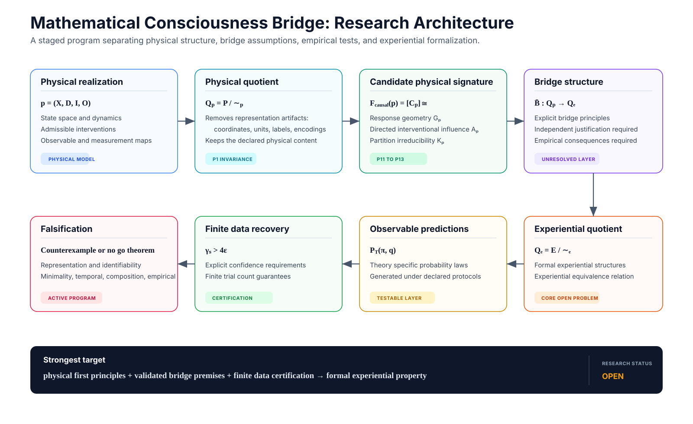

**Research architecture.** Physical realization, representation-independent structure, candidate signatures, measurement, empirical predictions, bridge principles, experiential structure, finite-data certification, and falsification are treated as distinct layers.

The central proof target is deliberately conditional:

\[
\boxed{
\text{physical first principles}
+
\text{explicit bridge principles}
+
\text{empirical discrimination}
+
\text{finite-data certification}
\Longrightarrow
\text{formal experiential property}.
}
\]

The implication must follow from stated premises. The premises must themselves expose the theory to falsification.


**Multiscale physical hierarchy.** Local dynamics, network state, persistent subsystem, intervention-resolved structure, temporal/compositional/scale behavior, and the bridge layer are not interchangeable objects.

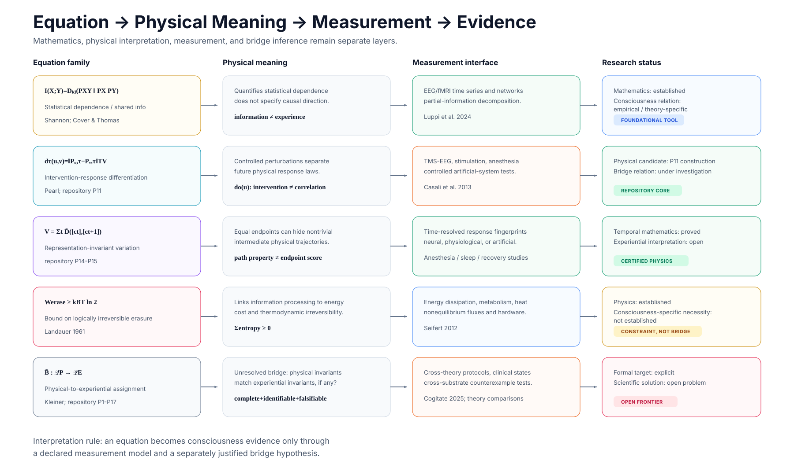

\[
\boxed{
\text{equation}
\neq
\text{physical interpretation}
\neq
\text{measurement model}
\neq
\text{empirical evidence}
\neq
\text{experiential conclusion}.
}
\]

---

# 2. Classical and stochastic physical foundation

A controlled stochastic system may be written

\[
\boxed{
dX_t=f(X_t,u_t)\,dt+G(X_t,u_t)\,dW_t,
}
\]

or through a transition kernel

\[
\boxed{
X_{t+\Delta t}\sim K_{\Delta t}(\cdot\mid X_t,u_t).
}
\]

The physical model must declare state variables, units, observables, interventions, noise model, boundary conditions, sampling timescale, and scale of validity.

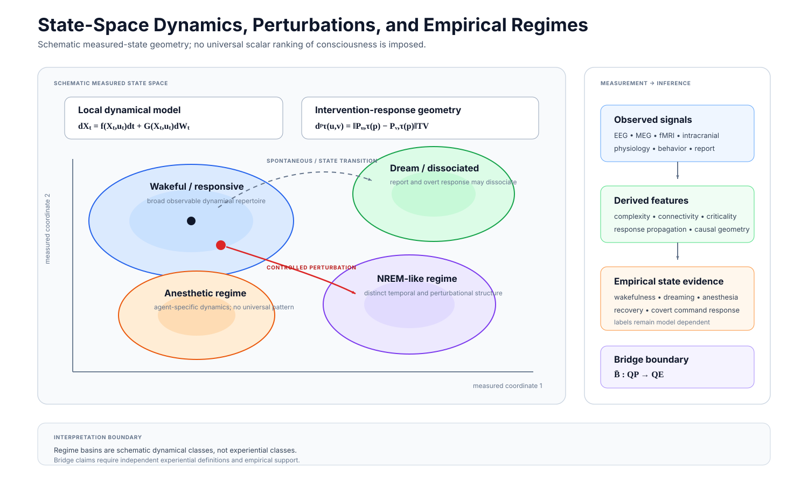

## 2.1 Mean-reverting stochastic dynamics

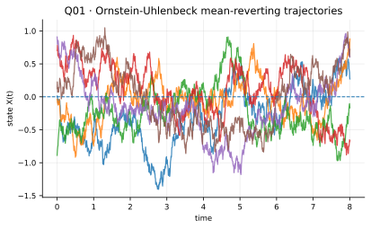

For

\[
dX_t=\theta(\mu-X_t)dt+\sigma dW_t,
\]

linear drift pulls trajectories toward equilibrium while diffusion sustains fluctuations.

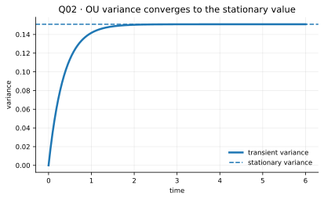

\[
\boxed{
\operatorname{Var}[X_t]
=\frac{\sigma^2}{2\theta}
\left(1-e^{-2\theta t}\right),
\qquad
\operatorname{Var}_{\infty}=\frac{\sigma^2}{2\theta}.
}
\]

For the atlas parameters, the tested stationary value is **0.1508928571**.

## 2.2 Metastable physical landscapes

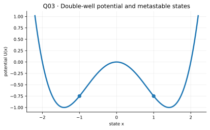

\[
U(x)=\frac{a}{4}x^4-\frac{b}{2}x^2.
\]

The potential contains two minima separated by an energy barrier.

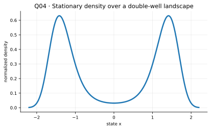

\[
\boxed{p(x)\propto e^{-\beta U(x)}.}
\]

## 2.3 Linear dynamics and stability

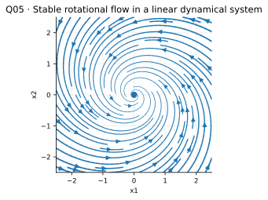

\[
\dot x=Ax.
\]

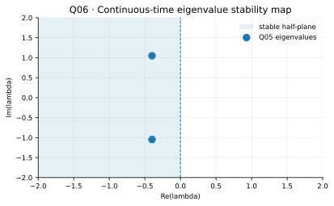

Continuous-time asymptotic stability requires

\[
\boxed{\operatorname{Re}\lambda_i(A)<0\quad\forall i.}
\]

The atlas example has eigenvalue real part **-0.4**.

## 2.4 Diffusion

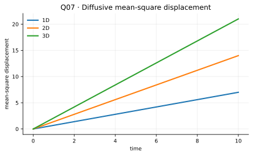

\[
\boxed{\mathbb E\|X_t-X_0\|^2=2dDt.}
\]

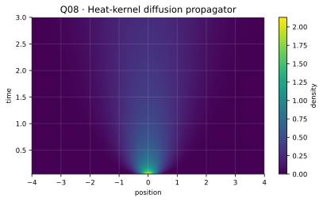

\[
\boxed{
G(x,t)=\frac{1}{\sqrt{4\pi Dt}}
\exp\left(-\frac{x^2}{4Dt}\right).
}
\]

## 2.5 Thermodynamics of information

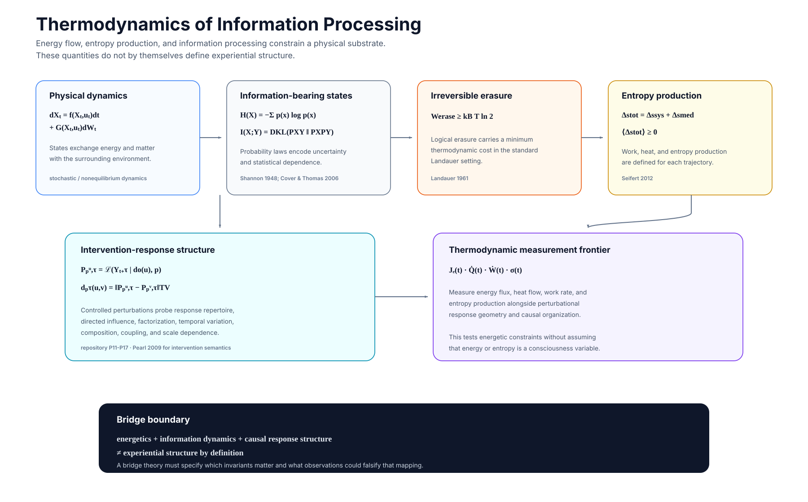

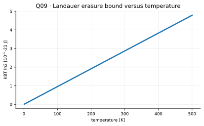

Logical erasure obeys

\[
\boxed{W_{\mathrm{erase}}\ge k_BT\ln2.}
\]

At 300 K, the tested lower bound is approximately

\[
2.870978885\times10^{-21}\ \mathrm J
\]

per erased bit.

## 2.6 Information, synchronization, mixing, and control

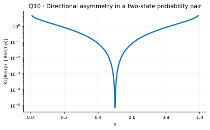

\[
D_{\mathrm{KL}}(P\|Q)=\sum_i P_i\log\frac{P_i}{Q_i}.
\]

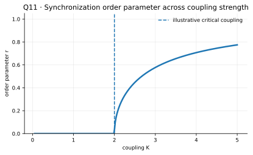

\[
r e^{i\psi}=\frac1N\sum_{j=1}^Ne^{i\theta_j}.
\]

This is a synthetic coupled-oscillator benchmark, not a consciousness index.

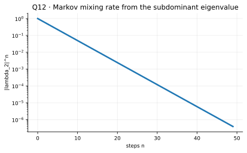

The atlas Markov example has subdominant eigenvalue magnitude

\[
|\lambda_2|=0.74.
\]

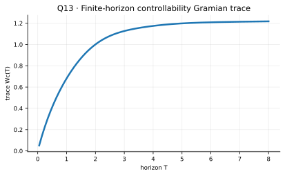

\[
\boxed{
W_c(T)=\int_0^T e^{At}BB^{\mathsf T}e^{A^{\mathsf T}t}\,dt.
}
\]

---

# 3. Quantum foundations: the deepest operational physical layer used here

The quantum part of this repository is not a claim that consciousness is caused by quantum effects. It is a more demanding physical baseline. If one wants to argue that experiential structure is not reducible to physics, the relevant physical description cannot stop at classical state variables while ignoring the quantum theory that underlies them.

For a closed system,

\[
\boxed{
i\hbar\frac{\partial}{\partial t}|\psi(t)\rangle
=\hat H|\psi(t)\rangle,
}
\]

or, for the density operator,

\[
\boxed{
i\hbar\dot\rho=[H,\rho].}
\]

For an open Markovian quantum system, a standard Lindblad form is

\[
\boxed{
\dot\rho
=-\frac{i}{\hbar}[H,\rho]
+\sum_k\left(
L_k\rho L_k^{\dagger}
-\frac12\{L_k^{\dagger}L_k,\rho\}
\right).
}
\]

These equations define physical dynamics. They do not define experience.

## 3.1 Schrödinger propagation and quantization

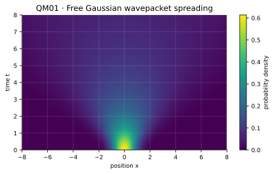

**QM01 - Free Gaussian wavepacket.** The exact free-particle Gaussian solution broadens under Schrödinger evolution because different momentum components accumulate different phases.

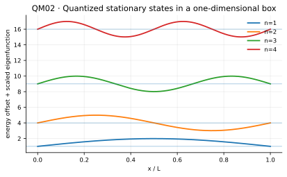

**QM02 - Quantized stationary states.** For an infinite one-dimensional well,

\[
\boxed{
E_n=\frac{n^2\pi^2\hbar^2}{2mL^2},
\qquad
\psi_n(x)=\sqrt{\frac2L}\sin\frac{n\pi x}{L}.
}
\]

Boundary conditions discretize the allowed energy spectrum.

## 3.2 Superposition, interference, and uncertainty

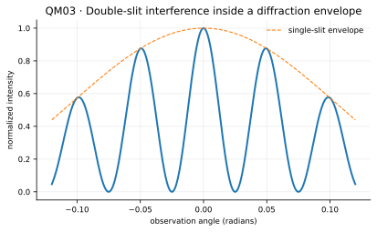

**QM03 - Double-slit interference.** Amplitudes add before probabilities are computed; interference is a physical consequence of coherent superposition.

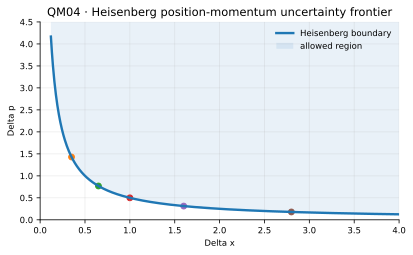

**QM04 - Heisenberg uncertainty frontier.** For canonical position and momentum,

\[
\boxed{\Delta x\,\Delta p\ge\frac{\hbar}{2}.}
\]

Minimum-uncertainty Gaussian states saturate the bound.

## 3.3 Quantum state geometry and the Born rule

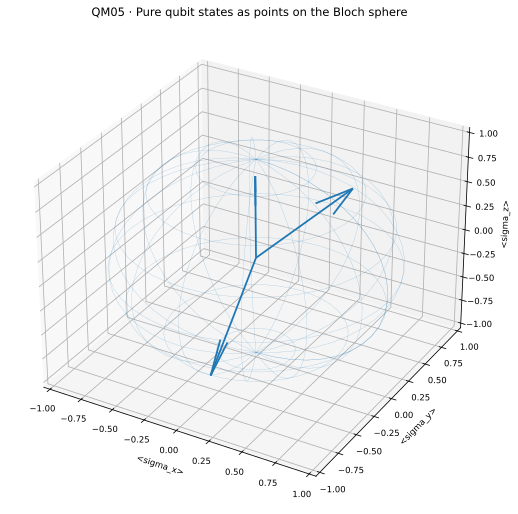

**QM05 - Bloch-sphere geometry.** A qubit density operator can be written

\[
\boxed{
\rho=\frac12(I+\mathbf r\cdot\boldsymbol\sigma),
\qquad |\mathbf r|\le1.
}
\]

Pure states satisfy \(|\mathbf r|=1\); mixed states lie inside the sphere.

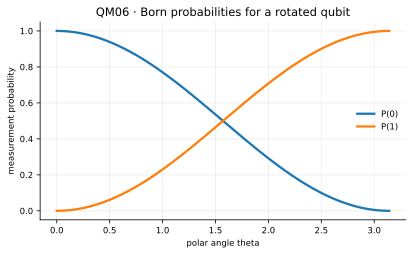

**QM06 - Born probabilities.** For a rotated pure qubit,

\[
\boxed{
P(0)=\cos^2\frac\theta2,
\qquad
P(1)=\sin^2\frac\theta2.
}
\]

More generally, a measurement with POVM element \(M_y\) gives

\[
\boxed{p(y)=\operatorname{Tr}(M_y\rho).}
\]

## 3.4 Coherent dynamics and decoherence

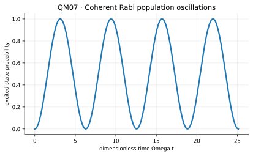

**QM07 - Rabi oscillation.** A resonantly driven two-level system exhibits

\[
P_e(t)=\sin^2\frac{\Omega t}{2}.
\]

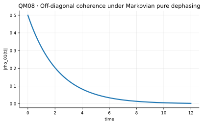

**QM08 - Pure dephasing.** A standard Markovian model gives

\[
\boxed{|\rho_{01}(t)|=|\rho_{01}(0)|e^{-\Gamma t}.}
\]

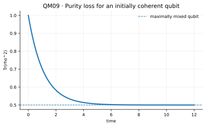

**QM09 - Purity.** For an initially coherent qubit under the displayed dephasing model,

\[
\boxed{
\operatorname{Tr}(\rho^2)
=\frac12\left(1+e^{-2\Gamma t}\right).
}
\]

This tends from one toward one half.

## 3.5 Quantum entropy and entanglement

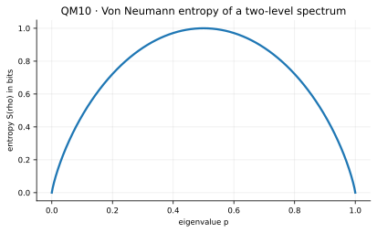

**QM10 - Von Neumann entropy.** Quantum-state entropy is

\[
\boxed{S(\rho)=-\operatorname{Tr}(\rho\log_2\rho).}
\]

For a qubit spectrum \((p,1-p)\), entropy is zero for a pure state and one bit for a maximally mixed state.

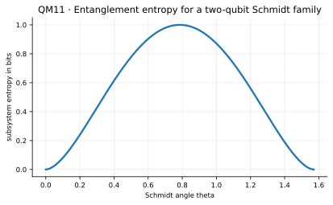

**QM11 - Bipartite entanglement.** For

\[
|\psi\rangle
=\cos\theta|00\rangle+\sin\theta|11\rangle,
\]

the reduced-state entropy reaches one bit at \(\theta=\pi/4\).

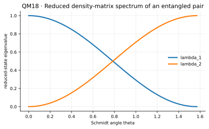

**QM18 - Partial trace.** The globally pure Schmidt state above gives reduced eigenvalues

\[
\boxed{\lambda_1=\cos^2\theta,\qquad\lambda_2=\sin^2\theta.}
\]

A subsystem can therefore be mixed even when the joint quantum state is pure.

## 3.6 Bell correlations and nonclassicality

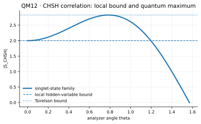

**QM12 - Bell-CHSH structure.** Local hidden-variable models obey

\[
\boxed{|S_{\mathrm{CHSH}}|\le2,}
\]

while quantum theory allows

\[
\boxed{|S_{\mathrm{CHSH}}|\le2\sqrt2.}
\]

Violation of the local bound demonstrates nonclassical correlation structure; it does not permit superluminal signalling and does not by itself imply anything about consciousness.

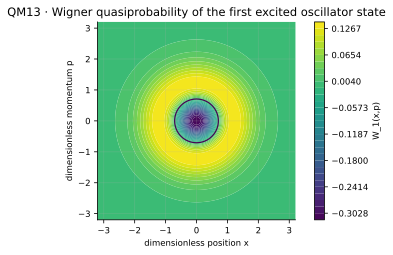

**QM13 - Wigner negativity.** The first excited harmonic-oscillator state has a negative region in its Wigner quasiprobability. This is a standard marker of nonclassical state structure, not an experiential variable.

## 3.7 Hilbert-space growth and quantum distinguishability

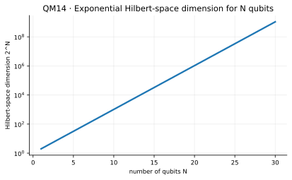

**QM14 - Tensor-product growth.** For \(N\) qubits,

\[
\boxed{\dim\left[(\mathbb C^2)^{\otimes N}\right]=2^N.}
\]

Exponential Hilbert-space dimension is a mathematical property of composite quantum state space. Large dimension alone is not a consciousness criterion.

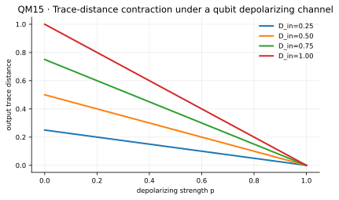

**QM15 - Quantum data processing.** For a depolarizing channel

\[
\Lambda_p(\rho)=(1-p)\rho+p\frac{I}{2},
\]

qubit trace distance contracts as

\[
\boxed{
D(\Lambda_p\rho,\Lambda_p\sigma)
=(1-p)D(\rho,\sigma).
}
\]

This quantum information-loss law is conceptually parallel to P17's classical total-variation contraction under coarse-graining.

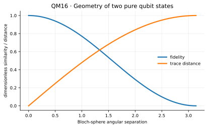

**QM16 - Pure-state geometry.** For pure qubit states separated by projective angle \(\theta\),

\[
F=\cos^2\frac\theta2,
\qquad
D=\sin\frac\theta2.
\]

## 3.8 Repeated quantum measurement

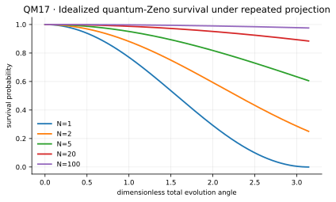

**QM17 - Idealized quantum Zeno effect.** Repeated projective survival measurements yield

\[
\boxed{
P_N(t)=\cos^{2N}\left(\frac{\Omega t}{2N}\right).
}
\]

The idealized limit suppresses coherent departure from the initial state. This is a physical measurement effect; it is not evidence that conscious observation causes collapse.

---

# 4. Quantum operational completeness and the physical-to-experiential test

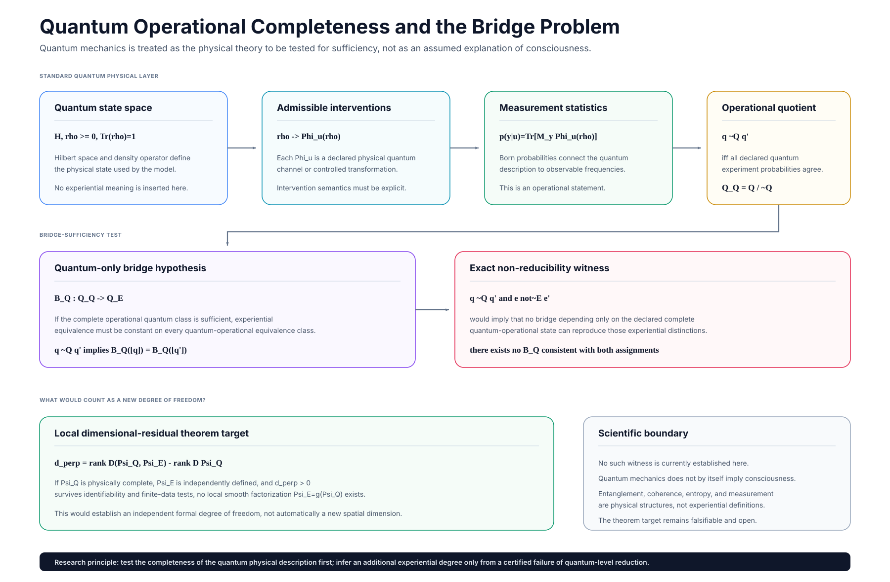

A useful quantum-level physical object for this research is

\[
\boxed{
\mathfrak Q
=(\mathcal H,\rho,\{\Phi_u\}_{u\in\mathcal U},\{M_y\}_{y\in\mathcal Y}),
}
\]

where \(\mathcal H\) is Hilbert space, \(\rho\) is the density operator, \(\Phi_u\) are declared quantum interventions/channels, and \(M_y\) are declared measurement operators. Operational predictions are

\[
\boxed{
p(y\mid u)=\operatorname{Tr}[M_y\Phi_u(\rho)].}
\]

Define **quantum operational equivalence** by

\[
\boxed{
q\sim_Qq'
\iff
\operatorname{Tr}[M_y\Phi_u(\rho_q)]
=
\operatorname{Tr}[M_y\Phi_u(\rho_{q'})]
\quad\forall u,y
}
\]

for the declared complete experiment class. The operational quantum quotient is

\[
\boxed{\mathcal Q_Q=\mathcal Q/\sim_Q.}
\]

## 4.1 Quantum-only bridge hypothesis

If experience is completely determined by the declared operational quantum state, then there must exist

\[
\boxed{B_Q:\mathcal Q_Q\to\mathcal Q_E.}
\]

Consequently,

\[
q\sim_Qq'
\quad\Longrightarrow\quad
B_Q([q])=B_Q([q']).
\]

This is not metaphysics; it is the same quotient/factorization logic used by P1, P5, and P7.

## 4.2 Exact non-reducibility witness

A decisive counterexample to the quantum-only bridge would require **both** of the following:

\[
\boxed{q\sim_Qq'}
\]

under an operationally complete declared quantum experiment class, while independently established experiential structure satisfies

\[
\boxed{e\not\sim_E e'.}
\]

If those conditions were established, no function depending only on \([q]\in\mathcal Q_Q\) could represent both experiential assignments. Formally,

\[
\boxed{
q\sim_Qq'
\ \text{and}\ 
e\not\sim_Ee'
\Longrightarrow
\nexists B_Q:\mathcal Q_Q\to\mathcal Q_E
\text{ consistent with both assignments}.
}
\]

No such empirical witness is claimed here. The theorem structure tells us exactly what evidence would be required.

## 4.3 Independent formal degree of freedom: local rank target

Let \(\Psi_Q\) be a physically complete quantum-operational fingerprint and \(\Psi_E\) an independently defined experiential fingerprint. If experiential structure locally factors through the quantum physical description,

\[
\Psi_E=g\circ\Psi_Q,
\]

then

\[
D\Psi_E=Dg\,D\Psi_Q
\]

and therefore

\[
\operatorname{rank}D(\Psi_Q,\Psi_E)
=\operatorname{rank}D\Psi_Q.
\]

This motivates the open residual

\[
\boxed{
d_{\perp}
=
\operatorname{rank}D(\Psi_Q,\Psi_E)
-
\operatorname{rank}D\Psi_Q.
}
\]

Under independently justified experiential coordinates and a certified complete physical fingerprint,

\[
\boxed{d_{\perp}>0}
\]

would rule out a local smooth reduction \(\Psi_E=g(\Psi_Q)\). That would establish an additional **formal degree of freedom relative to the chosen complete physical representation**. It would not automatically establish a fifth spatial dimension, a new spacetime coordinate, or a modification of quantum mechanics.

The required work before such a statement can become a scientific result is explicit: formal experiential coordinates, physical completeness, identifiability, finite-data certification, counterexample search, and empirical measurement of the purported residual.

---

# 4.4 Fundamental theory / Theory-of-Everything interface

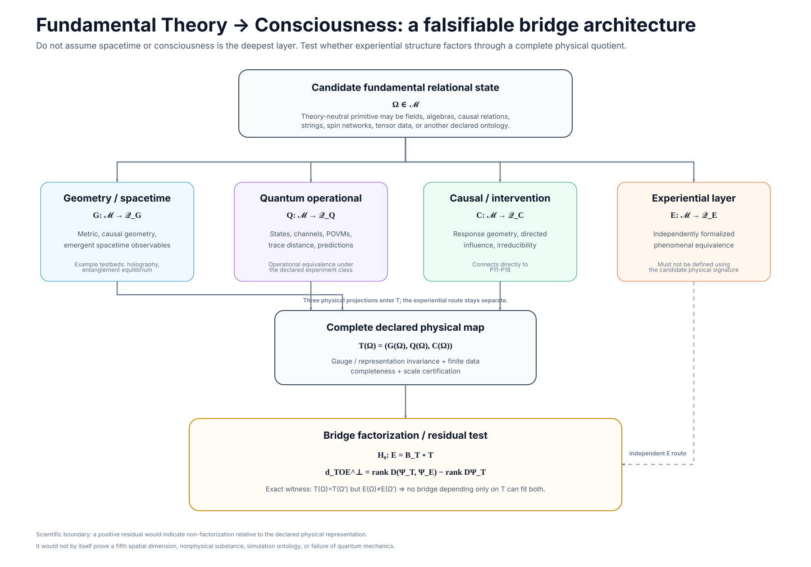

There is currently **no experimentally established Theory of Everything** unifying quantum theory, the Standard Model, and gravity. This project therefore does not insert a preferred TOE as scientific fact. Instead it defines a common mathematical interface into which candidate fundamental theories can be placed and compared.

Let

\[
\boxed{\Omega\in\mathcal M}
\]

be a state of a declared candidate fundamental theory. From the same underlying state define

\[
\boxed{
G:\mathcal M\to\mathcal Q_G,
\qquad
Q:\mathcal M\to\mathcal Q_Q,
\qquad
C:\mathcal M\to\mathcal Q_C,
\qquad
E:\mathcal M\to\mathcal Q_E,
}
\]

where \(G\) is geometric/spacetime structure, \(Q\) is quantum-operational structure, \(C\) is intervention-resolved causal structure, and \(E\) is independently formalized experiential structure. The declared complete physical descriptor is

\[
\boxed{T(\Omega)=\bigl(G(\Omega),Q(\Omega),C(\Omega)\bigr).}
\]

The conservative physical-reduction hypothesis is the factorization

\[
\boxed{E=B_T\circ T.}
\]

The exact no-factorization witness is therefore

\[
\boxed{
T(\Omega)=T(\Omega')
\quad\text{but}\quad
E(\Omega)\ne E(\Omega')
\Longrightarrow
\nexists B_T\text{ consistent with both states}.
}
\]

This gives the project a rigorous way to investigate a very broad question without deciding the metaphysics in advance: **spacetime and experiential structure may be tested as different quotient structures of a deeper candidate state, while factorization determines whether the experiential quotient is already fixed by the complete physical quotient.**

For local smooth coordinates, define the transverse residual

\[
\boxed{
d_{\mathrm{TOE}}^{\perp}
=
\operatorname{rank}D(\Psi_T,\Psi_E)
-
\operatorname{rank}D\Psi_T.
}
\]

If \(\Psi_E=g\circ\Psi_T\), then necessarily \(d_{\mathrm{TOE}}^{\perp}=0\). A certified positive residual would rule out that local factorization relative to the declared physical representation. It would **not** by itself establish a fifth spatial dimension, nonphysical substance, simulation ontology, or failure of quantum mechanics.

## Scientific anchors

The fundamental-theory layer is connected to external literature through explicit source roles. These papers motivate mathematical and experimental directions. None is cited as a proof of consciousness.

| Source | Role in this repository | Direct record |
| --- | --- | --- |
| Jacobson, 2016 | entanglement-equilibrium route connecting quantum information and semiclassical spacetime dynamics | [DOI 10.1103/PhysRevLett.116.201101](https://doi.org/10.1103/PhysRevLett.116.201101) |
| Pastawski, Yoshida, Harlow, and Preskill, 2015 | holographic quantum error correction and bulk-boundary structure | [DOI 10.1007/JHEP06(2015)149](https://doi.org/10.1007/JHEP06(2015)149) |
| Marletto and Vedral, 2025 | information-theoretic methods for laboratory tests relevant to quantum gravity | [DOI 10.1103/RevModPhys.97.015006](https://doi.org/10.1103/RevModPhys.97.015006) |
| Takayanagi, 2025 | quantum-information perspective on emergent holographic spacetime | [DOI 10.1103/pg4r-fy8n](https://doi.org/10.1103/pg4r-fy8n) |
| Kleiner, 2020 | mathematical formalization of consciousness models and experiential spaces | [DOI 10.3390/e22060609](https://doi.org/10.3390/e22060609) |
| Cogitate Consortium et al., 2025 | adversarial empirical testing of predictions from IIT and GNWT | [DOI 10.1038/s41586-025-08888-1](https://doi.org/10.1038/s41586-025-08888-1) |

The evidential classification and bibliographic metadata for these sources are maintained in the [Reference Audit](docs/reference_audit.md). The broader physics and mathematical foundation is maintained in the [Foundational Bibliography](docs/foundational_physics_mathematics_bibliography.md).

## Where *My Big TOE* fits

Thomas W. Campbell's *My Big TOE* proposes that consciousness is fundamental and physical reality is virtual. Those broad claims are **not treated as established scientific facts here**. Campbell, Owhadi, Sauvageau, and Watkinson published a narrower simulation-theory experiment proposal based on explicit finite-resource assumptions and wave/particle tests. The paper is available as [arXiv:1703.00058](https://arxiv.org/abs/1703.00058). It is included only as a **speculative, falsifiable antecedent**, not as a premise of the present framework.

The scientific rule is simple: an additional primitive must change a measurable prediction, improve out-of-sample explanatory power, resolve a proved factorization failure, or produce a new falsifiable invariant. Otherwise it is not an identifiable new component of reality.

[Read the full Fundamental Theory to Consciousness program](docs/fundamental_theory_consciousness_program.md).

# 4.5 P19 - fundamental physical sufficiency and residual tests

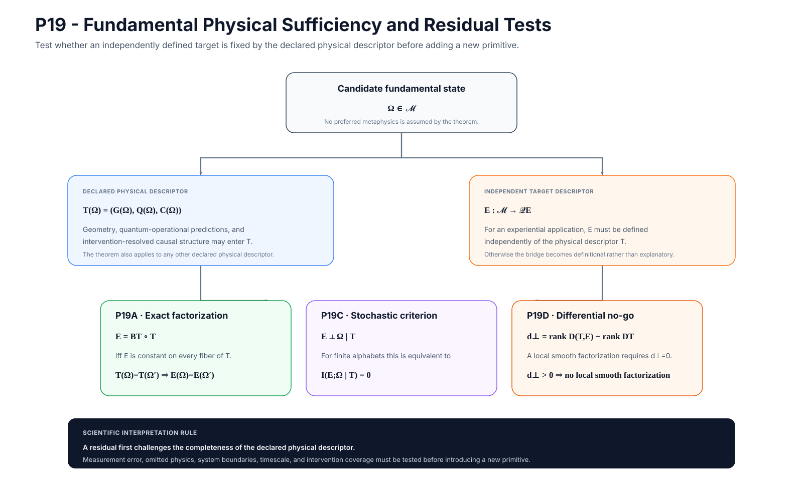

P19 turns the fundamental-theory interface into an exact theorem. Let

\[
T:\mathcal M\to\mathcal Q_T
\]

be the declared physical descriptor and let

\[
E:\mathcal M\to\mathcal Q_E
\]

be an independently defined target descriptor. There exists a unique bridge on the physical image,

\[
\boxed{E=B_T\circ T,}
\]

if and only if the target is constant on every physical fiber:

\[
\boxed{
T(\Omega)=T(\Omega')
\Longrightarrow
E(\Omega)=E(\Omega').
}
\]

Thus a single exact collision

\[
\boxed{
T(\Omega)=T(\Omega')
\quad\text{but}\quad
E(\Omega)\ne E(\Omega')
}
\]

rules out every deterministic bridge through that declared physical descriptor.

The stochastic extension replaces deterministic factorization by conditional independence,

\[
\boxed{E\perp\!\!\!\perp\Omega\mid T.}
\]

For finite alphabets this is equivalent to

\[
\boxed{
\mathcal I_{\perp}^{\mathrm{fund}}
:=I(E;\Omega\mid T)=0.
}
\]

For smooth local coordinates, any differentiable factorization requires

\[
\boxed{
\operatorname{rank}D(T,E)=\operatorname{rank}DT.
}
\]

Therefore

\[
\boxed{
d_{\perp}
:=\operatorname{rank}D(T,E)-\operatorname{rank}DT>0
}
\]

is a sufficient local no-factorization certificate.

The interpretation is deliberately conservative. A residual first challenges the completeness of the declared physical descriptor. Measurement error, omitted physical variables, system boundaries, timescale, and intervention coverage must be tested before introducing a new primitive.

[Read Proposition 19](docs/proposition_19_fundamental_physical_sufficiency.md). See the [Equation and Citation Map](docs/equation_and_citation_map.md) for the provenance of each mathematical ingredient and the [Falsification Program](docs/falsification_program.md) for the empirical burden.

# 4.6 P20 - finite-sample residual certification

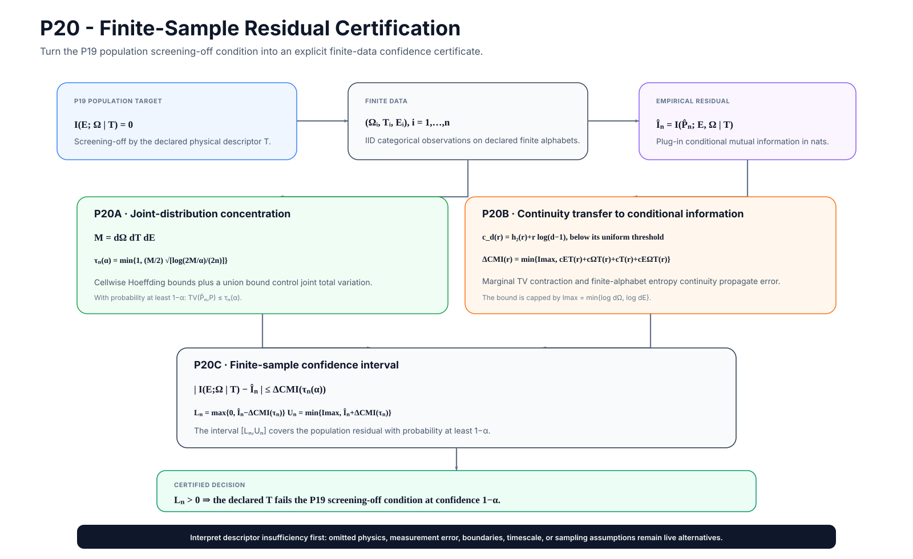

P19 states a population criterion. P20 asks what finite data can certify. Let

\[
Z_i=(\Omega_i,T_i,E_i),\qquad i=1,\ldots,n,
\]

be IID samples on declared finite alphabets of sizes \(d_\Omega,d_T,d_E\), and let

\[
M=d_\Omega d_T d_E.
\]

A simultaneous Hoeffding and union-bound argument gives the conservative joint-distribution radius

\[
\boxed{
\tau_n(\alpha)
=
\min\left\{
1,
\frac{M}{2}
\sqrt{\frac{1}{2n}\log\frac{2M}{\alpha}}
\right\}.
}
\]

Finite-alphabet entropy continuity then propagates this distributional uncertainty to conditional mutual information. If \(\widehat I_n\) is the empirical residual, P20 proves

\[
\boxed{
\left|
I_P(E;\Omega\mid T)-\widehat I_n
\right|
\le
\Delta_{\mathrm{CMI}}\bigl(\tau_n(\alpha)\bigr)
}
\]

with probability at least \(1-\alpha\). Therefore

\[
\boxed{
L_n
=
\max\left\{0,
\widehat I_n-\Delta_{\mathrm{CMI}}(\tau_n)
\right\}
}
\]

is a valid lower confidence bound, and

\[
\boxed{
L_n>0
\Longrightarrow
I_P(E;\Omega\mid T)>0
}
\]

at confidence at least \(1-\alpha\), under the stated model.

For the synthetic binary checkpoint with \(n=10{,}000\), \(\alpha=0.05\), and \(\widehat I_n=\log 2\), the conservative lower bound is approximately

\[
\boxed{L_n\approx0.234702\text{ nats}.}
\]

This is a mathematical calibration, not an empirical consciousness result. A certified positive residual first means that the declared physical descriptor \(T\) fails to screen off the declared target \(E\) under the sampling assumptions. Omitted physics, measurement error, preprocessing, system boundaries, timescale, and sampling dependence remain alternative explanations that must be tested.

[Read Proposition 20](docs/proposition_20_finite_sample_residual_certification.md). The [P20 theorem map](docs/figures/p20_finite_sample_residual_certificate.svg), [implementation](src/consciousness_bridge/finite_sample_residual_certification.py), [tests](tests/test_finite_sample_residual_certification.py), [equation provenance](docs/equation_and_citation_map.md), and [falsification requirements](docs/falsification_program.md) are linked directly.

# 4.7 P21 - physical-descriptor refinement and residual persistence

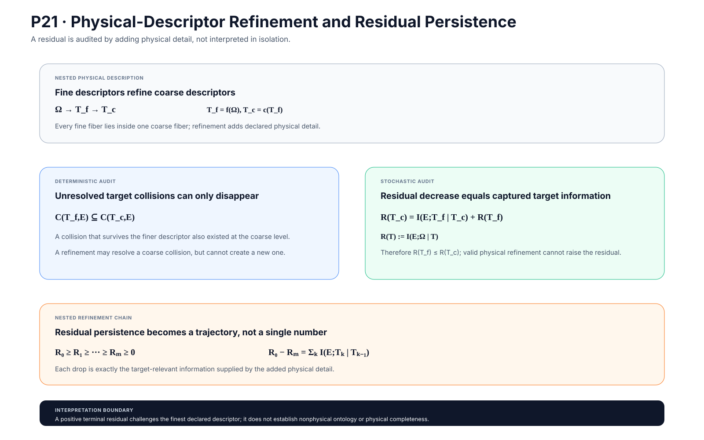

P19 asks whether a declared physical descriptor is sufficient, and P20 asks whether a positive residual can be certified from finite data. P21 addresses the next necessary scientific objection: **could the residual simply reflect omitted physical detail?**

Let the fine physical descriptor be a deterministic function of the sampled physical state,

\[
T_f=f(\Omega),
\]

and let the coarse descriptor be obtained from the fine descriptor,

\[
\boxed{T_c=c(T_f).}
\]

For a deterministic target audit, define the unresolved collision set

\[
\mathcal C(T,E)
=
\{(\omega,\omega'):
T(\omega)=T(\omega'),\ E(\omega)\ne E(\omega')\}.
\]

P21 proves

\[
\boxed{
\mathcal C(T_f,E)
\subseteq
\mathcal C(T_c,E).
}
\]

A valid refinement can therefore resolve a collision produced by a coarse description, but it cannot create a new unresolved collision that was absent at the coarse level.

For finite stochastic variables define the descriptor-relative residual

\[
\boxed{R(T):=I(E;\Omega\mid T).}
\]

The conditional-information chain rule gives the exact refinement decomposition

\[
\boxed{
R(T_c)
=
I(E;T_f\mid T_c)
+
R(T_f).
}
\]

Hence

\[
\boxed{R(T_f)\le R(T_c),}
\]

and the decrease is not an unspecified effect:

\[
\boxed{
R(T_c)-R(T_f)
=
I(E;T_f\mid T_c).
}
\]

It is exactly the target-relevant information supplied by the added physical detail.

For a nested descriptor chain

\[
T_0\preceq T_1\preceq\cdots\preceq T_m,
\]

P21 yields

\[
\boxed{
R_0\ge R_1\ge\cdots\ge R_m\ge0
}
\]

and the telescoping identity

\[
\boxed{
R_0-R_m
=
\sum_{k=1}^{m}I(E;T_k\mid T_{k-1}).
}
\]

This turns omitted physics into an explicit audit trajectory. Each refinement must state which physical variables were added, how the nesting relation is established, how much residual was removed, and how much remains.

The interpretation boundary is essential. A positive residual at the finest **declared and measured** level challenges that descriptor; it does not establish that no richer physical description exists. In particular, if the chain reaches the identity descriptor \(T_m=\Omega\), then

\[
\boxed{I(E;\Omega\mid\Omega)=0}
\]

by definition. Conditional screening-off therefore cannot by itself prove that a target lies outside physics. P21 is an omitted-physics control theorem, not an argument for a nonphysical substance or an extra spacetime dimension.

[Read Proposition 21](docs/proposition_21_descriptor_refinement_residual_persistence.md). The [P21 theorem map](docs/figures/p21_descriptor_refinement_residual_persistence.svg), [implementation](src/consciousness_bridge/descriptor_refinement_residual.py), and [tests](tests/test_descriptor_refinement_residual.py) expose the complete proof-to-code audit path.

# 4.8 P22 - simultaneous finite-sample refinement-chain certification


P21 gives the exact population trajectory of a nested physical-descriptor audit. P22 asks whether the **entire trajectory** can be certified from one finite data set without treating every descriptor level as a separately sampled statistical experiment.

Let

\[
Z=(\Omega,E)
\]

have a finite declared alphabet, and suppose

\[
Z_1,\ldots,Z_n\overset{\mathrm{IID}}{\sim}P_{\Omega E}.
\]

For predeclared deterministic nested descriptors

\[
T_k=f_k(\Omega),
\qquad
T_{k-1}=c_k(T_k),
\]

P22 first certifies one base event

\[
\boxed{
\mathcal A_n
=
\left\{
\|P_{\Omega E}-\widehat P_{\Omega E}\|_{\mathrm{TV}}
\le
\tau_n(\alpha)
\right\}
}
\]

with

\[
\Pr(\mathcal A_n)\ge1-\alpha.
\]

Every level-specific residual law is a deterministic pushforward of \(P_{\Omega E}\):

\[
\phi_k(\omega,e)
=
(\omega,T_k(\omega),e).
\]

Every refinement-gain law is also a deterministic pushforward:

\[
\psi_k(\omega,e)
=
(T_k(\omega),T_{k-1}(\omega),e).
\]

Total-variation contraction therefore transfers the **same** base confidence event to every residual and every gain distribution in the chain.

For

\[
R_k=I(E;\Omega\mid T_k),
\]

P22 obtains simultaneous intervals satisfying

\[
\boxed{
|R_k-\widehat R_k|
\le
\Delta_k(\tau_n(\alpha))
\qquad
\forall k.
}
\]

For the P21 refinement gains

\[
G_k=I(E;T_k\mid T_{k-1}),
\]

it likewise obtains

\[
\boxed{
|G_k-\widehat G_k|
\le
\Gamma_k(\tau_n(\alpha))
\qquad
\forall k.
}
\]

P21 also gives

\[
G_k=R_{k-1}-R_k,
\qquad
\widehat G_k=\widehat R_{k-1}-\widehat R_k,
\]

so P22 intersects the direct gain interval with the difference-based interval implied by the residual bounds.

The main simultaneous statement is

\[
\boxed{
\Pr\left(
R_k\in\mathcal I_k^R\ \forall k,
\quad
G_k\in\mathcal I_k^G\ \forall k
\right)
\ge1-\alpha.
}
\]

This construction does **not** replace \(\alpha\) by \(\alpha/(2m+1)\). There is one probabilistic event for the shared base law, and all level-specific bounds follow deterministically from that event. This is different from running independently calibrated confidence procedures at each level.

The absence of a level-count penalty does not make long chains statistically free. The base radius depends on the declared physical-target alphabet \(d_\Omega d_E\), and the entropy-continuity radii depend on the descriptor alphabet sizes. High-dimensional alphabets can make the finite-data certificate numerically weak.

If the terminal lower bound satisfies

\[
\boxed{L_m^R>0,}
\]

then residual persistence at the finest tested descriptor is certified with simultaneous confidence at least \(1-\alpha\) under the declared finite-alphabet IID model. The conclusion remains descriptor relative. P22 does not establish physical completeness, nonphysical ontology, or an additional spacetime dimension, and the P21 identity boundary

\[
I(E;\Omega\mid\Omega)=0
\]

remains unchanged.

[Read Proposition 22](docs/proposition_22_simultaneous_refinement_chain_certification.md). The [P22 theorem map](docs/figures/p22_simultaneous_refinement_chain_certification.svg), [implementation](src/consciousness_bridge/refinement_chain_certification.py), and [tests](tests/test_refinement_chain_certification.py) expose the full proof-to-code path.

# 4.9 P23 - adaptive physical-descriptor selection certification


P22 certifies a fixed declared refinement chain. P23 addresses the next statistical question: **what happens when the next physical refinement is selected after inspecting the same finite data?**

Let the sampled base law be

\[
Z=(\Omega,E)\sim P,
\]

with empirical law \(\widehat P_n\), and let a common coarse physical descriptor be

\[
T_c=c(\Omega).
\]

For every admissible candidate \(f\), define a finer deterministic descriptor

\[
T_f=f(\Omega)
\]

that refines \(T_c\). The P21 refinement gain and remaining residual are

\[
\boxed{
G_f=I(E;T_f\mid T_c),
\qquad
R_f=I(E;\Omega\mid T_f).
}
\]

P21 gives

\[
\boxed{R_c-R_f=G_f.}
\]

P23 starts from the same one-event finite-sample certificate used by P22:

\[
\boxed{
\mathcal A_n
=
\left\{
\|P-\widehat P_n\|_{\mathrm{TV}}
\le\tau_n(\alpha)
\right\},
\qquad
\Pr(\mathcal A_n)\ge1-\alpha.
}
\]

For **every** deterministic map \(h\), total variation contracts pathwise:

\[
\boxed{
\|h_\#P-h_\#\widehat P_n\|_{\mathrm{TV}}
\le
\|P-\widehat P_n\|_{\mathrm{TV}}.
}
\]

Therefore, once \(\mathcal A_n\) occurs, all admissible residual and gain pushforwards are controlled simultaneously. In particular,

\[
\boxed{
|G_f-\widehat G_f|
\le
\Gamma_f(\tau_n),
\qquad
|R_f-\widehat R_f|
\le
\Delta_f(\tau_n)
\quad
\forall f.
}
\]

Now choose the refinement from the same data:

\[
\boxed{
\widehat f
\in
\operatorname*{arg\,max}_{f}\widehat G_f.
}
\]

Because the candidate inequalities already hold simultaneously on one base event, they remain valid for the selected candidate. P23 therefore proves fixed-sample post-selection coverage without a separate candidate-count confidence split.

The theorem also quantifies selection regret. If

\[
G^*=\max_f G_f
\]

and \(L_f^G,U_f^G\) are simultaneous candidate gain bounds, then

\[
\boxed{
0
\le
G^*-G_{\widehat f}
\le
\max_f U_f^G-L_{\widehat f}^G
\le
2\Gamma_{\max}.
}
\]

Since all candidates refine the same coarse descriptor,

\[
\boxed{
R_{\widehat f}-\min_fR_f
=
G^*-G_{\widehat f}.
}
\]

Thus the same certificate bounds how far the selected physical refinement can be from the smallest population residual available in the declared admissible class.

The absence of a direct candidate-count penalty is structural, not a general statement that model selection is free. The confidence ball controls the **base distribution itself**, and candidate laws are deterministic pushforwards of that same law. The finite-data cost still depends strongly on the declared physical-state alphabet and on the descriptor alphabet sizes.

P23 also draws a strict boundary between statistical validity and scientific interpretation:

\[
\boxed{
\text{post-selection statistical validity}
\neq
\text{physical admissibility}.
}
\]

A descriptor engineered from target labels can still be a mathematical function of \(\Omega\) after construction. P23's probability theorem does not make such a map a physically explanatory variable. Physical admissibility still requires independent justification of variables, system boundaries, measurement models, intervention semantics, and scale.

Finally, P23 is **fixed-sample**. Repeatedly collecting more data, inspecting the certificate, and stopping when a desired result appears is an optional-stopping problem and is not covered by this theorem.

[Read Proposition 23](docs/proposition_23_adaptive_descriptor_selection_certification.md). The [P23 theorem map](docs/figures/p23_adaptive_descriptor_selection_certification.svg), [implementation](src/consciousness_bridge/adaptive_descriptor_selection.py), and [tests](tests/test_adaptive_descriptor_selection.py) expose the full proof-to-code path.

# 4.10 P24 - anytime-valid adaptive physical-refinement certification

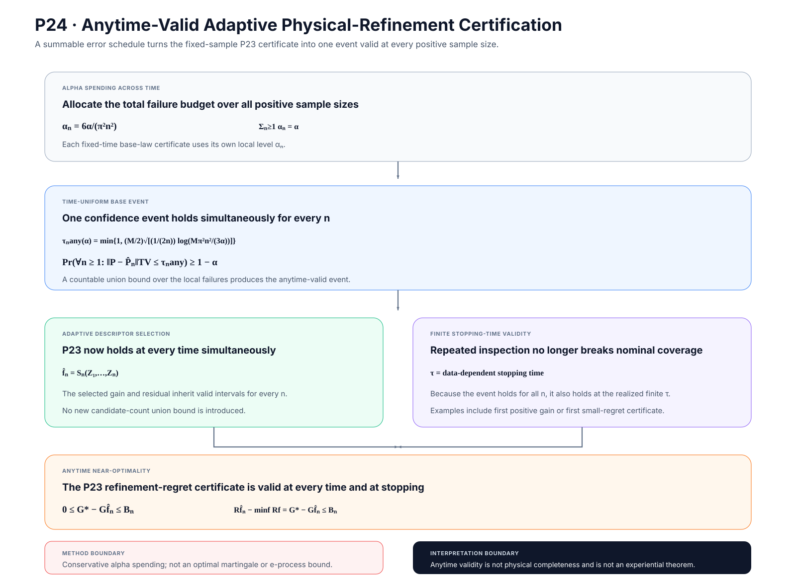

P23 is a fixed-sample theorem. P24 addresses the remaining repeated-look loophole: **what happens when the same growing data stream is inspected repeatedly and the analysis stops when a desired certificate first appears?**

Let

\[
Z_i=(\Omega_i,E_i),
\qquad
Z_1,Z_2,\ldots\overset{\mathrm{IID}}{\sim}P,
\]

on a finite base alphabet of size \(M\). P24 allocates the total error probability across all positive sample sizes using

\[
\boxed{
\alpha_n
=
\frac{6\alpha}{\pi^2n^2}.
}
\]

Because

\[
\sum_{n=1}^{\infty}\frac1{n^2}=\frac{\pi^2}{6},
\]

we obtain the exact budget identity

\[
\boxed{
\sum_{n=1}^{\infty}\alpha_n=\alpha.
}
\]

Applying the P20 finite-alphabet concentration bound at local level \(\alpha_n\) gives

\[
\boxed{
\tau_n^{\mathrm{any}}(\alpha)
=
\min\left\{
1,
\frac M2
\sqrt{
\frac1{2n}
\log\left(
\frac{M\pi^2n^2}{3\alpha}
\right)
}
\right\}.
}
\]

A countable union bound then yields one event valid for all positive times:

\[
\boxed{
\Pr\left(
\forall n\ge1,
\ \|P-\widehat P_n\|_{\mathrm{TV}}
\le
\tau_n^{\mathrm{any}}(\alpha)
\right)
\ge1-\alpha.
}
\]

P23's deterministic-pushforward argument is pathwise, so on this one event the gain and residual intervals remain valid for every admissible deterministic descriptor at every time. If the analysis selects

\[
\widehat f_n=S_n(Z_1,\ldots,Z_n),
\]

then

\[
\boxed{
G_{\widehat f_n}\in\mathcal I^G_{n,\widehat f_n},
\qquad
R_{\widehat f_n}\in\mathcal I^R_{n,\widehat f_n}
\quad\forall n\ge1
}
\]

with simultaneous probability at least \(1-\alpha\).

Let \(\tau\) be a stopping time with respect to the observed-data filtration. If \(\tau<\infty\), the same event is valid at the realized random time, so

\[
\boxed{
\Pr\left(
G_{\widehat f_\tau}\in\mathcal I^G_{\tau,\widehat f_\tau},
\quad
R_{\widehat f_\tau}\in\mathcal I^R_{\tau,\widehat f_\tau}
\right)
\ge1-\alpha.
}
\]

The P23 near-optimality result is also time uniform. With

\[
B_n
=
\max_fU_{f,n}^G-L_{\widehat f_n,n}^G,
\]

P24 gives

\[
\boxed{
0\le G^*-G_{\widehat f_n}\le B_n
\qquad\forall n\ge1,
}
\]

and, by P21,

\[
\boxed{
R_{\widehat f_n}-\min_fR_f
=G^*-G_{\widehat f_n}
\le B_n.
}
\]

This permits statistically valid stopping rules such as the first time the selected gain has a positive lower bound or the first time the refinement-regret certificate falls below a prespecified tolerance.

The construction is deliberately conservative. It is an explicit alpha-spending confidence sequence, not an optimized martingale, e-process, or mixture bound. It assumes a fixed finite alphabet, IID observations, and deterministic admissible descriptor maps.

The interpretation boundary remains strict:

\[
\boxed{
\text{anytime statistical validity}
\neq
\text{physical completeness}
\neq
\text{experiential interpretation}.
}
\]

[Read Proposition 24](docs/proposition_24_anytime_adaptive_refinement_certification.md). The [P24 theorem map](docs/figures/p24_anytime_adaptive_refinement_certification.svg), [implementation](src/consciousness_bridge/anytime_refinement_certification.py), and [tests](tests/test_anytime_refinement_certification.py) expose the full proof-to-code path.

---

# 5. Probability, distinguishability, and information geometry

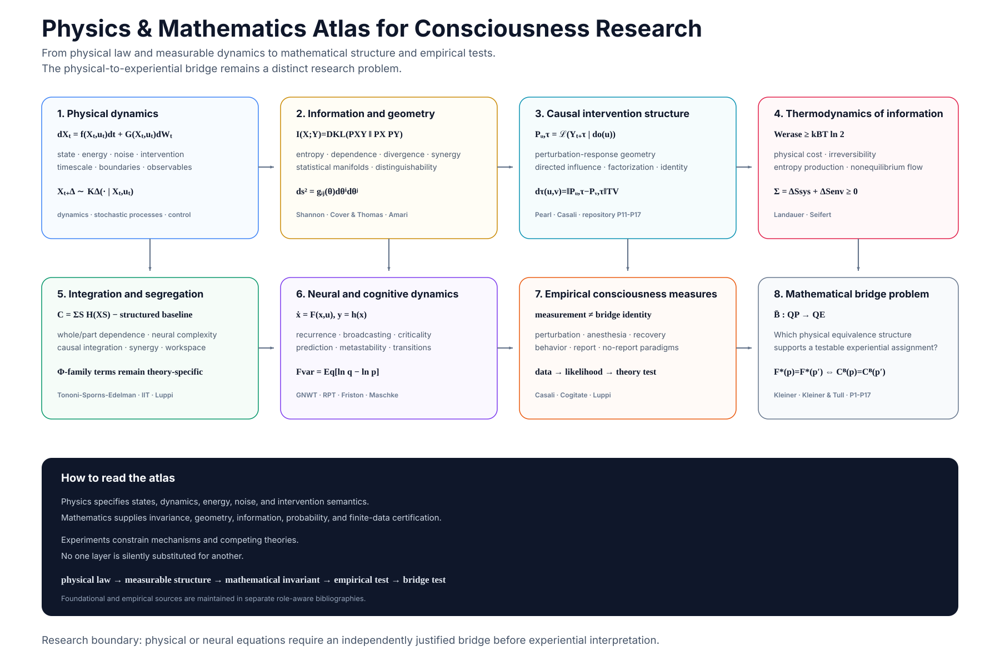

## 5.1 Correlated Gaussian geometry

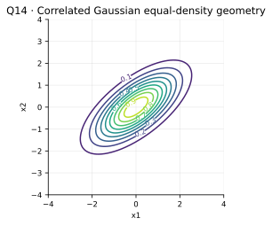

\[
p(x)\propto
\exp\left[-\frac12(x-\mu)^{\mathsf T}\Sigma^{-1}(x-\mu)\right].
\]

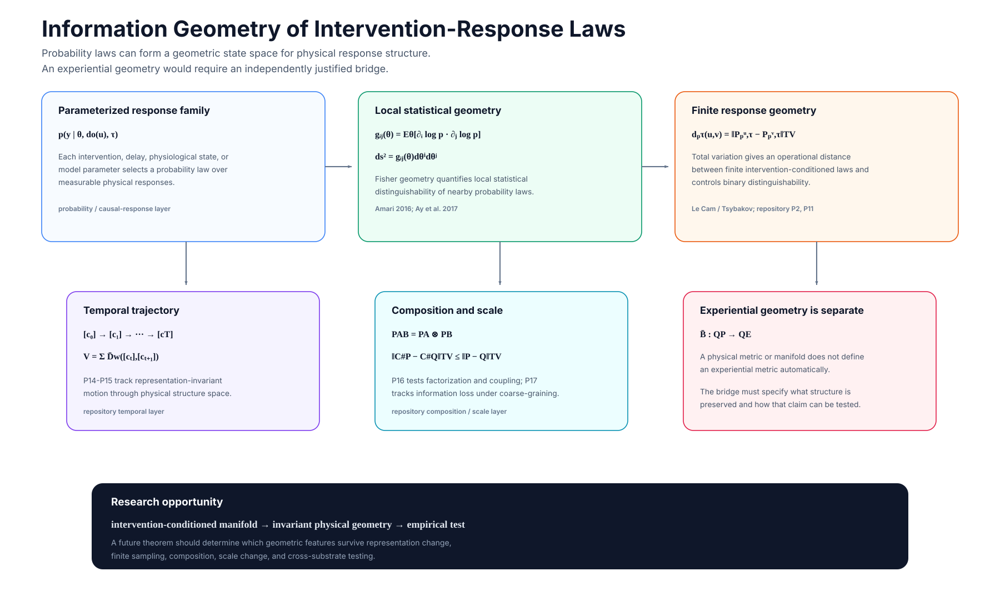

Intervention-conditioned laws can be treated as points in statistical space. Geometry gives a language for distinguishability and perturbation without supplying an experiential interpretation.

## 5.2 Gaussian KL divergence

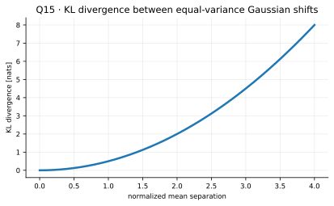

For equal variance,

\[
\boxed{D_{\mathrm{KL}}=\frac{(\mu_1-\mu_2)^2}{2\sigma^2}.}
\]

## 5.3 Fisher information

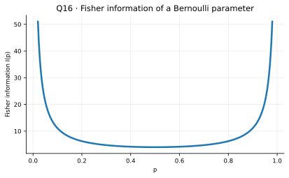

\[
\boxed{I(p)=\frac1{p(1-p)}.}
\]

## 5.4 Gaussian mutual information

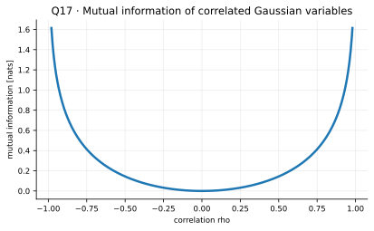

\[
\boxed{I(X;Y)=-\frac12\log(1-\rho^2).}
\]

## 5.5 Total variation

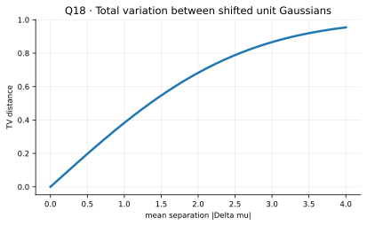

\[
\boxed{\|P-Q\|_{\mathrm{TV}}=\frac12\int|p-q|.}
\]

Total variation is used repeatedly because it has direct operational meaning as distinguishability of probability laws.

---

# 6. Physical and experiential domains

A physical input is modeled abstractly as

\[
\boxed{p=(\mathcal X,\mathcal D,\mathfrak I,\mathcal O),}
\]

with physical quotient

\[
\boxed{\mathcal Q_P=\mathcal P/\sim_P.}
\]

Let a future formal experiential space be \(\mathcal E\), with

\[
\boxed{\mathcal Q_E=\mathcal E/\sim_E.}
\]

The target bridge is

\[
\boxed{\bar B:\mathcal Q_P\longrightarrow\mathcal Q_E.}
\]

A complete empirical bridge theory must specify

\[
\boxed{
\mathfrak T
=(\mathcal P,\mathcal E,\sim_P,\sim_E,\mathcal B,\mathcal M,\Pi).
}
\]


| Criterion | Requirement | Current support |
| --- | --- | --- |
| U1 | physical well-definedness | physical and quantum foundation + P1 |
| U2 | experiential well-definedness | open formalization problem |
| U3 | non-definitional bridge | architectural requirement |
| U4 | representation invariance | P1 |
| U5 | physical-feature sufficiency | P5 |
| U6 | bridge completeness | P6 |
| U7 | empirical identifiability | P2-P3 |
| U8 | cross-theory discrimination | P4 |
| U9 | experimental recoverability | P7 |
| U10 | finite-measurement certification | P8 and P15 |
| U11 | explicit sample complexity | P9 |
| U12 | temporal, compositional, scale, substrate, quantum, and falsification consistency | partially addressed; active frontier |

---

# 7. Theorem roadmap - P1 through P45


| Proposition | Core result | Status | Proof |
| --- | --- | --- | --- |
| **P1** | representation-invariant bridge descends to the physical quotient | proved | [P1](docs/proposition_1_representation_invariance.md) |
| **P2** | experiment-class bridge identifiability using total variation | proved | [P2](docs/proposition_2_bridge_identifiability.md) |
| **P3** | observational theory-equivalence classes | proved | [P3](docs/proposition_3_bridge_equivalence_classes.md) |
| **P4** | maximin and set-cover discriminating experiment design | proved | [P4](docs/proposition_4_discriminating_experiment_design.md) |
| **P5** | exact physical-feature sufficiency criterion | proved | [P5](docs/proposition_5_feature_sufficiency.md) |
| **P6** | canonical complete bridge signature | proved | [P6](docs/proposition_6_canonical_bridge_signature.md) |
| **P7** | exact experimental recoverability criterion | proved | [P7](docs/proposition_7_experimental_signature_recovery.md) |
| **P8** | robust finite-error signature recovery | proved | [P8](docs/proposition_8_robust_signature_recovery.md) |
| **P9** | explicit categorical sample-complexity guarantee | proved | [P9](docs/proposition_9_categorical_sample_complexity.md) |
| **P10** | robust protocol-family design | proved | [P10](docs/proposition_10_robust_experiment_design.md) |
| **P11** | intervention-resolved causal structure | proved construction / candidate | [P11](docs/proposition_11_intervention_resolved_causal_structure.md) |
| **P12** | single-component and scalar insufficiency | proved no-go | [P12](docs/proposition_12_component_insufficiency.md) |
| **P13** | pairwise component irredundancy | proved no-go | [P13](docs/proposition_13_pairwise_component_irredundancy.md) |
| **P14** | representation-invariant temporal continuation | proved | [P14](docs/proposition_14_temporal_continuation.md) |
| **P15** | finite-error temporal certification | proved | [P15](docs/proposition_15_finite_sample_temporal_certification.md) |
| **P16** | independent composition and response-level coupling defect | proved | [P16](docs/proposition_16_independent_composition_and_coupling.md) |
| **P17** | coarse-graining contraction and refinement non-recoverability | proved | [P17](docs/proposition_17_coarse_graining_and_refinement.md) |
| **P18** | approximate reconstruction gives a quantitative scale-sufficiency certificate | proved | [P18](docs/proposition_18_scale_sufficiency_certification.md) |
| **P19** | exact physical-sufficiency factorization, conditional-information residual, and differential no-go criterion | proved | [P19](docs/proposition_19_fundamental_physical_sufficiency.md) |
| **P20** | finite-sample confidence interval for the P19 conditional-information residual | proved | [P20](docs/proposition_20_finite_sample_residual_certification.md) |
| **P21** | descriptor refinement makes deterministic collisions and stochastic residuals monotone, with exact information-gain decomposition | proved | [P21](docs/proposition_21_descriptor_refinement_residual_persistence.md) |
| **P22** | one base confidence event simultaneously certifies the declared residual-and-refinement-gain chain | proved finite-sample theorem | [P22](docs/proposition_22_simultaneous_refinement_chain_certification.md) |
| **P23** | fixed-sample adaptive descriptor selection retains simultaneous coverage and admits explicit refinement-regret bounds | proved post-selection theorem | [P23](docs/proposition_23_adaptive_descriptor_selection_certification.md) |
| **P24** | summable alpha spending gives time-uniform adaptive-selection and finite stopping-time validity | proved anytime-valid theorem | [P24](docs/proposition_24_anytime_adaptive_refinement_certification.md) |
| **P25** | P11 directed influence contracts under target coarse observation, with P18 reconstruction controlling the loss | proved physical scale theorem | [P25](docs/proposition_25_directed_influence_scale_certification.md) |
| **P26** | P11 partition irreducibility contracts under block-compatible observation, with P18 reconstruction controlling the loss from the partition-product null | proved physical scale theorem | [P26](docs/proposition_26_partition_irreducibility_scale_certification.md) |
| **P27** | aggregation-saturated fine partitions are exactly those that descend through a surjective node map; the surviving partition lattice is isomorphic to the coarse partition lattice, with P18 controlling probabilistic irreducibility loss | proved physical scale theorem | [P27](docs/proposition_27_partition_lattice_node_aggregation.md) |
| **P28** | matched intervention-pair source labels descend iff each pair has at most one coarse source image; aggregate-source influence then contracts under target-fiber state aggregation with P18 reconstruction control | proved physical scale theorem | [P28](docs/proposition_28_intervention_node_aggregation_compatibility.md) |
| **P29** | every response-geometry entry on the fixed intervention-delay grid contracts under node aggregation, with complete sup-norm geometry distortion bounded by P18 reconstruction | proved physical scale theorem | [P29](docs/proposition_29_response_geometry_node_aggregation.md) |
| **P30** | simultaneous response-geometry, directed-influence, and partition transport requires one shared scale declaration; zero numerical distortion cannot replace semantic compatibility | proved assembly theorem | [P30](docs/proposition_30_full_p11_scale_compatibility.md) |
| **P31** | an intervention quotient descends exactly iff response laws are constant on every intervention fiber; nonzero quotient ambiguity bounds representative-dependent coarse geometry | proved operational quotient theorem | [P31](docs/proposition_31_intervention_quotient_compatibility.md) |
| **P32** | a delay quotient descends exactly iff response laws are constant on every temporal fiber | proved operational quotient theorem | [P32](docs/proposition_32_delay_quotient_compatibility.md) |
| **P33** | joint intervention-delay ambiguity is the product-fiber diameter and is bounded by the sum of separate ambiguities | proved joint quotient theorem | [P33](docs/proposition_33_joint_operational_quotient.md) |
| **P34** | exact full P11 transport requires one joint scale declaration; response geometry has an additive approximate bound | proved assembly theorem | [P34](docs/proposition_34_joint_p11_operational_scale.md) |
| **P35** | semantically descendable directed influence changes by at most twice the joint operational ambiguity | proved perturbation theorem | [P35](docs/proposition_35_approximate_directed_influence_operational_quotient.md) |
| **P36** | m-block partition irreducibility changes by at most (m+1) times response-law ambiguity | proved product-reference perturbation theorem | [P36](docs/proposition_36_partition_irreducibility_operational_quotient.md) |
| **P37** | response geometry, directed influence, and partition irreducibility admit one complete approximate P11 operational-scale budget | proved complete scale theorem | [P37](docs/proposition_37_complete_approximate_p11_operational_scale.md) |
| **P38** | an independently defined target factors through a tomographically complete quantum state iff it is constant on quantum-state fibers; an exact collision proves non-factorization through that declared descriptor | proved quantum sufficiency theorem | [P38](docs/proposition_38_quantum_operational_sufficiency.md) |
| **P39** | simultaneous target-TV lower bounds are checked against every exact state-fiber hypothesis in a tomography confidence set; a positive worst-model margin certifies P38 non-factorization for the true declared model | proved finite-data model-set theorem | [P39](docs/proposition_39_finite_data_quantum_nonfactorization.md) |
| **P40** | injective finite descriptors always admit unrestricted factorization on the sampled image; with a declared modulus of continuity, target separation exceeding the confidence-region quantum envelope yields a robust obstruction | proved no-go plus regularity theorem | [P40](docs/proposition_40_continuous_quantum_region_regularity.md) |
| **P41** | simultaneous trace-distance balls imply a pairwise quantum upper envelope; combining it with target-TV lower confidence and a declared bridge modulus yields an end-to-end obstruction | proved confidence-envelope theorem | [P41](docs/proposition_41_trace_ball_quantum_envelope.md) |

---

# 8. P1-P10 - invariance, identifiability, recovery, and finite data

## 8.1 Representation invariance

There exists a unique quotient bridge \(\bar B\) with \(B=\bar B\circ\pi_P\) if and only if

\[
\boxed{p\sim_Pp'\Longrightarrow B(p)=B(p').}
\]

## 8.2 Theory identifiability

\[
\boxed{
\Delta_\Pi
=\sup_{\pi\in\Pi}
\|P_1^{\pi,q}-P_2^{\pi,q}\|_{\mathrm{TV}}.
}
\]

\[
\boxed{
\Delta_\Pi=0
\iff
P_1^{\pi,q}=P_2^{\pi,q}
\quad\forall\pi\in\Pi.
}
\]

With equal priors,

\[
\boxed{
R_\pi^*=\frac12\left(1-\|P_1^{\pi,q}-P_2^{\pi,q}\|_{\mathrm{TV}}\right).
}
\]

## 8.3 Feature sufficiency and canonical completeness

\[
\boxed{
\bar B=g\circ F
\iff
F(p)=F(p')\Longrightarrow\bar B(p)=\bar B(p').
}
\]

The canonical bridge signature is

\[
\boxed{C_B(p)=[p]_{\sim_B}.}
\]

## 8.4 Robust finite-data recovery

Define

\[
\boxed{\gamma_S=\delta_S-\omega_S.}
\]

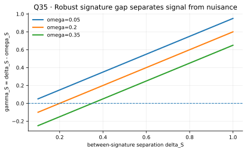

P8 gives exact recovery under uniform error \(\varepsilon\) when

\[
\boxed{\gamma_S>4\varepsilon.}
\]

For the categorical benchmark, P9 gives

\[
\boxed{
n\ge
\frac{8K^2}{\gamma_S^2}
\log\left(\frac{2N_PN_\pi K}{\alpha}\right).
}
\]

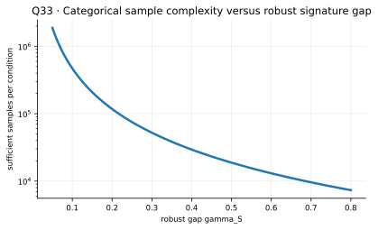

The sufficient sample requirement scales as \(\gamma_S^{-2}\).

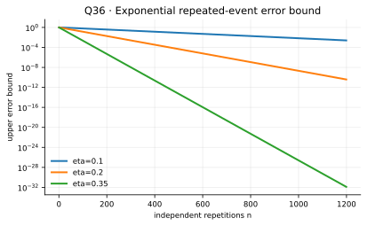

\[
\boxed{\Pr(\mathrm{error})\lesssim e^{-n\eta^2/2}.}
\]

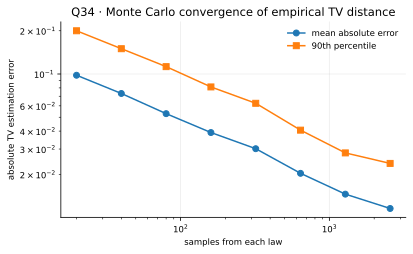

The fixed-seed simulation verifies convergence of empirical total variation toward its population value.

---

# 9. P11 - intervention-resolved causal structure

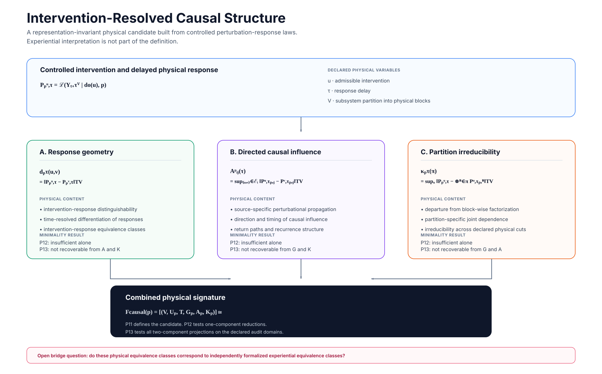

Let the subsystem contain blocks \(V=\{1,\ldots,m\}\). For intervention \(u\) and delay \(\tau\),

\[
\boxed{
P_p^{u,\tau}=\mathcal L(Y_{t+\tau}^{V}\mid do(u),p).
}
\]

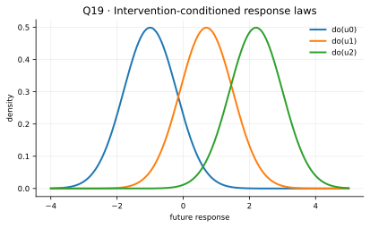

**Q19 - Intervention response laws.** Synthetic distributions illustrate the primitive observable object of P11.

## 9.1 Response geometry

\[
\boxed{d_p^\tau(u,v)=\|P_p^{u,\tau}-P_p^{v,\tau}\|_{\mathrm{TV}}.}
\]

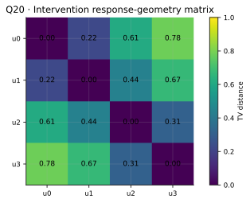

## 9.2 Directed influence

\[
\boxed{
A_{ij}^{p}(\tau)
=\sup_{(u,v)\in\mathcal E_i}
\|P_{p,j}^{u,\tau}-P_{p,j}^{v,\tau}\|_{\mathrm{TV}}.
}
\]

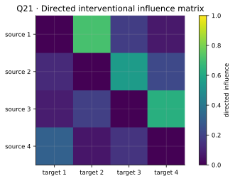

## 9.3 Partition irreducibility

\[
P_{p,\pi}^{u,\tau}
=\bigotimes_{B\in\pi}P_{p,B}^{u,\tau},
\]

\[
\boxed{
\kappa_p^\tau(\pi)
=\sup_u\|P_p^{u,\tau}-P_{p,\pi}^{u,\tau}\|_{\mathrm{TV}}.
}
\]

The candidate is

\[
\boxed{
\mathfrak C_p
=(V,\mathcal U_p,\mathcal T,\mathcal G_p,\mathcal A_p,\mathcal K_p),
\qquad
F_{\mathrm{causal}}(p)=[\mathfrak C_p]_{\cong}.
}
\]

It is a structured physical candidate, not a consciousness value.

---

# 10. P12-P13 - constructive no-go results

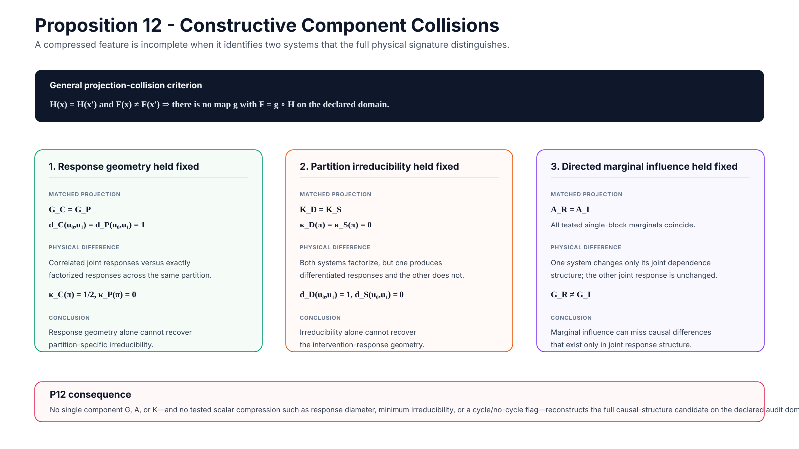

If

\[
H(x)=H(x')
\quad\text{but}\quad
F(x)\ne F(x'),
\]

then

\[
\boxed{\nexists g\text{ with }F=g\circ H.}
\]

P12 constructs explicit failures for response geometry alone, directed influence alone, partition irreducibility alone, and several scalar reductions.

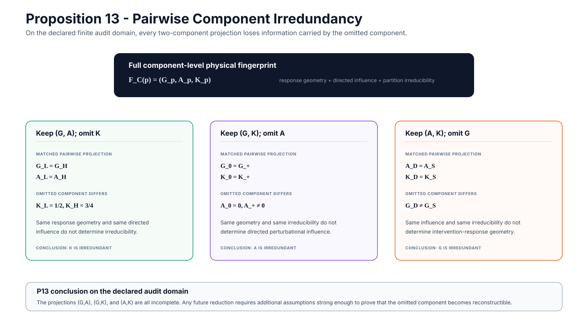

P13 proves that every two-component projection admits a collision on the declared audit domain:

\[
(\mathcal G,\mathcal A)\not\Rightarrow\mathcal K,
\qquad
(\mathcal G,\mathcal K)\not\Rightarrow\mathcal A,
\qquad
(\mathcal A,\mathcal K)\not\Rightarrow\mathcal G.
\]

These negative results prevent premature reduction to a one-number consciousness score.

---

# 11. P14-P15 - temporal continuation

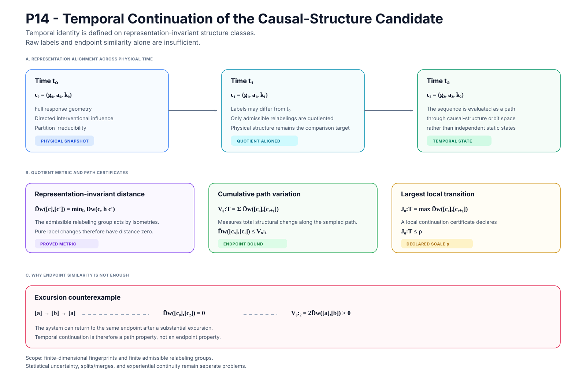

For fingerprint \(c=(g,a,k)\), define

\[
D_w(c,c')
=\max\{w_G\|g-g'\|_\infty,w_A\|a-a'\|_\infty,w_K\|k-k'\|_\infty\}.
\]

For admissible relabeling group \(\mathcal H\),

\[
\boxed{\overline D_w([c],[c'])=\min_{h\in\mathcal H}D_w(c,hc').}
\]

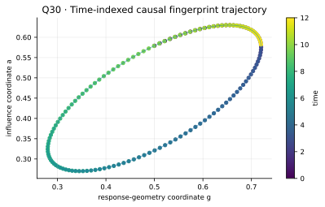

The synthetic fingerprint trajectory traces structural evolution after representation alignment.

\[
\boxed{
V_{0:T}=\sum_{t=0}^{T-1}\overline D_w([c_t],[c_{t+1}]).
}
\]

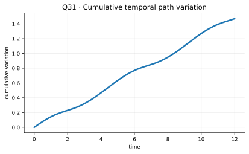

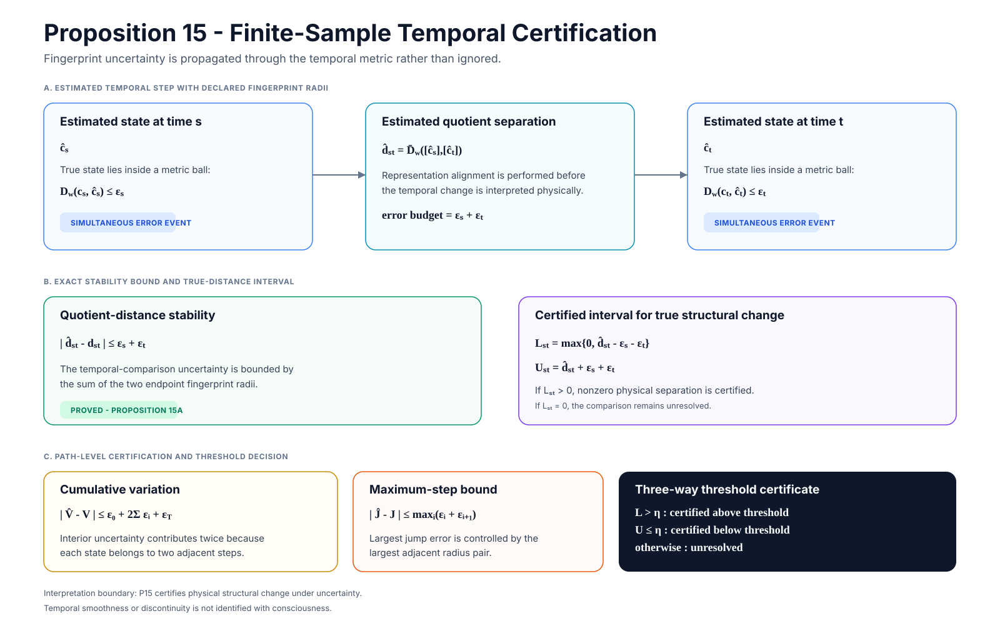

If

\[
D_w(c_t,\widehat c_t)\le\varepsilon_t,
\]

then

\[
\boxed{|\widehat d_{st}-d_{st}|\le\varepsilon_s+\varepsilon_t.}
\]

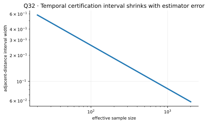

---

# 12. P16 - composition and coupling

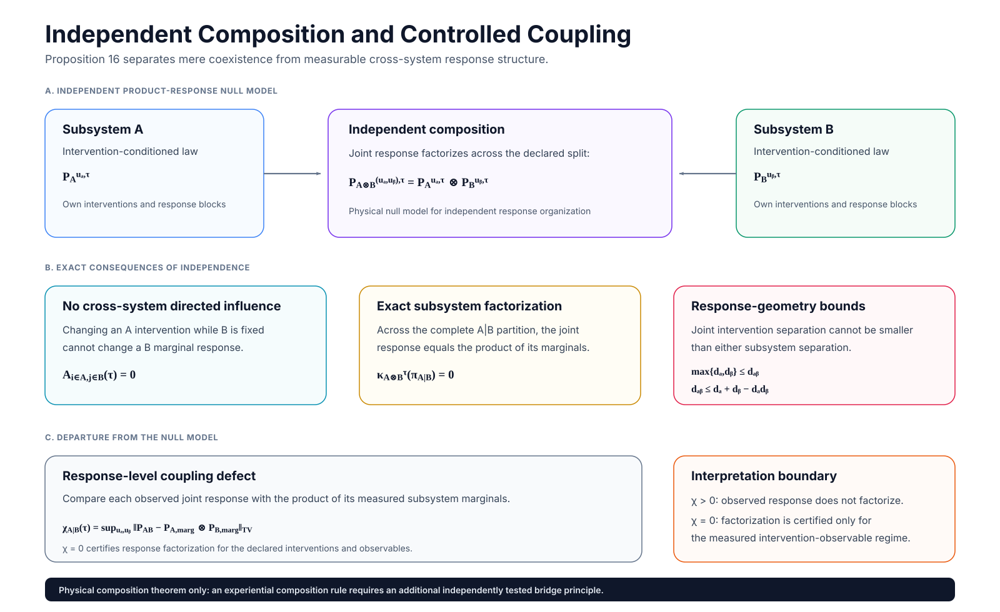

For independent product response,

\[
\boxed{
P_{A\otimes B}^{(u_A,u_B),\tau}
=P_A^{u_A,\tau}\otimes P_B^{u_B,\tau}.
}
\]

P16 proves

\[
\boxed{
\max\{d_A,d_B\}
\le d_{AB}
\le d_A+d_B-d_Ad_B.
}
\]

Cross-system directed influence vanishes under the independent null, and the complete \(A|B\) partition factorizes.

Define

\[
\boxed{\chi_{A|B}(\tau)=\kappa_{AB}^{\tau}(\pi_{A|B}).}
\]

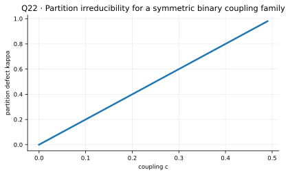

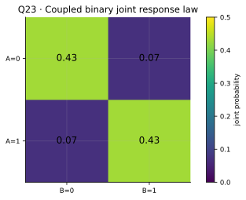

A dependent joint law can retain unchanged single-variable marginals.

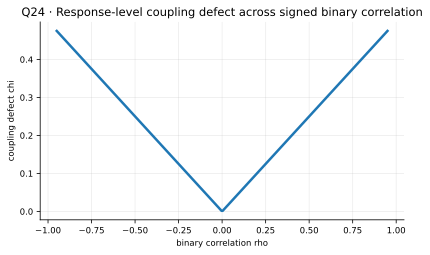

---

# 13. P17-P18 - scale, information loss, and sufficiency

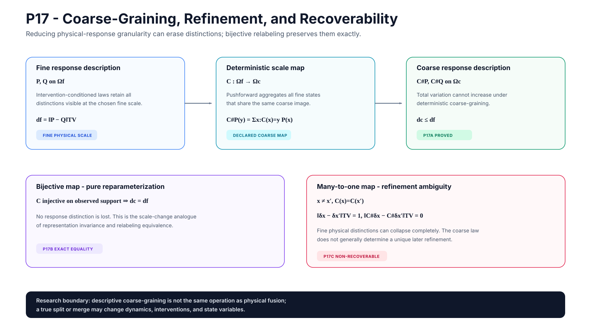

## 13.1 P17 - deterministic coarse-graining

Let

\[
C:\Omega_f\to\Omega_c,
\qquad
C_\#P(y)=\sum_{x:C(x)=y}P(x).
\]

Then

\[
\boxed{
\|C_\#P-C_\#Q\|_{\mathrm{TV}}
\le\|P-Q\|_{\mathrm{TV}}.
}
\]

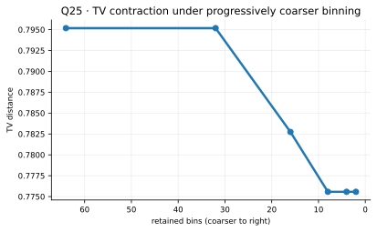

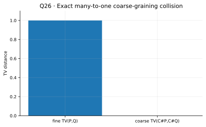

If \(x\ne x'\) but \(C(x)=C(x')\), then

\[
\|\delta_x-\delta_{x'}\|_{\mathrm{TV}}=1,
\qquad
\boxed{\|C_\#\delta_x-C_\#\delta_{x'}\|_{\mathrm{TV}}=0.}
\]

## 13.2 P18 - approximate reconstruction certificate

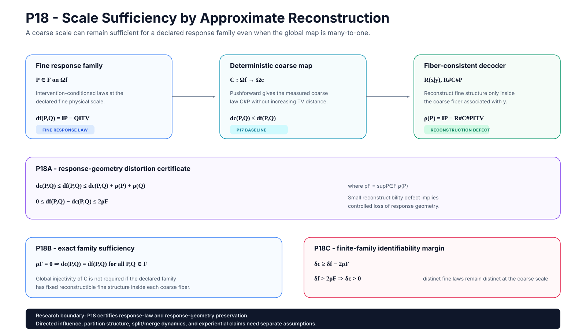

Let \(R\) be a fiber-consistent stochastic decoder and define

\[
D=R_\#C_\#,
\qquad
\rho(P)=\|P-DP\|_{\mathrm{TV}},
\qquad
\rho_{\mathcal F}=\sup_{P\in\mathcal F}\rho(P).
\]

P18 proves

\[
\boxed{
\|C_\#P-C_\#Q\|_{\mathrm{TV}}
\le\|P-Q\|_{\mathrm{TV}}
\le\|C_\#P-C_\#Q\|_{\mathrm{TV}}+\rho(P)+\rho(Q).
}
\]

Therefore

\[
\boxed{0\le d_f-d_c\le2\rho_{\mathcal F}.}
\]

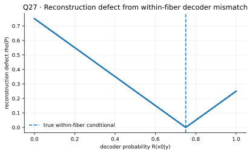

For finite \(\mathcal F\),

\[
\boxed{\delta_c\ge\delta_f-2\rho_{\mathcal F}.}
\]

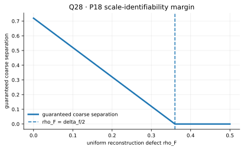

If

\[
\boxed{\delta_f>2\rho_{\mathcal F},}
\]

then all declared response laws remain distinct at the coarse scale.

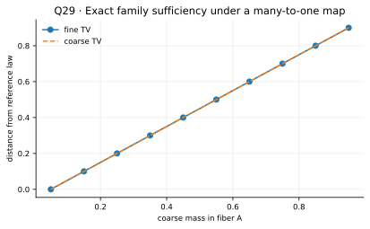

When \(\rho_{\mathcal F}=0\), pairwise response geometry is exactly preserved on the declared family even if the global coarse map is many-to-one.

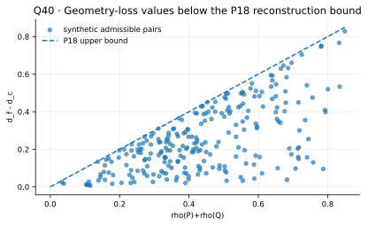

\[
\boxed{d_f-d_c\le\rho(P)+\rho(Q).}
\]

### Classical/quantum connection

P17 and QM15 express the same broad information-theoretic principle in different mathematical settings: physical processing or coarse description cannot arbitrarily increase operational distinguishability. P18 then asks the complementary positive question: under what reconstruction conditions is a reduced physical description still sufficient for the response family being studied?

P18 does not automatically certify directed influence, partition structure, intervention semantics, quantum coherence, physical split/merge dynamics, or experiential properties.

## 13.3 P25 - directed-influence scale certification

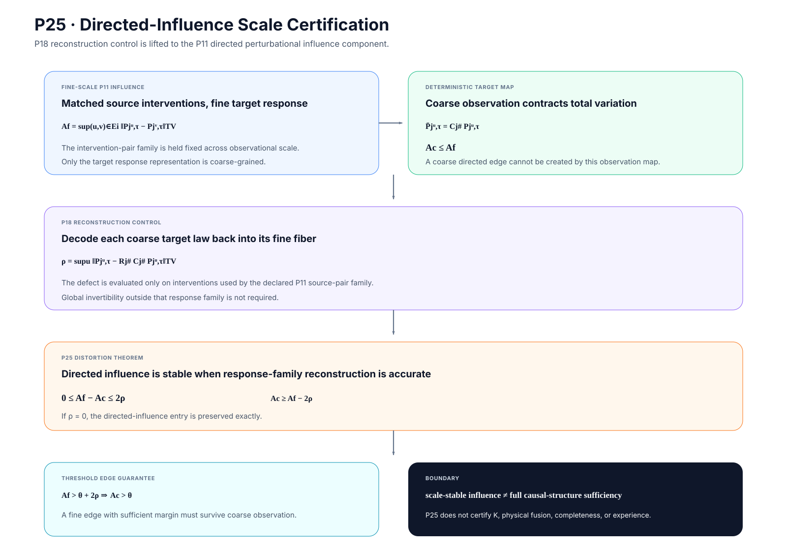

P25 returns to the P11 directed-influence component and asks whether it survives deterministic coarse observation of the target response. Fix a source block \(i\), target block \(j\), delay \(\tau\), and the same matched intervention-pair family \(\mathcal E_i\) at both observational scales.

The fine directed influence is

\[
\boxed{
A_{i\to j}^{f}(\tau)
=
\sup_{(u,v)\in\mathcal E_i}
\|P_j^{u,\tau}-P_j^{v,\tau}\|_{\mathrm{TV}}.
}
\]

For deterministic target map \(C_j\), define

\[
\overline P_j^{u,\tau}=(C_j)_\#P_j^{u,\tau}
\]

and

\[
\boxed{
A_{i\to j}^{c}(\tau)
=
\sup_{(u,v)\in\mathcal E_i}
\|\overline P_j^{u,\tau}-\overline P_j^{v,\tau}\|_{\mathrm{TV}}.
}
\]

Total-variation contraction gives the first P25 statement:

\[
\boxed{
A_{i\to j}^{c}(\tau)
\le
A_{i\to j}^{f}(\tau).
}
\]

Thus deterministic target coarse observation cannot manufacture a larger P11 directed-influence value when intervention semantics are held fixed.

Now let \(R_j\) be a P18 fiber-consistent stochastic decoder and define

\[
\rho_{i\to j}(\tau)
=
\sup_u
\|P_j^{u,\tau}-(R_j)_\#(C_j)_\#P_j^{u,\tau}\|_{\mathrm{TV}},
\]

where the supremum is over interventions appearing in the matched-pair family. Applying the P18 pairwise distortion theorem before taking the P11 supremum gives

\[
\boxed{
0
\le
A_{i\to j}^{f}(\tau)-A_{i\to j}^{c}(\tau)
\le
2\rho_{i\to j}(\tau).
}
\]

Equivalently,

\[
\boxed{
A_{i\to j}^{c}(\tau)
\ge
A_{i\to j}^{f}(\tau)-2\rho_{i\to j}(\tau).
}
\]

Therefore exact reconstruction on the declared response family, \(\rho_{i\to j}(\tau)=0\), gives exact directed-influence preservation even when the target map is globally many-to-one.

For a declared edge threshold \(\theta\), P25 also yields the margin certificate

\[
\boxed{
A_{i\to j}^{f}(\tau)>\theta+2\rho_{i\to j}(\tau)
\Longrightarrow
A_{i\to j}^{c}(\tau)>\theta.
}
\]

Conversely, contraction gives

\[
A_{i\to j}^{c}(\tau)>\theta
\Longrightarrow
A_{i\to j}^{f}(\tau)>\theta.
\]

So coarse observation cannot create a threshold edge relative to the same fine intervention semantics, while a sufficiently strong fine edge is guaranteed to survive coarse observation.

The theorem has a deliberately narrow physical scope. P25 certifies target-response observation coarse-graining. It does not yet certify source-node aggregation, changed intervention channels, partition irreducibility \(\mathcal K\), genuine physical fusion, the entire P11 structure, physical completeness, or experience.

[Read Proposition 25](docs/proposition_25_directed_influence_scale_certification.md). The [P25 theorem map](docs/figures/p25_directed_influence_scale_certification.svg), [implementation](src/consciousness_bridge/directed_influence_scale_certification.py), and [tests](tests/test_directed_influence_scale_certification.py) expose the complete proof-to-code path.

## 13.4 P26 - partition-irreducibility scale certification

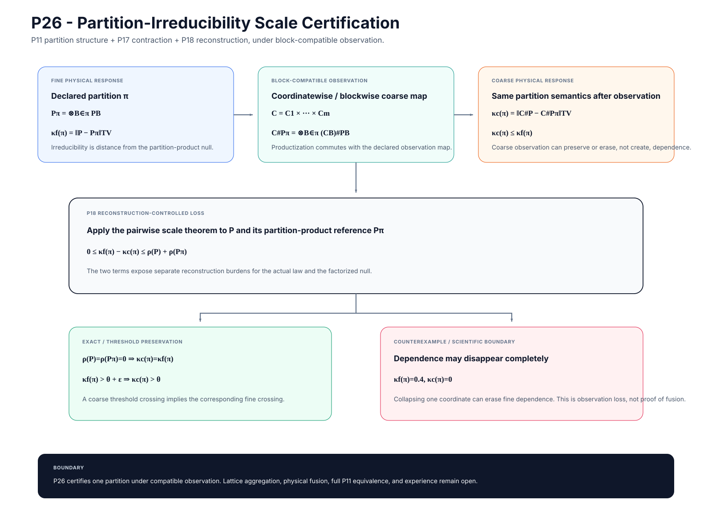

P26 extends the physical scale audit from response geometry and directed influence to the P11 partition component \(\mathcal K\). Fix an intervention \(u\), delay \(\tau\), and a declared partition \(\pi\). The fine partition-product reference is

\[
\boxed{
P_{\pi}^{u,\tau}
=
\bigotimes_{B\in\pi}P_B^{u,\tau},
}
\]

and the fine irreducibility is

\[
\boxed{
\kappa_f^{u,\tau}(\pi)
=
\|P^{u,\tau}-P_{\pi}^{u,\tau}\|_{\mathrm{TV}}.
}
\]

The scale comparison is scientifically meaningful only when the deterministic observation map is block compatible with the declared partition. For a coordinatewise or blockwise map \(C\), partition productization commutes with observation:

\[
\boxed{
C_\#P_{\pi}^{u,\tau}
=
\bigotimes_{B\in\pi}(C_B)_\#P_B^{u,\tau}.
}
\]

Therefore the coarse irreducibility

\[
\kappa_c^{u,\tau}(\pi)
=
\|C_\#P^{u,\tau}-C_\#P_{\pi}^{u,\tau}\|_{\mathrm{TV}}
\]

obeys total-variation contraction:

\[
\boxed{
0\le
\kappa_f^{u,\tau}(\pi)-\kappa_c^{u,\tau}(\pi).
}
\]

Let \(D=R_\#C_\#\) be the P18 reconstruction operator and define \(\rho(Q)=\|Q-DQ\|_{\mathrm{TV}}\). Applying P18 to the pair \((P^{u,\tau},P_{\pi}^{u,\tau})\) gives the sharper P26 bound

\[
\boxed{
0\le
\kappa_f^{u,\tau}(\pi)-\kappa_c^{u,\tau}(\pi)
\le
\rho(P^{u,\tau})+
\rho(P_{\pi}^{u,\tau}).
}
\]

The two reconstruction terms are intentionally kept separate because they correspond to different physical objects: the actual joint response and the factorized partition null.

If both reconstruct exactly, then

\[
\boxed{
\kappa_c^{u,\tau}(\pi)=\kappa_f^{u,\tau}(\pi).
}
\]

For a threshold \(\theta\), define

\[
\varepsilon_{\pi}^{u,\tau}
=
\rho(P^{u,\tau})+\rho(P_{\pi}^{u,\tau}).
\]

Then

\[
\boxed{
\kappa_f^{u,\tau}(\pi)>
\theta+\varepsilon_{\pi}^{u,\tau}
\Longrightarrow
\kappa_c^{u,\tau}(\pi)>	heta.
}
\]

Conversely,

\[
\kappa_c^{u,\tau}(\pi)>	heta
\Longrightarrow
\kappa_f^{u,\tau}(\pi)>	heta.
\]

A binary counterexample shows why no stronger unconditional invariance statement is possible: a correlated fine law can have \(\kappa_f=0.4\), while collapsing one coordinate makes \(\kappa_c=0\). Fine dependence can therefore disappear completely under information-destroying observation.

P26 remains an observation-scale theorem. It does not yet solve aggregation of multiple fine blocks into a new coarse node, transformation of the full partition lattice, changing intervention semantics, genuine physical fusion, complete P11 scale equivalence, physical completeness, or experience.

[Read Proposition 26](docs/proposition_26_partition_irreducibility_scale_certification.md). The [P26 theorem map](docs/figures/p26_partition_irreducibility_scale_certification.svg), [implementation](src/consciousness_bridge/partition_irreducibility_scale_certification.py), and [tests](tests/test_partition_irreducibility_scale_certification.py) expose the complete proof-to-code path.

## 13.5 P27 - partition-lattice transport under node aggregation

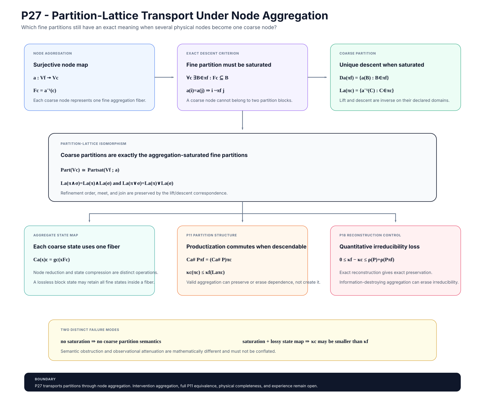

P27 removes an assumption that P26 deliberately retained. The node set itself may now change. Let

\[
\boxed{
a:V_f\twoheadrightarrow V_c
}
\]

be a surjective node-aggregation map and let

\[
F_c=a^{-1}(c)
\]

be the fine-node fiber represented by coarse node \(c\).

A fine partition \(\pi_f\) has an exact coarse meaning if and only if no aggregation fiber is split across two fine partition blocks:

\[
\boxed{
\pi_f\text{ descends through }a
\iff
\forall c\in V_c\;\exists B\in\pi_f:\;F_c\subseteq B.
}
\]

Equivalently,

\[
\boxed{
a(i)=a(j)\Longrightarrow i\sim_{\pi_f}j.}
\]

This aggregation-saturation criterion separates a structural incompatibility from ordinary measurement error. If a fiber crosses a proposed partition boundary, the corresponding coarse partition simply does not exist.

For every coarse partition \(\pi_c\), define the lift

\[
\boxed{
L_a(\pi_c)=\{a^{-1}(C):C\in\pi_c\}.
}
\]

For every saturated fine partition, define its descent by the images of its blocks. The two operations are inverse and preserve the refinement order, meet, and join. Therefore

\[
\boxed{
\operatorname{Part}(V_c)
\simeq_{\mathrm{lattice}}
\operatorname{Part}_{\mathrm{sat}}(V_f;a).
}
\]

This identifies exactly which portion of the fine partition lattice survives node aggregation.

The probabilistic P11 quantity can also be transported when each coarse state depends only on the fine states inside its aggregation fiber. If \(C_a\) is such an aggregation-compatible state map and \(\pi_f=L_a(\pi_c)\), then

\[
\boxed{
(C_a)_\#P_{\pi_f}
=
\bigl((C_a)_\#P\bigr)_{\pi_c}.
}
\]

Hence total-variation contraction gives

\[
\boxed{
\kappa_c(\pi_c)
\le
\kappa_f(L_a\pi_c).
}
\]

With a P18 reconstruction operator \(D=R_\#(C_a)_\#\),

\[
\boxed{
0\le
\kappa_f(\pi_f)-\kappa_c(\pi_c)
\le
\rho(P)+\rho(P_{\pi_f}).
}
\]

Exact reconstruction of the response law and its partition-product null gives exact irreducibility preservation even though the declared node count has changed.

P27 therefore distinguishes two failure modes that should never be conflated:

\[
\boxed{
\text{no partition descent}
\neq
\text{valid partition with attenuated irreducibility}.
}
\]

The first is a semantic obstruction created by the node quotient. The second is information loss created by the aggregate-state map.

P27 still does not solve intervention-channel aggregation, source-node perturbation semantics, directed influence under source aggregation, complete P11 scale equivalence, genuine physical fusion, physical completeness, or experience. Those remain separate theorem burdens.

[Read Proposition 27](docs/proposition_27_partition_lattice_node_aggregation.md). The [P27 theorem map](docs/figures/p27_partition_lattice_node_aggregation.svg), [implementation](src/consciousness_bridge/partition_lattice_node_aggregation.py), and [tests](tests/test_partition_lattice_node_aggregation.py) expose the complete proof-to-code path.

## 13.6 P28 - intervention compatibility under node aggregation

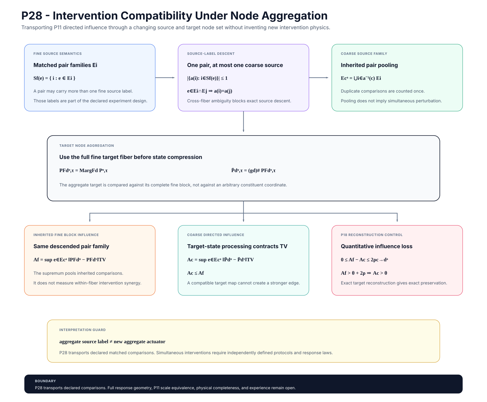

P28 transports the P11 directed-influence branch through the changing node set introduced by P27. For each fine source \(i\), let \(\mathcal E_i\) be its declared matched intervention-pair family. For a pair \(e\), define its fine source incidence

\[
S_f(e)=\{i:e\in\mathcal E_i\}.
\]

Under the surjective node map \(a:V_f\twoheadrightarrow V_c\), the pair has an unambiguous coarse source label exactly when

\[
\boxed{
|\{a(i):i\in S_f(e)\}|\le1.
}
\]

Equivalently,

\[
\boxed{
e\in\mathcal E_i\cap\mathcal E_j
\Longrightarrow a(i)=a(j).
}
\]

When this condition holds, the inherited coarse pair family is

\[
\boxed{
\mathcal E_c^a
=
\bigcup_{i\in a^{-1}(c)}\mathcal E_i.
}
\]

This union is a pooling of already declared comparisons. It is not a newly inferred simultaneous perturbation of every fine source in the aggregate node.

For coarse target \(d\), P28 first takes the full fine target-fiber marginal

\[
\boxed{
P_{F_d}^{u,\tau}
=
\operatorname{Marg}_{F_d}P^{u,\tau},
\qquad F_d=a^{-1}(d),
}
\]

and defines inherited fine block influence

\[
\boxed{
A_{c\to d}^{f,a}(\tau)
=
\sup_{(u,v)\in\mathcal E_c^a}
\|P_{F_d}^{u,\tau}-P_{F_d}^{v,\tau}\|_{\mathrm{TV}}.
}
\]

If \(g_d\) is the declared target-fiber state map, the coarse response is \(\overline P_d^{u,\tau}=(g_d)_\#P_{F_d}^{u,\tau}\) and

\[
\boxed{
A_{c\to d}^{c,a}(\tau)
\le
A_{c\to d}^{f,a}(\tau).
}
\]

Thus target-state aggregation cannot create a stronger directed-influence value once the source intervention semantics have validly descended.

With P18 target-fiber reconstruction defect

\[
\rho_{c\to d}^{a}(\tau)
=
\sup_u
\|P_{F_d}^{u,\tau}-(R_d)_\#(g_d)_\#P_{F_d}^{u,\tau}\|_{\mathrm{TV}},
\]

P28 obtains

\[
\boxed{
0\le
A_{c\to d}^{f,a}(\tau)-A_{c\to d}^{c,a}(\tau)
\le
2\rho_{c\to d}^{a}(\tau).
}
\]

Therefore exact target reconstruction gives exact influence preservation, and for threshold \(\theta\),

\[
\boxed{
A_{c\to d}^{f,a}(\tau)>
\theta+2\rho_{c\to d}^{a}(\tau)
\Longrightarrow
A_{c\to d}^{c,a}(\tau)>	heta.
}
\]

The central interpretation guard is

\[
\boxed{
\text{aggregate source label}
\neq
\text{new aggregate physical actuator}.
}
\]

A simultaneous or synergistic intervention on several fine constituents requires its own independently declared protocol and response laws. P28 does not manufacture that experiment by notation.

After P27 and P28, the changing-node-set transport problem has explicit rules for the P11 partition component \(\mathcal K\) and directed-influence component \(\mathcal A\). The next physical theorem burden is to align the complete response geometry \(\mathcal G\), admissible intervention family \(\mathcal U\), and delays \(\mathcal T\) under the same node quotient before claiming full P11 scale equivalence.

[Read Proposition 28](docs/proposition_28_intervention_node_aggregation_compatibility.md). The [P28 theorem map](docs/figures/p28_intervention_node_aggregation_compatibility.svg), [implementation](src/consciousness_bridge/intervention_node_aggregation_compatibility.py), and [tests](tests/test_intervention_node_aggregation_compatibility.py) expose the complete proof-to-code path.

## 13.7 P29 - response-geometry transport under node aggregation

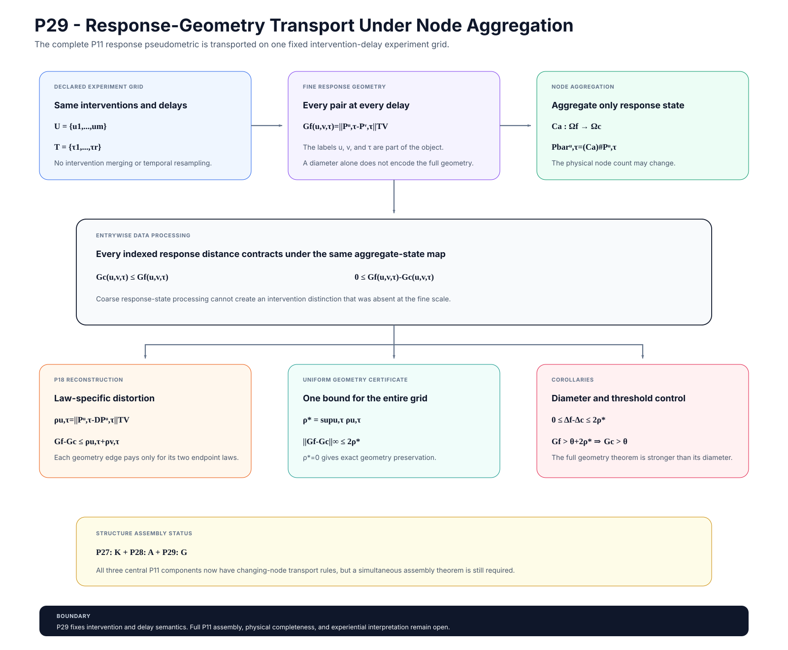

P29 completes the changing-node transport analysis for the third central P11 component, the response geometry \(\mathcal G\). It keeps the intervention labels \(\mathcal U\) and delay labels \(\mathcal T\) fixed and changes only the physical response representation through the P27 node quotient and its aggregate-state map.

For every intervention pair and retained delay,

\[
\boxed{
G_f(u,v,\tau)
=
\|P^{u,\tau}-P^{v,\tau}\|_{\mathrm{TV}}.
}
\]

After the aggregation-compatible state map \(C_a\),

\[
\overline P^{u,\tau}=(C_a)_\#P^{u,\tau},
\]

and

\[
\boxed{
G_c(u,v,\tau)
=
\|\overline P^{u,\tau}-\overline P^{v,\tau}\|_{\mathrm{TV}}.
}
\]

Total-variation data processing gives an entrywise theorem over the complete declared experiment grid:

\[
\boxed{
0\le G_f(u,v,\tau)-G_c(u,v,\tau)
\quad\forall u,v,\tau.
}
\]

Let \(D=R_\#(C_a)_\#\) be the P18 reconstruction operator and define

\[
\rho_{u,\tau}
=
\|P^{u,\tau}-DP^{u,\tau}\|_{\mathrm{TV}}.
\]

P18 gives the sharper law-specific bound

\[
\boxed{
0\le
G_f(u,v,\tau)-G_c(u,v,\tau)
\le
\rho_{u,\tau}+\rho_{v,\tau}.
}
\]

For the uniform declared-family defect

\[
\rho_*
=
\sup_{u,\tau}\rho_{u,\tau},
\]

all geometry entries are controlled simultaneously:

\[
\boxed{
\|\mathcal G_f-\mathcal G_c\|_\infty
\le2\rho_*.
}
\]

Thus \(\rho_*=0\) gives exact preservation of the complete indexed response geometry, not merely preservation of its diameter. As corollaries,

\[
\boxed{
0\le\Delta_f-\Delta_c\le2\rho_*
}
\]

for response diameters, and a fine separation satisfying

\[
G_f(u,v,\tau)>\theta+2\rho_*
\]

must remain above \(\theta\) after aggregation.

The common index grid is an explicit scientific assumption:

\[
\boxed{
\text{state-space aggregation}
\neq
\text{intervention aggregation}
\neq
\text{time aggregation}.
}
\]

P29 does not merge intervention labels or identify different delays. Those operations require separate compatibility theorems.

At this point P27, P28, and P29 provide changing-node transport rules for the three central P11 components

\[
\boxed{
\mathcal K,
\qquad
\mathcal A,
\qquad
\mathcal G.
}
\]

That still does not by itself establish full P11 scale equivalence. A simultaneous assembly theorem must require one common node quotient, aggregate-state map, intervention semantics, delay semantics, and reconstruction family and prove all component correspondences on the same compatibility diagram.

[Read Proposition 29](docs/proposition_29_response_geometry_node_aggregation.md). The [P29 theorem map](docs/figures/p29_response_geometry_node_aggregation.svg), [implementation](src/consciousness_bridge/response_geometry_node_aggregation.py), and [tests](tests/test_response_geometry_node_aggregation.py) expose the complete proof-to-code path.

## 13.8 P30 - full declared P11 scale compatibility

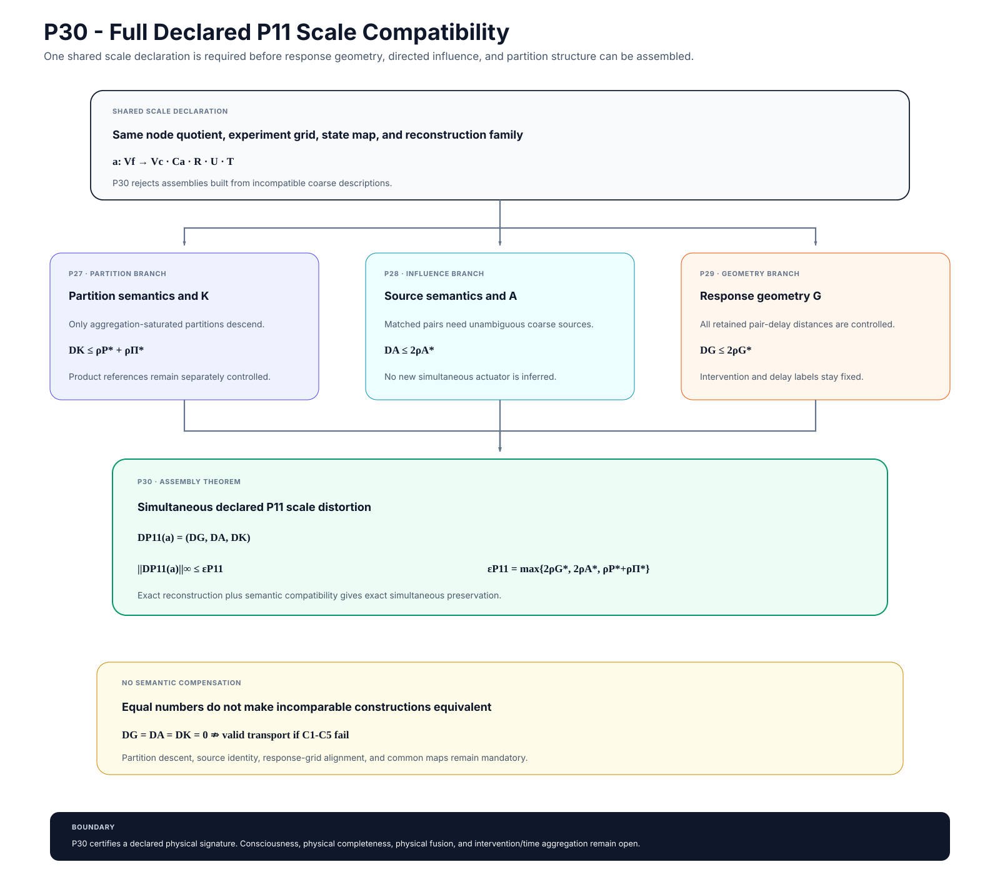

P30 asks when the three changing-node results can legitimately be combined into one statement about the declared P11 physical signature

\[
\mathfrak C=(V,\mathcal U,\mathcal T,\mathcal G,\mathcal A,\mathcal K).
\]

The theorem requires one shared scale declaration: the same surjective node quotient \(a:V_f\twoheadrightarrow V_c\), the same retained intervention set \(\mathcal U\), the same retained delay set \(\mathcal T\), one compatible aggregate-state map \(C_a\), and one declared reconstruction family or compatible restrictions of it.

Define the three component distortions

\[
D_G=\|\mathcal G_f-\mathcal G_c\|_\infty,
\]

\[
D_A=\|\mathcal A_f-\mathcal A_c\|_\infty,
\]

and

\[
D_K=\sup_{\pi_c}\left|\kappa_f(L_a\pi_c)-\kappa_c(\pi_c)\right|,
\]

where \(L_a\pi_c\) is the P27 saturated lift and the directed-influence supremum is restricted to source comparisons whose semantics satisfy P28.

The declared P11 distortion vector is

\[
\boxed{
\mathbf D_{P11}(a)=(D_G,D_A,D_K).
}
\]

Let \(\rho_G^*\) be the P29 response-family reconstruction defect, \(\rho_A^*\) the P28/P25 target-family defect, and \(\rho_P^*,\rho_\Pi^*\) the P27/P26 response and partition-product reconstruction defects. Define

\[
\boxed{
\varepsilon_{P11}
=
\max\left\{
2\rho_G^*,
2\rho_A^*,
\rho_P^*+\rho_\Pi^*
\right\}.
}
\]

Under the shared compatibility conditions and the hypotheses of the component theorems,

\[
\boxed{
\|\mathbf D_{P11}(a)\|_\infty
\le
\varepsilon_{P11}.
}
\]

Thus all three central P11 components are simultaneously reconstruction-controlled under one auditable scale declaration. If all relevant reconstruction defects vanish, then

\[
\boxed{D_G=D_A=D_K=0.}
\]

P30 also makes a logically separate point that prevents a false scale-invariance conclusion:

\[
\boxed{
D_G=D_A=D_K=0
\not\Rightarrow
\text{valid P11 scale transport if the semantic conditions fail}.
}
\]

A zero numerical difference cannot repair an ambiguous source intervention, a non-descendable partition, a mismatched intervention-delay grid, or component calculations performed under different coarse physical maps.

The exact interpretation boundary is therefore

\[
\boxed{
\text{simultaneous transport of a declared physical signature}
\neq
\text{physical completeness}
\neq
\text{consciousness}.
}
\]

P30 also does not identify node aggregation with genuine physical fusion and does not solve intervention or time quotienting. Those remain separate theorem burdens.

[Read Proposition 30](docs/proposition_30_full_p11_scale_compatibility.md). The [P30 theorem map](docs/figures/p30_full_p11_scale_compatibility.svg), [implementation](src/consciousness_bridge/full_p11_scale_compatibility.py), and [tests](tests/test_full_p11_scale_compatibility.py) expose the complete proof-to-code path.

## 13.9 P31 - intervention-quotient compatibility

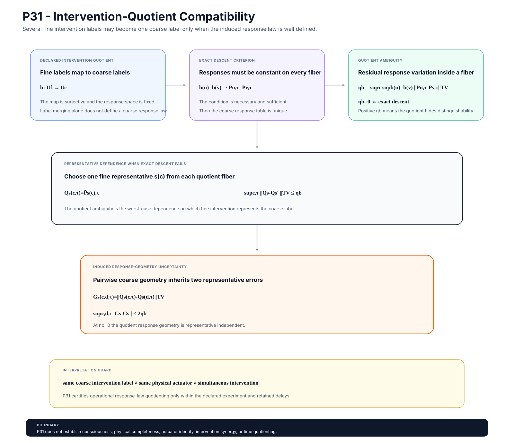

P30 deliberately keeps the intervention set fixed. P31 addresses the next scale operation directly: when may several fine intervention labels be identified as one coarse intervention label without making the response law depend on which fine representative was chosen?

Let

\[
\boxed{
b:\mathcal U_f\twoheadrightarrow\mathcal U_c
}
\]

be a declared surjective intervention-label quotient. Assume all compared responses already live on one common physical response space, for example after any independently declared node/state map,

\[
\overline P^{u,\tau}=(C_a)_\#P^{u,\tau}.
\]

A unique coarse response table \(Q^{c,\tau}\) exists exactly when the fine response family is constant on every fiber of \(b\):

\[
\boxed{
b(u)=b(v)
\Longrightarrow
\overline P^{u,\tau}=\overline P^{v,\tau}
\quad\forall\tau\in\mathcal T.}
\]

Equivalently,

\[
\boxed{
\overline P^{u,\tau}=Q^{b(u),\tau}
\quad\forall u,\tau
}
\]

for one uniquely defined descended table. This is an exact quotient criterion, not a relabeling convention.

When exact descent fails, P31 defines the intervention-quotient ambiguity defect

\[
\boxed{
\eta_b
=
\sup_{\tau\in\mathcal T}
\sup_{u,v:\,b(u)=b(v)}
\left\|
\overline P^{u,\tau}-\overline P^{v,\tau}
\right\|_{\mathrm{TV}}.
}
\]

Then

\[
\boxed{
\eta_b=0
\iff
\text{exact intervention-quotient descent}.
}
\]

If a coarse table is nevertheless built by selecting one representative \(s(c)\in b^{-1}(c)\), with

\[
Q_s^{c,\tau}=\overline P^{s(c),\tau},
\]

then any two selections satisfy

\[
\boxed{
\sup_{c,\tau}
\|Q_s^{c,\tau}-Q_{s'}^{c,\tau}\|_{\mathrm{TV}}
\le\eta_b.
}
\]

The induced coarse response geometry therefore obeys

\[
\boxed{
\sup_{c,d,\tau}
|G_s(c,d,\tau)-G_{s'}(c,d,\tau)|
\le2\eta_b.
}
\]

Thus a nonzero \(\eta_b\) is a quantitative warning that the proposed coarse intervention geometry is representative dependent. It measures hidden response variation inside the intervention quotient fibers.

The scientific interpretation remains narrow:

\[
\boxed{
\text{same coarse intervention label}
\neq
\text{same physical actuator}
\neq
\text{simultaneous intervention}.
}
\]

A small \(\eta_b\) says only that the declared response experiment is relatively insensitive to which fine intervention in a quotient fiber was used. It does not prove mechanistic or ontological identity.

P31 therefore supplies the missing theorem needed before extending P30 from a fixed intervention set to a changing intervention set. The next unresolved scale operation is a delay/time quotient: when may several fine delays be represented by one coarse temporal label without representative-dependent response structure?

[Read Proposition 31](docs/proposition_31_intervention_quotient_compatibility.md). The [P31 theorem map](docs/figures/p31_intervention_quotient_compatibility.svg), [implementation](src/consciousness_bridge/intervention_quotient_compatibility.py), and [tests](tests/test_intervention_quotient_compatibility.py) expose the complete proof-to-code path.

## 13.10 P32-P37 - complete operational scale closure


P32-P37 close the operational-scale assumptions left open by P30-P31. They do not add an experiential variable. They determine when the declared P11 physical candidate remains mathematically meaningful while time labels, intervention labels, nodes, and response states are coarse-grained together.

**P32** introduces a surjective delay quotient \(a:\mathcal T_f\twoheadrightarrow\mathcal T_c\). Exact temporal descent requires

\[
\boxed{
a(\tau)=a(\sigma)\Longrightarrow P^{u,\tau}=P^{u,\sigma}\quad\forall u.}
\]

The temporal ambiguity is the largest total-variation diameter inside one delay fiber.

**P33** combines the intervention quotient \(b\) and delay quotient \(a\). For the product experiment grid,

\[
\boxed{
\eta_{a\times b}
=\sup_{b(u)=b(v),\ a(\tau)=a(\sigma)}
\|P^{u,\tau}-P^{v,\sigma}\|_{\mathrm{TV}}
\le \eta_b+\eta_a.
}
\]

Thus the two independently audited operational ambiguities compose additively in total variation.

**P34** declares the complete scale transformation

\[
\boxed{\Sigma=(q_V,C_V,b,a,R)}
\]

and proves exact full-signature transport only when node, state, intervention-source, temporal, and partition semantics all descend consistently. For response geometry, nonzero joint quotient ambiguity gives

\[
\boxed{D_G^{\mathrm{full}}\le2\rho_G^*+2\eta_{a\times b}.}
\]

**P35** proves the corresponding directed-influence stability, conditional on descended source semantics:

\[
\boxed{D_A^{\mathrm{full}}\le2\rho_A^*+2\eta_{a\times b}.}
\]

**P36** handles the fact that partition irreducibility compares a law with a product of its own moving marginals. For an \(m\)-block partition,

\[
\boxed{
|\kappa_\pi(P)-\kappa_\pi(Q)|\le(m+1)\|P-Q\|_{\mathrm{TV}}.
}
\]

Therefore operational quotient ambiguity contributes at most \((m_{\max}+1)\eta_{a\times b}\) to the declared partition branch.

**P37** assembles all three components. With

\[
\varepsilon_G=2\rho_G^*+2\eta_{a\times b},
\qquad
\varepsilon_A=2\rho_A^*+2\eta_{a\times b},
\]

and

\[
\varepsilon_K=\rho_P^*+\rho_\Pi^*+(m_{\max}+1)\eta_{a\times b},
\]

the complete declared P11 distortion obeys

\[
\boxed{
\|\mathbf D_{P11}^{\mathrm{full}}(\Sigma)\|_\infty
\le
\max\{\varepsilon_G,\varepsilon_A,\varepsilon_K\}.
}
\]

This closes the approximate operational-scale branch for the candidate physical signature. The result remains conditional on explicit semantic compatibility and does not establish physical completeness or consciousness.

[Read P32](docs/proposition_32_delay_quotient_compatibility.md), [P33](docs/proposition_33_joint_operational_quotient.md), [P34](docs/proposition_34_joint_p11_operational_scale.md), [P35](docs/proposition_35_approximate_directed_influence_operational_quotient.md), [P36](docs/proposition_36_partition_irreducibility_operational_quotient.md), and [P37](docs/proposition_37_complete_approximate_p11_operational_scale.md).

## 13.11 P38 - quantum operational sufficiency and the exact non-factorization witness


P38 returns to the deeper physical-completeness question. Let \(x\) label a preparation and let

\[
\rho_x\in\mathcal D(\mathcal H)
\]

be its finite-dimensional density operator. Assume the declared measurement class is tomographically complete, so equality of all declared Born statistics is equivalent to equality of density operators.

For an independently defined deterministic target \(y(x)\), quantum operational sufficiency is exactly the factorization

\[
y(x)=g(\rho_x).
\]

P38 proves

\[
\boxed{
\rho_x=\rho_{x'}
\Longrightarrow
y(x)=y(x')
}
\]

is necessary and sufficient for that factorization. Therefore the exact collision

\[
\boxed{
\rho_x=\rho_{x'}
\quad\text{but}\quad
y(x)\neq y(x')
}
\]

is a sufficient non-factorization witness for the declared quantum-state descriptor.

For a stochastic target, the corresponding condition is

\[
\boxed{I(Y;X\mid\rho_X)=0.}
\]

A positive residual means preparation identity still carries target-relevant information not represented by the declared density-operator descriptor. It does **not** by itself show that quantum mechanics is incomplete. Incomplete system boundaries, omitted environment variables, an inadequate preparation model, tomography error, hidden classical variables, and target-measurement error must be constrained first.

The strong open target is

\[
\boxed{
\inf_{Q\in\mathfrak Q_{\mathrm{admissible}}}
I(Y;X\mid Q)>0,
}
\]

for a physically justified class of increasingly complete quantum descriptors. P38 states this target but does not prove it.

The next theorem burden is finite-data quantum non-factorization certification: tomography uncertainty and target-distribution uncertainty must be propagated into a residual or collision certificate before any claimed quantum insufficiency can be considered experimentally meaningful.

[Read Proposition 38](docs/proposition_38_quantum_operational_sufficiency.md). The [P38 theorem map](docs/figures/p38_quantum_operational_sufficiency.svg), [implementation](src/consciousness_bridge/quantum_operational_sufficiency.py), and [tests](tests/test_quantum_operational_sufficiency.py) expose the proof-to-code path.

## 13.12 P39 - finite-data quantum model-set non-factorization


P38 is exact, but finite noisy tomography does not justify replacing equality of quantum states by a numerical closeness threshold. Distinct density operators can have arbitrarily small trace distance, so

\[
\boxed{
\text{small tomography distance}
\not\Rightarrow
\text{exact quantum-state equality}.
}
\]

P39 therefore uses a declared finite quantum hypothesis family \(\mathfrak H_Q\). Each hypothesis \(h\) explicitly specifies exact operational-state fibers through \(q_h\). A tomography analysis returns a confidence set \(\mathcal C_Q\) with

\[
\boxed{\Pr(h_*\in\mathcal C_Q)\ge1-\alpha_Q.}
\]

For independently defined target laws, let simultaneous total-variation confidence radii satisfy

\[
\Pr\left(\|P_x-\widehat P_x\|_{\mathrm{TV}}\le\varepsilon_x\ \forall x\right)
\ge1-\alpha_Y.
\]

Define

\[
\boxed{
L_{xx'}=
\left[\|\widehat P_x-\widehat P_{x'}\|_{\mathrm{TV}}-\varepsilon_x-\varepsilon_{x'}\right]_+.
}
\]

For one candidate quantum hypothesis,

\[
\boxed{V(h)=\max_{q_h(x)=q_h(x')}L_{xx'}.}
\]

A positive \(V(h)\) certifies a same-state pair whose true target laws differ on the target-confidence event. Over the complete tomography confidence set define

\[
\boxed{V_*=\min_{h\in\mathcal C_Q}V(h).}
\]

P39 proves

\[
\boxed{
V_*>0
\Longrightarrow
\text{the true declared quantum hypothesis fails P38 stochastic factorization}
}
\]

with confidence at least

\[
\boxed{1-\alpha_Q-\alpha_Y.}
\]

An injective surviving hypothesis has no same-state collision and therefore gives \(V(h)=0\), correctly blocking this certificate. The theorem therefore cannot manufacture non-factorization merely from target differences.

The interpretation boundary is strict:

\[
\boxed{
\text{all models in the declared quantum confidence set fail target factorization}
\neq
\text{quantum mechanics is incomplete}.
}
\]

A positive certificate can still reflect an overly narrow model family, an incorrect system boundary, omitted environmental degrees of freedom, preparation misspecification, target-measurement error, or nonstationarity. For an experiential application, the target must additionally be justified independently of the physical variables under test.

The next theorem target is continuous-region robust quantum sufficiency, replacing the finite hypothesis set by a physically admissible continuous confidence region and minimizing a factorization discrepancy over that entire region.

[Read Proposition 39](docs/proposition_39_finite_data_quantum_nonfactorization.md). The [P39 theorem map](docs/figures/p39_finite_data_quantum_nonfactorization.svg), [implementation](src/consciousness_bridge/finite_data_quantum_nonfactorization.py), and [tests](tests/test_finite_data_quantum_nonfactorization.py) expose the complete proof-to-code path.

## 13.13 P40 - continuous quantum confidence regions and bridge regularity


P39 handles a finite family of exact state-fiber hypotheses. P40 asks what remains possible when tomography instead leaves a continuous set of admissible quantum descriptor assignments.

The first result is a no-go theorem. If a candidate descriptor \(Q:x\mapsto\rho_x\) is injective on the finite preparation set, then any target assignment can be written as

\[
\boxed{y=g\circ Q}
\]

for some unrestricted map \(g\) defined on the finite image of \(Q\). The same is true for arbitrary target distributions. Therefore

\[
\boxed{
\text{injective finite quantum descriptor}
+
\text{unrestricted bridge}
\Longrightarrow
\text{factorization is always possible on the sampled preparations}.
}
\]

This means small but nonzero trace distance cannot become a non-factorization witness by itself.

To obtain a continuous-region obstruction, P40 requires a declared bridge regularity class. Let \(\omega\) be a nondecreasing modulus with \(\omega(0)=0\) and require

\[
\boxed{
\|g(\rho)-g(\sigma)\|_{\mathrm{TV}}
\le
\omega(D(\rho,\sigma)).
}
\]

For a quantum confidence region \(\mathcal C_Q\), define the largest pairwise state separation still allowed anywhere in that region:

\[
\boxed{
U_{xx'}=
\sup_{Q\in\mathcal C_Q}
D(\rho_x^Q,\rho_{x'}^Q).
}
\]

If simultaneous target analysis supplies

\[
L_{xx'}\le\|P_x-P_{x'}\|_{\mathrm{TV}},
\]

define

\[
\boxed{
M_{xx'}=L_{xx'}-\omega(U_{xx'}),
\qquad
M_*=\max_{x\ne x'}M_{xx'}.
}
\]

P40 proves

\[
\boxed{
M_*>0
\Longrightarrow
\text{no descriptor in }\mathcal C_Q
\text{ supports a bridge in the declared regularity class}.
}
\]

For an \(L\)-Lipschitz bridge, \(\omega(r)=Lr\), so one pair is obstructed whenever

\[
\boxed{L_{xx'}>L\,U_{xx'}.}
\]

This also gives a lower bound on the effective Lipschitz constant required by any bridge that could fit the pair.

The scientific boundary is essential:

\[
\boxed{
\text{no regular bridge in the declared quantum confidence region}
\neq
\text{no quantum explanation}.
}
\]

The regularity class is an additional bridge-model assumption, not a consequence of quantum mechanics. A positive obstruction may instead expose an inadequate system boundary, an overly narrow quantum confidence region, invalid target confidence bounds, omitted environmental variables, or an unjustified regularity assumption.

The next theorem target is end-to-end quantum tomography control: derive certified bounds on \(U_{xx'}\) directly from trace-norm or measurement-frequency confidence regions and propagate them into sample-complexity conditions for \(M_*>0\).

[Read Proposition 40](docs/proposition_40_continuous_quantum_region_regularity.md). The [P40 theorem map](docs/figures/p40_continuous_quantum_region_regularity.svg), [implementation](src/consciousness_bridge/continuous_quantum_region_regularity.py), and [tests](tests/test_continuous_quantum_region_regularity.py) expose the complete proof-to-code path.

## 13.14 P41 - trace-ball quantum envelope and end-to-end certification


P40 defines the continuous-region quantity

\[
U_{xx'}=
\sup_{Q\in\mathcal C_Q}D(\rho_x^Q,\rho_{x'}^Q),
\]

but computing that supremum may require a difficult optimization over the complete tomography confidence region. P41 gives a direct analytic bound when tomography supplies simultaneous trace-distance balls

\[
D(\rho_x,\widehat\rho_x)\le r_x.
\]

For each preparation pair, triangle inequality gives

\[
\boxed{
D(\rho_x,\rho_{x'})
\le
U^{\mathrm{ball}}_{xx'}
:=
\min\left\{1,
D(\widehat\rho_x,\widehat\rho_{x'})+r_x+r_{x'}
\right\}.
}
\]

Therefore the exact P40 region supremum satisfies

\[
\boxed{U_{xx'}\le U^{\mathrm{ball}}_{xx'}.}
\]

For independently estimated target laws with simultaneous TV radii \(\varepsilon_x\), P41 also gives

\[
\boxed{
L^{\mathrm{ball}}_{xx'}
=
\left[
\|\widehat P_x-\widehat P_{x'}\|_{\mathrm{TV}}
-\varepsilon_x-\varepsilon_{x'}
\right]_+
\le
\|P_x-P_{x'}\|_{\mathrm{TV}}.
}
\]

For a declared bridge modulus \(\omega\), the fully computable sufficient obstruction becomes

\[
\boxed{
L^{\mathrm{ball}}_{xx'}
>
\omega(U^{\mathrm{ball}}_{xx'}).
}
\]

For an \(L\)-Lipschitz bridge,

\[
\boxed{
M^{\mathrm{ball}}_{xx'}
=
L^{\mathrm{ball}}_{xx'}
-LU^{\mathrm{ball}}_{xx'}.
}
\]

A positive maximum over preparation pairs rules out the declared Lipschitz bridge class throughout the complete trace-ball quantum confidence region, on the joint confidence event.

In the unsaturated symmetric-error regime, a conservative design inequality is

\[
\boxed{
d_Y-Ld_Q>2\varepsilon+2Lr.}
\]

The left side is the population regularity gap. The right side is the combined uncertainty cost. This decomposition tells an experimentalist whether the current limitation is quantum-state precision, target precision, or the assumed bridge regularity.

If the simultaneous quantum and target confidence events have failure probabilities \(\alpha_Q\) and \(\alpha_Y\), respectively, the P41 certificate has confidence at least

\[
\boxed{\max\{0,1-\alpha_Q-\alpha_Y\}.}
\]

The scientific boundary remains unchanged:

\[
\boxed{
\text{positive trace-ball regularity obstruction}
\neq
\text{proof that quantum mechanics is incomplete}.
}
\]

P41 applies only to the declared trace-ball confidence region, independent target confidence bounds, and bridge regularity class. The next theorem burden is to insert explicit sample-size-dependent tomography and target radii into the design inequality and solve for sufficient experiment sizes.

[Read Proposition 41](docs/proposition_41_trace_ball_quantum_envelope.md). The [P41 theorem map](docs/figures/p41_trace_ball_quantum_envelope.svg), [implementation](src/consciousness_bridge/trace_ball_quantum_envelope.py), and [tests](tests/test_trace_ball_quantum_envelope.py) expose the complete proof-to-code path.

## 13.15 P42 - quantum regular-bridge sample complexity


P41 states its uncertainty budget in terms of abstract quantum and target confidence radii. P42 derives those radii for one explicit experimental design and solves the resulting sufficient sample-size inequalities.

Let there be \(K\) preparations. For each preparation, measure one fixed informationally complete POVM with \(m\) outcomes. Let \(p_x\) be the true measurement distribution and \(\widehat p_x\) the empirical distribution from \(n_Q\) IID repetitions. Let the fixed linear reconstruction map \(R\) satisfy \(R(p_x)=\rho_x\) and

\[
\boxed{
\frac12\|R(v)\|_1\le\kappa_R\|v\|_1.
}
\]

A coordinate Hoeffding bound plus a union bound over all \(Km\) coordinates gives

\[
\boxed{
t_Q=\sqrt{\frac{\log(2Km/\alpha_Q)}{2n_Q}}}
\]

and therefore the simultaneous raw-reconstruction trace-norm radius

\[
\boxed{
r_Q=\kappa_Rm\sqrt{\frac{\log(2Km/\alpha_Q)}{2n_Q}}.
}
\]

The raw linear reconstruction \(\widetilde\rho_x=R(\widehat p_x)\) need not be positive semidefinite, so P42 treats it only as a Hermitian reconstruction. It does not silently relabel it as a physical density operator.

For an independently defined categorical target with alphabet size \(k\), \(n_Y\) IID observations per preparation give the simultaneous total-variation radius

\[
\boxed{
\varepsilon_Y
=\frac{k}{2}
\sqrt{\frac{\log(2Kk/\alpha_Y)}{2n_Y}}.
}
\]

For one preparation pair define

\[
d_Q=D(\rho_x,\rho_{x'}),
\qquad
d_Y=\|P_x-P_{x'}\|_{\mathrm{TV}},
\]

and the population Lipschitz regularity gap

\[
\boxed{\Delta=d_Y-Ld_Q.}
\]

P42 proves that on the simultaneous concentration event, the empirical P41 obstruction margin obeys

\[
\boxed{
\widehat M_{xx'}
\ge
\Delta-4\varepsilon_Y-4Lr_Q.
}
\]

The factor four is not decorative. The empirical pair distances can deviate from their population values, and the final certificate then consumes a second uncertainty allowance when it forms its lower and upper confidence envelopes.

Choose \(\lambda\in(0,1)\) and require

\[
4\varepsilon_Y\le\lambda\Delta,
\qquad
4Lr_Q\le(1-\lambda)\Delta.
\]

Solving gives the sufficient per-preparation sample sizes

\[
\boxed{
n_Y
\ge
\frac{2k^2}{\lambda^2\Delta^2}
\log\frac{2Kk}{\alpha_Y}
}
\]

and

\[
\boxed{
n_Q
\ge
\frac{8L^2\kappa_R^2m^2}{(1-\lambda)^2\Delta^2}
\log\frac{2Km}{\alpha_Q}.
}
\]

For balanced allocation \(\lambda=1/2\),

\[
\boxed{
n_Y\ge\frac{8k^2}{\Delta^2}\log\frac{2Kk}{\alpha_Y}}
\]

and

\[
\boxed{
n_Q\ge\frac{32L^2\kappa_R^2m^2}{\Delta^2}\log\frac{2Km}{\alpha_Q}.}
\]

The theorem therefore exposes the experimental scaling directly: both sample requirements grow as \(\Delta^{-2}\), while the quantum requirement grows as \(L^2\kappa_R^2\). Poor tomography conditioning is not hidden inside an unspecified error bar.

With these sufficient sample sizes, a positive empirical obstruction is certified with confidence at least

\[
\boxed{\max\{0,1-\alpha_Q-\alpha_Y\}.}
\]

The result is conservative because it uses coordinate Hoeffding bounds and union bounds. Better tomography or multinomial confidence regions may improve the constants and dimension dependence without changing the logical structure.

The scientific boundary remains strict:

\[
\boxed{
\text{sufficient samples to reject one declared regular bridge class}
\neq
\text{quantum mechanics is incomplete}.
}
\]

P42 is conditional on the fixed IC measurement, reconstruction map, IID sampling model, system boundary, independent target definition, and declared Lipschitz bridge class. It does not identify the target with consciousness.

[Read Proposition 42](docs/proposition_42_quantum_regular_bridge_sample_complexity.md). The [P42 theorem map](docs/figures/p42_quantum_regular_bridge_sample_complexity.svg), [implementation](src/consciousness_bridge/quantum_regular_bridge_sample_complexity.py), and [tests](tests/test_quantum_regular_bridge_sample_complexity.py) expose the complete proof-to-code path.

## 13.16 P43 - optimal quantum-target uncertainty allocation


P42 leaves one design choice free: the fraction \(\lambda\in(0,1)\) of the population regularity gap assigned to target uncertainty. P43 solves that design problem exactly for a declared weighted sampling cost.

Write the P42 sufficient sample sizes as

\[
n_Y\ge\frac{A_Y}{\lambda^2},
\qquad
n_Q\ge\frac{A_Q}{(1-\lambda)^2},
\]

with

\[
A_Y=\frac{2k^2}{\Delta^2}\log\frac{2Kk}{\alpha_Y},
\qquad
A_Q=\frac{8L^2\kappa_R^2m^2}{\Delta^2}\log\frac{2Km}{\alpha_Q}.
\]

Let \(c_Y>0\) and \(c_Q>0\) be declared costs per target and quantum sample. The continuous weighted per-preparation cost is

\[
\boxed{
C(\lambda)
=c_Y\frac{A_Y}{\lambda^2}
+c_Q\frac{A_Q}{(1-\lambda)^2}.
}
\]

Because

\[
C''(\lambda)
=\frac{6c_YA_Y}{\lambda^4}
+\frac{6c_QA_Q}{(1-\lambda)^4}>0,
\]

the objective is strictly convex. P43 therefore has one global optimum:

\[
\boxed{
\lambda_*
=
\frac{(c_YA_Y)^{1/3}}
{(c_YA_Y)^{1/3}+(c_QA_Q)^{1/3}}.
}
\]

The exact minimum continuous cost is

\[
\boxed{
C_*
=\left[(c_YA_Y)^{1/3}+(c_QA_Q)^{1/3}\right]^3.
}
\]

Using sufficient integer sample sizes

\[
N_Y=\left\lceil\frac{A_Y}{\lambda_*^2}\right\rceil,
\qquad
N_Q=\left\lceil\frac{A_Q}{(1-\lambda_*)^2}\right\rceil,
\]

P43 gives the rounding guarantee

\[
\boxed{
C_*
\le c_YN_Y+c_QN_Q
\le C_*+c_Y+c_Q.
}
\]

Balanced allocation \(\lambda=1/2\) is optimal exactly when

\[
\boxed{c_YA_Y=c_QA_Q.}
\]

More generally its continuous cost is within a factor four of the optimum:

\[
\boxed{
1\le\frac{C_{1/2}}{C_*}\le4.
}
\]

P43 replaces that generic baseline with the exact cost-minimizing design. The cube-root law also exposes how tomography conditioning, bridge regularity, measurement outcome count, target alphabet size, and monetary or operational sample costs shift the optimal precision budget.

No additional confidence penalty is introduced when the design quantities are fixed before data collection. The P42 confidence lower bound remains

\[
\boxed{\max\{0,1-\alpha_Q-\alpha_Y\}.}
\]

The scientific boundary is unchanged:

\[
\boxed{
\text{optimal resource allocation inside P42}
\neq
\text{evidence that quantum mechanics is incomplete}.
}
\]

The costs are design weights, not physical observables. P43 optimizes a declared experiment and does not establish physical completeness or experiential interpretation.

[Read Proposition 43](docs/proposition_43_optimal_quantum_target_allocation.md). The [P43 theorem map](docs/figures/p43_optimal_quantum_target_allocation.svg), [implementation](src/consciousness_bridge/optimal_quantum_target_allocation.py), and [tests](tests/test_optimal_quantum_target_allocation.py) expose the complete proof-to-code path.

## 13.17 P44 - pair-adaptive finite-family certification


P42 and P43 design a regularity test for one preparation pair selected before data collection. P44 asks a different statistical question: can the final witness pair be selected after the data are observed without invalidating the stated confidence level?

Let a finite predeclared candidate family be indexed by

\[
\mathcal J=\{1,\ldots,J\},
\]

with true population regularity margins

\[
\boxed{M_j=d_{Y,j}-L_jd_{Q,j}.}
\]

Suppose candidate \(j\) has a random lower confidence margin \(\underline M_j\), with quantum and target failure allocations \(\alpha_{Q,j}\) and \(\alpha_{Y,j}\). If

\[
\sum_j\alpha_{Q,j}\le\alpha_Q,
\qquad
\sum_j\alpha_{Y,j}\le\alpha_Y,
\]

then the union bound gives the simultaneous family event

\[
\boxed{
\Pr\left(\underline M_j\le M_j\ \forall j\in\mathcal J\right)
\ge
1-\alpha_Q-\alpha_Y.
}
\]

No independence assumption between candidate analyses is required. This matters because candidate pairs can share preparations and can therefore share data.

Let \(\widehat j=\mathcal S(\mathcal D)\) be any measurable selector taking values in the predeclared family. On the same simultaneous event,

\[
\boxed{\underline M_{\widehat j}\le M_{\widehat j}.}
\]

Therefore

\[
\boxed{
\underline M_{\widehat j}>0
\Longrightarrow
M_{\widehat j}>0
}
\]

with confidence at least

\[
\boxed{\max\{0,1-\alpha_Q-\alpha_Y\}.}
\]

A useful selector is

\[
\widehat j\in\arg\max_j\underline M_j,
\]

but the theorem does not require that particular rule. Its validity comes from simultaneous coverage of the complete candidate family, not from a special property of the maximizer.

P44 also permits predeclared weighted confidence spending. Positive weights can allocate more error budget to scientifically prioritized or more efficient candidates while preserving the family theorem. Equal weights recover Bonferroni spending. If the weights themselves are chosen from the evidence used for certification, a new adaptive-design theorem is required.

The scientific boundary is strict:

\[
\boxed{
\text{valid selected regularity witness}
\neq
\text{physical completeness}
\neq
\text{quantum incompleteness}
\neq
\text{consciousness theorem}.
}
\]

P44 certifies a finite family of declared descriptor and bridge-regularity tests. It does not show that a richer quantum descriptor cannot work, and it does not identify the target with consciousness.

[Read Proposition 44](docs/proposition_44_pair_adaptive_sample_allocation.md). The [P44 theorem map](docs/figures/p44_pair_adaptive_sample_allocation.svg), [implementation](src/consciousness_bridge/pair_adaptive_sample_allocation.py), and [tests](tests/test_pair_adaptive_sample_allocation.py) expose the complete proof-to-code path.

## 13.18 P45 - shared-preparation graph allocation


P44 allows a final witness pair to be chosen after observing the data, provided the candidate family and simultaneous confidence control were declared in advance. P45 addresses the complementary design problem that appears when several candidate pairs share preparations and therefore share sample streams.

Let the candidate family form an undirected graph

\[
G=(V,E),
\]

with preparations as vertices and candidate regularity witnesses as edges. For edge \(e=\{i,j\}\), define the population regularity gap

\[
\boxed{
\Delta_e=d_{Y,e}-L_ed_{Q,e}.
}
\]

If preparation \(i\) has target uncertainty radius \(\varepsilon_i\) and quantum reconstruction radius \(r_i\), the nonuniform P42 argument yields

\[
\boxed{
\widehat M_e
\ge
\Delta_e
-2(\varepsilon_i+\varepsilon_j)
-2L_e(r_i+r_j).
}
\]

Thus the preparation-level design constraint for each candidate edge is

\[
\boxed{
2(\varepsilon_i+\varepsilon_j)
+2L_e(r_i+r_j)
\le
\Delta_e.
}
\]

Assume preparation-specific concentration laws

\[
\varepsilon_i=\frac{a_{Y,i}}{\sqrt{n_{Y,i}}},
\qquad
r_i=\frac{a_{Q,i}}{\sqrt{n_{Q,i}}}.
\]

With positive weighted sample-cost coefficients \(w_{Y,i}\) and \(w_{Q,i}\), the continuous design objective is

\[
\boxed{
C(\varepsilon,r)
=
\sum_i\frac{w_{Y,i}}{\varepsilon_i^2}
+
\sum_i\frac{w_{Q,i}}{r_i^2}.
}
\]

P45 proves that, under positive weights, positive edge gaps, graph coverage of the optimized vertices, and nonempty positive feasibility, this objective has a unique global minimizer. The reason is structural: every inverse-square term is strictly convex and every graph edge constraint is affine.

The optimum obeys an incidence-weighted KKT law. If \(\lambda_e\ge0\) is the multiplier for edge \(e\), then

\[
\boxed{
\frac{w_{Y,i}}{\varepsilon_i^3}
=
\sum_{e\ni i}\lambda_e,
}
\]

and

\[
\boxed{
\frac{w_{Q,i}}{r_i^3}
=
\sum_{e\ni i}\lambda_eL_e.
}
\]

Equivalently,

\[
\varepsilon_i
=
\left(
\frac{w_{Y,i}}{\sum_{e\ni i}\lambda_e}
\right)^{1/3},
\qquad
r_i
=
\left(
\frac{w_{Q,i}}{\sum_{e\ni i}\lambda_eL_e}
\right)^{1/3}
\]

whenever the corresponding denominators are positive. This is the graph version of the P43 cube-root allocation law. The required precision at one preparation is determined by all active incident edge constraints, not by one pair in isolation.

For a single edge with coefficient vector \(a=(2,2,2L_e,2L_e)\) and stream weights \(w_l\), define

\[
S_e=\sum_l a_l^{2/3}w_l^{1/3}.
\]

The unique continuous optimum is

\[
\boxed{
u_l^*
=
\frac{\Delta_e}{S_e}
\left(\frac{w_l}{a_l}\right)^{1/3},
}
\]

with exact minimum cost

\[
\boxed{
C_e^*=\frac{S_e^3}{\Delta_e^2}.
}
\]

Ceiling the resulting continuous sample counts preserves feasibility because increasing sample size decreases every radius of the form \(a/\sqrt n\).

The combined design logic is now

\[
\boxed{
\text{P45 shared preparation allocation}
+
\text{simultaneous confidence}
+
\text{P44 post-selection}
\Longrightarrow
\text{resource-aware valid selected witness}.
}
\]

The scientific boundary remains explicit. P45 is an experimental resource-allocation theorem for a declared quantum descriptor family and bridge regularity class. It does not establish physical completeness, quantum incompleteness, or consciousness.

[Read Proposition 45](docs/proposition_45_shared_preparation_graph_allocation.md). The [P45 theorem map](docs/figures/p45_shared_preparation_graph_allocation.svg), [implementation](src/consciousness_bridge/shared_preparation_graph_allocation.py), and [tests](tests/test_shared_preparation_graph_allocation.py) expose the complete proof-to-code path.

## 13.19 P46 - budget-constrained witness-graph selection


P45 solves a continuous shared-precision problem after the witness graph has already been declared. P46 addresses the discrete problem that appears when the total budget is too small to measure every preparation.

For a selected preparation set \(S\subseteq V\), define the total value of candidate witness edges whose two endpoints are both available:

\[
\boxed{
F(S)=\sum_{\{i,j\}\in E}w_{ij}\mathbf 1\{i,j\in S\}.
}
\]

The hard-budget design problem is

\[
\boxed{
\max_{S\subseteq V}F(S)
\quad\text{subject to}\quad
\sum_{i\in S}c_i\le B.
}
\]

P46 first proves that \(F\) is monotone and supermodular. Adding a preparation can become more valuable after neighboring preparations are already selected because more candidate witness edges become complete.

The general optimization problem is NP-hard. With unit costs and unit edge weights, the decision question of whether one can obtain value \(\binom{k}{2}\) using budget \(k\) is equivalent to asking whether the graph contains a \(k\)-clique.

P46 also gives a computable upper bound. If

\[
d_i=\sum_{j:\{i,j\}\in E}w_{ij}
\]

is the full weighted degree, then every feasible set satisfies

\[
\boxed{
2F(S)\le\sum_{i\in S}d_i.
}
\]

Relaxing the resulting degree-weighted 0-1 knapsack to fractional vertex selection gives

\[
\boxed{
F^*(B)
\le
U_{\rm deg}(B)
:=
\min\left\{
\sum_{e\in E}w_e,
\frac12K_{\rm frac}(B)
\right\}.
}
\]

Therefore any feasible design \(S\) has the certified optimality interval

\[
\boxed{
F(S)\le F^*(B)\le U_{\rm deg}(B),
}
\]

and

\[
\boxed{
F^*(B)-F(S)
\le
U_{\rm deg}(B)-F(S).
}
\]

For small graphs the repository implementation enumerates every budget-feasible subset and returns the exact optimum together with the independent degree-relaxation cross-check.

The design pipeline is now

\[
\boxed{
\text{hard budget}
\longrightarrow
\text{P46 preparation subset}
\longrightarrow
\text{induced witness graph}
\longrightarrow
\text{P45 continuous precision allocation}.
}
\]

The scientific boundary remains strict. P46 is an experimental resource-selection theorem. It does not establish that a selected witness is physically real, that a quantum descriptor is complete, that quantum mechanics is incomplete, or that the independently defined target is consciousness.

[Read Proposition 46](docs/proposition_46_budget_constrained_witness_graph.md). The [P46 theorem map](docs/figures/p46_budget_constrained_witness_graph.svg), [implementation](src/consciousness_bridge/budget_constrained_witness_graph.py), and [tests](tests/test_budget_constrained_witness_graph.py) expose the proof-to-code path.


## 13.20 P47 - anytime-valid sequential witness-graph refinement


P46 exposes a practical statistical gap. A real experiment may use early observations to decide which preparation to sample next, which witness edges remain active, how shared precision is allocated, and when the experiment stops. Fixed-sample guarantees do not automatically remain valid when the local sample counts are themselves chosen from the data.

P47 closes that gap by assigning every declared preparation-level target and quantum stream an all-local-sample-size confidence sequence. If

\[
\mathcal E_*
=
\bigcap_{i\in V}
\left(\mathcal E_{Y,i}\cap\mathcal E_{Q,i}\right),
\]

then finite-family error allocation gives

\[
\boxed{
\Pr(\mathcal E_*)
\ge
1-\alpha_Y-\alpha_Q.
}
\]

On this one event, the preparation-level uncertainty bounds are valid for every local sample size. They therefore remain valid after substitution of the random local counts produced by any non-anticipating adaptive policy.

For an edge \(e=\{i,j\}\), let

\[
M_e=d_{Y,e}-L_e d_{Q,e}
\]

be the population regularity margin. The adaptive-time edge interval is

\[
\boxed{
\underline M_e(t)
\le
M_e
\le
\overline M_e(t)
\qquad
\forall e\in E,
\ \forall t,
}
\]

where the lower endpoint uses the smallest target separation and largest quantum separation compatible with the current preparation-level confidence radii, and the upper endpoint uses the reverse choices.

This simultaneous statement has three immediate consequences.

First, any data-dependent edge selector \(\widehat e_t\) remains covered. Second, an edge with \(\overline M_e(t)<0\) can be eliminated safely, and a preparation can be pruned when all of its incident declared edges are certified negative. Third, any stopping rule \(\tau\) based on the observed history remains valid because the certificate already holds at every global time.

Thus

\[
\boxed{
\underline M_{\widehat e_\tau}(\tau)>0
\Longrightarrow
M_{\widehat e_\tau}>0
}
\]

with the declared global confidence level.

The full adaptive design chain is now

\[
\boxed{
\text{P24 all-time validity}
+
\text{P44 family post-selection}
+
\text{P45 shared precision}
+
\text{P46 budgeted graph selection}
\longrightarrow
\text{P47 sequential graph refinement and stopping}.
}
\]

P47 deliberately separates **validity** from **efficiency**. P45 and P46 may be used inside the adaptive policy to decide where measurements are most valuable, while P47 guarantees that such history-dependent choices do not invalidate the final certificate. If a truly positive-margin edge continues to receive samples and the preparation-level radii converge to zero, its lower margin converges to the positive population margin and is eventually detected under the stated consistency assumptions.

The scientific boundary remains strict. A positive P47 margin rejects only the declared regular bridge class for the declared physical and target models. It does not establish quantum incompleteness, an extra physical dimension, or an experiential interpretation.

[Read Proposition 47](docs/proposition_47_anytime_sequential_witness_graph.md). The [P47 theorem map](docs/figures/p47_sequential_graph_refinement.svg), [implementation](src/consciousness_bridge/sequential_witness_graph.py), and [tests](tests/test_sequential_witness_graph.py) expose the proof-to-code path.


## 13.21 P48 - gap-dependent sequential stopping complexity


P47 proves that adaptive sampling and stopping can remain statistically valid. P48 answers the next quantitative question: **under an explicit shrinking confidence-sequence envelope, how much data is sufficient before the sequential witness graph must reach a sign conclusion?**

For edge \(e=\{i,j\}\), retain the population regularity margin

\[
M_e=d_{Y,e}-L_e d_{Q,e},
\qquad
g_e=|M_e|.
\]

Assume the preparation-level target and quantum confidence radii are bounded by terms of the form

\[
A_i\sqrt{\frac{\log(B_i n^2)}{n}}.
\]

Combining both endpoint target uncertainties and both endpoint quantum uncertainties gives the edge envelope

\[
\boxed{
U_e(n)
\le
A_e\sqrt{\frac{\log(B_e n^2)}{n}},
}
\]

with

\[
A_e
=
A_{Y,i}+A_{Y,j}
+
L_e(A_{Q,i}+A_{Q,j}),
\]

and \(B_e\) equal to the largest endpoint logarithmic factor.

On the P47 simultaneous event, the lower and upper population-margin certificates satisfy the deterministic perturbation bounds

\[
\underline M_e(n)
\ge
M_e-2U_e(n),
\qquad
\overline M_e(n)
\le
M_e+2U_e(n).
\]

Therefore the sign of any nonzero margin is certified once

\[
U_e(n)<\frac{g_e}{2}.
\]

P48 explicitly inverts the logarithmic envelope. Define

\[
q_e
=
\left(\frac{2A_e}{g_e}\right)^2,
\qquad
Q_e=\max\{q_e,1\}.
\]

Then the sufficient local count

\[
\boxed{
N_e
=
\left\lceil
4Q_e\log\left(4Q_e\sqrt{B_e}\right)
\right\rceil
}
\]

satisfies

\[
U_e(n)<\frac{g_e}{2}
\qquad
\forall n\ge N_e.
\]

For the concrete P48 active round-robin policy, every currently active preparation receives one additional target sample and one additional quantum/tomography sample per epoch, while P47-certified negative edges are eliminated and isolated vertices are pruned.

If at least one positive-margin witness exists, a true positive edge cannot be removed by the negative-elimination rule on the simultaneous P47 event. Hence its endpoints continue to receive data. The procedure must stop no later than

\[
\boxed{
K_+
=
\min_{e:M_e>0}N_e.
}
\]

If every declared edge is strictly negative, all edges must be eliminated by

\[
\boxed{
K_-
=
\max_{e\in E}N_e.
}
\]

Both conclusions inherit the P47 family-level probability guarantee

\[
\boxed{
1-\alpha_Y-\alpha_Q.
}
\]

Exactly zero population margin is treated separately: without an additional separation assumption there is no generic finite sign-certification bound. This boundary is explicit rather than hidden inside asymptotic notation.

The dominant scaling is

\[
\boxed{
N_e
=
O\left(
\frac{A_e^2}{g_e^2}
\log\left[
\frac{A_e^2\sqrt{B_e}}{g_e^2}
\right]
\right),
}
\]

so small population margins are quantitatively harder to resolve.

Finally, if \(c_i\) is the cost of one complete sampling epoch for preparation \(i\), then full-family round robin costs

\[
C_{\rm full}(K)
=
K\sum_{i\in V}c_i,
\]

while P47 safe pruning gives

\[
\boxed{
C_{\rm active}(K)
\le
C_{\rm full}(K).
}
\]

P48 is a sufficient stopping upper bound, not a minimax lower bound and not an adaptive-optimality theorem. Its scientific conclusion remains a finite-data certificate for a declared regular physical-to-target bridge class; it does not establish quantum incompleteness, an extra physical dimension, or consciousness.

[Read Proposition 48](docs/proposition_48_gap_dependent_stopping_complexity.md). The [P48 theorem map](docs/figures/p48_gap_dependent_stopping_complexity.svg), [implementation](src/consciousness_bridge/gap_stopping_complexity.py), and [tests](tests/test_gap_stopping_complexity.py) expose the proof-to-code path.


## 13.22 P49 - dyadic certification schedules


P48 provides an explicit sufficient local sample threshold \(N_e\) for every declared nonzero-margin edge. P49 asks a different practical question: **must the complete P47 witness graph be re-evaluated after every new sample?**

The answer is no. Define the dyadic checkpoint map

\[
\boxed{
D(N)=2^{\lceil\log_2N\rceil}.
}
\]

This is the first sample count in

\[
1,2,4,8,16,\ldots
\]

that is at least \(N\).

For every positive integer \(N\), P49 proves the exact deterministic bound

\[
\boxed{
N\le D(N)<2N.
}
\]

Thus an experiment that recomputes the full certificate only at dyadic counts reaches a valid P48 sign-certification checkpoint with strictly less than a factor of two sample-count overhead.

The number of full certification looks through that point is

\[
\boxed{
L(N)=\lceil\log_2N\rceil+1,
}
\]

so complete graph evaluation drops from at most \(O(N)\) per-sample looks to

\[
\boxed{O(\log N)}.
\]

If the P48 positive-witness stopping bound is

\[
K_+=\min_{e:M_e>0}N_e,
\]

then the dyadic procedure stops no later than

\[
\boxed{
\widetilde K_+=D(K_+)<2K_+.
}
\]

If every declared edge is strictly negative and P48 gives

\[
K_-=\max_eN_e,
\]

then dyadic all-negative certification occurs no later than

\[
\boxed{
\widetilde K_-=D(K_-)<2K_-.
}
\]

The P48 zero-gap boundary is unchanged. If a required population margin is exactly zero, P48 supplies no generic finite sign-separation threshold, and P49 cannot manufacture one by changing the checkpoint schedule.

P47 validity also requires no new correction: dyadic checkpoints are merely a deterministic subset of the times already covered by the P47 simultaneous confidence event.

For any full-family acquisition cost linear in epoch count,

\[
C_{\rm full}(K)=K\sum_{i\in V}c_i,
\]

the corresponding dyadic reference satisfies

\[
\boxed{
C_{\rm full}(K)
\le
C_{\rm dyad}(K)
<
2C_{\rm full}(K).
}
\]

P49 therefore separates **certification-computation frequency** from **sample acquisition**: the number of complete statistical evaluations becomes logarithmic, while the stopping-threshold overshoot remains strictly bounded below twofold.

The theorem is intentionally narrow. It does not prove dyadic scheduling is optimal, does not improve the underlying P48 population gap, and does not establish quantum incompleteness, an extra physical dimension, or consciousness.

[Read Proposition 49](docs/proposition_49_dyadic_stopping_overhead.md). The [P49 theorem map](docs/figures/p49_dyadic_stopping_overhead.svg), [implementation](src/consciousness_bridge/dyadic_stopping_overhead.py), and [tests](tests/test_dyadic_stopping_overhead.py) expose the proof-to-code path.


## 13.23 P50 - bounded-starvation asynchronous sampling


P47 permits non-anticipating adaptive sampling while preserving statistical validity, but P48's finite stopping theorem is expressed in **local samples received by the required preparations**. P50 closes the gap between local precision and global experimental time.

At global round \(t\), an asynchronous policy selects one active preparation \(I_t\). Fix a starvation horizon \(H\ge1\). The policy is **\(H\)-fair** when every preparation that remains active throughout any block of \(H\) consecutive rounds is sampled at least once in that block.

For a preparation active throughout the first \(T\) rounds, this gives the deterministic service bound

\[
\boxed{
N_i(T)\ge\left\lfloor\frac{T}{H}\right\rfloor.
}
\]

Hence after \(HN\) rounds, every preparation active throughout that period has at least \(N\) local samples.

If at least one positive-margin edge exists, let the P48 local stopping threshold be

\[
K_+=\min_{e:M_e>0}N_e.
\]

A truly positive edge cannot be removed by P47's certified-negative pruning rule on the simultaneous good event, so both of its endpoints remain active until positive certification. Under \(H\)-fairness they therefore reach the required local count by global round

\[
\boxed{
\tau_{+,H}\le HK_+.
}
\]

If every declared edge is strictly negative and

\[
K_-=\max_{e\in E}N_e,
\]

then each negative edge either disappears earlier or, if still active, accumulates enough endpoint samples to force its P48 negative certificate. Thus

\[
\boxed{
\tau_{0,H}\le HK_-.
}
\]

Both bounds inherit the P47 simultaneous confidence guarantee

\[
\boxed{1-\alpha_Y-\alpha_Q.}
\]

The bounded-starvation premise is mathematically substantive. Without it, an adaptive policy can sample unrelated preparations indefinitely while never advancing a needed endpoint. P47 remains statistically valid at the realized local counts, but no finite global-time stopping theorem follows. P50 therefore proves the separation

\[
\boxed{
\text{statistical validity}\neq\text{sampling progress}.
}
\]

Priority sampling remains flexible: within the starvation constraint the policy may use P45 shared-uncertainty pressure, P46 graph value, P47 interval state, P48 threshold pressure, P49 batching state, or another non-anticipating score. Once a preparation is safely pruned, it no longer creates a fairness obligation.

P49 composes directly with P50. For the dyadic threshold \(D(N_e)<2N_e\), an always-active endpoint reaches that checkpoint within

\[
\boxed{
H D(N_e)<2HN_e.
}
\]

P50 is a scheduling/progress theorem. It does not prove the priority policy optimal, does not strengthen the regularity obstruction into an ontological claim, and does not establish quantum incompleteness, an extra physical dimension, or consciousness.

[Read Proposition 50](docs/proposition_50_bounded_starvation_asynchronous_sampling.md). The [P50 theorem map](docs/figures/p50_bounded_starvation_asynchronous_sampling.svg), [implementation](src/consciousness_bridge/bounded_starvation_sampling.py), and [tests](tests/test_bounded_starvation_sampling.py) expose the proof-to-code path.


## 13.24 P51 - heterogeneous finite-window service-rate stopping


P50 uses one common starvation horizon \(H\). P51 replaces that worst-case factor with a preparation-specific finite-window guarantee

\[
(W_i,q_i),
\qquad
1\le q_i\le W_i,
\]

meaning that preparation \(i\), whenever active throughout any \(W_i\)-round window, is sampled at least \(q_i\) times in that window.

For a preparation active throughout the first \(T\) rounds,

\[
\boxed{
N_i(T)
\ge
q_i\left\lfloor\frac{T}{W_i}\right\rfloor.
}
\]

Therefore \(N\) local samples are guaranteed by

\[
\boxed{
T_i(N)
=
W_i\left\lceil\frac{N}{q_i}\right\rceil.
}
\]

For edge \(e=\{i,j\}\) with P48 threshold \(N_e\), both endpoints must reach that threshold, so the exact service bottleneck bound is

\[
\boxed{
T_e
=
\max\left\{
W_i\left\lceil\frac{N_e}{q_i}\right\rceil,
W_j\left\lceil\frac{N_e}{q_j}\right\rceil
\right\}.
}
\]

If positive-margin edges exist, then on the P47 simultaneous good event

\[
\boxed{
\tau_+
\le
T_+
=
\min_{e:M_e>0}T_e.
}
\]

If every declared edge is strictly negative,

\[
\boxed{
\tau_0
\le
T_-
=
\max_{e\in E}T_e.
}
\]

Both inherit the P47 probability guarantee \(1-\alpha_Y-\alpha_Q\).

P50 is recovered exactly by setting

\[
W_i=H,
\qquad q_i=1,
\]

which gives \(T_i(N)=HN\).

Writing \(\pi_i=q_i/W_i\) is useful for interpretation, but P51 deliberately retains the exact finite-window integer theorem. An asymptotic frequency condition alone can allow arbitrarily long finite starvation intervals and therefore cannot support the same deterministic stopping guarantee.

Dynamic P47 safe pruning remains compatible: once a preparation is no longer active, future windows impose no service obligation on it.

P51 is a scheduling theorem, not an optimality theorem. It does not strengthen the regularity witness into an ontological conclusion and does not establish quantum incompleteness, an extra physical dimension, or consciousness.

[Read Proposition 51](docs/proposition_51_heterogeneous_service_rate_stopping.md). The [P51 theorem map](docs/figures/p51_heterogeneous_service_rate_stopping.svg), [implementation](src/consciousness_bridge/heterogeneous_service_stopping.py), and [tests](tests/test_heterogeneous_service_stopping.py) expose the proof-to-code path.


## 13.25 P52 - capacity-optimal service allocation


P51 converts local sample thresholds into global-time guarantees once finite-window service rates are specified. P52 asks the inverse design question: **how should a fixed total sampling capacity be divided among preparations so the complete declared threshold task finishes as early as possible in the worst case?**

For a finite witness graph, let P48 supply a finite threshold \(N_e\) for every edge. The componentwise-minimal preparation demand sufficient to place every incident edge above threshold is

\[
\boxed{
d_i=\max\{N_e:e\ni i\},
}
\]

with \(d_i=0\) for isolated vertices.

Let \(C>0\) be total preparation-level sampling capacity and let \(\pi_i\ge0\) be the continuous service share assigned to preparation \(i\), subject to

\[
\sum_i\pi_i\le C.
\]

The deterministic threshold-saturation time is

\[
\boxed{
T(\pi)=\max_{i:d_i>0}\frac{d_i}{\pi_i}.
}
\]

For every feasible allocation with finite completion time \(T\), the inequalities \(d_i\le T\pi_i\) imply

\[
\sum_i d_i\le T\sum_i\pi_i\le TC.
\]

Therefore every policy obeys the capacity lower bound

\[
\boxed{
T(\pi)\ge\frac{\sum_i d_i}{C}.
}
\]

P52 then exhibits an allocation that attains the bound exactly:

\[
\boxed{
\pi_i^*=C\frac{d_i}{\sum_jd_j}.
}
\]

Every positive-demand preparation has the same completion bottleneck,

\[
\frac{d_i}{\pi_i^*}
=
\frac{\sum_jd_j}{C},
\]

so

\[
\boxed{
T^*=\frac{\sum_i d_i}{C}.
}
\]

The optimum is unique on the positive-demand support: any allocation attaining the same makespan must satisfy \(\pi_i\ge C d_i/\sum_jd_j\) for every required preparation, and capacity feasibility forces equality for all of them.

For integer demands under unit global capacity, the discrete result is exact as well. Any schedule needs at least \(\sum_i d_i\) rounds because each round contributes at most one sample toward the total outstanding demand. Selecting each preparation exactly \(d_i\) times attains that lower bound, giving

\[
\boxed{
T_{\rm discrete}^*=\sum_i d_i.
}
\]

This closes a clean optimization loop:

\[
\boxed{
\text{P48 local thresholds}
\to
\text{P50-P51 global service guarantees}
\to
\text{P52 capacity-optimal service shares}.
}
\]

P52 is an exact threshold-scheduling theorem. It does **not** claim that the conservative P48 thresholds are minimax statistical sample complexities, and it does not claim that proportional service minimizes every realized data-dependent stopping time. It also makes no ontological claim about quantum mechanics or consciousness.

[Read Proposition 52](docs/proposition_52_capacity_optimal_service_allocation.md). The [P52 theorem map](docs/figures/p52_capacity_optimal_service_allocation.svg), [implementation](src/consciousness_bridge/capacity_optimal_service_allocation.py), and [tests](tests/test_capacity_optimal_service_allocation.py) expose the proof-to-code path.


## 13.26 P53 - residual-demand reoptimization after safe pruning


P52 solves the capacity allocation problem for a fixed vector of local sampling demands. A sequential experiment is not fixed: samples accumulate and P47 may safely remove edges whose upper regularity margin is already certified negative. P53 gives the exact dynamic reoptimization law after either kind of progress.

For active witness graph \(G_t=(V,E_t)\), P48 edge thresholds \(N_e\), and collected local counts \(n_i(t)\), define

\[
\boxed{
r_i(t)=\max_{e\in E_t:e\ni i}(N_e-n_i(t))_+.
}
\]

The total residual burden is

\[
R(t)=\sum_i r_i(t).
\]

Reapplying P52 to the residual vector gives

\[
\boxed{
T_{\rm rem}^*(t)=\frac{R(t)}{C},
\qquad
\pi_i^*(t)=C\frac{r_i(t)}{R(t)}
}
\]

whenever \(R(t)>0\).

Now compare two valid sequential states with

\[
E_b\subseteq E_a,
\qquad
n_i(b)\ge n_i(a)\quad\forall i.
\]

Every retained threshold deficit can only shrink, and the maximum is taken over a subset of the earlier incident-edge family. Therefore

\[
\boxed{
r_i(b)\le r_i(a)\quad\forall i,}
\]

which immediately yields

\[
R(b)\le R(a),
\qquad
T_{\rm rem}^*(b)\le T_{\rm rem}^*(a).
\]

More strongly, because the P52 remaining optimum is exact at both states,

\[
\boxed{
T_{\rm rem}^*(a)-T_{\rm rem}^*(b)
=
\frac{R(a)-R(b)}{C}.
}
\]

This turns safe pruning into a quantitatively auditable scheduling benefit. Removing an edge releases capacity only where that edge contributes to an endpoint's current maximum unsatisfied threshold. A nonbinding edge may disappear with zero immediate service release; a uniquely binding edge can release a strict amount at one or both endpoints.

The statistical and scheduling roles remain separate. P47 supplies the validity of pruning. P53 does not create permission to remove an edge; it computes the deterministic capacity consequence after a valid removal has occurred.

P53 also does not claim that the P48 thresholds are information-theoretically minimal or that residual proportional allocation minimizes every realized random stopping time. It makes no ontological claim about consciousness or quantum theory.

[Read Proposition 53](docs/proposition_53_residual_demand_reoptimization.md). The [P53 theorem map](docs/figures/p53_residual_demand_reoptimization.svg), [implementation](src/consciousness_bridge/residual_demand_reoptimization.py), and [tests](tests/test_residual_demand_reoptimization.py) expose the proof-to-code path.


## 13.27 P54 - metric switching-cost residual scheduling


P53 gives the exact remaining deterministic sample burden after additional acquisition and valid safe pruning. P54 adds another experimental resource that is invisible to a sample-count-only analysis: the cost of changing the physical preparation or apparatus configuration.

Let

\[
V_+=\{i:r_i>0\}
\]

be the currently positive-demand preparations, let \(a>0\) be deterministic per-sample acquisition cost, and let \(c(u,v)\) be a declared finite metric over the relevant preparation/setup points. For any feasible expanded schedule \(\sigma\),

\[
C_{\rm total}(\sigma)
=
a\sum_i r_i+C_{\rm sw}(\sigma).
\]

The acquisition term is fixed. The nontrivial part is switching.

P54 proves that repeated preparation visits are never required under a metric. Delete every occurrence of a preparation after its first visit. Every resulting shortcut is no longer than the deleted route segment by repeated triangle inequality. Expanding each retained preparation back into one contiguous block adds only zero-cost self transitions. Hence

\[
\boxed{
C_{\rm sw}(\bar\sigma)\le C_{\rm sw}(\sigma).
}
\]

There is therefore always an optimal schedule that visits every member of \(V_+\) exactly once as a block. The exact deterministic optimization becomes

\[
\boxed{
C_{\rm total}^*
=
a\sum_{i\in V_+}r_i
+
L^*(V_+;s),
}
\]

where \(L^*(V_+;s)\) is the shortest Hamiltonian path through the positive-demand preparations, optionally rooted at the current setup \(s\), with no return-to-start requirement.

For exact small-instance auditing, the implementation uses the Held-Karp recurrence

\[
\boxed{
D(S,j)=\min_{k\in S\setminus\{j\}}
\left[D(S\setminus\{j\},k)+c(k,j)\right],
}
\]

with time complexity \(O(m^2 2^m)\) and state complexity \(O(m2^m)\) for \(m=|V_+|\).

The metric assumption is essential. Without triangle inequality, a repeated visit may be a cheaper intermediate route than a direct transition, so the batching theorem and Hamiltonian-path reduction need not hold.

This produces the scheduling chain

\[
\boxed{
\text{P48 local thresholds}
\to
\text{P52 static allocation}
\to
\text{P53 residual reoptimization}
\to
\text{P54 metric switching-cost routing}.
}
\]

P54 is a deterministic scheduling theorem conditional on declared residual demands and a declared metric switching cost. It does not claim that P48 thresholds are statistically minimax, does not independently validate pruning, and makes no ontological claim about consciousness or quantum mechanics.

[Read Proposition 54](docs/proposition_54_metric_switching_cost_residual_scheduling.md). The [P54 theorem map](docs/figures/p54_metric_switching_cost_residual_scheduling.svg), [implementation](src/consciousness_bridge/metric_switching_residual_schedule.py), and [tests](tests/test_metric_switching_residual_schedule.py) expose the proof-to-code path.


## 13.28 P55 - pruning-aware metric switching-cost monotonicity


P54 decomposes deterministic residual execution cost into a fixed acquisition term and an optimal metric switching route. P55 asks how that exact optimum changes as sequential evidence reduces residual demands or valid P47-safe pruning removes preparations from the active support.

For residual vectors \(r'\le r\) componentwise, define

\[
S(r)=\{i:r_i>0\},\qquad S(r')\subseteq S(r).
\]

With the same metric switching geometry and the same current setup state \(s\), P54 gives

\[
C^*(r;s)=a\sum_i r_i+L^*(S(r);s).
\]

Metric shortcutting proves support-deletion monotonicity:

\[
\boxed{L^*(S(r');s)\le L^*(S(r);s).}
\]

Subtracting the two exact P54 objectives yields the P55 release identity

\[
\boxed{
C^*(r;s)-C^*(r';s)
=
a\left(\sum_i r_i-\sum_i r_i'\right)
+
\left[L^*(S(r);s)-L^*(S(r');s)\right].
}
\]

Both terms are nonnegative. Thus additional samples or valid safe pruning cannot increase the optimal deterministic execution cost under a fixed metric and fixed start state.

If positive support is unchanged, then the route problem is identical and

\[
\boxed{
C^*(r;s)-C^*(r';s)
=
a\left(\sum_i r_i-\sum_i r_i'\right).
}
\]

If support shrinks, deleting vanished preparations from the old optimal route gives a computable shortcut saving \(\Delta_{\rm shortcut}\) satisfying

\[
\boxed{
0\le\Delta_{\rm shortcut}
\le L^*(S(r);s)-L^*(S(r');s).
}
\]

This separates a continuous acquisition effect from a discrete routing effect: reducing a positive demand preserves the route support, while driving a demand to zero may eliminate an entire preparation setup from the switching problem.

P55 requires the same metric and the same start/setup state across the two residual states. It does not independently justify pruning, claim statistical minimaxity of the P48 thresholds, or make any ontological claim about consciousness or quantum mechanics.

[Read Proposition 55](docs/proposition_55_pruning_aware_switching_monotonicity.md). The [P55 theorem map](docs/figures/p55_pruning_aware_switching_monotonicity.svg), [implementation](src/consciousness_bridge/pruning_aware_switching_monotonicity.py), and [tests](tests/test_pruning_aware_switching_monotonicity.py) expose the proof-to-code path.


## 13.29 P56 - moving-start metric reoptimization stability

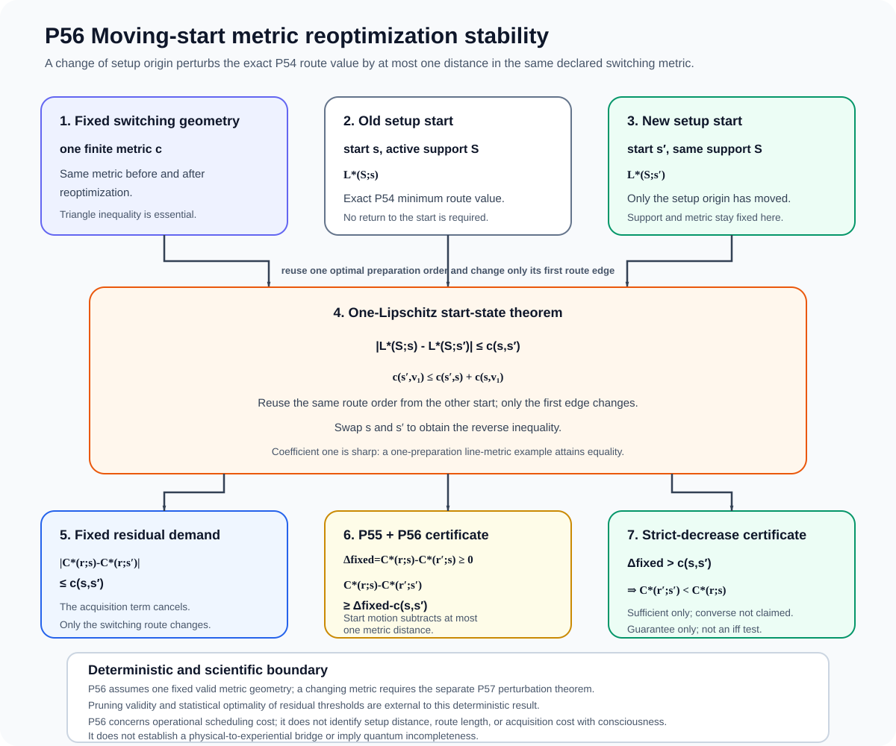

P55 proves monotone residual execution cost when the switching metric and current setup state remain fixed. P56 removes the fixed-start restriction while keeping one declared metric geometry.

For any nonempty active preparation support \(S\), let \(L^*(S;s)\) be the P54 shortest switching path beginning at setup state \(s\). Reusing an optimal route from a second start changes only the first transition, so the triangle inequality gives the sharp start-state stability theorem

\[
\boxed{
|L^*(S;s)-L^*(S;s')|\le c(s,s').
}
\]

The coefficient one is tight even for a single remaining preparation on a line metric.

For residual demand \(r'\le r\), define the P55 fixed-start saving

\[
\Delta_{\rm fixed}=C^*(r;s)-C^*(r';s)\ge0.
\]

P56 then proves

\[
\boxed{
C^*(r;s)-C^*(r';s')
\ge
\Delta_{\rm fixed}-c(s,s').
}
\]

Thus setup motion can erase at most one metric displacement worth of the improvement certified by P55. In particular,

\[
\boxed{
\Delta_{\rm fixed}>c(s,s')
\Longrightarrow
C^*(r';s')<C^*(r;s).
}
\]

Combining P55 and P56 separates three deterministic experimental effects: acquisition release from reduced residual counts, route release from support deletion, and a bounded penalty from moving the apparatus origin.

P56 assumes one unchanged metric switching geometry. If transition costs themselves change between states, a separate metric-perturbation theorem is required. P56 does not independently justify pruning, establish statistical minimaxity, or make an ontological claim about consciousness or quantum mechanics.

[Read Proposition 56](docs/proposition_56_moving_start_metric_reoptimization_stability.md). The [P56 theorem map](docs/figures/p56_moving_start_metric_reoptimization_stability.svg), [implementation](src/consciousness_bridge/moving_start_metric_reoptimization.py), and [tests](tests/test_moving_start_metric_reoptimization.py) expose the proof-to-code path.


## 13.30 P57 - switching-metric perturbation reoptimization stability

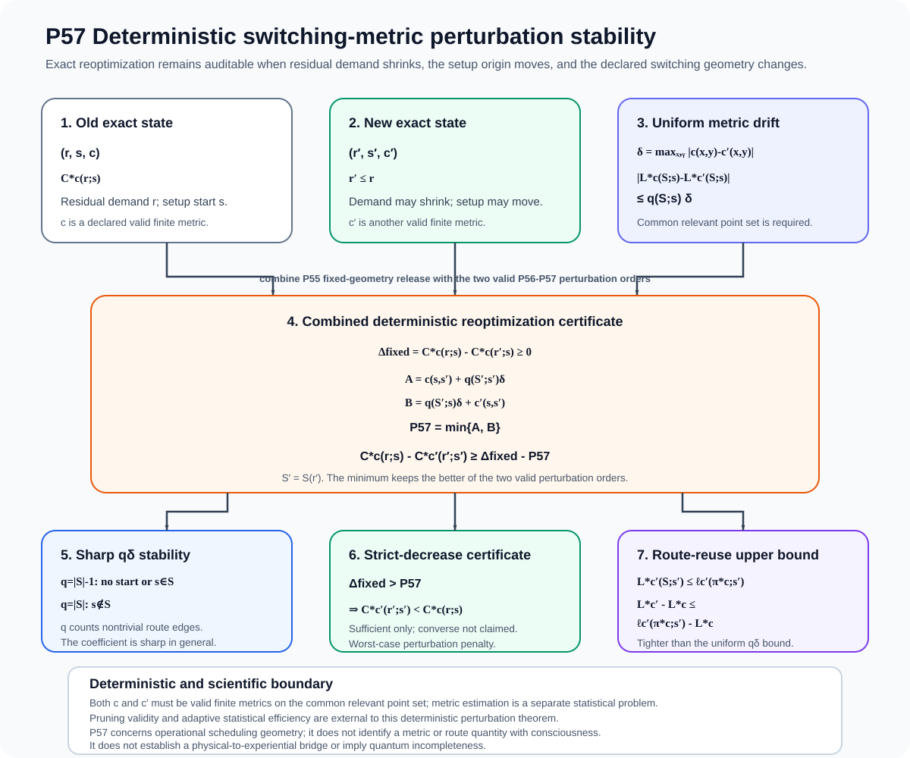

P56 controls movement of the current apparatus setup while holding one metric switching geometry fixed. P57 removes that fixed-metric restriction and asks how much the exact P54 optimum can change when the transition geometry itself changes between sequential reoptimization steps.

Let \(c\) and \(c'\) be two declared finite metrics on the relevant preparation and setup points. Define their uniform separation

\[
\boxed{
\delta
=
\max_{x,y}|c(x,y)-c'(x,y)|.
}
\]

For active support \(S\), define the number of nontrivial route edges

\[
\boxed{
q(S;s)
=
\begin{cases}
|S|-1,&s\text{ absent or }s\in S,\\
|S|,&s\notin S.
\end{cases}
}
\]

P57 proves the sharp deterministic stability bound

\[
\boxed{
|L_c^*(S;s)-L_{c'}^*(S;s)|
\le
q(S;s)\,\delta.
}
\]

The coefficient is tight: adding the same positive perturbation to every off-diagonal distance of a metric can increase every nontrivial route edge by exactly that amount.

P57 then composes all three changes that can occur during sequential experimental reoptimization. For \(r'\le r\), define the P55 release under the old geometry

\[
\Delta_{\rm fixed}
=
C_c^*(r;s)-C_c^*(r';s)\ge0.
\]

With \(S'=S(r')\), the joint start-and-metric perturbation penalty is

\[
\boxed{
P_{57}
=
\min\left\{
c(s,s')+q(S';s')\delta,
q(S';s)\delta+c'(s,s')
\right\}.
}
\]

Therefore

\[
\boxed{
C_c^*(r;s)-C_{c'}^*(r';s')
\ge
\Delta_{\rm fixed}-P_{57}.
}
\]

A directly checkable strict-improvement certificate follows:

\[
\boxed{
\Delta_{\rm fixed}>P_{57}
\Longrightarrow
C_{c'}^*(r';s')<C_c^*(r;s).
}
\]

P57 also gives a tighter instance-specific bound by taking the old optimal route and evaluating that exact order under the new metric and start. Since the new optimum cannot cost more than any feasible reused route, this route-reuse certificate can be much sharper than the worst-case \(q\delta\) envelope.

The deterministic scheduling chain is now

\[
\boxed{
\text{P53 residual demand}
\to
\text{P54 metric scheduling}
\to
\text{P55 support release}
\to
\text{P56 start motion}
\to
\text{P57 metric drift}.
}
\]

The scientific boundary remains strict. P57 assumes two valid declared metrics. It does not estimate a metric from noisy data, justify pruning, establish sequential minimaxity, imply hidden physics, identify any scheduling quantity with consciousness, or claim that quantum mechanics is incomplete.

[Read Proposition 57](docs/proposition_57_switching_metric_perturbation.md). The [P57 theorem map](docs/figures/p57_switching_metric_perturbation.svg), [implementation](src/consciousness_bridge/switching_metric_perturbation.py), and [tests](tests/test_switching_metric_perturbation.py) expose the proof-to-code path.


## 13.31 P58 - finite-data switching-metric uncertainty

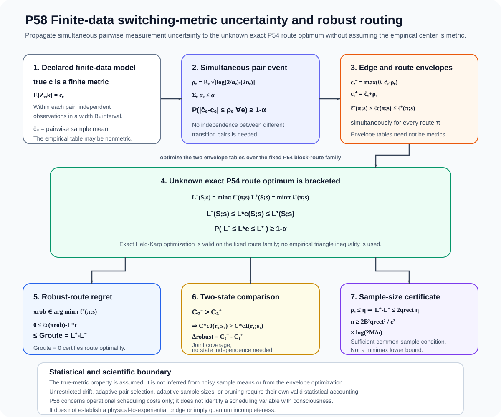

P57 treats the transition geometry as known. P58 moves the scheduling chain into a finite-data setting where the unknown true switching cost is a metric but its pairwise entries are measured with noise.

For every unordered transition pair \(e\), let \(\widehat c_e\) be a sample mean based on \(n_e\) bounded observations with range width \(B_e\). Allocate pairwise failure probabilities \(\alpha_e\) with \(\sum_e\alpha_e\le\alpha\), and define

\[
\boxed{
\rho_e
=
B_e\sqrt{\frac{1}{2n_e}\log\frac{2}{\alpha_e}}.
}
\]

Hoeffding concentration plus a finite-family union bound gives the simultaneous event

\[
\boxed{
|\widehat c_e-c_e|\le\rho_e
\quad\forall e
}
\]

with probability at least \(1-\alpha\).

A central methodological point is that the empirical table \(\widehat c\) is **not required to be a metric**. Sampling noise may violate triangle inequalities even when the unknown physical transition cost \(c\) is metric. P58 therefore avoids an unjustified projection step and works directly with pairwise confidence intervals.

Define edgewise envelopes

\[
\underline c_e=\max\{0,\widehat c_e-\rho_e\},
\qquad
\overline c_e=\widehat c_e+\rho_e.
\]

For every candidate block route \(\pi\), these induce route envelopes \(\underline\ell(\pi;s)\) and \(\overline\ell(\pi;s)\). Their exact Held-Karp minima are

\[
\boxed{
L^-(S;s)=\min_\pi\underline\ell(\pi;s),
\qquad
L^+(S;s)=\min_\pi\overline\ell(\pi;s).
}
\]

On the simultaneous confidence event,

\[
\boxed{
L^-(S;s)
\le
L_c^*(S;s)
\le
L^+(S;s).
}
\]

Adding the deterministic acquisition term gives a complete finite-data interval for the unknown true residual execution cost.

P58 also defines the robust route

\[
\boxed{
\pi^{\rm rob}\in\arg\min_\pi\overline\ell(\pi;s)
}
\]

and proves

\[
\boxed{
0\le
\ell_c(\pi^{\rm rob};s)-L_c^*(S;s)
\le
L^+(S;s)-L^-(S;s).
}
\]

Thus the route-envelope width is not merely an uncertainty bar. It is a certified upper bound on the regret of executing the robust route instead of the unknown true optimum.

For two sequential states with simultaneous total-cost intervals \([C_0^-,C_0^+]\) and \([C_1^-,C_1^+]\), P58 gives the direct strict-improvement certificate

\[
\boxed{
C_0^->C_1^+
\Longrightarrow
C_{c_0}^*(r_0;s_0)>C_{c_1}^*(r_1;s_1).
}
\]

Under a common pairwise confidence radius \(\eta\), the rectangular route interval satisfies

\[
\boxed{
L^+-L^-
\le
2q_{\rm rect}\eta.
}
\]

With equal pairwise sample counts \(n\), common observation range width \(B\), \(M\) calibrated unordered pairs, and equal error spending, a sufficient condition for route-interval width at most \(\varepsilon\) is

\[
\boxed{
n
\ge
\frac{2B^2q_{\rm rect}^2}{\varepsilon^2}
\log\frac{2M}{\alpha}.
}
\]

This is a transparent sufficient calibration law, not a minimax lower bound.

The sequential experimental-scheduling chain is now

\[
\boxed{
\text{P53 residual demand}
\to
\text{P54 exact metric scheduling}
\to
\text{P55 support release}
\to
\text{P56 start motion}
\to
\text{P57 deterministic metric drift}
\to
\text{P58 finite-data metric uncertainty}.
}
\]

The scientific boundary remains explicit. P58 is a finite-data experimental scheduling theorem. It does not infer an experiential variable from route geometry, does not validate pruning by itself, does not prove minimax adaptive calibration, and does not claim that quantum mechanics is incomplete.

[Read Proposition 58](docs/proposition_58_finite_data_metric_uncertainty.md). The [P58 theorem map](docs/figures/p58_finite_data_metric_uncertainty.svg), [implementation](src/consciousness_bridge/finite_data_metric_uncertainty.py), and [tests](tests/test_finite_data_metric_uncertainty.py) provide the proof-to-code path.


## 13.32 P59 - optimal transition-calibration allocation

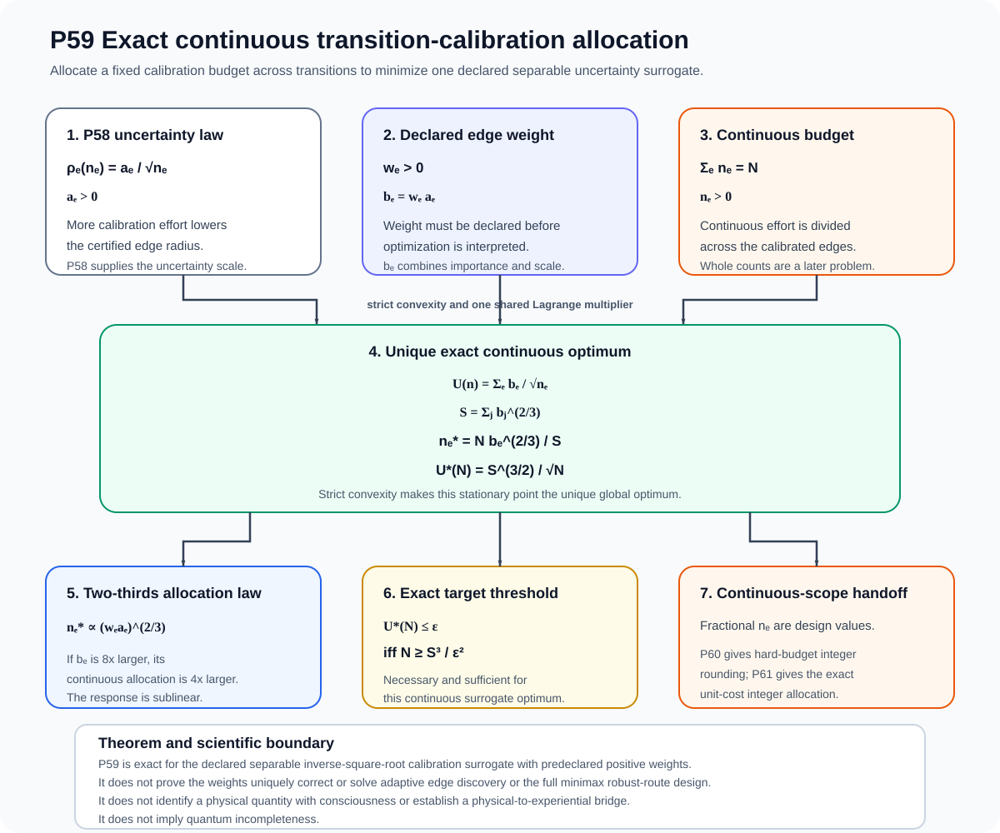

P58 tells us how uncertainty in measured transition costs propagates into uncertainty about the best experimental route. P59 asks the next practical question: if transition measurements themselves cost time or resources, where should a limited calibration budget be spent?

For each calibrated transition edge \(e\), suppose its uncertainty radius has the form

\[
\rho_e(n_e)=\frac{a_e}{\sqrt{n_e}},
\]

where \(n_e\) is the calibration effort allocated to that transition and \(a_e\) summarizes how difficult that transition is to estimate. Let \(w_e>0\) be a declared sensitivity weight describing how strongly that edge contributes to the chosen route-uncertainty surrogate.

P59 minimizes

\[
\boxed{
U(n)=\sum_e\frac{w_ea_e}{\sqrt{n_e}}
}
\]

subject to a fixed total calibration budget

\[
\boxed{
\sum_e n_e=N.
}
\]

Define

\[
b_e=w_ea_e,
\qquad
S=\sum_j b_j^{2/3}.
\]

The objective is strictly convex, so there is one unique continuous optimum:

\[
\boxed{
n_e^*=N\frac{b_e^{2/3}}{S}.
}
\]

In plain language, transitions receive more measurements when they are harder to estimate or more important to the declared routing objective, but the allocation grows sublinearly. If one transition has an effective coefficient eight times larger than another, it receives four times as much continuous calibration effort, not eight times as much.

The minimum achievable surrogate uncertainty is

\[
\boxed{
U^*(N)=\frac{S^{3/2}}{\sqrt N}.
}
\]

Therefore a target uncertainty \(\varepsilon>0\) is achievable for this declared continuous surrogate exactly when

\[
\boxed{
N\ge\frac{S^3}{\varepsilon^2}.
}
\]

This closes the first resource-allocation loop for P58:

\[
\boxed{
\text{finite-data metric uncertainty}
\longrightarrow
\text{quantified route uncertainty}
\longrightarrow
\text{optimal continuous calibration allocation}.
}
\]

The scientific boundary is important. P59 solves this explicit convex surrogate exactly. It does not claim that the sensitivity weights are uniquely determined by nature, does not solve the full combinatorial robust-routing design problem, does not justify adaptive edge discovery, and does not turn any switching or scheduling quantity into a measure of consciousness.

[Read Proposition 59](docs/proposition_59_optimal_transition_calibration.md). The [P59 theorem visual](docs/figures/p59_optimal_transition_calibration.svg), [implementation](src/consciousness_bridge/optimal_transition_calibration.py), and [tests](tests/test_optimal_transition_calibration.py) expose the proof-to-code path.


## 13.33 P60 - integer transition-calibration allocation


P59 gives the mathematically ideal allocation of calibration effort, but its solution can contain fractional measurement counts. P60 makes that design directly implementable when every calibration measurement must be a whole number and the experiment has a hard total budget.

Let \(m\) be the number of calibrated transitions and let \(B>m\) be the available integer budget. P60 reserves one possible rounding unit per transition and applies the P59 continuous optimum to

\[
\boxed{B-m}
\]

units of effective budget. If \(\widetilde n_e\) is that continuous allocation, choose

\[
\boxed{k_e=\lceil\widetilde n_e\rceil.}
\]

Because each ceiling adds strictly less than one unit,

\[
\boxed{\sum_e k_e\le B.}
\]

Because increasing a calibration count can only reduce the P59 uncertainty surrogate,

\[
\boxed{U(k)\le U^*(B-m).}
\]

Comparing this with the ideal continuous optimum that could use the full budget \(B\) gives

\[
\boxed{
\frac{U(k)}{U^*(B)}
\le
\sqrt{\frac{B}{B-m}}.
}
\]

This ratio approaches one as the budget becomes large relative to the number of calibrated transitions. In practical terms, the cost of requiring whole measurements becomes negligible in the large-budget regime.

For a desired uncertainty level \(\varepsilon\), P60 also provides the explicit sufficient hard integer budget

\[
\boxed{
B\ge
m+
\left\lceil\frac{S^3}{\varepsilon^2}\right\rceil,
}
\]

where \(S=\sum_e(w_ea_e)^{2/3}\) is the P59 normalization.

The calibration chain is now

\[
\boxed{
\text{P58: quantify transition uncertainty}
\to
\text{P59: allocate divisible calibration effort optimally}
\to
\text{P60: implement the design with whole measurements}.
}
\]

P60 is a constructive guarantee, not yet an exact solution of the discrete integer optimization problem. It deliberately leaves open whether the remaining budget can be allocated by a marginal-gain rule to obtain the exact integer optimum.

[Read Proposition 60](docs/proposition_60_integer_transition_calibration.md). The [P60 theorem visual](docs/figures/p60_integer_transition_calibration.svg), [implementation](src/consciousness_bridge/integer_transition_calibration.py), and [tests](tests/test_integer_transition_calibration.py) expose the proof-to-code path.

---

# 14. Observer-to-bridge handoff

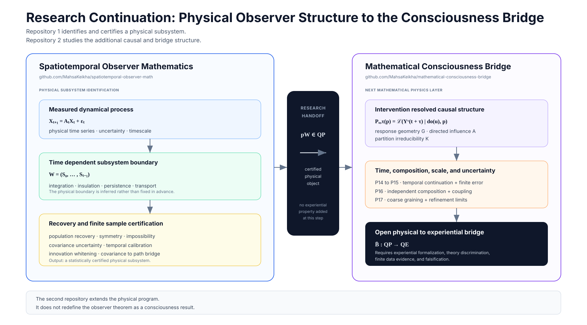

The foundation repository identifies candidate moving subsystems as world-tubes

\[
\boxed{\mathcal W=(S_0,\ldots,S_{T-1}).}
\]

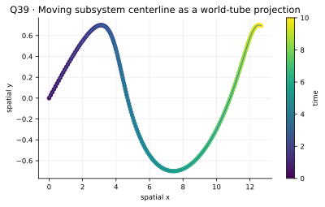

The combined physical program is

```text
physical measurements
        |
        v
effective dynamical / quantum model
        |
        v
certified persistent subsystem
        |
        v
operational interventions and responses
        |
        v
causal structure
        |
        v
temporal continuation + finite-error certification
        |
        v
composition + scale certification
        |
        v
physical-to-experiential bridge test
```

---

# 15. Empirical consciousness-measurement interface

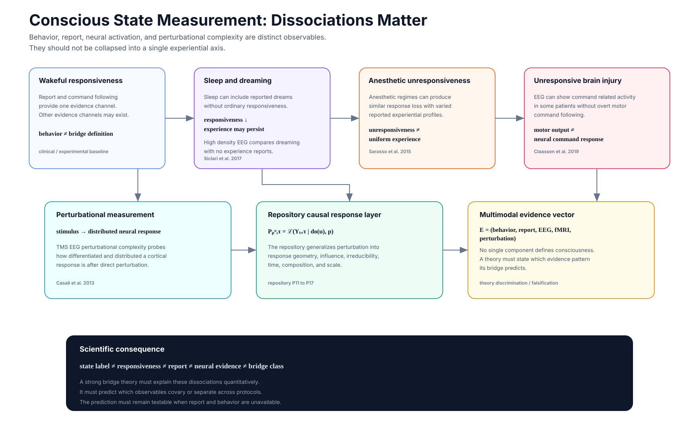

Behavioral responsiveness, report, perturbational response, neural dynamics, imaging, and theoretical interpretation are distinct measurement layers.

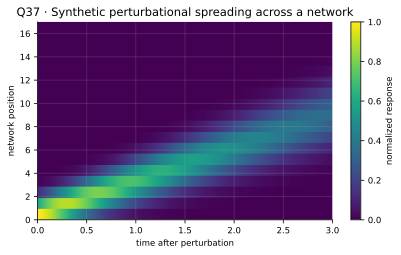

**Q37 - Synthetic perturbational spreading.** This controlled network example is not patient or neural data.

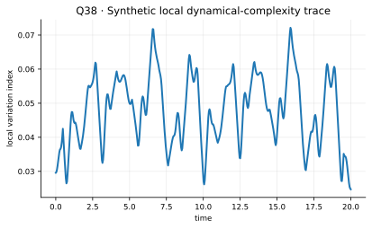

**Q38 - Synthetic dynamical complexity.** This is not presented as a validated consciousness measure.

Selected empirical lineages are tracked in [Literature Map](docs/literature_map.md), including perturbational complexity, critical dynamics, information integration, and adversarial theory comparison. Empirical correlates constrain a candidate bridge; they do not by themselves establish one.

---

# 16. Candidate theory families and empirical discrimination

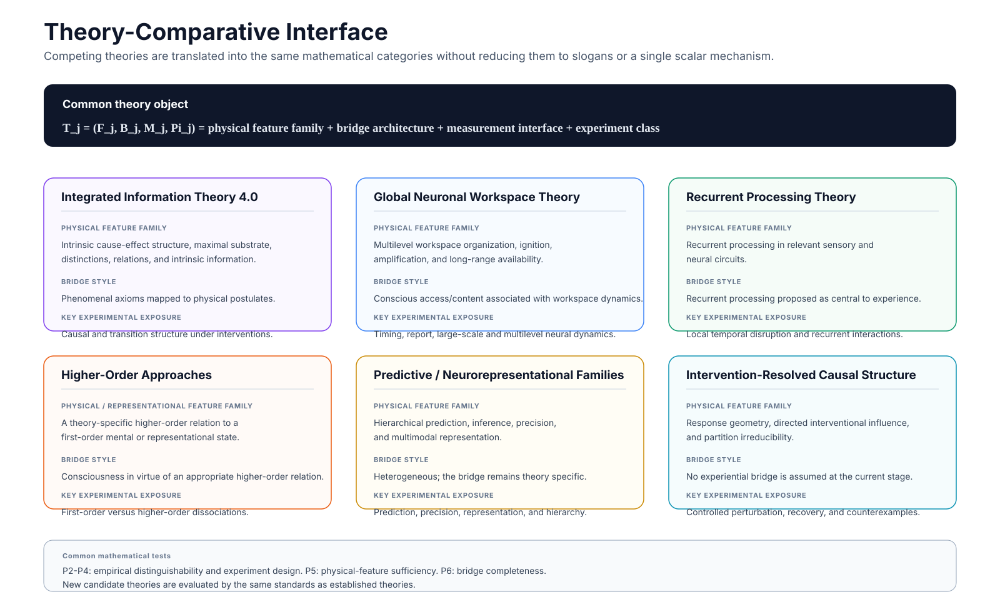

Major theory families are translated into

\[
\boxed{\mathfrak T_j=(\mathcal F_j,\mathcal B_j,\mathcal M_j,\Pi_j).}
\]

| Theory family | Physical structure emphasized | Bridge style | Main empirical exposure |
| --- | --- | --- | --- |
| IIT | intrinsic causal / cause-effect structure | phenomenal axioms mapped to physical postulates | causal structure and perturbation |
| GNWT | workspace organization, ignition, availability | workspace/access relation | timing, report, large-scale dynamics |
| RPT | recurrent processing | recurrence-centered | local temporal disruption and recurrence |
| Higher-order | higher-order representational relations | higher-order relation | first-order / higher-order dissociation |
| Predictive / neurorepresentational | prediction, inference, precision, hierarchy | theory specific | hierarchy, prediction, perturbation |
| Repository physical candidate | response geometry, influence, partition structure, temporal/compositional/scale behavior | experiential bridge intentionally open | intervention, counterexample, finite-data, scale and quantum-completeness tests |

This is not a ranking. P2-P7 give precise mathematical criteria for empirical indistinguishability, feature sufficiency, and experimental recovery.

---

# 17. Extreme-environment stress testing


Spaceflight and related extreme environments can stress cognition, physiology, sleep/circadian structure, workload, radiation exposure, and measurement robustness. This is an application domain, not independent evidence for a consciousness bridge.

---

# 18. Falsification program

A useful bridge theory must be able to fail.

## Representation failure

\[
p\sim_Pp'\quad\text{but}\quad F(p)\ne F(p').
\]

## Feature-sufficiency failure

\[
F(p)=F(p')\quad\text{but}\quad\bar B(p)\ne\bar B(p').
\]

## Observational-identifiability failure

\[
\boxed{\Delta_\Pi=0.}
\]

## Experimental-recoverability failure

\[
\Psi_\Pi(p)=\Psi_\Pi(p')
\quad\text{but}\quad
F_*(p)\ne F_*(p').
\]

## Compression failure

P12-P13 provide explicit component and projection collisions.

## Temporal failure

P14 shows that equal endpoints can hide a nontrivial path. P15 prevents uncertainty from being hidden by forced binary classification.

## Composition failure

P16 supplies the independent product-response null. A higher-level claim must distinguish coexistence from coupling.

## Scale failure

P17 shows that coarse-graining can erase distinctions. P18 quantifies when reconstruction is good enough to retain the declared response geometry. P25 extends that control to the P11 directed-influence component under fixed intervention semantics and target observation coarse-graining. P26 extends it to P11 partition irreducibility when the observation map is compatible with the declared partition. P27 identifies exactly which fine partitions remain meaningful when the node set itself is aggregated and quantifies their remaining irreducibility under aggregation-compatible state maps. P28 adds the source-side compatibility condition required to transport matched intervention comparisons and directed influence through that same node quotient. P29 then controls the complete P11 response geometry on the unchanged intervention-delay experiment grid.

## Quantum-reduction failure

The quantum-only bridge hypothesis fails if an operationally complete quantum equivalence class is shown to contain independently distinguishable experiential classes:

\[
\boxed{q\sim_Qq'\quad\text{but}\quad e\not\sim_Ee'.}
\]

This is currently a theorem target, not an observed fact.

[Read the complete falsification program](docs/falsification_program.md).

---

# 19. Numerical validation facts

The figures are tied to executable equations and tests rather than decorative graphics.

| Validation checkpoint | Tested value / relation | Role |
| --- | ---: | --- |
| OU stationary variance | **0.1508928571** | Q02 closed form |
| Landauer bound at 300 K | **2.870978885e-21 J** | Q09 physical scale |
| linear-system eigenvalue real part | **-0.4** | Q05/Q06 stability |
| Markov subdominant eigenvalue | **0.74** | Q12 mixing |
| P17 fine TV witness | **0.6** | fine-scale distinction |
| same P17 witness after collision map | **0.0** | exact information loss |
| P18 exact-family reconstruction defect | **0.0** | exact family sufficiency |
| P9 gap scaling | \(n(2\gamma)=n(\gamma)/4\) | inverse-square sample law |
| Born probabilities | \(P(0)+P(1)=1\) | QM06 normalization |
| Heisenberg minimum family | \(\Delta x\Delta p=\hbar/2\) | QM04 boundary |
| dephasing purity | \(1\to1/2\) | QM09 open-system limit |
| qubit entropy maximum | **1 bit** | QM10 |
| Schmidt entanglement maximum | **1 bit** | QM11 |
| CHSH quantum maximum | \(2\sqrt2\) | QM12 |
| depolarizing trace distance | \((1-p)D\) | QM15 contraction |
| reduced-state eigenvalue sum | **1** | QM18 normalization |
| classical/causal quantitative figure count | **40** | visual integrity |
| quantum quantitative figure count | **18** | quantum-atlas integrity |

The classical/causal audit is documented in [Quantitative Atlas Validation Report](docs/quantitative_atlas_validation_report.md). Quantum checkpoints are enforced in `tests/test_quantum_foundations_atlas.py`.

---

# 20. Reproducibility and audit path

Install the project:

```bash
python -m pip install -e ".[dev]"
```

Run all tests:

```bash
pytest
```

Run static checks:

```bash
ruff check .
```

Regenerate the 40 classical/causal quantitative figures:

```bash
python scripts/generate_quantitative_atlas.py
```

Regenerate the 18 quantum-foundations figures:

```bash
python scripts/generate_quantum_foundations_atlas.py
```

The repository includes separate GitHub Actions workflows for both generated atlases. The main-page tests require the full Q01-Q40 sequence, the full QM01-QM18 sequence, the P1-P41 proposition chain, and the canonical scientific maps to remain visible in this README.

The code audits representation invariance, theory discrimination, feature sufficiency, experimental recovery, finite-error certification, sample complexity, causal response geometry, directed influence, partition irreducibility, compression collisions, temporal metrics, composition, coupling, coarse-graining, scale sufficiency, fundamental residual certification, quantum normalization, uncertainty, decoherence, entropy, entanglement, Bell bounds, trace-distance contraction, figure inventories, documentation integrity, and visual publication quality.

---

# 21. Full visual audit index

## Classical / causal quantitative atlas

| Figure | Topic |
| --- | --- |
| Q01 | Ornstein-Uhlenbeck trajectories |
| Q02 | OU stationary variance |
| Q03 | double-well potential |
| Q04 | double-well stationary density |
| Q05 | linear state-space flow |
| Q06 | eigenvalue stability |
| Q07 | diffusion mean-square displacement |
| Q08 | heat kernel |
| Q09 | Landauer bound |
| Q10 | KL asymmetry |
| Q11 | oscillator coherence |
| Q12 | Markov mixing |
| Q13 | controllability Gramian |
| Q14 | correlated Gaussian geometry |
| Q15 | Gaussian KL |
| Q16 | Fisher information |
| Q17 | Gaussian mutual information |
| Q18 | Gaussian total variation |
| Q19 | intervention response laws |
| Q20 | response geometry matrix |
| Q21 | directed influence matrix |
| Q22 | partition irreducibility |
| Q23 | coupled joint law |
| Q24 | coupling defect |
| Q25 | TV contraction under binning |
| Q26 | exact coarse collision |
| Q27 | reconstruction defect |
| Q28 | scale-identifiability margin |
| Q29 | exact family scale sufficiency |
| Q30 | temporal fingerprint trajectory |
| Q31 | cumulative path variation |
| Q32 | temporal certification width |
| Q33 | sample complexity |
| Q34 | Monte Carlo TV convergence |
| Q35 | robust signature gap |
| Q36 | repeated-event concentration |
| Q37 | synthetic perturbational spreading |
| Q38 | synthetic dynamical complexity |
| Q39 | world-tube projection |
| Q40 | P18 admissible region |

## Quantum foundations atlas

| Figure | Topic |
| --- | --- |
| QM01 | free Gaussian wavepacket |
| QM02 | infinite-well eigenstates |
| QM03 | double-slit interference |
| QM04 | uncertainty frontier |
| QM05 | Bloch sphere |
| QM06 | Born probabilities |
| QM07 | Rabi oscillation |
| QM08 | dephasing coherence |
| QM09 | purity under dephasing |
| QM10 | von Neumann entropy |
| QM11 | entanglement entropy |
| QM12 | Bell-CHSH violation |
| QM13 | Wigner negativity |
| QM14 | Hilbert-space dimension |
| QM15 | trace-distance contraction |
| QM16 | fidelity and trace distance |
| QM17 | quantum Zeno survival |
| QM18 | reduced density spectrum |

The index is an audit aid. The figures themselves are intentionally embedded above where the corresponding equations enter the scientific argument.

---

# 22. Current frontier

The next research stage is not to invent a consciousness equation. It is to make the physical completeness question harder and the bridge claim more falsifiable.

1. **Quantum operational completeness.** Specify experiment classes rich enough that \(q\sim_Qq'\) has a defensible physical meaning rather than merely meaning “we did not measure enough.”
2. **Quantum bridge identifiability.** Extend P2-P4 to quantum channels and POVM families using trace distance, fidelity, and optimal quantum hypothesis testing.
3. **Quantum feature sufficiency.** Determine which quantum features-coherence, entanglement spectrum, channel structure, response geometry-are provably incomplete or irredundant for declared targets.
4. **Open-system intervention structure.** Generalize P11 from classical response laws to controlled quantum channels and reduced-state response families.
5. **Quantum/classical scale handoff.** Relate CPTP data processing, decoherence, classical coarse-graining, and P17-P18 reconstruction in one multiscale theorem.
6. **Directed influence across scale.** Extend P18-style certification from response geometry to directed influence and partition structure.
7. **Finite-sample certification beyond the P20 baseline.** Develop sharper multinomial, structured, non-IID, and quantum confidence methods while preserving explicit coverage guarantees.
8. **Experiential formalization.** Define \(\mathcal Q_E\), experiential invariances, and measurement procedures independently of any physical candidate.
9. **Exact non-reducibility witness search.** Test whether any independently established experiential distinction survives after conditioning on a physically complete quantum-operational equivalence class.
10. **Dimensional-residual theorem.** Determine when \(d_{\perp}>0\) can be identified robustly rather than arising from omitted physical variables, poor tomography, coordinate choice, or finite data.
11. **Biological and artificial counterexamples.** Search for systems that match candidate physical/quantum signatures while differing in the evidence relevant to consciousness.
12. **Bridge theorem.** Attempt a conditional physical-to-experiential theorem only after physical, quantum, experiential, identifiability, temporal, compositional, scale, finite-data, and falsification layers are jointly explicit.

The current physical-mathematical chain is

\[
\boxed{
\text{classical + quantum dynamics}
\longrightarrow
\text{operational interventions}
\longrightarrow
\text{response and causal structure}
\longrightarrow
\text{temporal/compositional/scale certification}
\longrightarrow
\text{quantum-completeness test}
\longrightarrow
\text{finite-sample residual certification}
\longrightarrow
\text{bridge or non-reducibility test}.
}
\]

The scientific objective is to discover whether a complete physical description is sufficient-not to assume in advance that it is sufficient or insufficient.

---

# Start here for a deeper audit

| Reader goal | Entry point |
| --- | --- |
| Follow the complete quantitative classical/causal program | **[Quantitative Physics & Mathematics Atlas](docs/quantitative_physics_mathematics_atlas.md)** |
| Check numerical facts behind Q01-Q40 | **[Quantitative Atlas Validation Report](docs/quantitative_atlas_validation_report.md)** |
| Inspect the generated quantum atlas metadata | [`docs/figures/quantum/quantum_figure_manifest.json`](docs/figures/quantum/quantum_figure_manifest.json) |
| Follow P1-P20 in proof order | **[Theorem Roadmap](docs/theorem_roadmap.md)** |
| Read the structured physical candidate | **[P11 - Intervention-Resolved Causal Structure](docs/proposition_11_intervention_resolved_causal_structure.md)** |
| Read the scale-loss theorem | **[P17 - Coarse-Graining and Refinement](docs/proposition_17_coarse_graining_and_refinement.md)** |
| Read the scale-sufficiency theorem | **[P18 - Scale Sufficiency](docs/proposition_18_scale_sufficiency_certification.md)** |
| Read the population physical-sufficiency theorem | **[P19 - Fundamental Physical Sufficiency](docs/proposition_19_fundamental_physical_sufficiency.md)** |
| Read the finite-sample residual theorem | **[P20 - Finite-Sample Residual Certification](docs/proposition_20_finite_sample_residual_certification.md)** |
| Trace equations to sources | [Equation and Citation Map](docs/equation_and_citation_map.md) |
| Inspect failure conditions | [Falsification Program](docs/falsification_program.md) |
| Continue backward to subsystem identification | [Spatiotemporal Observer Mathematics](https://github.com/MahsaKeikha/spatiotemporal-observer-math) |
| Cite the research program | [`CITATION.cff`](CITATION.cff) |
