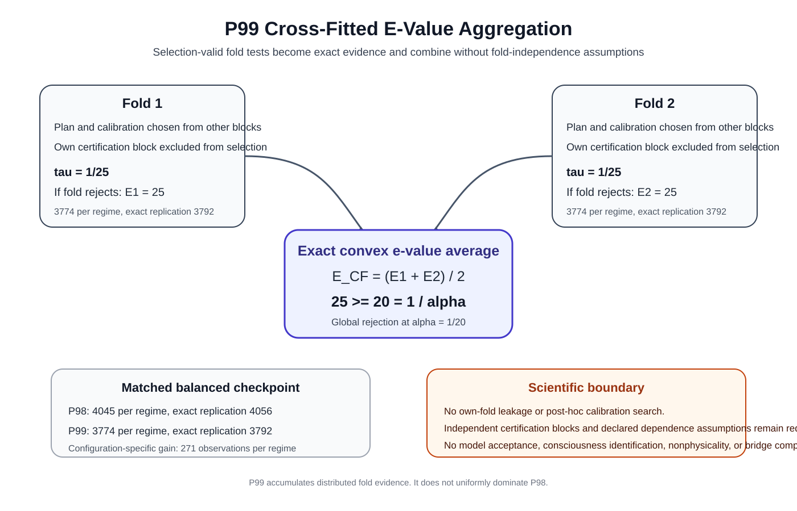

# Mathematical Consciousness Bridge

**Mahsa Keikha, PhD**

> ## The question
>
> **Can a physical description ever be enough to explain a difference related to experience?**

Science is extraordinarily good at describing what physical systems do. We can measure activity, structure, behavior, dynamics, responses to stimulation, information flow, and many other physical properties.

This project asks a different question: **how would we know whether a physical description is actually enough to account for a distinction related to experience, rather than merely being correlated with it?**

The repository does not begin by declaring a brain pattern, information measure, quantum effect, hidden variable, or mathematical object to be consciousness. Instead, it builds a framework for testing proposed connections carefully enough that they can fail.

**[Start here](START_HERE.md)** · **[Research map](docs/research_map.md)** · **[Visual atlas](docs/figure_catalog.md)** · **[Technical record](docs/detailed_proposition_record.md)** · **[Reproduce the work](docs/reproducibility.md)**

---

## The idea in one minute

A scientific claim linking physics to experience should survive a few basic questions:

| Question | In plain language | Go deeper |
| --- | --- | --- |
| **What are we describing?** | Be clear about which physical information is actually included. | [Research map](docs/research_map.md) |
| **Could something important be missing?** | A useful physical description may still leave out a distinction that matters to the target we care about. | [Bridge problem](docs/bridge_problem.md) |
| **Can we trust what we observe?** | Reports, labels, behavior, and other measurements can be incomplete or noisy. | [Start Here](START_HERE.md) |
| **Can the proposed model be wrong?** | A serious model must make predictions or constraints that can fail. | [Falsification program](docs/falsification_program.md) |
| **Does the result survive real uncertainty?** | Apparent patterns should remain meaningful when finite data and numerical uncertainty are taken seriously. | [Reproducibility guide](docs/reproducibility.md) |

That is the core of the project. The mathematics behind each question is available one layer deeper for readers who want to inspect it.

---

## Why this matters

The difficult part of consciousness research is not only collecting more measurements. It is knowing **what those measurements would have to establish** before a physical description could legitimately be said to explain a distinction related to experience.

This repository tries to make that logic explicit. It separates the scientific question into smaller pieces that can be tested, challenged, reproduced, and improved independently.

The goal is not to make the strongest possible claim. It is to make strong claims **hard to make casually and easy to audit carefully**.

---

## What has been built

The repository contains a growing mathematical and computational research program covering physical description, sufficiency, measurement, model testing, reasoning with finite data, and reproducibility.

You do **not** need to read the propositions in order to understand the project.

If you want the complete theorem record, including assumptions, proofs, implementations, tests, figures, and scientific boundaries, use the **[Detailed Proposition Record](docs/detailed_proposition_record.md)** or the **[Theorem Roadmap](docs/theorem_roadmap.md)**.

Historical selection-valid lineage: P96 introduced independent holdout certification after data-dependent plan selection; P97, P98, and P99 extend that line through finite candidate families, cross-fitting, and e-value aggregation.

The current public theorem frontier is **P99**. The formal release remains **v0.82.0**.

**[Read the current frontier](docs/proposition_99_cross_fitted_evalue_aggregation.md)**

---

## Visual architecture

**Figure 1. Scientific architecture of the project.** The research moves from physical dynamics to operationally measurable structure, then to mathematical sufficiency tests, target-side validity, finite-data certification, experimental design, and finally the still-open physical-to-experiential bridge. The arrows are logical dependencies, not claims that one layer has already been identified with consciousness.

> **Visual reading standard.** Every reader-facing figure now has a clear title, an embedded SVG description, a nearby caption or atlas explanation, a scientific-status boundary, and a direct route to the proof or source context. Use the [Complete Figure Catalog](docs/figure_catalog.md) to understand every visual without searching the repository, and the [Figure Caption and Description Standard](docs/figure_caption_and_description_standard.md) for the enforced documentation rules.

### Current theorem frontier

**Figure 2. P99 cross-fitted e-value aggregation.** P99 converts a selection-valid level-`tau` fold rejection into the exact e-value `R(tau)/tau`. Finite threshold mixtures remain valid when their calibration is frozen before own-fold evaluation. Fixed convex averaging across folds remains valid even when the cross-fitted fold certificates are dependent, because the proof uses expectation linearity rather than independence.

For two equally weighted folds, two regimes per fold, one-step dependence, and 5 percent global error, the declared distributed-evidence design uses fold test level **1/25** and local regime level **1/50**. The exact mathematical crossing is **3774 observations per regime**, with first denominator-24 replication at **3792**. The unique two-fold totals are **15096 / 15168**. The matched equal-split P98 checkpoint is **4045 / 4056** per regime and **16180 / 16224** unique observations.

P99 does not uniformly dominate P98. It is designed to accumulate distributed evidence across several valid folds, while P98 can be better when one fold is individually decisive. P99 does not justify post-hoc calibration search, own-fold leakage, dependent-stream pseudo-folds, model acceptance, consciousness identification, nonphysicality, or completion of the physical-to-experiential bridge.

### Immediate predecessor: P97

[P97: Simultaneous Finite Candidate-Family Selection](docs/proposition_97_simultaneous_candidate_family_selection.md) remains the immediate same-data selection predecessor to P98. P97 permits post-inspection choice only within a finite candidate family fixed before certification statistics are inspected and pays for that search through explicit multiplicity. P98 takes a different route by rotating genuinely independent certification blocks while enforcing own-fold exclusion.

## Choose your path

| If you want to... | Start here |
| --- | --- |
| Understand the project without technical background | **[Start Here](START_HERE.md)** |
| See how the scientific questions fit together | **[Research Map](docs/research_map.md)** |
| Explore the project visually | **[Figure Catalog](docs/figure_catalog.md)** |
| Move into the formal architecture | **[Technical Research Architecture](docs/research_architecture.md)** |
| Follow the complete mathematical development | **[Theorem Roadmap](docs/theorem_roadmap.md)** |
| Find every proposition and its technical record | **[Detailed Proposition Record](docs/detailed_proposition_record.md)** |
| Check equations and sources | **[Equation and Citation Map](docs/equation_and_citation_map.md)** |
| Run the code and verification yourself | **[Reproducibility Guide](docs/reproducibility.md)** |
| Look up terminology | **[Glossary](docs/glossary.md)** |

---

## What this project does not claim

This repository does **not** claim that:

- a particular equation or hidden variable has been identified as consciousness;
- a model that survives one test is therefore uniquely correct;
- rejection of one physical model proves that consciousness is nonphysical;
- mathematical proof under stated assumptions makes those assumptions true in nature;
- the final bridge from physical description to experience has been solved.

The bridge remains an open scientific problem.

---

## Related physical foundation

This work follows the separate project **[Spatiotemporal Observer Mathematics](https://github.com/MahsaKeikha/spatiotemporal-observer-math)**, which studies how a persistent physical subsystem can be identified from measured dynamics.

That project asks **which physical system is being tracked**. This repository asks the next question: **what would be required before a physical description of that system could support a scientifically testable claim about experience?**

---

## Citation and license

For scholarly citation, see **[CITATION.md](CITATION.md)** and **[CITATION.cff](CITATION.cff)**.

MIT License. See **[LICENSE](LICENSE)**.

**Public theorem frontier:** P99
**Formal release:** v0.82.0
**Final bridge from physical description to experience:** open
