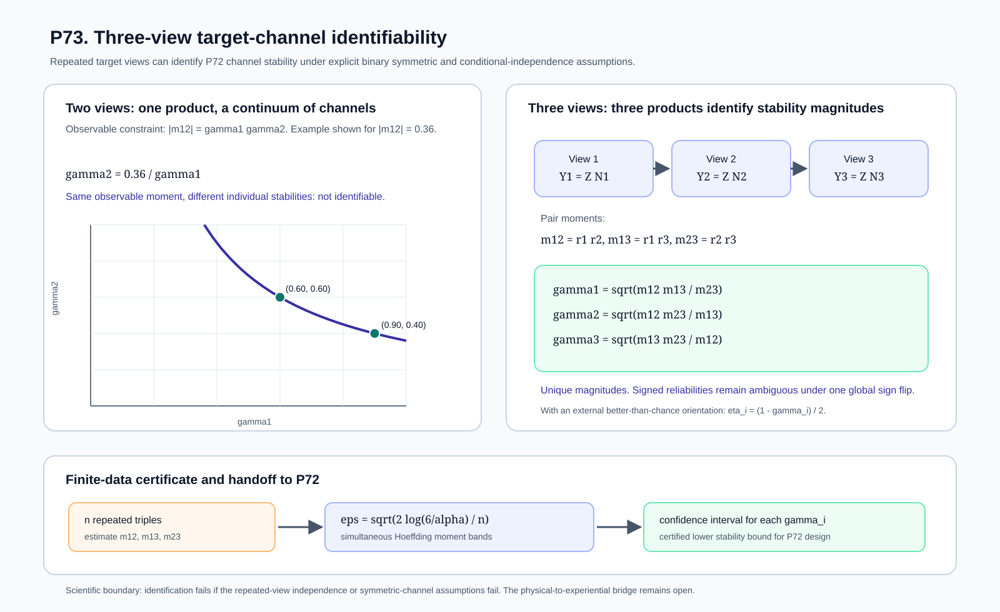

# Mathematical Consciousness Bridge

[](https://github.com/MahsaKeikha/mathematical-consciousness-bridge/actions/workflows/test.yml)
[](CITATION.cff)
[](LICENSE)

**Mahsa Keikha, PhD**

> **What mathematical and physical conditions would be required for a complete physical description of a system to support a scientifically testable claim about consciousness?**

This repository is a mathematical-physics research program for the **physical-to-experiential bridge problem**. It does not begin by assuming what consciousness is. It asks what must be true before any proposed physical description can legitimately be called sufficient for an independently specified experiential target, how that sufficiency can be falsified, and how finite experiments can distinguish a real bridge from correlation, representation choice, coarse-graining, target circularity, target-measurement error, measurement-channel non-identifiability, or statistical noise.


**Figure 1. Scientific architecture of the project.** The research moves from physical dynamics to operationally measurable structure, then to mathematical sufficiency tests, target-side validity, finite-data certification, experimental design, and finally the still-open physical-to-experiential bridge. The arrows are logical dependencies, not claims that one layer has already been identified with consciousness.

---

# What this project is trying to achieve, in plain language

The question behind this project is simple to state, even though it is exceptionally difficult to answer: **if science could describe the physical state and behavior of a system in complete detail, would that description also be enough to determine what, if anything, is experienced by that system?**

Modern physics and neuroscience give us extraordinarily powerful ways to describe what physical systems are doing. We can measure electrical activity, chemistry, blood flow, behavior, responses to stimulation, information flow, causal influence, and many other properties. Quantum mechanics gives us an even more fundamental language for physical states and measurement probabilities. But none of these descriptions, by themselves, tells us why a particular physical condition should correspond to a particular experience, or whether the physical description we chose contains every distinction that would matter for experience.

The purpose of this research is to study that missing connection without assuming the answer in advance. It does not begin by selecting one number, pattern, field, quantum effect, level of complexity, or other physical quantity and declaring that quantity to be consciousness. Instead, it treats every proposed connection between physical description and experience as a scientific claim that has to survive a sequence of independent tests.

The first requirement is to define the physical side clearly. What exactly are we claiming to know about the system? Which measurements, interventions, time scales, spatial scales, and physical variables are included? The project then asks whether that description remains meaningful when we change coordinates, coarse-grain the system, examine it over time, intervene on it, or describe it at a different level of physical detail. A proposed bridge should not depend on an arbitrary representation or disappear simply because the same physical situation was written in a different language.

The second requirement is to define the target independently. If we want to test whether physics is sufficient for some experiential distinction, that distinction cannot simply be created from the same physical data and then used as evidence that the physical data explain it. P71 formalizes this problem. It shows why a target derived from the physical descriptor being tested can make the result circular. A bridge can appear successful because the conclusion was already built into the way the target was defined.

The third requirement is to ask how that target is actually observed. Experience is not a laboratory instrument reading that we can assume to be perfect. Reports, behavioral responses, clinical judgments, repeated assessments, and other possible indicators may all contain noise or bias. P72 shows why this matters: an imperfect measurement process can weaken or even erase a real distinction. Therefore, failing to observe a difference does not automatically mean that no difference exists.

The fourth requirement is to justify the reliability of the measurement itself. P73 addresses one carefully defined case of this problem. It shows that, under a specific repeated-measurement model, three sufficiently independent binary views can identify the strength of the individual measurement channels, whereas two different views cannot separate their individual reliabilities. The broader lesson is simple: **before a measurement is used as evidence for a physical-to-experiential claim, its reliability must itself be justified, estimated, or challenged scientifically.** Agreement between measurements is not enough if they may share the same bias or error.

Once the physical description, the target, and the target measurement are all defensible, the project asks the central question: **does the physical description actually contain enough information to account for the target distinction?** One of the most important tests is to look for cases that appear identical according to the declared physical description but remain different according to the independently justified target. Finding such a case would show that the declared physical description is not sufficient for that target. It would not automatically prove that consciousness lies outside physics. It would show that something important is missing from the particular physical description, measurement scheme, or bridge model being tested.

The project also treats uncertainty as part of the science rather than as an afterthought. Real experiments contain finite data, noisy measurements, imperfect reconstructions, adaptive choices, and competing explanations. The mathematics in this repository is designed to determine when an apparent result is strong enough to survive those uncertainties and when the correct conclusion is simply that the evidence is still insufficient. The same principle applies to the quantum part of the project: a complete quantum description of a declared experiment is still not, by itself, a theory of experience. The additional bridge between the physical description and the experiential target must still be stated and tested.

This is why the many equations, theorems, simulations, figures, and optimization results in the repository all serve one larger purpose. They are not separate attempts to invent a formula for consciousness. They are pieces of a scientific test architecture. Some establish what a valid physical description must preserve. Some determine when a target is circular. Some quantify what noisy measurement can hide. Some determine how measurement reliability can be estimated. Others control statistical uncertainty, compare physical descriptions, design experiments, or make those experiments more efficient. Together they are meant to remove hidden assumptions one by one.

A successful outcome would therefore not be a single impressive equation labeled "consciousness." It would be a defensible chain of inference: a clearly specified physical system, a physical description that survives representation and scale changes, an independently justified experiential target, a trustworthy way of observing that target, a bridge rule that survives uncertainty and competing explanations, and experiments capable of proving that rule wrong if it is false. A strong negative result would be equally valuable if it identified exactly where a proposed physical description fails.

That is the purpose of the **Mathematical Consciousness Bridge**: **to transform the broad question of how physical reality relates to experience into a sequence of precise scientific obligations that can be examined, tested, falsified, and improved one by one, without hiding the hardest part of the problem inside an assumption.**

The research currently contains **73 proposition-level results** and **62 equation-driven quantitative figures**. The theorem frontier is P73. These results build the test architecture and close specific mathematical gaps, but the physical-to-experiential bridge itself remains open.

This project continues [Spatiotemporal Observer Mathematics](https://github.com/MahsaKeikha/spatiotemporal-observer-math), which addresses the prior physical problem of identifying a persistent moving subsystem from measured dynamics.

---

# Abstract

Let $\Omega$ denote the physically admissible state or history space, let $T:\Omega\to\mathcal T$ be a declared physical descriptor, and let $E:\Omega\to\mathcal E$ be an independently specified target representing the distinctions a proposed bridge claims to explain. The deterministic bridge question is whether there exists a map $B$ such that $E=B\circ T$. The stochastic version asks whether the conditional target law factors through $T$, equivalently whether the residual $I(E;\Omega\mid T)$ vanishes under the declared probabilistic model. The smooth version yields a differential rank obstruction.

The program develops the structures required to make those tests scientifically meaningful: intervention-conditioned response laws, causal influence, temporal continuation, composition defects, coarse-graining and reconstruction bounds, multiscale operational quotients, finite-sample confidence certificates, quantum-state model-set tests, adaptive experiment design, scheduling, and certified resource allocation.

P71 adds a non-circularity theorem: if a target is constructed as $E=h(T)$, or through a descriptor-only stochastic channel, successful factorization is guaranteed by construction and has no independent evidential force. P72 adds a target-measurement theorem. If an independently justified latent target $E^\star$ is observed as $Y$ through a declared nondifferential channel satisfying $Y\perp\!\!\!\perp\Omega\mid(E^\star,T)$, then

$$
\boxed{I(Y;\Omega\mid T)\le I(E^\star;\Omega\mid T).}
$$

Target measurement can therefore attenuate or erase a genuine population witness, but under that model it cannot create a positive observed residual from a latent target already screened off by $T$.

P73 addresses one assumption left open by P72. For a latent binary target $Z$ and three repeated target views $Y_i=ZN_i$ with mutually independent binary noises independent of $Z$, define $r_i=\mathbb E[N_i]$, $\gamma_i=|r_i|$, and $m_{ij}=\mathbb E[Y_iY_j]$. Then $m_{ij}=r_ir_j$. Two heterogeneous views identify only one product and therefore do not identify the two individual channel stabilities. Three nonzero compatible views identify all three stability magnitudes. The signed reliability vector remains ambiguous under one global latent-label orientation. P73 also gives simultaneous finite-sample stability intervals. These results are conditional on the declared repeated-view model and do not establish that real experiential measurements satisfy it.

These results establish a rigorous **test architecture**, not a completed ontology of consciousness.

---

# Scientific status discipline

| Status | Meaning in this project |
| --- | --- |
| **Definition** | A mathematical object introduced for the framework. |
| **Proved** | A theorem derived from explicit assumptions. |
| **Implemented** | Executable code mirrors a stated theorem or procedure. |
| **Numerically verified** | A simulation or computation checks an implementation or example. |
| **Empirically supported** | The statement depends on external published experimental evidence. |
| **Synthetic example** | A controlled example used to expose logic, failure modes, or calibration behavior. |
| **Hypothesis** | A scientifically motivated proposal not yet established by theorem or experiment. |
| **Open bridge problem** | A physical-to-experiential identification has not been derived. |

This distinction is central. The repository **does not assume that a physical quantity is consciousness**. It does not identify consciousness with entropy, integration, complexity, synchronization, entanglement, coherence, measurement, a state of matter, or an additional spacetime coordinate.

**Quantum mechanics does not by itself imply consciousness.** A complete quantum state specifies the outcome statistics of declared measurements, but an experiential conclusion requires an additional bridge statement unless that bridge is independently derived.

Likewise, a latent target symbol such as $E^\star$ is not a declaration of experiential ground truth. P71-P73 formalize target-side obligations that must be satisfied before such a target can carry bridge evidence.

---

# The core scientific thesis in one view

A descriptor $T$ partitions the admissible physical domain into fibers. A deterministic bridge through $T$ can exist only if the target is constant on every such physical equivalence class. In symbols,

$$
T(\omega_1)=T(\omega_2),\quad E(\omega_1)\ne E(\omega_2)\quad\Longrightarrow\quad E\ne B\circ T.
$$

The stochastic analogue uses

$$
R_{\mathrm{stoch}}(T)=I(E;\Omega\mid T).
$$

But those equations have evidential content only after target provenance and target measurement are justified. If the target is latent, any claimed channel-stability bound must also be supported by calibration data or by explicit assumptions whose adequacy can be challenged.

| Layer | Mathematical object | Scientific question | Failure witness |
| --- | --- | --- | --- |
| Physical description | $T(\omega)$ | Is the declared physics represented without arbitrary coordinate dependence? | Representation or identifiability failure |
| Operational structure | response laws and causal geometry | Do interventions expose physically meaningful distinctions? | Collision or missing causal distinction |
| Target provenance | target-construction protocol | Was the target defined independently of the tested descriptor? | Descriptor-derived target, P71 |
| Target measurement | $K_t(y\mid e)$ | Does noisy observation preserve the relevant target distinctions? | Erasure or differential measurement, P72 |
| Channel calibration | repeated-view moments or calibration data | Is the stability used by the bridge test identified rather than assumed? | Two-view underdetermination or model failure, P73 |
| Bridge sufficiency | $E=B\circ T$ | Is the target constant on physical fibers? | Same $T$, different $E$ |
| Stochastic sufficiency | $I(E;\Omega\mid T)$ | Is target-relevant information left outside $T$? | Certified positive residual |
| Scale stability | coarse-graining plus reconstruction | Does relevant physical structure survive a change of resolution? | Uncontrolled reconstruction or distortion |
| Quantum sufficiency | $\rho$, channels, measurement statistics | Does the target factor through the declared operational quantum state? | Regularity-aware non-factorization witness |
| Finite experiment | confidence regions and stopping rules | Can a witness survive uncertainty and adaptive sampling? | Confidence or design assumptions fail |

This is the scientific contribution of the project at its current stage: **a bridge claim is decomposed into separately auditable mathematical obligations instead of being hidden inside a single proposed consciousness quantity.**

---

# How to read this study

The main page is organized as a scientific argument rather than a chronological project log. A first-time reader can follow the core argument and use the direct links below for details. Detailed proposition chronology and downstream calibration mathematics remain on separate pages so they do not interrupt the main scientific path.

| Reader question | Where the answer appears |
| --- | --- |
| **What is the scientific problem?** | [Abstract](#abstract), [core scientific thesis](#the-core-scientific-thesis-in-one-view), [Research at a glance](#research-at-a-glance), and [Section 1](#1-mathematical-formulation-of-the-bridge-problem) |
| **What exactly is being measured and compared?** | [Section 1](#1-mathematical-formulation-of-the-bridge-problem), [Section 2](#2-from-physical-dynamics-to-operational-structure), [Section 3](#3-time-composition-and-scale-cannot-be-ignored), [Section 4](#4-turning-a-population-theorem-into-a-finite-experiment), [measurement map](docs/figures/conscious_state_measurement_map.svg), and [response-geometry map](docs/figures/information_geometry_response_manifold.svg) |
| **How do we avoid circular targets?** | [P71](docs/proposition_71_target_provenance_noncircularity.md) |
| **How does noisy target measurement affect evidence?** | [P72](docs/proposition_72_target_measurement_channel_robustness.md) |
| **When can a binary target channel be calibrated without latent ground truth?** | [P73](docs/proposition_73_three_view_target_channel_identifiability.md) and its [provenance record](docs/p73_equation_provenance.md) |
| **What has actually been proved?** | [Scientific status discipline](#scientific-status-discipline), [Theorem roadmap](docs/theorem_roadmap.md), and [What has actually been established](#what-has-actually-been-established) |
| **What would falsify the framework or a candidate bridge?** | [Falsification logic](#falsification-logic) and the [Falsification program](docs/falsification_program.md) |
| **What remains unknown?** | [What remains open](#what-remains-open), [Current scientific status](#current-scientific-status), [Research navigation](docs/research_navigation.md), [Detailed proposition record](docs/detailed_proposition_record.md), and the [Calibration and Optimization Frontier](docs/calibration_optimization_frontier_p61_p70.md) |


**Figure 2. Scientific proof ladder.** A credible consciousness bridge must pass distinct layers: physical well-definedness, experiential well-definedness, non-circular bridge premises, representation invariance, physical-feature sufficiency, experimental recoverability, competing-theory discrimination, finite-data support, and explicit falsification. The figure is a requirements map, not a claim that every layer has already been closed.

---

# Research at a glance

| Stage | Results | Scientific question | Status | Main entry point |
| --- | --- | --- | --- | --- |
| 1. Foundations and identifiability | **P1-P10** | What must be invariant, distinguishable, recoverable, and statistically testable? | Proved / implemented / tested | [Theorem roadmap](docs/theorem_roadmap.md) |
| 2. Causal, temporal, compositional, and scale structure | **P11-P18** | Which structured physical distinctions survive interventions, time, composition, and coarse-graining? | Proved / implemented / tested | [Quantitative atlas](docs/quantitative_physics_mathematics_atlas.md) |
| 3. Bridge sufficiency and target validity | **P19-P24, P71-P73** | Does an independently justified, adequately measured, and defensibly calibrated target factor through the physical descriptor? | Proved under declared models | [Research navigation](docs/research_navigation.md) |
| 4. Multiscale operational structure | **P25-P37** | Which causal and response structures survive node, state, intervention, and delay quotients? | Proved / implemented / tested | [Theorem roadmap](docs/theorem_roadmap.md) |
| 5. Quantum sufficiency and falsification | **P38-P44** | What follows from a declared operational quantum description, and what does not? | Conditional tests proved; ontology open | [Quantum foundations](docs/quantum_foundations_and_bridge_test.md) |
| 6. Adaptive experiment design and scheduling | **P45-P60** | How should evidence gathering, stopping, service allocation, switching, and calibration be organized? | Proved / implemented / tested | [Equation and citation map](docs/equation_and_citation_map.md) |
| 7. Calibration and integer optimization | **P61-P70** | How should downstream finite calibration resources be allocated and certified? | Proved / implemented / tested | [Calibration and Optimization Frontier](docs/calibration_optimization_frontier_p61_p70.md) |

The dependency-oriented theorem map covers **P1 through P73 with explicit dependency branches**.


**Figure 3. Theorem dependency map.** Proposition numbers preserve development order, while the dependency map shows scientific order. P71-P73 return to the P19 target-sufficiency lineage; P61-P70 remains a separate downstream optimization branch.

---

# 1. Mathematical formulation of the bridge problem

## 1.1 Physical states, descriptors, and targets

Let $\Omega$ be the admissible physical state or history space, $T$ the declared physical descriptor, and $E$ the independently specified target.

The target is intentionally not equated with verbal report or overt responsiveness. Dreaming, anesthesia, perturbational complexity, and covert command-related brain activation motivate keeping behavior, report, neural evidence, and experiential inference distinct.


**Figure 4. Measurement and dissociation map.** Behavioral responsiveness, subjective report, perturbational complexity, and command-related brain activation are different evidence channels. A bridge theory must state which observable pattern it predicts and what target those observations are claimed to measure.

## 1.2 Exact deterministic sufficiency

The exact question is whether there exists a bridge law $B$ such that $E=B\circ T$. Equivalently, equal declared physical descriptors must imply equal targets.

## 1.3 Stochastic sufficiency

For finite stochastic variables, the project measures residual target information outside the descriptor using $I(E;\Omega\mid T)$ and studies how that residual changes under descriptor refinement.

## 1.4 Smooth differential obstruction

For differentiable bridge classes, local rank provides a necessary condition for factorization and therefore a local obstruction when the target varies in directions unavailable to the descriptor.


**Figure 5. The logical gap being tested.** Fundamental physical theory determines physical structure and operational predictions. A consciousness theory still requires a justified map from physical equivalence classes to target equivalence classes.

## 1.5 P71: target provenance cannot be circular

If the target is defined from the tested descriptor, successful factorization can hold by construction. P71 proves this for deterministic descriptor-derived targets, descriptor-only stochastic channels, and fixed learned rules evaluated on held-out data. It also shows why observed zero residual does not by itself establish independent target provenance.


**Figure 6. P71 non-circularity theorem.** A descriptor-derived target automatically respects descriptor fibers, whereas a separately declared synthetic target can expose same-descriptor/different-target collisions. The synthetic example illustrates theorem logic; it is not claimed to be an experiential variable.

Direct proof: [Proposition 71](docs/proposition_71_target_provenance_noncircularity.md).

## 1.6 P72: noisy target observation is a separate scientific layer

P72 separates an independently justified latent target from its observed measurement. Under its declared nondifferential measurement condition, the observed conditional residual cannot exceed the latent-target residual. This gives a one-way transfer of positive evidence while preserving the warning that an erasing measurement channel can hide a genuine latent witness.


**Figure 7. P72 target-measurement theorem.** Nondifferential target noise can attenuate or erase a real bridge witness, but cannot create a positive population residual from a screened-off latent target under the stated model. The binary channel exposes an exact erasure point, and the finite-data panel shows how measurement stability enters the sample burden.

Direct proof: [Proposition 72](docs/proposition_72_target_measurement_channel_robustness.md). Equation classification: [P72 provenance record](docs/p72_equation_provenance.md).

## 1.7 P73: three repeated views can identify binary channel stability under a declared model

P73 addresses one quantity that P72 otherwise has to assume. Under a narrow binary symmetric repeated-view model with conditionally independent errors, two heterogeneous views identify only a product of their reliabilities, while three nondegenerate views identify the three reliability magnitudes up to one global latent-label orientation. P73 also supplies finite-sample confidence intervals for those stability magnitudes.



**Figure 8. P73 identifiability boundary.** Two heterogeneous views leave a continuum of compatible stability pairs. Under the declared three-view model, three nonzero pair moments identify the P72 stability magnitudes, and finite moment bands propagate into calibration intervals. This is a measurement-model theorem, not empirical evidence that any particular report, rater, or neural measure is a valid experiential target.

Direct proof: [Proposition 73](docs/proposition_73_three_view_target_channel_identifiability.md). Equation classification: [P73 provenance record](docs/p73_equation_provenance.md).

---

# 2. From physical dynamics to operational structure

A useful bridge test cannot depend only on coordinates or passive correlations. P11 builds an intervention-resolved physical candidate from response geometry, directed influence, and partition irreducibility.


**Figure 9. Anatomy of the operational physical candidate.** Controlled interventions generate response distributions. Distances define response geometry; matched perturbations define directed influence; comparisons with partition-product nulls expose irreducibility. These are physical candidates to be tested for sufficiency, not definitions of consciousness.


**Figure 10. Response laws as a physical geometry.** Parameterized intervention-conditioned probability laws can be studied using operational distances and local statistical geometry. An experiential geometry would still require a separately justified bridge.


**Figure 11. Constructive collision tests.** A compressed physical feature must earn sufficiency by factorization or reconstruction, not by visual plausibility or correlation.

---

# 3. Time, composition, and scale cannot be ignored

P14 treats temporal continuation as a path property rather than endpoint identity. P16 studies independent composition and coupling. P17-P18 quantify what can be lost under coarse-graining and what can be controlled through reconstruction.


**Figure 12. Temporal continuation.** Representation-equivalent descriptions are quotiented out while local structural changes are accumulated along a trajectory. Endpoint equality alone cannot certify a continuous physical history.


**Figure 13. Scale sufficiency logic.** Coarse-graining can erase distinctions, but reconstruction control bounds how much declared response geometry was lost.


**Figure 14. Multiscale hierarchy.** A scientifically credible descriptor must state which objects survive changes of scale, which require compatibility conditions, and which acquire bounded distortion.

---

# 4. Turning a population theorem into a finite experiment

Exact mathematical insufficiency becomes scientifically useful only when finite observations support it with controlled error. P20-P24 develop finite-sample and adaptive residual certification, while P72-P73 add measurement-side and calibration-side uncertainty control.


**Figure 15. From exact factorization to finite-data evidence.** A bridge claim is rejected only when a confidence-controlled lower bound remains positive under the declared sampling assumptions.

---

# 4.4 Fundamental theory / Theory-of-Everything interface

There is currently no experimentally established Theory of Everything that has separately been shown to determine experiential variables. The bridge framework therefore keeps fundamental physics and the experiential bridge logically separate.

For bookkeeping, a broad physical descriptor may be written schematically as

$$
T(\Omega)=\bigl(G(\Omega),Q(\Omega),C(\Omega)\bigr),
$$

where $G$ denotes geometric information, $Q$ quantum-operational information, and $C$ effective causal or classical structure under the declared model. This notation is an interface, not a claim that these components are fundamental or complete.

Thomas W. Campbell's *My Big TOE* and similar consciousness-first proposals are treated, if mentioned, only as speculative falsifiable antecedents, not as established premises in the theorem chain.


**Figure 16. Research handoff.** The preceding observer-mathematics project identifies and statistically certifies a physical subsystem. This repository begins after that physical object is declared and asks what additional physical, target, and bridge conditions are required. No experiential property is inserted at the handoff.

---

# 5. Quantum mechanics enters as a physical description, not as an assumption about consciousness

For a finite-dimensional quantum system, a density operator and declared measurements determine operational outcome statistics. The bridge question remains separate: does an independently justified target factor through that declared operational quantum state under an explicitly declared bridge class?


**Figure 17. Quantum completeness versus experiential completeness.** Tomographic completeness closes the declared operational quantum description. It does not automatically close the physical-to-experiential map.


**Figure 18. P38 quantum sufficiency test.** Equal declared quantum descriptors with unequal independently defined targets give an exact non-factorization witness. Finite data require uncertainty-aware replacements for exact equality.


**Figure 19. Finite-data quantum envelope.** Quantum-state confidence regions and target uncertainty are propagated into an end-to-end regularity obstruction. The scientific conclusion is conditional on tomography coverage, the target measurement model, and the declared bridge regularity.

For the complete QM01-QM18 visual sequence, see [Quantum foundations and bridge test](docs/quantum_foundations_and_bridge_test.md).

---

# 6. Adaptive experiment design: collecting evidence without invalidating it

P45-P60 develop shared preparation graphs, adaptive sampling, time-uniform confidence protection, safe pruning, stopping complexity, service allocation, switching costs, finite-data transition uncertainty, and the beginning of transition calibration.


**Figure 20. Adaptive evidence collection.** The experiment may choose what to sample next based on previous observations, but validity is protected by a shared time-uniform confidence event.

---

# 7. Calibration and optimization as a downstream experimental layer

The detailed P61-P70 sequence belongs to the experimental implementation layer. It allocates and certifies finite calibration resources after the bridge hypothesis, physical descriptor, target protocol, witness family, uncertainty model, and experimental constraints have been declared.

**[Read the complete Calibration and Optimization Frontier: P61-P70](docs/calibration_optimization_frontier_p61_p70.md).**

This branch remains intentionally separate from P71-P73. Better optimization can make an experiment more efficient; it cannot rescue a circular target, an erasing target-measurement channel, or a channel-calibration model whose assumptions are false.

---

# What has actually been established

The strongest current conclusions are methodological and conditional. The project has exact and stochastic physical-sufficiency criteria, local smooth obstructions, intervention-resolved physical structure, temporal and multiscale compatibility results, finite-data certification, adaptive experimental-design guarantees, quantum operational sufficiency tests under declared bridge classes, target-provenance non-circularity, noisy-target robustness, and a narrow three-view target-channel identifiability theorem.

P71 proves that descriptor-derived targets cannot independently validate sufficiency of the same descriptor. P72 proves that, under a nondifferential target channel, noisy observation can attenuate or erase a latent witness and provides a stability-aware finite-data handoff. P73 proves that two heterogeneous repeated binary views do not identify their individual channel stabilities, while three nondegenerate views do identify the three stability magnitudes under the declared independent binary symmetric model.

The experiment-design branch separately provides scheduling, stopping, calibration, integer optimization, lower-bounded heterogeneous calibration, and primal-dual gap decomposition without promoting those engineering results into consciousness ontology.

These statements do **not** prove that consciousness is reducible to the current physical descriptors, irreducible to physics, quantum, non-quantum, a field, a state of matter, or an additional dimension.

---

# What remains open

The physical-to-experiential bridge remains open. The immediate target-side problem after P73 is **target-channel model adequacy and correlated-error robustness**. Shared bias can make repeated measurements agree even when the conditional-independence model is false. The next theorem should quantify how such dependence perturbs inferred stability and should state observable diagnostics or sensitivity bounds.

Broader open work includes independently defining experiential variables, validating their observation protocols, identifying physical descriptors by experiment rather than convenience, testing target distinctions across interventions, time, scale, and composition, extending finite-data guarantees beyond restrictive finite-alphabet assumptions, and designing decisive comparisons among competing bridge theories.

A claim of non-reducibility would require a valid obstruction relative to a sufficiently complete physical description, a scientifically defensible target, a controlled measurement channel, and an admissible bridge class. Failure of one coarse descriptor is not failure of physics.

---

# Falsification logic

| Claim being tested | What would count against it? | What would not be enough? |
| --- | --- | --- |
| Descriptor $T$ is exactly sufficient for $E$ | Same $T$, different independently justified $E$ | Mere correlation |
| Descriptor $T$ is stochastically sufficient | Certified positive residual target information outside $T$ | Positive empirical estimate without uncertainty control |
| Target is independently evidential | Provenance shows it was constructed from tested $T$ | Train/test separation alone |
| Observed target faithfully supports latent witness | Channel premise or stability fails | Treating a report or label as transparent ground truth |
| P73 repeated-view calibration is valid | Pair moments or external evidence contradict the declared repeated-view model | High raw agreement by itself |
| Quantum descriptor is sufficient under class $\mathcal B$ | Certified target separation exceeds every admissible bridge image from the quantum confidence region | Numerically close tomography estimates |
| Adaptive experiment is valid | Confidence or non-anticipation assumptions are violated | Adaptivity by itself |


**Figure 21. Common interface for competing theory families.** Existing consciousness theories and the repository's intervention-resolved physical candidate can be compared through physical feature family, bridge architecture, target construction, measurement interface, and discriminating experiment rather than by assuming one theory is the default answer.

See the [Falsification program](docs/falsification_program.md) for explicit repository-level failure conditions.

---

# Evidence, references, and provenance

The repository keeps standard mathematics, physical theory, empirical evidence, repository-original derivations, and speculative antecedents distinct.

| Resource | Purpose |
| --- | --- |
| [Equation and citation map](docs/equation_and_citation_map.md) | Standard versus repository-derived equations and theorem lineage |
| [P72 equation and provenance record](docs/p72_equation_provenance.md) | Target-measurement theorem equation classification and external context |
| [P73 equation and provenance record](docs/p73_equation_provenance.md) | Repeated-view identifiability, finite stability calibration, and methodological provenance |
| [Foundational physics and mathematics bibliography](docs/foundational_physics_mathematics_bibliography.md) | Mathematics, physics, information theory, and causal inference sources |
| [Literature map](docs/literature_map.md) | Consciousness theory and empirical comparison literature |
| [Reference audit](docs/reference_audit.md) | Evidence-role and metadata audit |
| [Citation and reference policy](docs/citation_and_reference_policy.md) | Attribution and scientific sourcing rules |

Selected foundations include Shannon (1948), Cover and Thomas (2006), Pearl (2009), Lee (2013), Amari (2016), Landauer (1961), Casali et al. (2013), Tegmark (2015), Seth and Bayne (2022), Cogitate Consortium et al. (2025), Luppi et al. (2026), Siclari et al. (2017), Sarasso et al. (2015), and Claassen et al. (2019). P73 additionally uses Dawid and Skene (1979) and Allman, Matias, and Rhodes (2009) as methodological context while deriving its narrow binary formulas directly from the declared model.

---

# Complete visual evidence without front-page overload

The main page shows only the figures needed to recover the scientific argument. The complete visual record remains available separately.

| Visual collection | What it contains |
| --- | --- |
| [Visual atlas](website/visual-atlas.html) | Browser-oriented gallery of scientific figures |
| [Quantitative physics and mathematics atlas](docs/quantitative_physics_mathematics_atlas.md) | Full Q01-Q40 classical/statistical/causal sequence |
| [Quantum foundations and bridge test](docs/quantum_foundations_and_bridge_test.md) | Full QM01-QM18 quantum sequence plus P38-P44 |
| [Theorem roadmap](docs/theorem_roadmap.md) | Proposition dependencies and proof links |
| [Equation evidence map](docs/figures/equation_evidence_map.svg) | Visual provenance from equations to assumptions and evidence |


**Figure 22. Evidence provenance.** A mathematical identity, a theorem under assumptions, a numerical result, an empirical observation, and a target-measurement premise are different kinds of evidence. The project keeps those routes explicit.

---

# Numerical validation facts

The repository is executable rather than purely expository. The numerical layer verifies algorithms, finite examples, geometry, and regression behavior; it is not treated as empirical proof of a consciousness theory.

The reproducibility surface includes Python 3.10, 3.11, and 3.12 CI coverage, theorem-specific tests, figure geometry tests, link integrity tests, publication-integration guards, and source implementations under [`src/consciousness_bridge/`](src/consciousness_bridge/).

A passing test proves only that the declared code and repository invariants behave as tested. It does not convert a mathematical or synthetic result into biological evidence.

---

# Reproducibility and audit path

```bash
git clone https://github.com/MahsaKeikha/mathematical-consciousness-bridge.git
cd mathematical-consciousness-bridge
python -m venv .venv
source .venv/bin/activate
python -m pip install -e ".[dev]"
pytest
```

For scientific auditing, use the [Theorem roadmap](docs/theorem_roadmap.md), [Research navigation](docs/research_navigation.md), [Equation and citation map](docs/equation_and_citation_map.md), [Visual atlas](website/visual-atlas.html), and the source/tests directories.

<details>
<summary><strong>Permanent proof, figure, code, and test index: P39-P60</strong></summary>

This compact index preserves direct traceability for the quantum and experiment-design continuation. The P61-P70 calibration frontier is documented on its dedicated page.

- **Proposition 39**: [p39_finite_data_quantum_nonfactorization.svg](docs/figures/p39_finite_data_quantum_nonfactorization.svg), [`finite_data_quantum_nonfactorization.py`](src/consciousness_bridge/finite_data_quantum_nonfactorization.py), [`test_finite_data_quantum_nonfactorization.py`](tests/test_finite_data_quantum_nonfactorization.py).
- **Proposition 40**: [p40_continuous_quantum_region_regularity.svg](docs/figures/p40_continuous_quantum_region_regularity.svg), [`continuous_quantum_region_regularity.py`](src/consciousness_bridge/continuous_quantum_region_regularity.py), [`test_continuous_quantum_region_regularity.py`](tests/test_continuous_quantum_region_regularity.py).
- **Proposition 41**: [p41_trace_ball_quantum_envelope.svg](docs/figures/p41_trace_ball_quantum_envelope.svg), [`trace_ball_quantum_envelope.py`](src/consciousness_bridge/trace_ball_quantum_envelope.py), [`test_trace_ball_quantum_envelope.py`](tests/test_trace_ball_quantum_envelope.py).
- **Proposition 42**: [p42_quantum_regular_bridge_sample_complexity.svg](docs/figures/p42_quantum_regular_bridge_sample_complexity.svg), [`quantum_regular_bridge_sample_complexity.py`](src/consciousness_bridge/quantum_regular_bridge_sample_complexity.py), [`test_quantum_regular_bridge_sample_complexity.py`](tests/test_quantum_regular_bridge_sample_complexity.py).
- **Proposition 43**: [p43_optimal_quantum_target_allocation.svg](docs/figures/p43_optimal_quantum_target_allocation.svg), [`optimal_quantum_target_allocation.py`](src/consciousness_bridge/optimal_quantum_target_allocation.py), [`test_optimal_quantum_target_allocation.py`](tests/test_optimal_quantum_target_allocation.py).
- **Proposition 44**: [p44_pair_adaptive_sample_allocation.svg](docs/figures/p44_pair_adaptive_sample_allocation.svg), [`pair_adaptive_sample_allocation.py`](src/consciousness_bridge/pair_adaptive_sample_allocation.py), [`test_pair_adaptive_sample_allocation.py`](tests/test_pair_adaptive_sample_allocation.py).
- **Proposition 45**: [p45_shared_preparation_graph_allocation.svg](docs/figures/p45_shared_preparation_graph_allocation.svg), [`shared_preparation_graph_allocation.py`](src/consciousness_bridge/shared_preparation_graph_allocation.py), [`test_shared_preparation_graph_allocation.py`](tests/test_shared_preparation_graph_allocation.py).
- **Proposition 46**: [p46_budget_constrained_witness_graph.svg](docs/figures/p46_budget_constrained_witness_graph.svg), [`budget_constrained_witness_graph.py`](src/consciousness_bridge/budget_constrained_witness_graph.py), [`test_budget_constrained_witness_graph.py`](tests/test_budget_constrained_witness_graph.py).
- **Proposition 47**: [p47_sequential_graph_refinement.svg](docs/figures/p47_sequential_graph_refinement.svg), [`sequential_witness_graph.py`](src/consciousness_bridge/sequential_witness_graph.py), [`test_sequential_witness_graph.py`](tests/test_sequential_witness_graph.py).
- **Proposition 48**: [p48_gap_dependent_stopping_complexity.svg](docs/figures/p48_gap_dependent_stopping_complexity.svg), [`gap_stopping_complexity.py`](src/consciousness_bridge/gap_stopping_complexity.py), [`test_gap_stopping_complexity.py`](tests/test_gap_stopping_complexity.py).
- **Proposition 49**: [p49_dyadic_stopping_overhead.svg](docs/figures/p49_dyadic_stopping_overhead.svg), [`dyadic_stopping_overhead.py`](src/consciousness_bridge/dyadic_stopping_overhead.py), [`test_dyadic_stopping_overhead.py`](tests/test_dyadic_stopping_overhead.py).
- **Proposition 50**: [p50_bounded_starvation_asynchronous_sampling.svg](docs/figures/p50_bounded_starvation_asynchronous_sampling.svg), [`bounded_starvation_sampling.py`](src/consciousness_bridge/bounded_starvation_sampling.py), [`test_bounded_starvation_sampling.py`](tests/test_bounded_starvation_sampling.py).
- **Proposition 51**: [p51_heterogeneous_service_rate_stopping.svg](docs/figures/p51_heterogeneous_service_rate_stopping.svg), [`heterogeneous_service_stopping.py`](src/consciousness_bridge/heterogeneous_service_stopping.py), [`test_heterogeneous_service_stopping.py`](tests/test_heterogeneous_service_stopping.py).
- **Proposition 52**: [p52_capacity_optimal_service_allocation.svg](docs/figures/p52_capacity_optimal_service_allocation.svg), [`capacity_optimal_service_allocation.py`](src/consciousness_bridge/capacity_optimal_service_allocation.py), [`test_capacity_optimal_service_allocation.py`](tests/test_capacity_optimal_service_allocation.py).
- **Proposition 53**: [p53_residual_demand_reoptimization.svg](docs/figures/p53_residual_demand_reoptimization.svg), [`residual_demand_reoptimization.py`](src/consciousness_bridge/residual_demand_reoptimization.py), [`test_residual_demand_reoptimization.py`](tests/test_residual_demand_reoptimization.py).
- **Proposition 54**: [p54_metric_switching_cost_residual_scheduling.svg](docs/figures/p54_metric_switching_cost_residual_scheduling.svg), [`metric_switching_residual_schedule.py`](src/consciousness_bridge/metric_switching_residual_schedule.py), [`test_metric_switching_residual_schedule.py`](tests/test_metric_switching_residual_schedule.py).
- **Proposition 55**: [p55_pruning_aware_switching_monotonicity.svg](docs/figures/p55_pruning_aware_switching_monotonicity.svg), [`pruning_aware_switching_monotonicity.py`](src/consciousness_bridge/pruning_aware_switching_monotonicity.py), [`test_pruning_aware_switching_monotonicity.py`](tests/test_pruning_aware_switching_monotonicity.py).
- **Proposition 56**: [p56_moving_start_metric_reoptimization_stability.svg](docs/figures/p56_moving_start_metric_reoptimization_stability.svg), [`moving_start_metric_reoptimization.py`](src/consciousness_bridge/moving_start_metric_reoptimization.py), [`test_moving_start_metric_reoptimization.py`](tests/test_moving_start_metric_reoptimization.py).
- **Proposition 57**: [p57_switching_metric_perturbation.svg](docs/figures/p57_switching_metric_perturbation.svg), [`switching_metric_perturbation.py`](src/consciousness_bridge/switching_metric_perturbation.py), [`test_switching_metric_perturbation.py`](tests/test_switching_metric_perturbation.py).
- **Proposition 58**: [p58_finite_data_metric_uncertainty.svg](docs/figures/p58_finite_data_metric_uncertainty.svg), [`finite_data_metric_uncertainty.py`](src/consciousness_bridge/finite_data_metric_uncertainty.py), [`test_finite_data_metric_uncertainty.py`](tests/test_finite_data_metric_uncertainty.py).
- **Proposition 59**: [p59_optimal_transition_calibration.svg](docs/figures/p59_optimal_transition_calibration.svg), [`optimal_transition_calibration.py`](src/consciousness_bridge/optimal_transition_calibration.py), [`test_optimal_transition_calibration.py`](tests/test_optimal_transition_calibration.py).
- **Proposition 60**: [p60_integer_transition_calibration.svg](docs/figures/p60_integer_transition_calibration.svg), [`integer_transition_calibration.py`](src/consciousness_bridge/integer_transition_calibration.py), [`test_integer_transition_calibration.py`](tests/test_integer_transition_calibration.py).

</details>

---

# Detailed proposition record

The proposition-by-proposition development history is intentionally kept off the main scientific reading path.

**[Read the complete P1 to P73 detailed proposition record](docs/detailed_proposition_record.md).**

---

# Current scientific status

| Item | Current state |
| --- | --- |
| Public theorem frontier | **P73** |
| Documented version | **v0.73.0** |
| Proposition-level results | **73** |
| Equation-driven quantitative figures | **62** |
| Target-provenance guard | **P71 proved under declared construction model** |
| Target-measurement robustness | **P72 proved under declared nondifferential channel model** |
| Target-channel identifiability | **P73 proved under declared three-view binary symmetric independent-noise model** |
| Physical-to-experiential bridge | **Open physical-to-experiential bridge** |
| Quantum ontology claim | **Not assumed** |
| Consciousness identified with a scalar, state of matter, or spacetime coordinate | **Not claimed** |
| Reproducibility | Python 3.10, 3.11, and 3.12 test matrix plus theorem-specific regression guards |

---

# Navigation

| If you want to... | Go here |
| --- | --- |
| Understand theorem dependencies | [Theorem roadmap](docs/theorem_roadmap.md) |
| Read the proposition chronology | [Detailed proposition record](docs/detailed_proposition_record.md) |
| Inspect target non-circularity | [P71](docs/proposition_71_target_provenance_noncircularity.md) |
| Inspect noisy target measurement | [P72](docs/proposition_72_target_measurement_channel_robustness.md) |
| Audit P72 equations | [P72 equation and provenance record](docs/p72_equation_provenance.md) |
| Inspect target-channel identifiability | [P73](docs/proposition_73_three_view_target_channel_identifiability.md) |
| Audit P73 equations | [P73 equation and provenance record](docs/p73_equation_provenance.md) |
| Inspect P61-P70 calibration | [Calibration and Optimization Frontier](docs/calibration_optimization_frontier_p61_p70.md) |
| Follow work by scientific question | [Research navigation](docs/research_navigation.md) |
| Audit equations and citations | [Equation and citation map](docs/equation_and_citation_map.md) |
| Inspect classical quantitative figures | [Quantitative physics and mathematics atlas](docs/quantitative_physics_mathematics_atlas.md) |
| Inspect the quantum branch | [Quantum foundations and bridge test](docs/quantum_foundations_and_bridge_test.md) |
| Inspect falsification conditions | [Falsification program](docs/falsification_program.md) |
| Browse the website | [Website entry point](website/index.html) |
| Browse every visual | [Visual atlas](website/visual-atlas.html) |
| Audit code and tests | [`src/consciousness_bridge/`](src/consciousness_bridge/) and [`tests/`](tests/) |
| Cite the research | [Citation guide](CITATION.md), [`CITATION.cff`](CITATION.cff), and [`CITATION.bib`](CITATION.bib) |

---

## Scope statement

This repository is an ongoing research program. Its purpose is to make physical-to-experiential claims harder to state vaguely and easier to test rigorously. It should be read as a sequence of explicit mathematical conditions, counterexample constructions, finite-data certificates, target-validity requirements, and experimental design tools. The final bridge remains a scientific target, not a conclusion assumed in advance.

---

# Citation

If this research program, one of its propositions, figures, algorithms, or implementations contributes to your work, please cite it. When a specific theorem or artifact is central to an argument, cite both the overall research program and the proposition or artifact used.

## Preferred scholarly citation

> **Keikha, M. (2026). *Mathematical Consciousness Bridge: A Mathematical-Physics Test Architecture for the Physical-to-Experiential Bridge Problem* (Version 0.73.0). GitHub research repository. https://github.com/MahsaKeikha/mathematical-consciousness-bridge**

## BibTeX

```bibtex
@misc{keikha2026mathematicalconsciousnessbridge,
  author       = {Keikha, Mahsa},
  title        = {Mathematical Consciousness Bridge: A Mathematical-Physics Test Architecture for the Physical-to-Experiential Bridge Problem},
  year         = {2026},
  version      = {0.73.0},
  howpublished = {GitHub research repository},
  url          = {https://github.com/MahsaKeikha/mathematical-consciousness-bridge},
  note         = {Ongoing research program. Current documented theorem frontier: P73.}
}
```

For theorem-level attribution, identify the proposition explicitly and preserve its declared assumptions. Because the repository evolves, reproducible citations should include the documented version and, when relevant, the exact Git commit SHA. No DOI is currently asserted.

Citation resources: **[full citation guide](CITATION.md)** | **[machine-readable CFF](CITATION.cff)** | **[BibTeX](CITATION.bib)**
