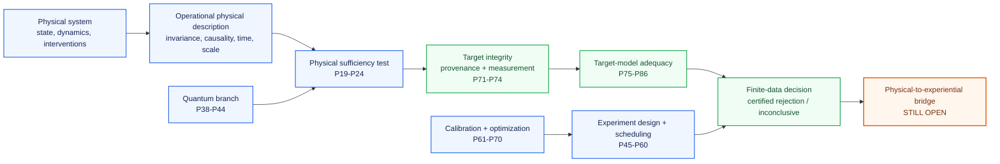

# Start Here: Mathematical Consciousness Bridge

**A reader-first guide to the research question, the 86-result theorem program, the code, and the scientific boundaries.**

If this is your first time in the repository, start on this page before opening the full README or individual theorem files.

> **Central question**
>
> What mathematical and physical conditions would have to be satisfied before a physical description of a system could support a scientifically testable claim about an independently specified experiential target?

The project does **not** begin by choosing a favorite formula for consciousness. It begins by asking what a scientifically defensible bridge claim would have to survive: representation changes, hidden variables, coarse-graining, target circularity, noisy measurement, non-identifiability, finite data, model inadequacy, and uncertified optimization.

The current release is **v0.82.0**. The repository contains **86 proposition-level results**. The current theorem frontier is **P86**. The physical-to-experiential bridge itself remains open.

---

## The project in one picture

The arrows show **logical dependency**, not proof that experience has already been reduced to physics. The repository is strongest when read as a staged test architecture: each layer removes one class of hidden assumption before a stronger claim is allowed.

---

## What has been proved, and what has not

| Status | What it means in this repository |
| --- | --- |
| **Proved mathematical result** | A theorem or proposition follows from explicitly stated assumptions and has a proof record. |
| **Implemented certificate** | The mathematical result has executable code and regression tests. |
| **Finite-data guarantee** | A conclusion includes an explicit uncertainty or confidence statement under the declared sampling model. |
| **Model rejection** | The declared model is incompatible with the data under the stated certificate. It is not a proof that consciousness is nonphysical. |
| **Non-rejection** | The current test did not certify incompatibility. It is not model validation. |
| **Open bridge claim** | The step from a complete physical description to experiential structure has not been established. |

The repository therefore makes a deliberate distinction between **mathematical correctness**, **empirical adequacy**, and **experiential interpretation**. They are not interchangeable.

---

## A ten-minute first read

If you want the shortest coherent path before opening proofs:

1. Read the central question and project-in-one-picture above.
2. Read the six recurring terms on the public [Start Here page](website/start-here.html#reader-primer), or keep the [Glossary](docs/glossary.md) open.
3. Read P19 in plain language as the core sufficiency question.
4. Read P71-P76 as target integrity and model-adequacy safeguards.
5. Read P77-P86 as the progression from finite-data model-set separation to exact shared-parameter parity incompatibility.
6. Finish with the scientific boundaries: rejection of a declared model is not an ontological conclusion about consciousness.

For the presentation rules used across the website and documentation, see the [Reader Experience and Visual Presentation Standard](docs/reader_experience_and_visual_standard.md).

---

## Choose the reading path that fits you

| If you are... | Start with | Then read |
| --- | --- | --- |
| **A first-time reader** | this page | [README](README.md) → [Research Navigation](docs/research_navigation.md) |
| **A mathematician** | [Theorem Roadmap](docs/theorem_roadmap.md) | [Detailed Proposition Record](docs/detailed_proposition_record.md) → proposition proofs → [Equation and Citation Map](docs/equation_and_citation_map.md) |
| **A physicist** | [Bridge Problem](docs/bridge_problem.md) | P11-P19 → [Quantum Foundations and Bridge Test](docs/quantum_foundations_and_bridge_test.md) → P38-P44 |
| **A consciousness researcher** | [Bridge Problem](docs/bridge_problem.md) | P19 → P71-P86 → [Falsification Program](docs/falsification_program.md) |
| **An experimentalist or statistician** | P20-P24 | P39-P44 → P47-P60 → P74-P84 |
| **A software reviewer** | [pyproject.toml](pyproject.toml) | [`src/consciousness_bridge/`](src/consciousness_bridge/) → [`tests/`](tests/) → theorem/provenance files |
| **A visual reader** | [Figure Catalog](docs/figure_catalog.md) | [Visual Atlas](website/visual-atlas.html) → theorem figures linked from the roadmap |

---

## The 86 results, organized by scientific role

The proposition numbers record development order. They do **not** imply that every later proposition depends on every earlier one.

| Results | Scientific function | Why this layer exists |
| --- | --- | --- |
| **P1-P10** | Invariance, identifiability, recovery, robust protocol design | Prevent representation choices or weak experiments from being mistaken for physical facts. |
| **P11-P18** | Intervention-resolved causal, temporal, compositional, and scale-aware physical structure | Make the physical description operational rather than purely descriptive. |
| **P19-P24** | Physical sufficiency, residual tests, refinement, adaptive validity | State and statistically test whether a declared physical descriptor screens off an independently defined target. |
| **P25-P37** | Operational-scale compatibility | Track which physical distinctions survive aggregation, quotienting, and scale changes. |
| **P38-P44** | Quantum operational sufficiency | Test declared quantum descriptions without assuming that quantum completeness is experiential completeness. |
| **P45-P60** | Adaptive experiment design, scheduling, switching, and transition calibration | Collect evidence efficiently while preserving validity. |
| **P61-P70** | Calibration and optimization | Solve downstream finite-resource allocation problems once the scientific witness is already defined. |
| **P71-P74** | Target provenance and target measurement | Prevent circular targets and quantify whether noisy target measurements are identifiable and reliable. |
| **P75-P86** | Target-model adequacy and certified continuous-family separation | Test the declared target-measurement model itself, including finite-data rejection and exact-rational global separation certificates. |

For the complete one-row-per-proposition index, use the [Theorem Roadmap](docs/theorem_roadmap.md) and [Research Navigation](docs/research_navigation.md).

---

## The current frontier: P71-P86 in plain language

The newest branch returns directly to a basic scientific problem: before a physical descriptor can be judged sufficient for an experiential target, how do we know the **target itself** and the **way we measure it** are scientifically defensible?

**P71: target provenance.** If the target is constructed from the same descriptor being tested, successful prediction can be circular by construction. P71 formalizes that failure mode.

**P72: noisy target measurement.** An independently justified latent target can be observed through a noisy channel. Under the declared nondifferential channel model, measurement can attenuate or erase a real witness. It does not license treating a null observation as proof of no latent distinction.

**P73: target-channel identifiability.** Under a restricted nondegenerate three-view binary latent model, the target-measurement channels can be recovered up to the unavoidable global latent-label swap. Two views are insufficient in general.

**P74: finite-sample recovery.** Population identifiability is not enough. P74 adds simultaneous uncertainty bounds and refuses to certify recovery near the inversion singularity.

**P75: model adequacy.** Successfully recovering parameters does not prove the model is right. A fourth binary view creates overidentifying restrictions and a full-law reconstruction audit.

**P76: finite-sample adequacy rejection.** P75 constraints are moved into finite data. A violation must remain separated from zero after uncertainty is propagated before the model is rejected.

**P77: full-law model-set separation.** Instead of checking only selected necessary constraints, P77 asks whether the entire empirical confidence region is separated from the entire declared model family.

**P78: certified continuous separation.** The P75 family is continuous, so an ordinary numerical best fit cannot certify separation from every allowed model. P78 uses exact-rational branch-and-bound to produce a global lower bound.

**P79: certified sampling radius.** The statistical side of the rejection inequality also needs the correct numerical direction. P79 gives an exact-rational upper certificate for the sampling radius.

**P80: simplex-coupled tightening.** P78 cellwise intervals ignore the fact that probabilities must sum to one. P80 retains normalization inside each box relaxation and therefore cannot weaken the P78 lower bound.

**P81: projection-event tightening.** P80 still omits exact constraints on marginal and projected event probabilities implied by a parameter box. P81 adds all nonempty projected binary events and transfers any event mismatch back to a certified full-law L-infinity lower bound. P81 is never weaker than P80 and can be strictly stronger.

The direct P81 proof is [here](docs/proposition_81_projection_event_model_separation.md), with its [equation/provenance record](docs/p81_equation_provenance.md), [implementation](src/consciousness_bridge/projection_event_model_separation.py), and [tests](tests/test_projection_event_model_separation.py).

**P82: exact nested projection contrasts.** Separate projected-event intervals can discard dependence created by shared parameters. P82 computes exact ranges for 256 nested residual events directly from the P75 factorization and can strictly improve P81 while preserving one-sided certification.

**P83: exact projection parity.** P83 adds 22 parity observables on two, three, and four views. The branchwise parity probability has a closed product form whose extrema on a rational box occur at vertices. A strict exact-rational witness has `L82 = 0` but `L83 = 1/16`, showing that parity can expose a dependency constraint invisible to all predeclared P82 events.

**P84: exact joint projection parity.** P84 asks whether separately compatible P83 parity events are jointly realizable by one shared P75 parameter assignment. It audits 220 exact pairwise parity-event contrasts using common response-coordinate vertices. A strict exact-rational witness has `L83 = 0` but `L84 = 1/32`, proving a genuine shared-parameter incompatibility invisible to the complete P83 scalar parity audit.

---

## How to read any theorem in this repository

Each mature proposition is intended to be auditable through the same chain:

**1. Scientific question** → what hidden assumption or failure mode is being addressed?

**2. Declared assumptions** → exactly what mathematical, physical, statistical, or measurement conditions are required?

**3. Formal statement** → what is actually proved?

**4. Proof** → which inequalities, constructions, or identifiability arguments establish it?

**5. Implementation** → does executable code compute the certificate or quantity?

**6. Tests** → are edge cases, exact witnesses, dominance relations, and regression behavior checked?

**7. Provenance** → which ingredients are standard mathematics, which come from prior propositions, and which result is new here?

**8. Scientific boundary** → what stronger conclusion is explicitly *not* justified?

This structure is designed so that a skeptical reader can audit the mathematics without accepting the research motivation in advance.

---

## Key notation

| Symbol | Meaning |
| --- | --- |
| \(\Omega\) | physically admissible state or history space |
| \(T\) | declared physical descriptor |
| \(E\) | independently specified target whose distinctions a bridge claims to explain |
| \(B\) | candidate bridge map, when one is declared |
| \(I(E;\Omega\mid T)\) | residual conditional information used in the stochastic sufficiency formulation |
| \(E^\star\) | latent target before target-measurement noise |
| \(Y\) | observed target measurement |
| \(P75\) model | declared four-view binary latent target-measurement family used in P75-P86 |
| \(L_{78},L_{80},L_{81},L_{82},L_{83},L_{84}\) | progressively tighter certified lower bounds used in continuous-model separation |

Notation is proposition-specific when needed; every proof file defines its local objects explicitly.

---

## Where the strongest claims stop

A reader should leave the repository with five boundaries completely clear:

1. **A failed descriptor is not a proof of nonphysical consciousness.** The descriptor may omit relevant physical information.
2. **A successful fit is not a bridge proof.** It may be circular, underidentified, noisy, or empirically underconstrained.
3. **A latent variable is not automatically consciousness.** Semantic identification requires independent justification.
4. **Quantum completeness is not automatically experiential completeness.** A bridge principle still has to be stated and tested.
5. **The physical-to-experiential bridge remains open.** The repository builds the mathematical obligations and falsification machinery needed to study it rigorously.

---

## Best next links

- **Full scientific narrative:** [README](README.md)
- **Logical theorem dependency structure:** [Theorem Roadmap](docs/theorem_roadmap.md)
- **All research entry points:** [Research Navigation](docs/research_navigation.md)
- **Every proposition in compact form:** [Detailed Proposition Record](docs/detailed_proposition_record.md)
- **Equation-level provenance:** [Equation and Citation Map](docs/equation_and_citation_map.md)
- **All curated visuals:** [Figure Catalog](docs/figure_catalog.md)
- **Reader and visual presentation standard:** [Reader Experience and Visual Presentation Standard](docs/reader_experience_and_visual_standard.md)
- **What would count as failure:** [Falsification Program](docs/falsification_program.md)
- **How to cite the work:** [Citation Guide](CITATION.md)
- **Reproduce everything:** [Reproducibility Guide](docs/reproducibility.md)
- **Contribute or review changes:** [CONTRIBUTING.md](CONTRIBUTING.md)
- **Public visual site:** [website](website/index.html)

---

## Current research status

**Version:** 0.82.0  
**Proposition frontier:** P86
**Proposition-level results:** 86
**Scientific status of the bridge:** open  
**Repository standard:** theorem + proof + implementation + tests + provenance + explicit scientific boundary where applicable

The project is intended to remain difficult to overclaim. A result is strongest when a reader can see not only what it establishes, but also exactly what it leaves unresolved.

## Previous theorem frontier: P84

[P84: Exact Joint Projection-Parity Contrast Certificate](docs/proposition_84_exact_projection_parity_contrast.md) strengthens the complete P83 lower bound with 220 genuinely coupled parity-event contrasts evaluated under one shared P75 parameter assignment. Its exact-rational strict witness has `L83 = 0` and `L84 = 1/32`. The theorem remains a conditional model-distance certificate and does not identify any latent state with consciousness.

Implementation: [`joint_projection_parity_contrast_separation.py`](src/consciousness_bridge/joint_projection_parity_contrast_separation.py). Tests: [`test_joint_projection_parity_contrast_separation.py`](tests/test_joint_projection_parity_contrast_separation.py). Provenance: [`p84_equation_provenance.md`](docs/p84_equation_provenance.md).

## Previous theorem frontier: P85

P85 is the previous documented theorem frontier. It strengthens P84 by testing exact signed functionals of three distinct canonical even-parity observables under one shared P75 parameter assignment. The exact regression witness has the complete P84 lower bound equal to zero while P85 certifies a full-law L-infinity lower bound of `1/32`.

This remains a conditional model-separation result. The physical-to-experiential bridge itself remains open.

- [P85 proof](docs/proposition_85_exact_triple_projection_parity_functional.md)
- [P85 equation provenance](docs/p85_equation_provenance.md)
- [P85 source](src/consciousness_bridge/triple_projection_parity_functional_separation.py)
- [P85 tests](tests/test_triple_projection_parity_functional_separation.py)
- [P85 figure](docs/figures/p85_exact_triple_projection_parity_functional.svg)

## Current frontier: P86

P86 is the current documented theorem frontier. It tests 10,560 exact minimally weighted four-event parity functionals with primitive coefficient magnitudes `{1,1,1,2}` under one shared P75 parameter assignment. The strict exact-rational witness has the complete `L85 = 0` certificate while P86 gives `L86 = 1/192`.

This is a stronger conditional model-separation certificate, not an identification of consciousness. The physical-to-experiential bridge remains open.

- [P86 proof](docs/proposition_86_exact_minimally_weighted_quad_projection_parity_functional.md)
- [P86 equation provenance](docs/p86_equation_provenance.md)
- [P86 source](src/consciousness_bridge/weighted_quad_projection_parity_functional_separation.py)
- [P86 tests](tests/test_weighted_quad_projection_parity_functional_separation.py)
- [P86 figure](docs/figures/p86_exact_minimally_weighted_quad_projection_parity.svg)
