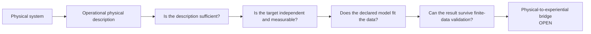
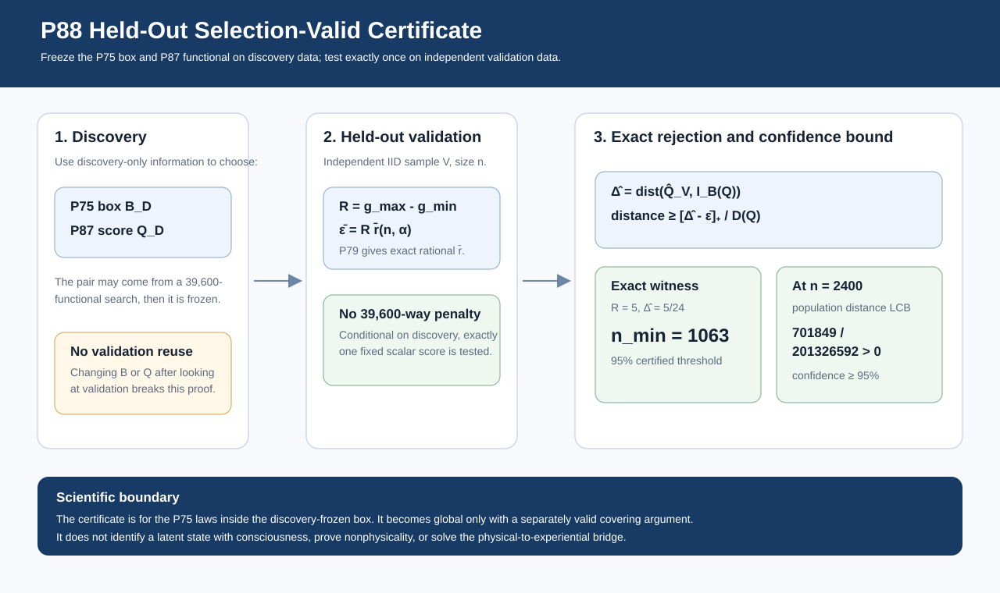

# Start Here: Mathematical Consciousness Bridge

**A short guided introduction to the question, the evidence, and the boundaries of the research.**

> ## The central question
>
> **What would have to be true before a physical description of a system could support a scientifically testable claim about experience?**

The project does not start by choosing a preferred formula for consciousness. It starts one step earlier: by asking what any proposed bridge from physical description to experience would have to demonstrate before the claim could be treated as scientifically meaningful.

That means separating questions that are often blended together. Is the physical description well defined? Is the experience-related target independent rather than circular? Can that target be measured reliably? Is the measurement model identifiable? Does the declared model actually fit the observations? Can finite-data evidence survive statistical uncertainty, numerical error, and selection effects?

The current formal release is **v0.82.0**. The repository contains **88 proposition-level results**, with **P88** as the current theorem frontier. The physical-to-experiential bridge itself remains **open**.

---

## The idea in one picture

The arrows show a scientific dependency, not a completed reduction of experience to physics. Each layer removes one possible source of false confidence before the next claim is allowed.

---

## Three ideas that organize the whole repository

### 1. A physical description can be useful without being sufficient

A map can be excellent for one purpose and still omit information needed for another. In the same way, a physical descriptor may predict many observations while still losing a distinction that matters to an independently defined target.

This motivates the core sufficiency question developed around [P19](docs/proposition_19_fundamental_physical_sufficiency.md).

### 2. The target must not be built from the answer

If an experience-related target is constructed from the same physical descriptor being tested, successful prediction can become circular by design. The target and its measurement therefore need their own scientific justification.

This is the focus of the target-integrity path beginning with [P71](docs/proposition_71_target_provenance_noncircularity.md).

### 3. A model should be able to fail

Compatibility is weaker than explanation. The repository therefore develops exact and finite-sample tests that can expose when a declared model cannot reproduce the observed law under its stated assumptions.

The current model-adequacy path runs from [P75 through P88](docs/research_traceability_index.md#target-side-research-frontier-p71-p88).

---

## What has actually been established?

The 88 results form a staged research program rather than one giant theorem. They cover five broad jobs:

| Scientific job | What it asks | Where to enter |
| --- | --- | --- |
| Define the physical description | What structure is invariant, identifiable, causal, temporal, and scale-aware? | [Research Architecture](docs/research_architecture.md) |
| Test physical sufficiency | Does the descriptor preserve the distinctions required by an independent target? | [P19](docs/proposition_19_fundamental_physical_sufficiency.md) |
| Protect target integrity | Is the target independent, measurable, identifiable, and recoverable? | [P71-P74](docs/research_traceability_index.md#target-integrity-and-measurement-p71-p74) |
| Test model adequacy | Can the declared target-measurement model reproduce the observed distribution? | [P75-P87](docs/research_traceability_index.md#model-adequacy-and-exact-separation-p75-p87) |
| Validate selected evidence | Can a discovery-selected incompatibility survive independent held-out data? | [P88](docs/proposition_88_heldout_selected_parity_functional_certification.md) |

You do **not** need to read 88 proofs in order. The proposition numbers preserve the research record; the reader paths above preserve the scientific story.

---

## The current frontier: P88

P87 can search a large exact family of parity-based functionals and find a strong incompatibility for a declared P75 parameter box. P88 asks what happens next: **can that discovery survive fresh data without pretending the search never happened?**

P88 uses a simple discipline. Discovery data may choose the box and the functional. That pair is then frozen. An independent validation sample is used only once to test the frozen choice.

For the stored exact witness, with `n = 2400` held-out observations and `alpha = 0.05`, the certificate gives a positive lower-confidence bound on distance from the P75 laws inside the frozen box. The exact P79-certified minimum held-out sample size for the stored gap is **1063**; 1062 is insufficient under the same certificate settings.

**Scientific boundary:** P88 is a box-specific finite-sample rejection theorem under genuine discovery/validation independence. It does not identify the P75 latent state with consciousness, prove that consciousness is nonphysical, validate an alternative ontology, or close the physical-to-experiential bridge.

### Audit P88 directly

[Theorem](docs/proposition_88_heldout_selected_parity_functional_certification.md) · [Equation provenance](docs/p88_equation_provenance.md) · [Implementation](src/consciousness_bridge/heldout_selected_parity_functional_certification.py) · [Tests](tests/test_heldout_selected_parity_functional_certification.py) · [Figure](docs/figures/p88_heldout_selected_parity_functional_certification.svg) · [Reproduce](docs/reproducibility.md)

---

## Choose how deep you want to go

| If you want... | Go here |
| --- | --- |
| A visual overview of the scientific layers | [Research Architecture](docs/research_architecture.md) |
| A question-by-question path through the frontier | [Research Traceability Index](docs/research_traceability_index.md) |
| The full dependency structure | [Theorem Roadmap](docs/theorem_roadmap.md) |
| Every proposition in compact technical form | [Detailed Proposition Record](docs/detailed_proposition_record.md) |
| Equation and method provenance | [Equation and Citation Map](docs/equation_and_citation_map.md) |
| All curated visuals | [Figure Catalog](docs/figure_catalog.md) |
| The empirical failure conditions | [Falsification Program](docs/falsification_program.md) |
| Reproducible code and verification | [Reproducibility Guide](docs/reproducibility.md) |
| Terminology | [Glossary](docs/glossary.md) |

---

## How to read a technical result

Every mature result should be auditable through the same chain:

**scientific question → assumptions → theorem → proof → implementation → tests → provenance → scientific boundary**

If you only want the idea, stop after the scientific question and result. If you want to audit the work, keep following the links until you reach the proof, source, and tests.

The repository follows the [Reader-First Publication Page Standard](docs/publication_page_standard.md) so deeper rigor remains available without overwhelming the first read.

---

## The boundaries matter as much as the results

The repository deliberately keeps these distinctions visible:

- A failed physical descriptor is not proof that consciousness is nonphysical.
- A latent variable is not automatically consciousness.
- A model that is not rejected is not therefore validated.
- A box-specific rejection is not a global rejection without a valid covering argument.
- A mathematically correct theorem does not make its empirical assumptions true in nature.
- The physical-to-experiential bridge remains open.

The goal is not to make the strongest possible claim. It is to make every claim precise enough that another researcher can see exactly why it follows, exactly what it depends on, and exactly where it stops.

---

## Continue from here

**New to the project:** [Research Architecture](docs/research_architecture.md)

**Interested in the newest result:** [P88 held-out certification](docs/proposition_88_heldout_selected_parity_functional_certification.md)

**Looking for a specific artifact:** [Research Traceability Index](docs/research_traceability_index.md)

**Ready for the full mathematics:** [Theorem Roadmap](docs/theorem_roadmap.md)

**Want to reproduce everything:** [Reproducibility Guide](docs/reproducibility.md)

---

**Formal release:** v0.82.0  
**Current theorem frontier:** P88  
**Proposition-level results:** 88  
**Physical-to-experiential bridge:** Open
