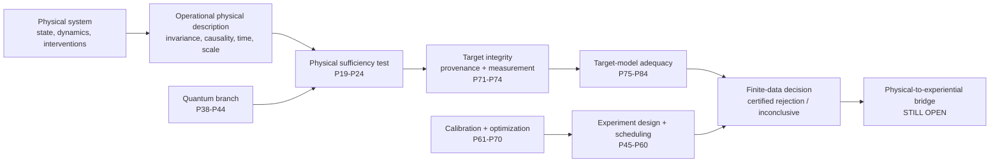

# Start Here: Mathematical Consciousness Bridge

**A reader-first guide to the research question, the 84-result theorem program, the code, and the scientific boundaries.**

If this is your first time in the repository, start on this page before opening the full README or individual theorem files.

> **Central question**
>
> What mathematical and physical conditions would have to be satisfied before a physical description of a system could support a scientifically testable claim about an independently specified experiential target?

The project does **not** begin by choosing a favorite formula for consciousness. It begins by asking what a scientifically defensible bridge claim would have to survive: representation changes, hidden variables, coarse-graining, target circularity, noisy measurement, non-identifiability, finite data, model inadequacy, and uncertified optimization.

The current release is **v0.82.0**. The repository contains **84 proposition-level results**. The current theorem frontier is **P84**. The physical-to-experiential bridge itself remains open.

---

## The project in one picture

The arrows show logical dependency, not proof that experience has already been reduced to physics. The repository is strongest when read as a staged test architecture: each layer removes one class of hidden assumption before a stronger claim is allowed.

---

## What has been proved, and what has not

| Status | Meaning in this repository |
| --- | --- |
| **Proved mathematical result** | A theorem follows from explicitly stated assumptions and has a proof record. |
| **Implemented certificate** | The theorem has executable code and regression tests. |
| **Finite-data guarantee** | A conclusion includes explicit uncertainty under the declared sampling model. |
| **Model rejection** | The declared model is incompatible with the data under the stated certificate. This is not proof that consciousness is nonphysical. |
| **Non-rejection** | The current test did not certify incompatibility. This is not model validation. |
| **Open bridge claim** | The step from physical description to experiential structure has not been established. |

The repository deliberately separates **mathematical correctness**, **empirical adequacy**, and **experiential interpretation**. They are not interchangeable.

---

## Choose the reading path that fits you

| If you are... | Start with | Then read |
| --- | --- | --- |
| **A first-time reader** | this page | [README](README.md) -> [Research Navigation](docs/research_navigation.md) |
| **A mathematician** | [Theorem Roadmap](docs/theorem_roadmap.md) | [Detailed Proposition Record](docs/detailed_proposition_record.md) -> proofs -> [Equation and Citation Map](docs/equation_and_citation_map.md) |
| **A physicist** | [Bridge Problem](docs/bridge_problem.md) | P11-P19 -> [Quantum Foundations and Bridge Test](docs/quantum_foundations_and_bridge_test.md) -> P38-P44 |
| **A consciousness researcher** | [Bridge Problem](docs/bridge_problem.md) | P19 -> P71-P84 -> [Falsification Program](docs/falsification_program.md) |
| **An experimentalist or statistician** | P20-P24 | P39-P44 -> P47-P60 -> P74-P84 |
| **A software reviewer** | [pyproject.toml](pyproject.toml) | [`src/consciousness_bridge/`](src/consciousness_bridge/) -> [`tests/`](tests/) -> theorem/provenance files |
| **A visual reader** | [Figure Catalog](docs/figure_catalog.md) | [Visual Atlas](website/visual-atlas.html) -> theorem figures |

---

## The 84 results, organized by scientific role

The proposition numbers record development order. They do **not** imply that every later proposition depends on every earlier one.

| Results | Scientific function | Why this layer exists |
| --- | --- | --- |
| **P1-P10** | Invariance, identifiability, recovery, robust protocol design | Prevent representation choices or weak experiments from being mistaken for physical facts. |
| **P11-P18** | Intervention-resolved causal, temporal, compositional, and scale-aware physical structure | Make the physical description operational rather than purely descriptive. |
| **P19-P24** | Physical sufficiency, residual tests, refinement, adaptive validity | Test whether a declared physical descriptor screens off an independently defined target. |
| **P25-P37** | Operational-scale compatibility | Track which physical distinctions survive aggregation, quotienting, and scale changes. |
| **P38-P44** | Quantum operational sufficiency | Test declared quantum descriptions without assuming that quantum completeness is experiential completeness. |
| **P45-P60** | Adaptive experiment design, scheduling, switching, and transition calibration | Collect evidence efficiently while preserving validity. |
| **P61-P70** | Calibration and optimization | Solve downstream finite-resource allocation problems once the scientific witness is declared. |
| **P71-P74** | Target provenance and target measurement | Prevent circular targets and quantify whether noisy target measurements are identifiable and reliable. |
| **P75-P84** | Target-model adequacy and certified continuous-family separation | Test the declared target-measurement model itself, including exact-rational global lower certificates and shared-parameter compatibility. |

For the complete one-row-per-proposition index, use the [Theorem Roadmap](docs/theorem_roadmap.md) and [Detailed Proposition Record](docs/detailed_proposition_record.md).

---

## The current frontier: P71-P84 in plain language

The newest branch returns directly to a basic scientific problem: before a physical descriptor can be judged sufficient for an experiential target, how do we know the **target itself**, the **way it is measured**, and the **measurement model used to interpret the data** are scientifically defensible?

**P71: target provenance.** If the target is constructed from the same descriptor being tested, successful prediction can be circular by construction.

**P72: noisy target measurement.** Under the declared nondifferential channel model, measurement can attenuate or erase a real witness. A null observation is not automatically evidence of no latent distinction.

**P73: target-channel identifiability.** Under a restricted nondegenerate three-view binary latent model, target-measurement channels can be recovered up to the unavoidable global latent-label swap. Two views are insufficient in general.

**P74: finite-sample recovery.** Population identifiability is not enough. P74 adds simultaneous uncertainty bounds and refuses to certify recovery near the inversion singularity.

**P75: model adequacy.** Successfully recovering parameters does not prove the model is right. A fourth binary view creates overidentifying restrictions and a full-law reconstruction audit.

**P76: finite-sample adequacy rejection.** A violation must remain separated from zero after uncertainty is propagated before the model is rejected.

**P77: full-law model-set separation.** P77 asks whether the complete empirical confidence region is separated from the complete declared model family.

**P78: certified continuous separation.** The P75 family is continuous, so an ordinary numerical best fit cannot certify separation from every allowed model. P78 uses exact-rational branch-and-bound to produce a global lower bound.

**P79: certified sampling radius.** The statistical side of the rejection inequality also needs the correct numerical direction. P79 gives an exact-rational upper certificate for the sampling radius.

**P80: simplex-coupled tightening.** P80 retains probability normalization inside each box relaxation and therefore cannot weaken the P78 lower bound.

**P81: projection-event tightening.** P81 adds exact projected binary-event ranges and transfers event mismatch to a certified full-law L-infinity lower bound.

**P82: exact nested projection contrasts.** P82 keeps common-parameter structure for 256 nested residual events and has a strict witness improving P81 from `1/16` to `1/12`.

**P83: exact projection parity.** P83 adds 22 parity observables on two, three, and four views. Its strict exact-rational witness has `L82 = 0` and `L83 = 1/16`.

**P84: exact joint projection-parity contrast.** P84 asks whether pairs of P83 parity observables can be produced by one shared P75 response-parameter assignment. It tests 220 genuinely coupled contrasts using exact common-endpoint multi-affine extremization. The strict exact-rational witness has `L83 = 0` but `L84 = 1/32`, so separate P83 feasibility does not imply joint parameter feasibility.

Read the full P84 proof in [docs/proposition_84_exact_joint_projection_parity_contrast.md](docs/proposition_84_exact_joint_projection_parity_contrast.md), the [P84 equation and provenance record](docs/p84_equation_provenance.md), the [implementation](src/consciousness_bridge/joint_projection_parity_contrast_separation.py), and the [regression tests](tests/test_joint_projection_parity_contrast_separation.py).

---

## How to read any theorem in this repository

Each mature proposition is intended to be auditable through the same chain:

**1. Scientific question** -> what hidden assumption or failure mode is being addressed?

**2. Declared assumptions** -> exactly what mathematical, physical, statistical, or measurement conditions are required?

**3. Formal statement** -> what is actually proved?

**4. Proof** -> which inequalities, constructions, or identifiability arguments establish it?

**5. Implementation** -> does executable code compute the certificate or quantity?

**6. Tests** -> are edge cases, exact witnesses, dominance relations, and regression behavior checked?

**7. Provenance** -> which ingredients are standard mathematics, which come from prior propositions, and which result is new here?

**8. Scientific boundary** -> what stronger conclusion is explicitly *not* justified?

---

## Key notation

| Symbol | Meaning |
| --- | --- |
| \(\Omega\) | physically admissible state or history space |
| \(T\) | declared physical descriptor |
| \(E\) | independently specified target whose distinctions a bridge claims to explain |
| \(B\) | candidate bridge map, when one is declared |
| \(I(E;\Omega\mid T)\) | residual conditional information used in the stochastic sufficiency formulation |
| \(E^\star\) | latent target before target-measurement noise |
| \(Y\) | observed target measurement |
| \(P75\) model | declared four-view binary latent target-measurement family used in P75-P84 |
| \(L_{78},L_{80},L_{81},L_{82},L_{83},L_{84}\) | progressively tighter certified lower bounds used in continuous-model separation |

---

## Where the strongest claims stop

A reader should leave the repository with five boundaries completely clear:

1. **A failed descriptor is not proof of nonphysical consciousness.** The descriptor may omit relevant physical information.
2. **A successful fit is not a bridge proof.** It may be circular, underidentified, noisy, or empirically underconstrained.
3. **A latent variable is not automatically consciousness.** Semantic identification requires independent justification.
4. **Quantum completeness is not automatically experiential completeness.** A bridge principle still has to be stated and tested.
5. **The physical-to-experiential bridge remains open.** The repository builds mathematical obligations and falsification machinery for studying it rigorously.

---

## Best next links

- **Full scientific narrative:** [README](README.md)
- **Logical theorem dependency structure:** [Theorem Roadmap](docs/theorem_roadmap.md)
- **All research entry points:** [Research Navigation](docs/research_navigation.md)
- **Every proposition in compact form:** [Detailed Proposition Record](docs/detailed_proposition_record.md)
- **Equation-level provenance:** [Equation and Citation Map](docs/equation_and_citation_map.md)
- **All curated visuals:** [Figure Catalog](docs/figure_catalog.md)
- **What would count as failure:** [Falsification Program](docs/falsification_program.md)
- **How to cite the work:** [Citation Guide](CITATION.md)
- **Reproduce everything:** [Reproducibility Guide](docs/reproducibility.md)
- **Public visual site:** [website](website/index.html)

---

## Current research status

**Version:** 0.82.0  
**Proposition frontier:** P84  
**Proposition-level results:** 84  
**Scientific status of the bridge:** open  
**Repository standard:** theorem + proof + implementation + tests + provenance + explicit scientific boundary where applicable

## Current theorem frontier: P84

[P84: Exact Joint Projection-Parity Contrast Certificate](docs/proposition_84_exact_joint_projection_parity_contrast.md) strengthens P83 with 220 exact shared-parameter parity contrasts. Its strict witness has `L83 = 0` and `L84 = 1/32`. The theorem remains a conditional model-distance certificate and does not identify any latent state with consciousness.