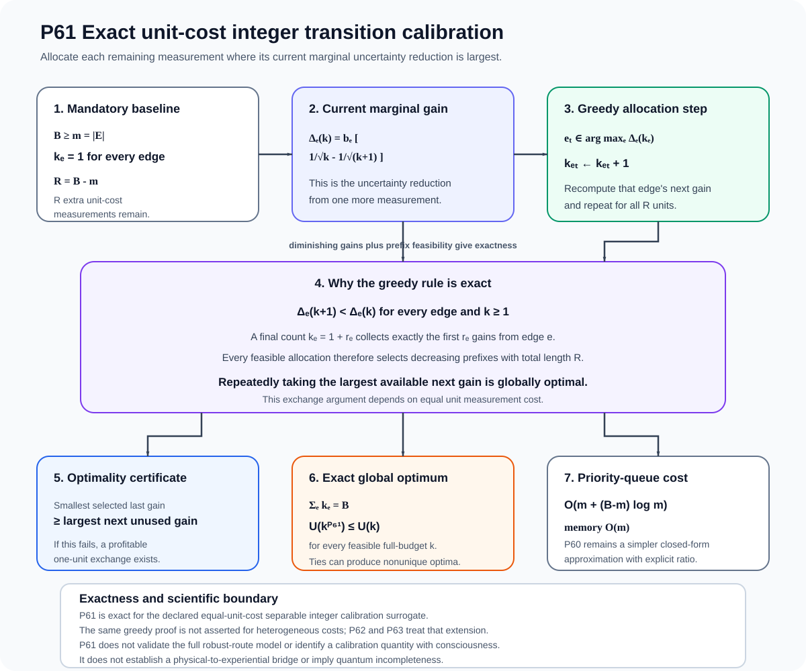
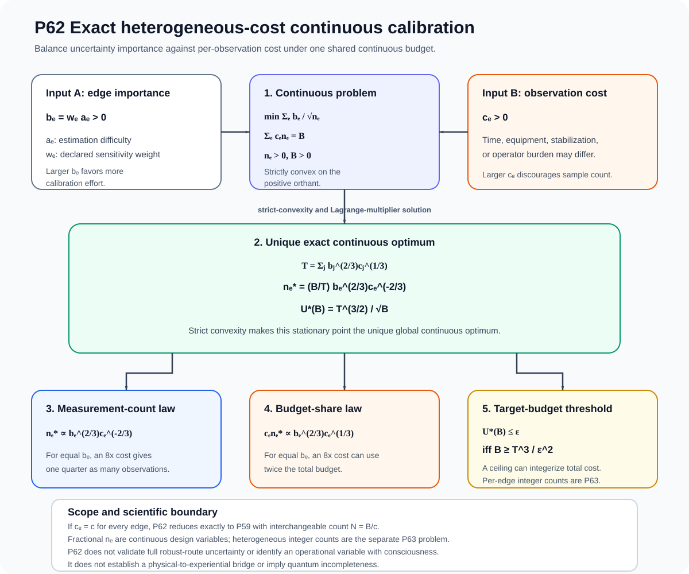
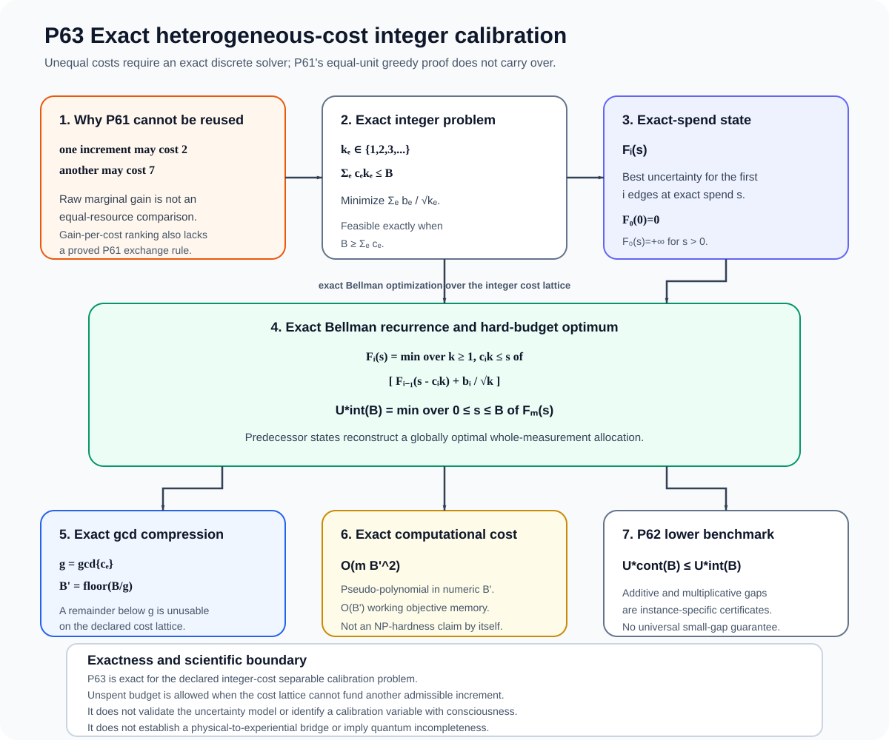
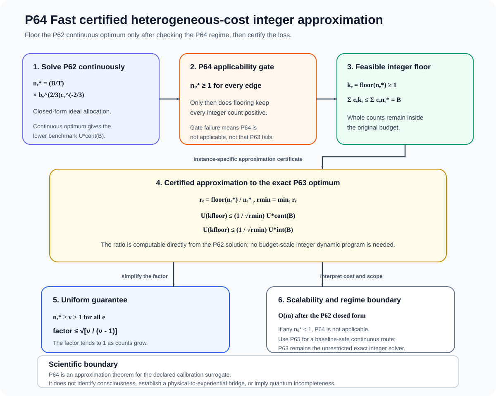
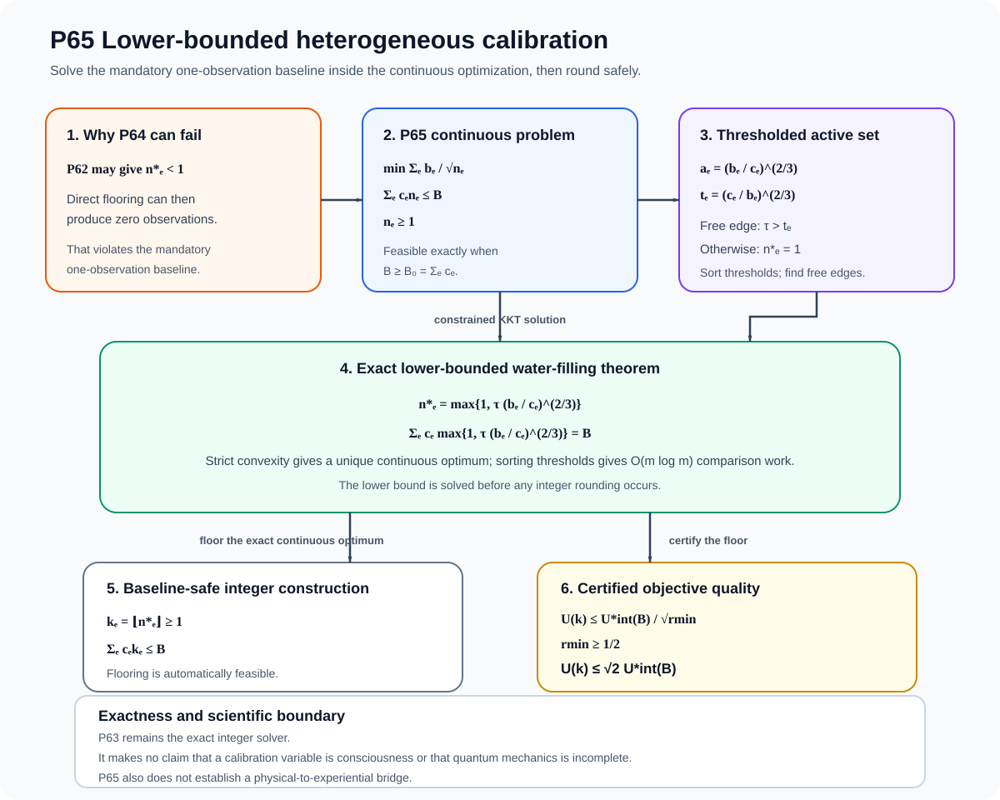
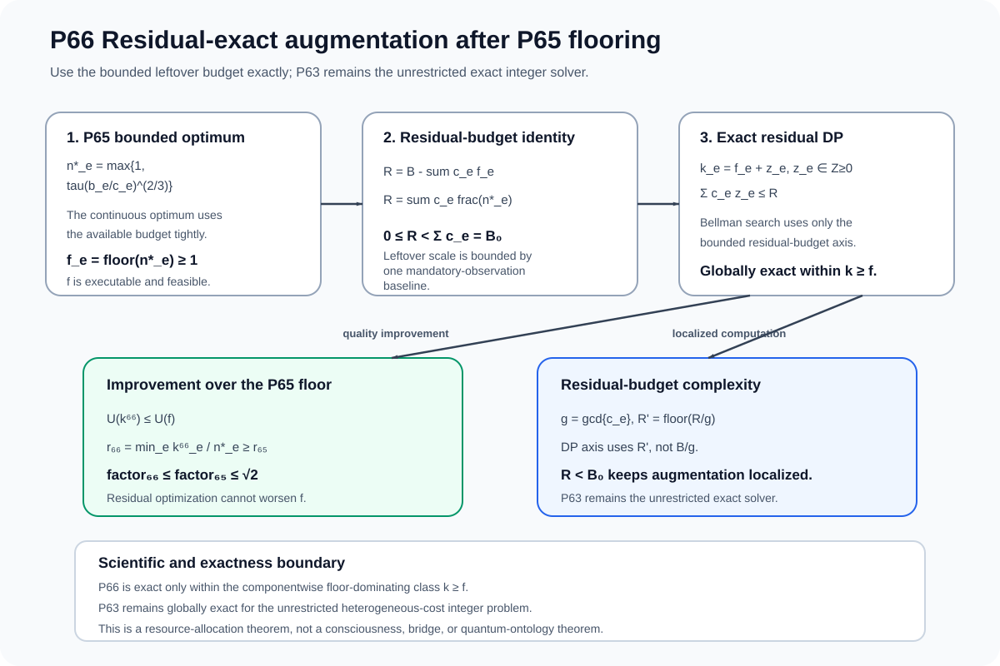
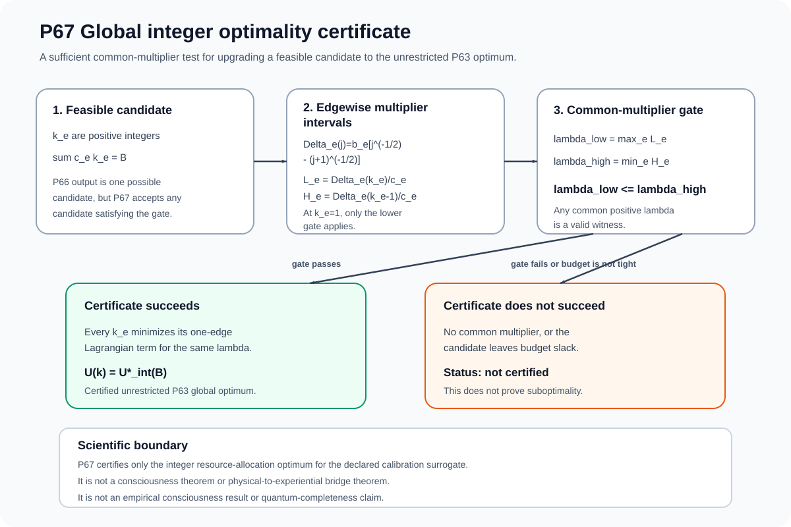
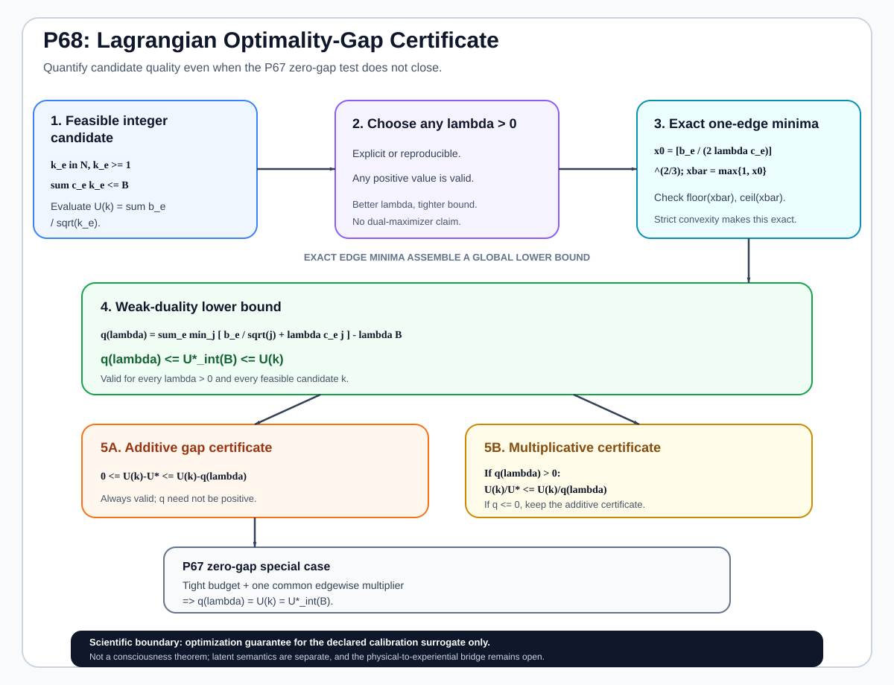
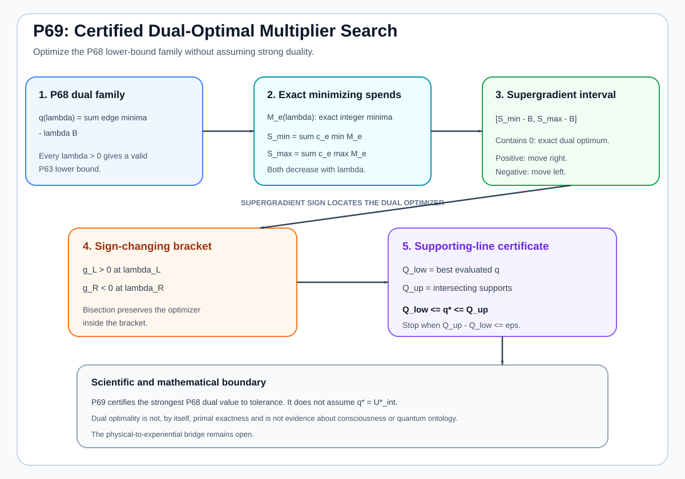

# Calibration and Optimization Frontier: P61-P70

This page contains the detailed downstream calibration and discrete-optimization branch of the Mathematical Consciousness Bridge research program. It is intentionally separate from the main README so the landing page can remain a self-contained scientific introduction rather than becoming a chronological theorem ledger.

The results here solve experimental-design and calibration problems that arise after a bridge test has already specified the physical descriptor, candidate witness family, uncertainty model, and acquisition constraints. They **do not identify consciousness**, strengthen an ontological claim, or turn an optimization objective into a consciousness measure.

The branch begins from the transition-calibration objective introduced in P59-P60 and develops exact, approximate, heterogeneous-cost, lower-bounded, primal-dual, and diagnostic integer optimization results through P70.

---

## Scientific role of this branch

Suppose a robust experiment has a finite set of calibration edges $e\in\mathcal E$. Each edge contributes uncertainty with coefficient $b_e>0$, receives $n_e$ observations, and may have per-observation cost $c_e>0$. A common surrogate uncertainty objective is

$$
U(n)=\sum_{e\in\mathcal E}\frac{b_e}{\sqrt{n_e}}.
$$

For heterogeneous costs and total budget $B$,

$$
\sum_{e\in\mathcal E}c_en_e\le B.
$$

The scientific question is therefore operational:

> Given a declared uncertainty model and finite experimental budget, how should calibration measurements be allocated, and how can a proposed discrete allocation be certified as optimal or near-optimal?

This is a resource-allocation problem inside the experimental layer of the project. It is downstream of the physical-to-experiential bridge logic.

---

# Dependency map

The P61-P70 sequence can be read as a progression from exact equal-cost integer allocation to increasingly realistic heterogeneous and certifiable discrete designs:

$$
\boxed{
\text{P61 exact equal-cost integer allocation}
\to
\text{P62 heterogeneous continuous optimum}
\to
\text{P63 exact heterogeneous integer DP}
\to
\text{P64 fast certified approximation}
\to
\text{P65 lower-bounded continuous optimum}
\to
\text{P66 residual exact augmentation}
\to
\text{P67 global optimality certificate}
\to
\text{P68 dual gap certificate}
\to
\text{P69 certified dual search}
\to
\text{P70 exact gap decomposition}
}
$$

For the complete project-wide dependency structure, see the [Theorem roadmap](theorem_roadmap.md).

---

# P61. Exact integer transition-calibration allocation

P61 closes the equal-cost discrete version of the transition-calibration problem. Starting from one required observation per calibrated edge, each additional observation is assigned according to its current marginal reduction in the inverse-square-root objective.

For an edge with current count $k$,

$$
\Delta_e(k)
=
\frac{b_e}{\sqrt{k}}
-
\frac{b_e}{\sqrt{k+1}}.
$$

Because these marginal gains decrease strictly as $k$ grows, the discrete resource-allocation problem has the diminishing-returns structure required by the exact greedy rule: repeatedly allocate the next whole observation to the edge with the largest current $\Delta_e(k)$.

**Scientific status:** proved for the declared separable equal-cost integer objective; implemented and tested.

**Figure P61.** Exact discrete allocation by descending marginal uncertainty reduction.

- [Proof](proposition_61_exact_integer_transition_calibration.md)
- [Implementation](../src/consciousness_bridge/exact_integer_transition_calibration.py)
- [Tests](../tests/test_exact_integer_transition_calibration.py)

---

# P62. Heterogeneous-cost transition calibration

P62 removes the equal-cost assumption. The continuous problem is

$$
\min_{n_e>0}
\sum_e\frac{b_e}{\sqrt{n_e}}
\quad\text{subject to}\quad
\sum_ec_en_e=B.
$$

The unique optimum satisfies

$$
\boxed{
n_e^*
=
\frac{B\,b_e^{2/3}c_e^{-2/3}}
{\sum_j b_j^{2/3}c_j^{1/3}}
}
$$

and therefore

$$
\boxed{
n_e^*\propto b_e^{2/3}c_e^{-2/3}.}
$$

The associated budget share scales as

$$
c_en_e^*\propto b_e^{2/3}c_e^{1/3}.
$$

Thus high-uncertainty edges receive more observations, while expensive edges receive fewer observations than an equal-cost rule would assign.

**Scientific status:** continuous convex optimum under the declared inverse-square-root uncertainty surrogate.

**Figure P62.** Continuous allocation shifts measurement effort according to both uncertainty coefficient and per-observation cost.

- [Proof](proposition_62_heterogeneous_cost_transition_calibration.md)
- [Implementation](../src/consciousness_bridge/heterogeneous_cost_transition_calibration.py)
- [Tests](../tests/test_heterogeneous_cost_transition_calibration.py)

---

# P63. Exact heterogeneous-cost integer calibration

P63 solves the unequal-cost integer problem exactly when observation costs and the budget are integer-valued. With integer counts $k_e\ge1$,

$$
\min_{k_e\in\mathbb N,\;k_e\ge1}
\sum_e\frac{b_e}{\sqrt{k_e}}
\quad\text{subject to}\quad
\sum_ec_ek_e\le B.
$$

The theorem gives an exact Bellman dynamic program and an exact gcd compression of the cost axis. P62 provides a rigorous continuous lower bound against which the integer optimum can be compared.

This is exact but pseudo-polynomial in the compressed budget, so it becomes the reference solver rather than the only scalable strategy.

**Scientific status:** exact discrete optimization theorem and implementation under integer cost/budget assumptions.

**Figure P63.** Exact dynamic programming over the heterogeneous integer budget.

- [Proof](proposition_63_exact_heterogeneous_integer_calibration.md)
- [Implementation](../src/consciousness_bridge/exact_heterogeneous_integer_calibration.py)
- [Tests](../tests/test_exact_heterogeneous_integer_calibration.py)

---

# P64. Fast certified heterogeneous integer approximation

P64 provides a scalable certified alternative to P63 in the regime where the P62 continuous optimum assigns at least one observation to every edge. The continuous allocation is floored to a feasible integer allocation and compared against the exact P63 optimum through an explicit instance-specific multiplicative certificate.

The role of P64 is computational: it trades exact dynamic programming for a fast allocation while keeping a mathematical performance guarantee.

**Scientific status:** proved approximation guarantee under the declared regime condition.

**Figure P64.** Continuous optimum, integer floor, and certified distance from the exact discrete optimum.

- [Proof](proposition_64_fast_heterogeneous_integer_approximation.md)
- [Implementation](../src/consciousness_bridge/fast_heterogeneous_integer_approximation.py)
- [Tests](../tests/test_fast_heterogeneous_integer_approximation.py)

---

# Proposition 65: lower-bounded heterogeneous calibration

P65 removes the regime restriction that every unconstrained continuous optimum must already exceed one observation. The continuous problem includes the mandatory baseline constraint $n_e\ge1$.

The KKT solution has a thresholded water-filling form,

$$
\boxed{
n_e^*=\max\left\{1,\left(\frac{b_e}{2\lambda c_e}\right)^{2/3}\right\},}
$$

with $\lambda$ chosen so that the active budget constraint is satisfied.

Flooring this baseline-safe continuous optimum gives a feasible integer design and an explicit certificate relative to the exact P63 optimum, including the universal $\sqrt2$ objective guarantee established under the proposition assumptions.

**Scientific status:** proved lower-bounded continuous optimum plus certified integer construction.

**Figure P65.** Mandatory baseline observations create an active-set water-filling structure.

- [Proof](proposition_65_lower_bounded_heterogeneous_calibration.md)
- [Implementation](../src/consciousness_bridge/lower_bounded_heterogeneous_calibration.py)
- [Tests](../tests/test_lower_bounded_heterogeneous_calibration.py)

---

# Proposition 66: residual-exact calibration augmentation

P66 begins from the feasible integer floor produced by P65 and uses the remaining budget exactly inside the class of allocations that dominate that floor componentwise. The residual budget is strictly smaller than the mandatory one-observation baseline cost, which makes a residual dynamic program substantially smaller than solving P63 across the entire original budget.

Let $r_{66}$ denote the residual budget after the P65 floor. P66 uses that small remaining budget to recover the best floor-dominating integer augmentation.

**Scientific status:** exact optimization theorem inside the declared floor-dominating class.

**Figure P66.** A small residual dynamic program extracts the exact improvement available above the certified P65 floor.

- [Proof](proposition_66_residual_exact_calibration_augmentation.md)
- [Implementation](../src/consciousness_bridge/residual_exact_calibration_augmentation.py)
- [Tests](../tests/test_residual_exact_calibration_augmentation.py)

---

# Proposition 67: global integer optimality certificate

P67 asks a different question: rather than solving the integer problem again, can a proposed feasible allocation be certified as globally optimal?

Using the discrete marginal reductions $\Delta_e(j)$, P67 gives a sufficient common-multiplier condition. If a budget-tight integer allocation admits a multiplier $\lambda$ that lies in the required marginal interval for every edge, weak duality proves that the candidate is also a global optimum of the unrestricted P63 integer problem.

The important distinction is logical: failure to find such a multiplier does **not** prove suboptimality. P67 is a sufficient certificate, not a necessary characterization in every instance.

**Scientific status:** proved sufficient global-optimality certificate.

**Figure P67.** A common multiplier aligns all edgewise discrete marginal intervals and closes the primal-dual certificate.

- [Proof](proposition_67_global_integer_optimality_certificate.md)
- [Implementation](../src/consciousness_bridge/global_integer_optimality_certificate.py)
- [Tests](../tests/test_global_integer_optimality_certificate.py)

---

# Proposition 68: Lagrangian optimality gap certificate

P68 provides a quantitative fallback when the zero-gap P67 certificate is unavailable. For $\lambda>0$, define the Lagrangian dual lower bound

$$
q(\lambda)
=
-\lambda B
+
\sum_e
\min_{j\ge1}
\left[
\frac{b_e}{\sqrt{j}}
+
\lambda c_ej
\right].
$$

For every feasible integer candidate $k$,

$$
\boxed{q(\lambda)\le U^*\le U(k),}
$$

so

$$
\boxed{0\le U(k)-U^*\le U(k)-q(\lambda).}
$$

The right-hand side is a rigorous additive optimality-gap certificate. P67 is recovered when that certified gap is zero.

**Scientific status:** proved dual lower bound and candidate optimality-gap certificate.

**Figure P68.** A feasible primal value and a Lagrangian lower bound bracket the unknown exact integer optimum.

- [Proof](proposition_68_lagrangian_optimality_gap.md)
- [Implementation](../src/consciousness_bridge/lagrangian_optimality_gap.py)
- [Tests](../tests/test_lagrangian_optimality_gap.py)

---

# Proposition 69: certified dual-optimal multiplier search

P69 optimizes the P68 lower-bound family itself. The dual function $q(\lambda)$ is concave, and its exact supergradient interval is determined by the budget slack of the edgewise Lagrangian minimizers. This produces a monotone one-dimensional search for the strongest evaluated dual certificate.

The search maintains explicit lower and upper support bounds

$$
\boxed{Q_{\rm low}\le q^*\le Q_{\rm up},}
$$

so the algorithm certifies how close the best evaluated multiplier is to the strongest value available within the declared P68 dual family.

No claim of strong duality is required. The result improves the certificate family while keeping the distinction between the dual optimum and the primal integer optimum explicit.

**Scientific status:** proved concavity, supergradient characterization, and certified one-dimensional dual search.

**Figure P69.** Supporting lines and monotone multiplier search bracket the best achievable P68 dual lower bound.

- [Proof](proposition_69_dual_optimal_multiplier.md)
- [Implementation](../src/consciousness_bridge/dual_optimal_multiplier.py)
- [Tests](../tests/test_dual_optimal_multiplier.py)

---

# Proposition 70: exact primal-dual gap decomposition

P70 makes the P68-P69 certificate diagnostic rather than opaque. For a feasible integer candidate $k$ and multiplier $\lambda>0$, define the edgewise Lagrangian regret

$$
r_e(k_e;\lambda)
=
\left[
\frac{b_e}{\sqrt{k_e}}
+
\lambda c_ek_e
\right]
-
\min_{j\ge1}
\left[
\frac{b_e}{\sqrt{j}}
+
\lambda c_ej
\right].
$$

Each $r_e(k_e;\lambda)\ge0$. P70 proves the exact decomposition

$$
\boxed{
U(k)-q(\lambda)
=
\sum_e r_e(k_e;\lambda)
+
\lambda\left(B-\sum_ec_ek_e\right).
}
$$

The total candidate-to-dual gap therefore has two transparent sources:

1. **edgewise Lagrangian regret**, showing which coordinates fail to minimize their local Lagrangian term;
2. **unused-budget penalty**, showing how much certificate slack comes from not exhausting the available budget.

If the decomposition is zero, every edgewise regret is zero and the budget is tight, recovering the P67 sufficient global-optimality conditions.

**Scientific status:** proved exact identity under the declared integer calibration model; implemented and tested.

**Figure P70.** The scalar optimality certificate is decomposed into local edge regrets plus unused-budget slack, making the remaining suboptimality diagnosis explicit.

- [Proof](proposition_70_primal_dual_gap_decomposition.md)
- [Implementation](../src/consciousness_bridge/primal_dual_gap_decomposition.py)
- [Tests](../tests/test_primal_dual_gap_decomposition.py)

---

# P61-P70 audit table

| Result | Optimization layer | Main mathematical contribution | Proof | Figure | Code | Tests |
| --- | --- | --- | --- | --- | --- | --- |
| **P61 exact integer calibration** | Equal-cost integer | Exact greedy optimum from diminishing marginal gains | [P61](proposition_61_exact_integer_transition_calibration.md) | [SVG](figures/p61_exact_integer_transition_calibration.svg) | [code](../src/consciousness_bridge/exact_integer_transition_calibration.py) | [tests](../tests/test_exact_integer_transition_calibration.py) |
| **P62 heterogeneous-cost calibration** | Unequal-cost continuous | Closed-form cost-weighted optimum | [P62](proposition_62_heterogeneous_cost_transition_calibration.md) | [SVG](figures/p62_heterogeneous_cost_transition_calibration.svg) | [code](../src/consciousness_bridge/heterogeneous_cost_transition_calibration.py) | [tests](../tests/test_heterogeneous_cost_transition_calibration.py) |
| **P63 exact unequal-cost integer calibration** | Unequal-cost integer | Exact Bellman DP and gcd compression | [P63](proposition_63_exact_heterogeneous_integer_calibration.md) | [SVG](figures/p63_exact_heterogeneous_integer_calibration.svg) | [code](../src/consciousness_bridge/exact_heterogeneous_integer_calibration.py) | [tests](../tests/test_exact_heterogeneous_integer_calibration.py) |
| **P64 fast certified integer approximation** | Unequal-cost integer | Fast floor-based approximation with certificate | [P64](proposition_64_fast_heterogeneous_integer_approximation.md) | [SVG](figures/p64_fast_heterogeneous_integer_approximation.svg) | [code](../src/consciousness_bridge/fast_heterogeneous_integer_approximation.py) | [tests](../tests/test_fast_heterogeneous_integer_approximation.py) |
| **Proposition 65: lower-bounded heterogeneous calibration** | Baseline-constrained continuous/integer | Water-filling active set and certified floor | [P65](proposition_65_lower_bounded_heterogeneous_calibration.md) | [SVG](figures/p65_lower_bounded_heterogeneous_calibration.svg) | [code](../src/consciousness_bridge/lower_bounded_heterogeneous_calibration.py) | [tests](../tests/test_lower_bounded_heterogeneous_calibration.py) |
| **Proposition 66: residual-exact calibration augmentation** | Residual integer | Exact floor-dominating residual DP | [P66](proposition_66_residual_exact_calibration_augmentation.md) | [SVG](figures/p66_residual_exact_calibration_augmentation.svg) | [code](../src/consciousness_bridge/residual_exact_calibration_augmentation.py) | [tests](../tests/test_residual_exact_calibration_augmentation.py) |
| **Proposition 67: global integer optimality certificate** | Certificate | Common-multiplier sufficient optimum condition | [P67](proposition_67_global_integer_optimality_certificate.md) | [SVG](figures/p67_global_integer_optimality_certificate.svg) | [code](../src/consciousness_bridge/global_integer_optimality_certificate.py) | [tests](../tests/test_global_integer_optimality_certificate.py) |
| **Proposition 68: Lagrangian optimality gap certificate** | Dual certificate | Rigorous lower bound and additive candidate gap | [P68](proposition_68_lagrangian_optimality_gap.md) | [SVG](figures/p68_lagrangian_optimality_gap.svg) | [code](../src/consciousness_bridge/lagrangian_optimality_gap.py) | [tests](../tests/test_lagrangian_optimality_gap.py) |
| **Proposition 69: certified dual-optimal multiplier search** | Dual optimization | Concave one-dimensional certified search | [P69](proposition_69_dual_optimal_multiplier.md) | [SVG](figures/p69_dual_optimal_multiplier.svg) | [code](../src/consciousness_bridge/dual_optimal_multiplier.py) | [tests](../tests/test_dual_optimal_multiplier.py) |
| **Proposition 70: exact primal-dual gap decomposition** | Diagnostic certificate | Exact decomposition into local regret and unused-budget penalty | [P70](proposition_70_primal_dual_gap_decomposition.md) | [SVG](figures/p70_primal_dual_gap_decomposition.svg) | [code](../src/consciousness_bridge/primal_dual_gap_decomposition.py) | [tests](../tests/test_primal_dual_gap_decomposition.py) |

---

# Interpretation boundary

These optimization results tell us how to allocate experimental resources and how to certify a discrete calibration design. They do not answer the physical-to-experiential bridge problem by themselves.

The logical order is:

$$
\text{bridge hypothesis}
\to
\text{discriminating experiment}
\to
\text{uncertainty model}
\to
\text{calibration objective}
\to
\text{P61-P70 optimization}.
$$

If the bridge hypothesis, target definition, physical descriptor, or uncertainty model changes, the calibration problem may also change. The optimization branch therefore remains subordinate to the scientific experiment it is designed to support.

---

# Related project pages

- [Main scientific study](../README.md)
- [Detailed P1-P70 proposition record](detailed_proposition_record.md)
- [Theorem roadmap](theorem_roadmap.md)
- [Research navigation](research_navigation.md)
- [Equation and citation map](equation_and_citation_map.md)
- [Falsification program](falsification_program.md)
