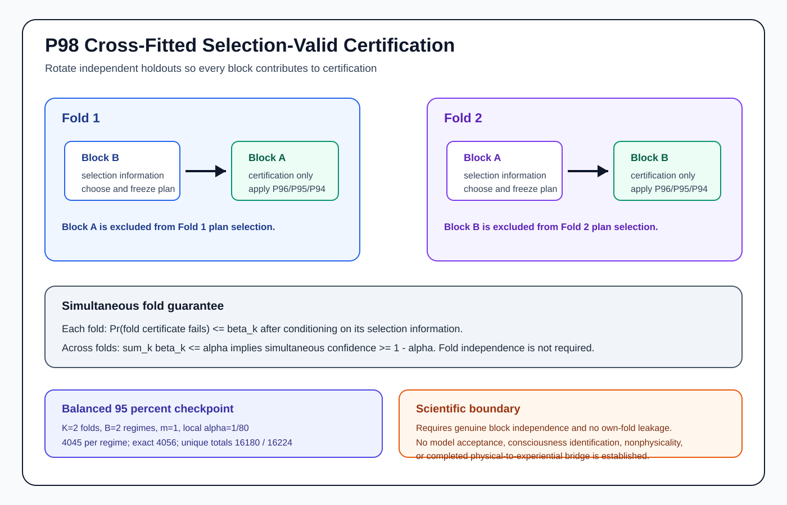

# Figure provenance and regeneration

`docs/figures/` is the canonical visual archive for the Mathematical
Consciousness Bridge research program. The repository distinguishes generated
computational atlases from source-controlled theorem and architecture diagrams
because they have different scientific meanings.

## Generated computational atlases

```text
docs/figures/quantitative/
docs/figures/quantum/
```

Regenerate and validate them with:

```bash
python scripts/generate_all_figures.py
```

## Source-controlled theorem and architecture figures

SVGs stored directly in this directory communicate theorem structure,
assumptions, inequalities, dependencies, or scientific boundaries. They are
validated as SVG documents and enriched with accessible `<title>` and `<desc>`
metadata. They are not reclassified as empirical evidence simply because they
are visual.

## Current frontier: P98



Canonical current-frontier figure: `p98_cross_fitted_selection_valid_certification.svg`

Recent exact frontier figures:

- `p95_drift_aware_stratified_sign_coherence.svg`
- `p96_selection_valid_holdout_stratification.svg`
- `p97_simultaneous_candidate_family_selection.svg`
- `p98_cross_fitted_selection_valid_certification.svg`

The GitHub-facing [`figures/`](../../figures/) gateway and its SHA-256
[`manifest.json`](../../figures/manifest.json) are deterministically synchronized
from this canonical tree by `scripts/sync_figure_publication.py`.

## Validation without regeneration

```bash
python scripts/generate_all_figures.py --validate-only
python scripts/sync_figure_publication.py --check
```

For the curated reader-facing index, see [`docs/figure_catalog.md`](../figure_catalog.md).
For complete setup instructions, see [`docs/reproducibility.md`](../reproducibility.md).

## Scientific boundary

A successful figure workflow proves that the declared generation and validation
path reproduced successfully. It does not turn a theorem illustration, synthetic
benchmark, or model calculation into empirical evidence about consciousness.
