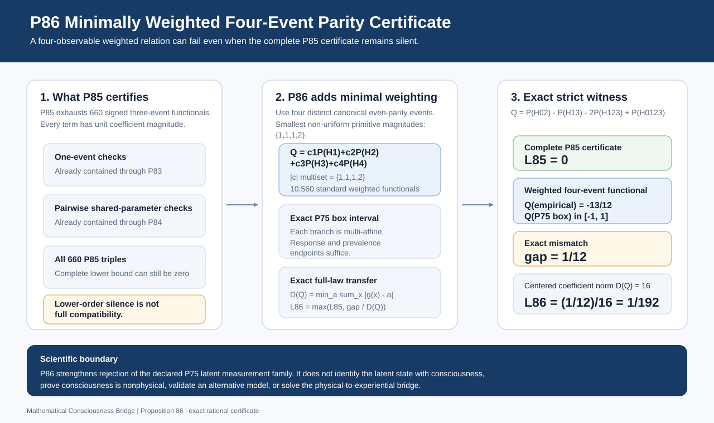

# Figure provenance and regeneration

`docs/figures/` is the canonical visual archive for the Mathematical
Consciousness Bridge research program. The repository distinguishes generated
computational atlases from source-controlled theorem and architecture diagrams
because they have different scientific meanings.

## Generated computational atlases

```text
docs/figures/quantitative/
docs/figures/quantum/
```

Regenerate and validate them with:

```bash
python scripts/generate_all_figures.py
```

The canonical generators are `scripts/generate_quantitative_atlas.py` and
`scripts/generate_quantum_foundations_atlas.py`. Their JSON manifests are
validated against the generated SVG sets.

## Source-controlled theorem and architecture figures

SVGs stored directly in this directory communicate theorem structure,
assumptions, inequalities, dependencies, or scientific boundaries. They are
validated as SVG documents and enriched with accessible `<title>` and `<desc>`
metadata. They are not reclassified as empirical evidence simply because they
are visual.

## Current frontier: P86



Canonical current-frontier figure: `p86_exact_minimally_weighted_quad_projection_parity.svg`

Recent exact frontier figures:

- `p83_exact_projection_parity.svg`
- `p84_exact_joint_projection_parity_contrast.svg`
- `p85_exact_triple_projection_parity_functional.svg`
- `p86_exact_minimally_weighted_quad_projection_parity.svg`

The GitHub-facing [`figures/`](../../figures/) gateway and its SHA-256
[`manifest.json`](../../figures/manifest.json) are deterministically synchronized
from this canonical tree by `scripts/sync_figure_publication.py`.

## Validation without regeneration

```bash
python scripts/generate_all_figures.py --validate-only
python scripts/sync_figure_publication.py --check
```

The `.github/workflows/figures.yml` workflow regenerates the computational
atlases, validates byte-identical reproducibility, checks figure-publication
synchronization, runs repository verification, and uploads generated figure
artifacts.

For the curated reader-facing index, see [`docs/figure_catalog.md`](../figure_catalog.md).
For complete setup instructions, see [`docs/reproducibility.md`](../reproducibility.md).

## Scientific boundary

A successful figure workflow proves that the declared generation and validation
path reproduced successfully. It does not turn a theorem illustration, synthetic
benchmark, or model calculation into empirical evidence about consciousness.
