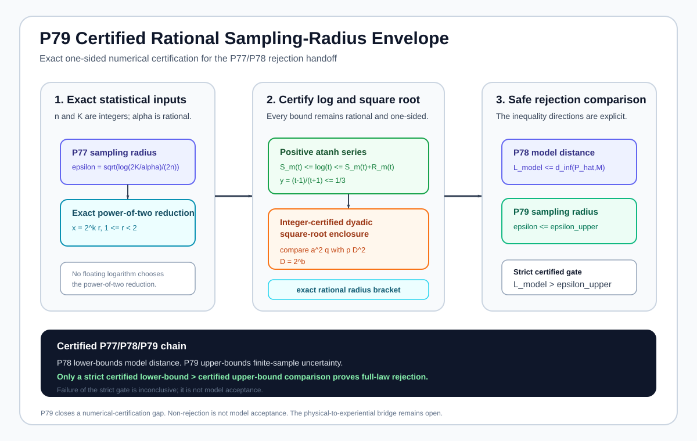
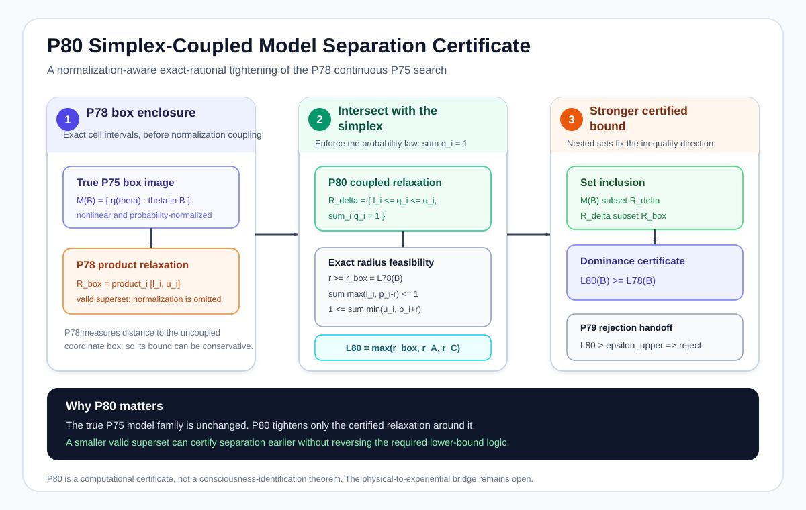

# Theorem Roadmap

This roadmap records the proved mathematical chain and the open route toward a scientifically meaningful physical-to-experiential bridge. It is organized by **logical dependency**, not by development date.

The current documented theorem frontier is **P84**. The proposition record runs from **P1 through P84 with explicit dependency branches**. P71-P84 return to the core P19 bridge-sufficiency lineage; they do not extend the P61-P70 calibration branch.

## 1. Scientific dependency map

\[
\boxed{
\begin{aligned}
&\text{P1-P10: invariance, identifiability, recovery, finite-data foundations}\\
&\Downarrow\\
&\text{P11-P18: intervention-resolved, temporal, compositional, scale-aware physics}\\
&\Downarrow\\
&\text{P19-P24: physical sufficiency, residuals, refinement, adaptive validity}\\
&\Downarrow\\
&\text{P71: target provenance must not impose the bridge}\\
&\Downarrow\\
&\text{P72: noisy target observation must preserve the claimed target distinction}\\
&\Downarrow\\
&\text{P73: target-channel stability can be identified under a declared three-view model}\\
&\Downarrow\\
&\text{P74: finite data can certify or refuse that channel recovery}\\
&\Downarrow\\
&\text{P75: the target-measurement model must face overidentifying adequacy tests}\\
&\Downarrow\\
&\text{P76: finite data must separate adequacy failure from sampling noise}\\
&\Downarrow\\
&\text{P77: full-law confidence regions must be separated from the complete declared model set}\\
&\Downarrow\\
&\text{P78: continuous P75 model distance must be lower-bounded globally and certifiably}\\
&\Downarrow\\
&\text{P79: the sampling-radius side of the rejection gate must have certified numerical direction}\\
&\Downarrow\\
&\text{P80: probability-simplex coupling tightens the continuous-family box certificate}\\
&\Downarrow\\
&\text{P81: projected-event constraints tighten the same certified model-distance lower bound}\\
&\Downarrow\\
&\text{P82: exact nested residual-event constraints tighten P81 while preserving certification}\\
&\Downarrow\\
&\text{P83: projection-parity constraints expose additional exact dependence structure}\\
&\Downarrow\\
&\text{P84: joint parity contrasts test shared-parameter compatibility across P83 observables}
\end{aligned}
}
\]

Separate but connected branches refine the physical representation and experimental machinery:

\[
\boxed{
\begin{aligned}
&\text{P25-P37: operational scale compatibility},\\
&\text{P38-P44: quantum operational sufficiency and regularity-aware tests},\\
&\text{P45-P60: adaptive evidence acquisition, scheduling, and calibration setup},\\
&\text{P61-P70: downstream calibration and integer optimization}.
\end{aligned}
}
\]

The proposition number records development order. It does not imply that P81 depends on P70. P81 strengthens P80's box certificate, uses P78's continuous-family construction and the P79 one-sided sampling-radius handoff, and ultimately descends from P77, the P75 continuous target-model family, P19, and the P71-P76 target-side lineage.

## 2. Target-side bridge lineage

### P19: declared physical sufficiency

For a declared physical descriptor \(T\) and independently specified target \(E\), P19 asks whether

\[
E=B\circ T
\]

and, in the finite stochastic formulation, whether

\[
I(E;\Omega\mid T)=0.
\]

A positive conditional-information residual rejects screening-off by the declared descriptor. It does not establish nonphysicality.

### P20-P24: finite data, refinement, selection, and stopping

P20 converts the P19 residual into a finite-sample confidence statement. P21 decomposes residual reduction under descriptor refinement. P22 makes an entire refinement chain simultaneously valid. P23 protects fixed-sample adaptive descriptor selection. P24 extends the guarantee to repeated looks and finite stopping times under the declared finite-alphabet IID model.

### P71: target-provenance non-circularity

If the target is constructed as

\[
E=h(T),
\]

then factorization and zero residual hold by construction. P71 therefore separates a mathematical fit from independent evidential target provenance.

Direct proof: [P71](proposition_71_target_provenance_noncircularity.md).

### P72: noisy target-measurement robustness

Let \(E^\star\) be an independently justified latent target and \(Y\) its observed measurement. Under

\[
Y\perp\!\!\!\perp\Omega\mid(E^\star,T),
\]

P72 proves

\[
\boxed{
I(Y;\Omega\mid T)
\le
I(E^\star;\Omega\mid T).
}
\]

Thus a positive observed population residual transfers to the latent target under the declared measurement model. The converse fails because an erasing measurement channel can hide a real latent residual.

For pairwise target distributions and channel \(K_t\), P72 defines

\[
\gamma_t
=
\inf_{\substack{v\ne0\\\mathbf1^\top v=0}}
\frac{\|K_tv\|_1}{\|v\|_1}
\]

and proves

\[
\boxed{
\gamma_t\operatorname{TV}(p,q)
\le
\operatorname{TV}(K_tp,K_tq)
\le
\operatorname{TV}(p,q).
}
\]

For a binary symmetric target channel, \(\gamma=|1-2\eta|\). P72 also provides a finite categorical target-TV lower confidence bound and a conservative sufficient equal-sample-size condition scaling as \((\gamma_0\Delta_E)^{-2}\).

Direct proof: [P72](proposition_72_target_measurement_channel_robustness.md). Provenance: [P72 equation record](p72_equation_provenance.md). Implementation: [`target_measurement_channel_robustness.py`](../src/consciousness_bridge/target_measurement_channel_robustness.py). Tests: [`test_target_measurement_channel_robustness.py`](../tests/test_target_measurement_channel_robustness.py).

### P73: three-view target-channel identifiability

Fix one physical stratum \(T=t\), let \(S\in\{-1,+1\}\) be a declared binary latent target, and let \(X_1,X_2,X_3\) be binary target views that are conditionally independent given \(S\). Write

\[
\mathbb E[X_j\mid S]=a_j+b_jS.
\]

With interior latent prevalence and nonzero loadings, P73 derives

\[
\boxed{C_{ij}=b_ib_j(1-m^2)}
\]

and

\[
\boxed{M_{123}=-2m(1-m^2)b_1b_2b_3.}
\]

The observable ratio

\[
q=\frac{M_{123}^2}{C_{12}C_{13}C_{23}}
\]

then gives

\[
\boxed{m^2=\frac{q}{q+4},\qquad 1-m^2=\frac4{q+4}.}
\]

Choosing one algebraic loading orientation recovers the three view channels and latent prevalence. The remaining global latent-label swap is an exact model symmetry and cannot be removed without an independent semantic anchor.

For each binary view, the P72 stability coefficient becomes

\[
\boxed{\gamma_j=|b_j|,}
\]

which is invariant under the label swap and is therefore identifiable from the observed three-view law in the declared nondegenerate model. The recovered joint channel also obeys

\[
\boxed{\gamma_{123}\ge\max\{\gamma_1,\gamma_2,\gamma_3\}.}
\]

P73 also gives a constructive two-view no-go result: in the balanced zero-intercept model, the full observed two-view law depends only on \(b_1b_2\), so different individual channel stabilities can produce exactly the same observable distribution.

Direct proof: [P73](proposition_73_target_channel_identifiability.md). Provenance: [P73 equation record](p73_equation_provenance.md). Implementation: [`target_channel_identifiability.py`](../src/consciousness_bridge/target_channel_identifiability.py). Tests: [`test_target_channel_identifiability.py`](../tests/test_target_channel_identifiability.py).

### P74: finite-sample target-channel recovery

P73 is a population inversion. P74 adds an explicit finite-sample layer. From \(n\) IID observed triples, the empirical eight-cell law \(\widehat P\) satisfies one simultaneous Hoeffding event. Defining

\[
\delta_n(\alpha)
=
\min\left\{2,8\sqrt{\frac{\log(16/\alpha)}{2n}}\right\},
\]

P74 proves on that event

\[
\boxed{|\widehat C_{ij}-C_{ij}|\le3\delta_n}
\]

and

\[
\boxed{|\widehat M_{123}-M_{123}|\le13\delta_n.}
\]

The theorem then introduces a finite-data nondegeneracy gate. The P73 inversion is certified only when every absolute covariance confidence interval is bounded away from zero and the covariance sign product is compatible with the P73 model. If the gate fails, the output is "not certified by the current data," not a forced latent estimate.

When the gate passes, P74 propagates the simultaneous event through the P73 formulas to obtain confidence intervals for the latent imbalance, latent variance, the prevalence orbit under global label swapping, all three P72 stability coefficients, the label-invariant products \(b_jm\), the channel offsets, and the full unordered latent-conditioned binary response-probability pairs. It also gives a certified lower bound for joint three-view stability and a conservative sufficient sample-size condition for clearing a known population covariance margin.

Direct proof: [P74](proposition_74_finite_sample_target_channel_recovery.md). Provenance: [P74 equation record](p74_equation_provenance.md). Implementation: [`finite_sample_target_channel_recovery.py`](../src/consciousness_bridge/finite_sample_target_channel_recovery.py). Tests: [`test_finite_sample_target_channel_recovery.py`](../tests/test_finite_sample_target_channel_recovery.py).

### P75: target-model adequacy and four-view overidentification

P73 identifies parameters under a declared three-view conditional-independence model, and P74 certifies that recovery from finite data. P75 asks whether successful recovery also validates that model. It does not.

For \(k\) binary observed views, the full observed law has

\[
d_{\mathrm{obs}}(k)=2^k-1
\]

continuous degrees of freedom, while one binary latent state with \(k\) binary view channels has

\[
d_{\mathrm{model}}(k)=1+2k.
\]

Therefore

\[
\boxed{d_{\mathrm{obs}}(3)=7=d_{\mathrm{model}}(3),}
\]

so the nondegenerate three-view model is generically just-identified. This does not mean every three-view distribution belongs to the real stochastic model; positivity, nondegeneracy, and valid-channel inequalities still matter. It means there is no generic dimension-based reserve of equality constraints after fitting the model.

With a fourth binary view,

\[
\boxed{d_{\mathrm{obs}}(4)=15,\qquad d_{\mathrm{model}}(4)=9,\qquad d_{\mathrm{over}}=6.}
\]

The fourth view therefore creates six generic overidentifying degrees of freedom. Under the declared conditional-independence model, P75 derives

\[
\boxed{C_{12}C_{34}=C_{13}C_{24}=C_{14}C_{23}}
\]

and requires all nondegenerate three-view subsets to recover the same latent-imbalance quantity

\[
\boxed{
q_{ijk}=\frac{M_{ijk}^2}{C_{ij}C_{ik}C_{jk}}=\frac{4m^2}{1-m^2}.
}
\]

It also derives the higher-order consistency relation

\[
\boxed{M_{1234}=(1+q)C_{12}C_{34},}
\]

with the equivalent covariance pairings.

The executable P75 audit does not treat those displayed moments as a complete algebraic characterization. It recovers an anchor P73 triple, infers the fourth binary channel, reconstructs all 16 cells of the four-view observable law, and checks exact population compatibility. A synthetic residual-dependence example is required to fail this full-law reconstruction and the transparent moment diagnostics.

Direct proof: [P75](proposition_75_target_model_adequacy_overidentification.md). Provenance: [P75 equation record](p75_equation_provenance.md). Implementation: [`target_model_adequacy.py`](../src/consciousness_bridge/target_model_adequacy.py). Tests: [`test_target_model_adequacy.py`](../tests/test_target_model_adequacy.py).

### P76: finite-sample target-model adequacy rejection

P75 is a population adequacy theorem. P76 places the empirical sixteen-cell four-view law inside one simultaneous finite-sample event. With

\[
\varepsilon_n(\alpha)=\sqrt{\frac{\log(32/\alpha)}{2n}},
\qquad
\delta_n(\alpha)=\min\{2,16\varepsilon_n(\alpha)\},
\]

all binary raw monomial moments are simultaneously controlled by \(\delta_n\) with probability at least \(1-\alpha\). This gives

\[
\boxed{|\widehat C_{ij}-C_{ij}|\le3\delta_n}
\]

and, for each displayed P75 tetrad residual \(D\),

\[
\boxed{|\widehat D-D|\le12\delta_n.}
\]

Therefore \(|\widehat D|>12\delta_n\) certifies a nonzero population tetrad and rejects the declared P75 model on the same confidence event. P76 also cross-multiplies the P75 equal-\(q\) and fourth-moment conditions into denominator-free polynomial equalities and propagates the shared empirical-law uncertainty through interval arithmetic.

The conclusion is one-sided. Exclusion of zero by any necessary-constraint interval certifies model incompatibility. Failure to exclude zero is inconclusive and is not model acceptance.

Direct proof: [P76](proposition_76_finite_sample_target_model_adequacy.md). Provenance: [P76 equation record](p76_equation_provenance.md). Implementation: [`finite_sample_target_model_adequacy.py`](../src/consciousness_bridge/finite_sample_target_model_adequacy.py). Tests: [`test_finite_sample_target_model_adequacy.py`](../tests/test_finite_sample_target_model_adequacy.py).

### P77: finite-sample full-law model-set separation

P76 provides finite-data rejection through selected necessary P75 polynomial constraints. P77 states the stronger confidence-set inversion criterion for the complete declared observed-law model family. For an alphabet of size \(K\),

\[
\varepsilon_{n,K}(\alpha)=\sqrt{\frac{\log(2K/\alpha)}{2n}},
\qquad
\delta_{n,K}(\alpha)=\min\{2,K\varepsilon_{n,K}(\alpha)\}.
\]

If \(\mathcal C_n(\widehat P)\) is the corresponding simultaneous empirical-law confidence region and \(\mathcal M\) is the declared model set, then

\[
\boxed{\mathcal C_n(\widehat P)\cap\mathcal M=\varnothing
\Longrightarrow P\notin\mathcal M}
\]

with confidence at least \(1-\alpha\). Equivalently, a sound lower bound on distance from \(\widehat P\) to \(\mathcal M\) that exceeds the sampling radius certifies rejection. A numerical candidate model supplies an upper bound on the minimum distance and cannot by itself certify incompatibility of a continuous family.

Direct proof: [P77](proposition_77_full_law_model_set_separation.md). Provenance: [P77 equation record](p77_equation_provenance.md). Implementation: [`full_law_model_set_separation.py`](../src/consciousness_bridge/full_law_model_set_separation.py). Tests: [`test_full_law_model_set_separation.py`](../tests/test_full_law_model_set_separation.py).

### P78: certified continuous separation for the P75 model family

P77 requires a certified lower bound on empirical distance to the complete model family. For the continuous P75 four-view binary latent model, P78 writes the observed-law map as a nine-parameter multi-affine map \(F:[0,1]^9	o\Delta_{15}\). On each parameter box \(B\), exact cell intervals produce

\[
L_\infty(B;\widehat P)
=
\max_x\operatorname{dist}(\widehat P(x),I_x(B))
\le
\inf_{	heta\in B}\|\widehat P-F(	heta)\|_\infty.
\]

For any finite partition \(\mathcal B\) of the full parameter cube,

\[
oxed{L_{\mathcal B}:=\min_{B\in\mathcal B}L_\infty(B;\widehat P)
\le d_\infty(\widehat P,\mathcal M_{4,2}).}
\]

An explicit admissible parameter point provides an upper bound. The cell maps are 1-Lipschitz in parameter \(L^1\), giving

\[
oxed{0\le d_\infty-L_{\mathcal B}\le\eta(\mathcal B).}
\]

The implementation uses exact rational arithmetic for empirical counts and dyadic box refinement. A P77 rejection is certified only when the P78 lower bound exceeds a separately valid upper bound on the P77 sampling radius.

Direct proof: [P78](proposition_78_certified_continuous_model_separation.md). Provenance: [P78 equation record](p78_equation_provenance.md). Implementation: [`certified_continuous_model_separation.py`](../src/consciousness_bridge/certified_continuous_model_separation.py). Tests: [`test_certified_continuous_model_separation.py`](../tests/test_certified_continuous_model_separation.py).

### P79: certified rational sampling-radius envelope

P77 supplies the analytic finite-alphabet sampling radius and P78 supplies a certified lower bound on distance to the continuous P75 model family. P79 makes the remaining comparison numerically one-sided rather than relying on floating-point rounding direction.

For

\[
\varepsilon_{n,K}(\alpha)=\sqrt{\frac{\log(2K/\alpha)}{2n}},
\]

P79 constructs exact rational values satisfying

\[
\boxed{\underline\varepsilon\le\varepsilon_{n,K}(\alpha)\le\overline\varepsilon.}
\]

The strict P77 handoff is certified whenever the P78 lower bound satisfies $L_{\mathrm{model}}>\overline\varepsilon$. Failure of this strict inequality is inconclusive and is not model acceptance.

Direct proof: [P79](proposition_79_certified_sampling_radius.md). Provenance: [P79 equation record](p79_equation_provenance.md). Implementation: [`certified_sampling_radius.py`](../src/consciousness_bridge/certified_sampling_radius.py). Tests: [`test_certified_sampling_radius.py`](../tests/test_certified_sampling_radius.py).

### P80: simplex-coupled continuous P75 separation

P78's exact cell intervals define a Cartesian-product relaxation for each P75 parameter box. P80 intersects those same intervals with the probability-simplex constraint and computes the exact L-infinity distance to the resulting smaller certified superset:

\[
\mathcal R_\Delta(B)
=
\{q:\ell_i(B)\le q_i\le u_i(B),\ \sum_i q_i=1\}.
\]

The set inclusions

\[
\mathcal M(B)\subseteq\mathcal R_\Delta(B)\subseteq\mathcal R_\square(B)
\]

imply

\[
\boxed{L_{80}(B)\ge L_{78}(B)}
\]

while $L_{80}(B)$ remains a valid lower bound on distance to the true P75 box image. Exact radius feasibility combines the P78 coordinatewise threshold $r_\square$ with two rational monotone mass crossings:

\[
\boxed{
r\ge r_\square,
\quad
\sum_i\max(\ell_i,\widehat p_i-r)\le1
\le
\sum_i\min(u_i,\widehat p_i+r).
}
\]

The global active-box minimum is therefore a certified continuous-family lower bound that is never weaker than the P78 bound on the same partition. P79 supplies the independent sampling-radius upper certificate for the strict rejection handoff.

Direct proof: [P80](proposition_80_simplex_coupled_model_separation.md). Provenance: [P80 equation record](p80_equation_provenance.md). Implementation: [`simplex_coupled_model_separation.py`](../src/consciousness_bridge/simplex_coupled_model_separation.py). Tests: [`test_simplex_coupled_model_separation.py`](../tests/test_simplex_coupled_model_separation.py).

### P81: projection-event continuous-family certificate

[P81](proposition_81_projection_event_model_separation.md) continues the P75-P80 target-model adequacy branch. It adds exact parameter-box ranges for all nonempty projected binary events and combines their full-law distance lower bound with P80.

| Result | Depends on | Adds |
| --- | --- | --- |
| [P81](proposition_81_projection_event_model_separation.md) | P75, P77, P78, P79, P80 | Exact projection-event intervals, event-size distance transfer, P81 >= P80 dominance, and strict-improvement witness |

### P82: exact nested projection-contrast certificate

[P82](proposition_82_exact_nested_projection_contrast.md) retains every P81 lower bound and adds exact residual-event constraints from nested cylinder pairs. The direct residual extremization can be strictly tighter than subtracting the separate P81 intervals because it preserves the shared P75 parameter structure.

| Result | Depends on | Adds |
| --- | --- | --- |
| [P82](proposition_82_exact_nested_projection_contrast.md) | P75, P77, P78, P79, P80, P81 | Exact nested-residual intervals, 256 new contrasts, P82 >= P81 dominance, and a strict 1/12 versus 1/16 witness |

## 3. Complete proposition index

| Proposition | Mathematical role | Scientific role | Status |
| --- | --- | --- | --- |
| [P1](proposition_1_representation_invariance.md) | quotient factorization | representation-independent bridge objects | proved |
| [P2](proposition_2_bridge_identifiability.md) | total-variation discriminability | exact theory identifiability | proved |
| [P3](proposition_3_bridge_equivalence_classes.md) | observable quotient | experiment-class equivalence | proved |
| [P4](proposition_4_discriminating_experiment_design.md) | maximin and set cover | adversarial experiment design | proved |
| [P5](proposition_5_feature_sufficiency.md) | feature factorization | exact feature sufficiency | proved |
| [P6](proposition_6_canonical_bridge_signature.md) | canonical quotient | completeness target | proved |
| [P7](proposition_7_experimental_signature_recovery.md) | observable recovery | exact recoverability criterion | proved |
| [P8](proposition_8_robust_signature_recovery.md) | perturbation bounds | finite-error recovery | proved |
| [P9](proposition_9_categorical_sample_complexity.md) | Hoeffding plus union bound | finite trial requirement | proved |
| [P10](proposition_10_robust_experiment_design.md) | robust protocol optimization | nuisance-aware discrimination | proved |
| [P11](proposition_11_intervention_resolved_causal_structure.md) | intervention-response structure | structured physical candidate | proved construction / candidate |
| [P12](proposition_12_component_insufficiency.md) | projection collisions | scalar/component insufficiency | proved no-go |
| [P13](proposition_13_pairwise_component_irredundancy.md) | pairwise projection collisions | component irredundancy | proved |
| [P14](proposition_14_temporal_continuation.md) | quotient temporal metric | representation-invariant continuation | proved |
| [P15](proposition_15_finite_sample_temporal_certification.md) | temporal perturbation bounds | finite-error temporal certification | proved |
| [P16](proposition_16_independent_composition_and_coupling.md) | product-response composition | independence null and coupling | proved |
| [P17](proposition_17_coarse_graining_and_refinement.md) | stochastic-map contraction | information loss under coarse-graining | proved |
| [P18](proposition_18_scale_sufficiency_certification.md) | approximate reconstruction | scale sufficiency | proved |
| [P19](proposition_19_fundamental_physical_sufficiency.md) | factorization, CMI, rank obstruction | declared physical sufficiency | proved |
| [P20](proposition_20_finite_sample_residual_certification.md) | finite CMI confidence interval | finite-data residual certification | proved |
| [P21](proposition_21_descriptor_refinement_residual_persistence.md) | conditional-information chain rule | omitted-physics refinement audit | proved |
| [P22](proposition_22_simultaneous_refinement_chain_certification.md) | shared confidence event | simultaneous refinement certification | proved |
| [P23](proposition_23_adaptive_descriptor_selection_certification.md) | post-selection control | adaptive descriptor choice | proved |
| [P24](proposition_24_anytime_adaptive_refinement_certification.md) | alpha spending | repeated-look validity | proved |
| [P25](proposition_25_directed_influence_scale_certification.md) | influence contraction | directed-influence scale stability | proved |
| [P26](proposition_26_partition_irreducibility_scale_certification.md) | product-null contraction | partition scale stability | proved |
| [P27](proposition_27_partition_lattice_node_aggregation.md) | lattice transport | node-aggregation semantics | proved |
| [P28](proposition_28_intervention_node_aggregation_compatibility.md) | source-label descent | aggregate influence compatibility | proved |
| [P29](proposition_29_response_geometry_node_aggregation.md) | pseudometric transport | response geometry under aggregation | proved |
| [P30](proposition_30_full_p11_scale_compatibility.md) | branch assembly | complete declared P11 scale transport | proved |
| [P31](proposition_31_intervention_quotient_compatibility.md) | intervention quotient | exact label descent | proved |
| [P32](proposition_32_delay_quotient_compatibility.md) | delay quotient | temporal descent | proved |
| [P33](proposition_33_joint_operational_quotient.md) | product quotient | joint intervention-delay descent | proved |
| [P34](proposition_34_joint_p11_operational_scale.md) | scale assembly | complete operational declaration | proved |
| [P35](proposition_35_approximate_directed_influence_operational_quotient.md) | metric perturbation | approximate influence stability | proved |
| [P36](proposition_36_partition_irreducibility_operational_quotient.md) | product-measure perturbation | approximate irreducibility stability | proved |
| [P37](proposition_37_complete_approximate_p11_operational_scale.md) | max-norm assembly | complete approximate P11 certificate | proved |
| [P38](proposition_38_quantum_operational_sufficiency.md) | quantum-state factorization | quantum operational sufficiency | proved conditional theorem |
| [P39](proposition_39_finite_data_quantum_nonfactorization.md) | tomography model-set bounds | finite-data quantum non-factorization | proved |
| [P40](proposition_40_continuous_quantum_region_regularity.md) | regularity obstruction | continuous-region bridge test | proved |
| [P41](proposition_41_trace_ball_quantum_envelope.md) | trace-ball envelope | computable quantum uncertainty | proved |
| [P42](proposition_42_quantum_regular_bridge_sample_complexity.md) | finite IC concentration | quantum-target sample design | proved |
| [P43](proposition_43_optimal_quantum_target_allocation.md) | convex allocation | optimal quantum-target split | proved |
| [P44](proposition_44_pair_adaptive_sample_allocation.md) | simultaneous pair coverage | post-data witness selection | proved |
| [P45](proposition_45_shared_preparation_graph_allocation.md) | shared convex allocation | preparation graph design | proved |
| [P46](proposition_46_budget_constrained_witness_graph.md) | combinatorial optimization | hard-budget witness selection | proved |
| [P47](proposition_47_anytime_sequential_witness_graph.md) | time-uniform graph inference | adaptive sampling and stopping | proved |
| [P48](proposition_48_gap_dependent_stopping_complexity.md) | confidence-sequence inversion | stopping complexity | proved |
| [P49](proposition_49_dyadic_stopping_overhead.md) | dyadic checkpoint geometry | logarithmic certification looks | proved |
| [P50](proposition_50_bounded_starvation_asynchronous_sampling.md) | fairness service bound | asynchronous stopping | proved |
| [P51](proposition_51_heterogeneous_service_rate_stopping.md) | heterogeneous quotas | service-rate stopping | proved |
| [P52](proposition_52_capacity_optimal_service_allocation.md) | minimax service allocation | capacity-optimal sampling | proved |
| [P53](proposition_53_residual_demand_reoptimization.md) | residual reoptimization | dynamic service release | proved |
| [P54](proposition_54_metric_switching_cost_residual_scheduling.md) | Hamiltonian-path reduction | metric switching schedule | proved |
| [P55](proposition_55_pruning_aware_switching_monotonicity.md) | metric shortcutting | pruning-aware cost release | proved |
| [P56](proposition_56_moving_start_metric_reoptimization_stability.md) | start-state perturbation | moving setup stability | proved |
| [P57](proposition_57_switching_metric_perturbation.md) | metric perturbation | switching geometry robustness | proved |
| [P58](proposition_58_finite_data_metric_uncertainty.md) | route envelopes | finite-data switching uncertainty | proved |
| [P59](proposition_59_optimal_transition_calibration.md) | strict convexity and KKT | optimal continuous calibration | proved |
| [P60](proposition_60_integer_transition_calibration.md) | ceiling construction | hard-budget integer calibration | proved |
| [P61](proposition_61_exact_integer_transition_calibration.md) | diminishing returns | exact equal-cost integer calibration | proved |
| [P62](proposition_62_heterogeneous_cost_transition_calibration.md) | heterogeneous KKT allocation | unequal-cost calibration | proved |
| [P63](proposition_63_exact_heterogeneous_integer_calibration.md) | Bellman dynamic program | exact unequal-cost integer calibration | proved |
| [P64](proposition_64_fast_heterogeneous_integer_approximation.md) | floor approximation | scalable certified approximation | proved |
| [P65](proposition_65_lower_bounded_heterogeneous_calibration.md) | active-set water filling | baseline-safe heterogeneous calibration | proved |
| [P66](proposition_66_residual_exact_calibration_augmentation.md) | residual dynamic program | exact floor-dominating augmentation | proved |
| [P67](proposition_67_global_integer_optimality_certificate.md) | common multiplier | global integer optimality certificate | proved |
| [P68](proposition_68_lagrangian_optimality_gap.md) | weak duality | quantitative candidate-gap certificate | proved |
| [P69](proposition_69_dual_optimal_multiplier.md) | concave dual optimization | strongest P68 lower-bound search | proved |
| [P70](proposition_70_primal_dual_gap_decomposition.md) | exact gap identity | certificate attribution | proved primal-dual diagnostic decomposition |
| [P71](proposition_71_target_provenance_noncircularity.md) | descriptor-derived target vacuity | independent target provenance guard | proved |
| [P72](proposition_72_target_measurement_channel_robustness.md) | conditional DPI, TV stability, finite target confidence | noisy target-measurement robustness | proved |
| [P73](proposition_73_target_channel_identifiability.md) | three-view moment inversion and two-view no-go | target-channel stability identifiability under a declared latent model | proved conditional theorem |
| [P74](proposition_74_finite_sample_target_channel_recovery.md) | simultaneous concentration and nonlinear interval propagation | finite-data target-channel recovery with a nondegeneracy gate | proved conditional theorem |
| [P75](proposition_75_target_model_adequacy_overidentification.md) | dimension count, tetrads, cross-triple moments, full-law reconstruction | target-model adequacy and four-view overidentification | proved conditional theorem |
| [P76](proposition_76_finite_sample_target_model_adequacy.md) | sixteen-cell concentration and polynomial interval propagation | finite-sample target-model adequacy rejection | proved conditional theorem |
| [P77](proposition_77_full_law_model_set_separation.md) | confidence-region/model-set separation | finite-sample full-law rejection with certified distance lower bounds | proved conditional theorem |
| [P78](proposition_78_certified_continuous_model_separation.md) | multi-affine box lower bounds and mesh-gap convergence | certified continuous P75 full-law model separation | proved conditional computational theorem |
| [P79](proposition_79_certified_sampling_radius.md) | exact-rational logarithm and dyadic square-root enclosure | one-sided numerical certification of the P77 sampling radius | proved numerical-certification theorem |
| [P80](proposition_80_simplex_coupled_model_separation.md) | probability-simplex interval relaxation and exact rational feasibility crossings | tighter certified continuous P75 full-law model separation | proved conditional computational theorem |
| [P81](proposition_81_projection_event_model_separation.md) | exact projected-event box intervals and event-size distance transfer | never-weaker projection-aware continuous P75 model separation | proved conditional computational theorem |
| [P82](proposition_82_exact_nested_projection_contrast.md) | exact nested residual-event box intervals and event-size distance transfer | never-weaker nested-contrast continuous P75 model separation | proved conditional computational theorem |
| [P83](proposition_83_exact_projection_parity.md) | exact projection-parity box intervals and event-size distance transfer | never-weaker parity-aware continuous P75 model separation | proved conditional computational theorem |
| [P84](proposition_84_exact_projection_parity_contrast.md) | exact joint parity-event contrasts at common response-coordinate vertices | shared-parameter compatibility test that strictly strengthens P83 | proved conditional computational theorem |

## 4. Calibration branch remains separate

The complete P61-P70 derivations, theorem figures, implementations, and tests are maintained on the dedicated [Calibration and Optimization Frontier](calibration_optimization_frontier_p61_p70.md).

The theorem visuals remain permanently available, including:

- `figures/p61_exact_integer_transition_calibration.svg`
- `figures/p62_heterogeneous_cost_transition_calibration.svg`
- `figures/p63_exact_heterogeneous_integer_calibration.svg`
- `figures/p64_fast_heterogeneous_integer_approximation.svg`
- `figures/p65_lower_bounded_heterogeneous_calibration.svg`
- `figures/p66_residual_exact_calibration_augmentation.svg`
- `figures/p67_global_integer_optimality_certificate.svg`
- `figures/p68_lagrangian_optimality_gap.svg`
- `figures/p69_dual_optimal_multiplier.svg`
- `figures/p70_primal_dual_gap_decomposition.svg`

These results optimize downstream experimental resources. They do not define consciousness and do not supply the missing physical-to-experiential bridge law.

## 5. Current open frontier

After P82, the target-side chain has a substantially clearer scientific burden:

1. target provenance must be non-circular relative to the physical descriptor being tested;
2. the target-observation channel must be scientifically defensible and sufficiently informative for the claimed witness;
3. channel reliability must be identified or externally calibrated under a declared measurement model;
4. finite data must resolve the channel far enough from singularity for recovery to be certified;
5. the target-measurement model must survive adequacy tests rather than being accepted because it can be fit;
6. finite data must separate genuine adequacy failure from sampling noise before rejection is claimed;
7. full-law rejection must be defined against the complete declared model family;
8. continuous-family separation must use a certified global lower bound rather than a local optimizer value;
9. the sampling-radius side of the rejection gate must have a certified upper direction; and
10. computational relaxations should retain as much exact probability structure as possible without invalidating the lower-bound direction.

P78 closes the global-lower-bound gap for the specific continuous P75 four-view binary latent family. P79 certifies the one-sided sampling-radius envelope. P80 strengthens the box relaxation by retaining probability normalization. P81 strengthens it again by retaining exact marginal and projected-event constraints implied by each parameter box. P82 then adds exact non-cylinder residual constraints from nested projected events, retaining common-parameter structure that separate event intervals discard. P82 then adds exact non-cylinder residual constraints from nested projected events, retaining common-parameter structure that separate event intervals discard.

The next computational question is therefore not another cosmetic bound. A substantive continuation beyond P82 would retain broader **simultaneous dependence among multiple overlapping events** or introduce a demonstrably tighter exact-rational convex or semialgebraic relaxation while preserving the certified lower-bound direction. Statistical extensions remain open as well, including sharper power analysis and target-view models with residual dependence, shared bias, temporal drift, or learned measurement pipelines.

None of P71-P82 identifies a latent variable with consciousness. None proves that a failed descriptor implies nonphysical consciousness. The physical-to-experiential bridge remains open.

## P83 frontier: exact projection-parity separation

P82 retains common-parameter structure for nested residual events. P83 adds a complementary dependency observable. For selected views $J$ and parity $b$,

\[
H(J,b)=\{x:\bigoplus_{j\in J}x_j=b\},
\]

and P75 conditional independence gives

\[
\boxed{
P_s(H(J,b))
=
\frac{1+(-1)^b\prod_{j\in J}(1-2q_{j,s})}{2}.
}
\]

The product is multi-affine in the selected response coordinates. Exact branch extrema therefore occur at box vertices, and the latent mixture is then affine in prevalence. P83 audits both parities on every two-, three-, and four-view subset, for 22 genuinely new events, and defines

\[
\boxed{L_{83}(B)=\max\{L_{82}(B),L_{\mathrm{par}}(B)\}.}
\]

A strict exact-rational witness fixes one observed channel at Bernoulli one half in both latent branches. Every P75 law in that box then has pair parity one half, while an empirical equal-bit law has parity one. The complete P82 event family remains compatible, giving

\[
\boxed{L_{82}(B)=0<L_{83}(B)=1/16.}
\]

P83 retains the already-proved P78 mesh-width upper certificate for branch-and-bound and the P79 one-sided sampling-radius rejection handoff. It does not claim a new convergence-rate theorem and does not identify the P75 latent state with consciousness.

Direct proof: [P83](proposition_83_exact_projection_parity.md). Provenance: [P83 equation record](p83_equation_provenance.md). Implementation: [`projection_parity_model_separation.py`](../src/consciousness_bridge/projection_parity_model_separation.py). Tests: [`test_projection_parity_model_separation.py`](../tests/test_projection_parity_model_separation.py).

## P84 frontier: exact joint projection-parity contrast separation

P83 tests 22 parity events separately. P84 tests whether pairs of those observables can be realized by the **same** P75 parameter assignment. For two parity events with different view sets, the branchwise probability contrast is multi-affine in the union of their response coordinates, so exact extrema occur at common endpoint vertices. P84 evaluates 220 genuinely coupled standard contrasts and defines

\[
\boxed{L_{84}(B)=\max\{L_{83}(B),L_{\mathrm{joint-parity}}(B)\}.}
\]

An exact-rational strict witness has

\[
\boxed{L_{83}(B)=0<L_{84}(B)=1/32.}
\]

The result proves that separate parity compatibility does not imply joint compatibility with one underlying parameter vector. P84 retains the P78 mesh-width upper certificate and the P79 one-sided sampling-radius rejection gate. It does not identify the P75 latent state with consciousness and does not close the physical-to-experiential bridge.

Direct proof: [P84](proposition_84_exact_projection_parity_contrast.md). Provenance: [P84 equation record](p84_equation_provenance.md). Implementation: [`joint_projection_parity_contrast_separation.py`](../src/consciousness_bridge/joint_projection_parity_contrast_separation.py). Tests: [`test_joint_projection_parity_contrast_separation.py`](../tests/test_joint_projection_parity_contrast_separation.py).
