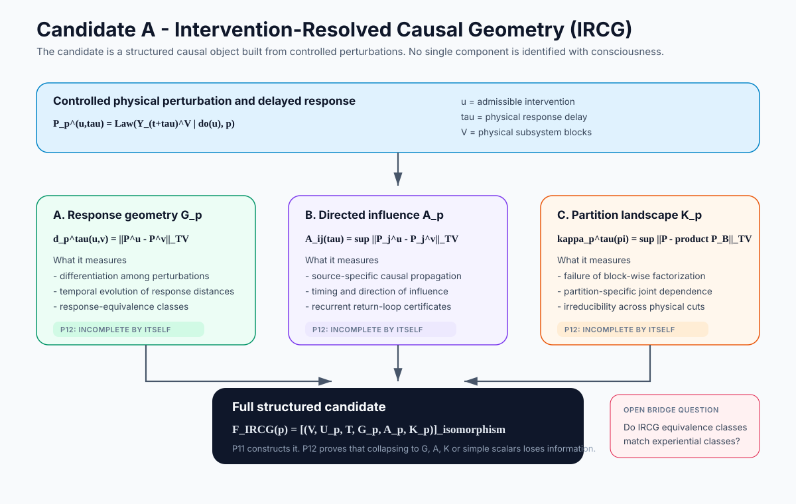

# Visual Research Guide

This guide provides the fastest visual route through the Mathematical Consciousness Bridge program. Every figure is a research diagram: labels correspond to objects, theorems, assumptions, or open problems defined elsewhere in the repository.

## 1. Entire research architecture

Read this first. The project separates physical realization, representation-invariant physical structure, candidate physical signatures, bridge principles, experiential structure, observable predictions, finite-data certification, and falsification.

The key logical distinction is

\[
\boxed{
\text{physical structure}
\neq
\text{experiential interpretation}
}
\]

until an independently justified bridge connects them.

## 2. Theorem dependency map

Propositions 1-10 establish the general mathematical infrastructure. Proposition 11 introduces the first original physical candidate, IRCG. Proposition 12 immediately tests whether simpler projections of IRCG can reconstruct the full object.

## 3. Anatomy of Candidate A: IRCG

IRCG is built from intervention-conditioned response laws

\[
P_p^{u,\tau}
=
\mathcal L(Y_{t+\tau}^{V}\mid do(u),p),
\]

then retains three complementary structures:

\[
\mathcal G_p
\quad
\mathcal A_p
\quad
\mathcal K_p.
\]

They encode response differentiation, directed causal influence, and partition-specific irreducibility respectively.

## 4. Why one component is not enough

Proposition 12 gives explicit realizable collision pairs showing that the complete candidate cannot generally be reconstructed from response geometry alone, partition irreducibility alone, directed marginal influence alone, or simple scalar reductions.

## 5. Universal proof criteria

The project uses twelve criteria to separate a mathematical theorem internal to a framework from a scientifically exposed bridge result. The full statements are in [Universal Consciousness Proof Target](universal_proof_target.md).

## 6. Competing theory families

The project compares contemporary theory families through one common interface

\[
\mathfrak T_j
=
(\mathcal F_j,\mathcal B_j,\mathcal M_j,\Pi_j).
\]

This allows theory-specific physical features, bridge architectures, measurements, and interventions to be compared using the same identifiability and experiment-design theorems.

## 7. Recommended reading order

| Stage | Read | Main question |
| --- | --- | --- |
| 1 | [README](../README.md) | What is the entire program? |
| 2 | [Bridge Problem](bridge_problem.md) | What exactly is missing between physics and experience? |
| 3 | [Physical Foundation](physical_foundation.md) | What counts as a physical system and admissible intervention? |
| 4 | [Theorem Roadmap](theorem_roadmap.md) | What has actually been proved? |
| 5 | [P11 - IRCG](proposition_11_intervention_resolved_causal_geometry.md) | What is the first original candidate physical signature? |
| 6 | [P12 - Component Insufficiency](proposition_12_component_insufficiency.md) | Which simplifications already fail? |
| 7 | [Candidate Theory Families](candidate_theory_families.md) | How are IIT, GNWT, RPT, HOT and predictive families compared? |
| 8 | [Universal Proof Target](universal_proof_target.md) | What would the final theorem-and-evidence package require? |
| 9 | [Equation and Citation Map](equation_and_citation_map.md) | Which equations are original, standard, assumed, or externally sourced? |
| 10 | [Literature Map](literature_map.md) | What role does each cited source play? |

## 8. Reading-status convention

The repository uses the following distinction throughout:

| Label | Meaning |
| --- | --- |
| **Definition** | a mathematical object introduced by the program |
| **Proved** | a theorem derived from declared assumptions |
| **Candidate physical signature** | a physical hypothesis being tested, not an experiential conclusion |
| **Empirical result** | evidence reported by a cited experiment or dataset |
| **Counterexample / no-go** | a declared sufficiency or recoverability claim fails on an explicit construction |
| **Open bridge problem** | an unresolved connection between physical and experiential structure |

This convention is essential for reading the figures correctly.