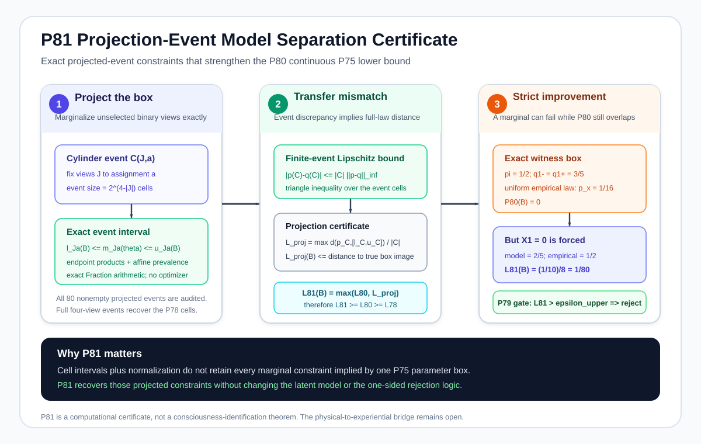
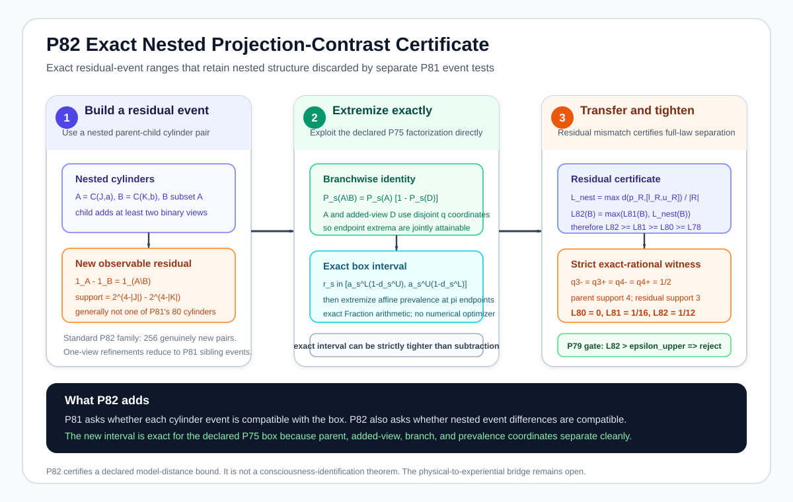
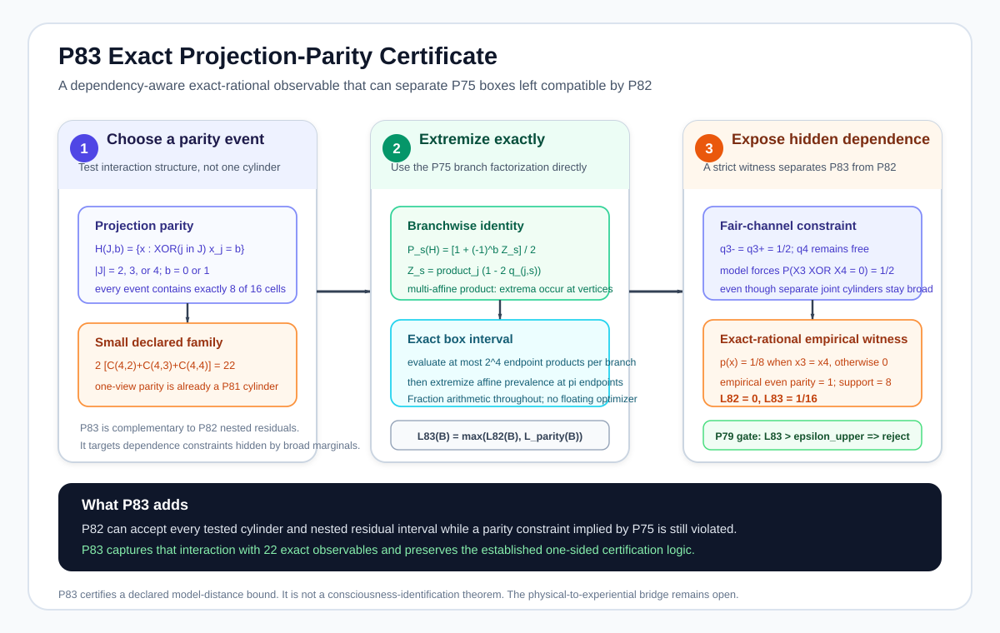
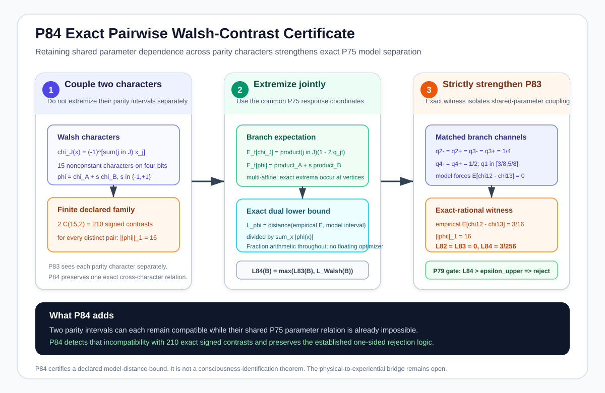

# Current visual frontier: P71-P84

This page is a compact visual entry point for the current target-side research branch.

The branch begins by asking whether the target itself is scientifically valid and measurable, then moves through channel identifiability, finite-sample recovery, model adequacy, full-law separation, and exact continuous-family certification.

## P71-P74: target integrity

### P71: target provenance and non-circularity

A physical-sufficiency test is scientifically informative only if the target is not constructed from the physical descriptor in a way that forces the desired factorization result.

[Open the P71 theorem figure](../docs/figures/p71_target_provenance_noncircularity.svg)

[Read the P71 proposition](../docs/proposition_71_target_provenance_noncircularity.md)

### P72: noisy target measurement

The declared target-observation channel can attenuate or erase a genuine latent distinction. A null observed witness therefore does not automatically imply a null latent witness.

[Open the P72 theorem figure](../docs/figures/p72_noisy_target_measurement.svg)

[Read the P72 proposition](../docs/proposition_72_noisy_target_measurement.md)

### P73: target-channel identifiability

Under the declared conditionally independent binary-view model, three nondegenerate views can identify the latent channel up to a global label swap, while two views are insufficient in general.

[Open the P73 theorem figure](../docs/figures/p73_target_channel_identifiability.svg)

[Read the P73 proposition](../docs/proposition_73_target_channel_identifiability.md)

### P74: finite-sample target-channel recovery

Finite-sample confidence bounds are propagated through the P73 inversion, including an explicit refusal to certify recovery near the covariance singularity.

[Open the P74 theorem figure](../docs/figures/p74_finite_sample_target_channel_recovery.svg)

[Read the P74 proposition](../docs/proposition_74_finite_sample_target_channel_recovery.md)

## P75-P84: target-model adequacy and certified separation

### P75: overidentification and model adequacy

A fourth observed view creates overidentifying restrictions. The model must survive an adequacy audit instead of being accepted simply because parameters can be recovered.


[Read the P75 proposition](../docs/proposition_75_target_model_adequacy_overidentification.md)

### P76: finite-sample adequacy rejection

An apparent population violation becomes a finite-data rejection certificate only when uncertainty is small enough that the violation remains separated from zero.


[Read the P76 proposition](../docs/proposition_76_finite_sample_target_model_adequacy.md)

### P77: full-law model-set separation

The complete empirical confidence region is compared against the complete declared model family. A local optimizer value is not used as a global rejection certificate.


[Read the P77 proposition](../docs/proposition_77_full_law_model_set_separation.md)

### P78: certified continuous-family lower bound

Exact-rational branch-and-bound replaces an uncertified local best fit with a global lower bound on distance to the continuous P75 family.


[Read the P78 proposition](../docs/proposition_78_certified_continuous_model_separation.md)

### P79: certified sampling-radius envelope

The statistical uncertainty side of the rejection gate is given the correct one-sided numerical direction through exact-rational logarithm and square-root enclosures.


[Read the P79 proposition](../docs/proposition_79_certified_sampling_radius.md)

### P80: simplex-coupled model separation

The box relaxation is tightened by retaining probability normalization, so the certified lower bound is never weaker than the P78 independent-cell relaxation.


[Read the P80 proposition](../docs/proposition_80_simplex_coupled_model_separation.md)

### P81: projection-event model separation

P81 retains exact box ranges for all nonempty projected binary events and transfers event mismatch into a certified full-law distance lower bound. The construction is never weaker than P80 and includes a strict-improvement witness.



[Read the P81 proposition](../docs/proposition_81_projection_event_model_separation.md)

[Open the P81 equation provenance](../docs/p81_equation_provenance.md)

[Open the P81 implementation](../src/consciousness_bridge/projection_event_model_separation.py)

[Open the P81 numerical tests](../tests/test_projection_event_model_separation.py)

[Open the P81 figure geometry tests](../tests/test_p81_figure_geometry.py)

### P82: exact nested projection contrasts

P82 preserves shared-parameter dependence for 256 nested residual events rather than subtracting separate projected-event intervals. Its exact witness strengthens P81 from `1/16` to `1/12` on the declared box.



[Read the P82 proposition](../docs/proposition_82_exact_nested_projection_contrast.md)

[Open the P82 equation provenance](../docs/p82_equation_provenance.md)

### P83: exact projection parity

P83 adds 22 parity observables. The branchwise parity probability is an exact multi-affine product transform, so rational box extrema are certified at vertices. A strict witness leaves the entire P82 family compatible while P83 certifies a full-law lower bound of `1/16`.



[Read the P83 proposition](../docs/proposition_83_exact_projection_parity.md)

[Open the P83 equation provenance](../docs/p83_equation_provenance.md)

[Open the P83 implementation](../src/consciousness_bridge/projection_parity_model_separation.py)

[Open the P83 numerical tests](../tests/test_projection_parity_model_separation.py)

### P84: exact pairwise Walsh contrasts

P84 keeps the shared P75 response coordinates inside signed combinations of two Walsh parity characters. It audits 210 predeclared pairwise contrasts. The strict exact-rational witness keeps the complete P82 and P83 certificates at zero while `chi_{1,2} - chi_{1,3}` is forced to zero by the model box and has empirical expectation `3/16`, yielding `L84 = 3/256`.



[Read the P84 proposition](../docs/proposition_84_exact_pairwise_walsh_contrast.md)

[Open the P84 equation provenance](../docs/p84_equation_provenance.md)

[Open the P84 implementation](../src/consciousness_bridge/walsh_contrast_model_separation.py)

[Open the P84 numerical tests](../tests/test_walsh_contrast_model_separation.py)

[Open the P84 figure geometry tests](../tests/test_p84_figure_geometry.py)

## Run the current research stack

From the repository root:

```bash
python -m pytest
python -m ruff check .
python scripts/generate_all_figures.py --validate-only
python scripts/verify_repository.py
```

To regenerate the computational atlases:

```bash
python scripts/generate_all_figures.py
```

The project does not claim that P71-P84 derives consciousness from physics. These results strengthen the methodology required before a physical-to-experiential bridge claim could be treated as scientifically credible. The bridge itself remains open.
