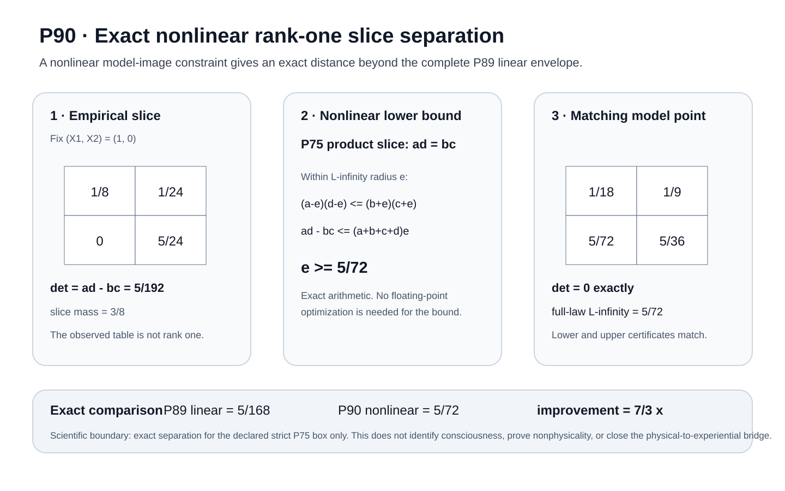

# Current visual frontier: P71-P90

This page is generated from the canonical proposition and figure tree.
It is the compact GitHub-facing visual route through the current target-side branch.

## Current theorem frontier: P90



[Read Proposition 90](../docs/proposition_90_exact_nonlinear_rank_one_separation.md)

[Open P90 equation provenance](../docs/p90_equation_provenance.md)

### Exact P90 nonlinear rank-one witness

P90 moves beyond the complete P89 linear envelope. On the strict box, prevalence is fixed at zero, so the selected two-by-two product-law slice must satisfy ad = bc. Matching exact rational lower and upper certificates prove:

```text
L89 = 5/168 < L90 = 5/72
L90 / L89 = 7/3
empirical determinant residual = 5/192
```

The theorem is exact only for the declared strict single-component P75 box. It does not identify consciousness, establish nonphysicality, or close the physical-to-experiential bridge.

## P71-P90 canonical theorem-figure index

| Proposition | Canonical figure | Proof | Provenance |
| --- | --- | --- | --- |
| P71 | [figure](../docs/figures/p71_target_provenance_noncircularity.svg) | [proof](../docs/proposition_71_target_provenance_noncircularity.md) | N/A |
| P72 | [figure](../docs/figures/p72_target_measurement_channel_robustness.svg) | [proof](../docs/proposition_72_target_measurement_channel_robustness.md) | [equations](../docs/p72_equation_provenance.md) |
| P73 | [figure](../docs/figures/p73_target_channel_identifiability.svg) | [proof](../docs/proposition_73_target_channel_identifiability.md) | [equations](../docs/p73_equation_provenance.md) |
| P74 | [figure](../docs/figures/p74_finite_sample_target_channel_recovery.svg) | [proof](../docs/proposition_74_finite_sample_target_channel_recovery.md) | [equations](../docs/p74_equation_provenance.md) |
| P75 | [figure](../docs/figures/p75_target_model_adequacy_overidentification.svg) | [proof](../docs/proposition_75_target_model_adequacy_overidentification.md) | [equations](../docs/p75_equation_provenance.md) |
| P76 | [figure](../docs/figures/p76_finite_sample_target_model_adequacy.svg) | [proof](../docs/proposition_76_finite_sample_target_model_adequacy.md) | [equations](../docs/p76_equation_provenance.md) |
| P77 | [figure](../docs/figures/p77_full_law_model_set_separation.svg) | [proof](../docs/proposition_77_full_law_model_set_separation.md) | [equations](../docs/p77_equation_provenance.md) |
| P78 | [figure](../docs/figures/p78_certified_continuous_model_separation.svg) | [proof](../docs/proposition_78_certified_continuous_model_separation.md) | [equations](../docs/p78_equation_provenance.md) |
| P79 | [figure](../docs/figures/p79_certified_sampling_radius.svg) | [proof](../docs/proposition_79_certified_sampling_radius.md) | [equations](../docs/p79_equation_provenance.md) |
| P80 | [figure](../docs/figures/p80_simplex_coupled_model_separation.svg) | [proof](../docs/proposition_80_simplex_coupled_model_separation.md) | [equations](../docs/p80_equation_provenance.md) |
| P81 | [figure](../docs/figures/p81_projection_event_model_separation.svg) | [proof](../docs/proposition_81_projection_event_model_separation.md) | [equations](../docs/p81_equation_provenance.md) |
| P82 | [figure](../docs/figures/p82_exact_nested_projection_contrast.svg) | [proof](../docs/proposition_82_exact_nested_projection_contrast.md) | [equations](../docs/p82_equation_provenance.md) |
| P83 | [figure](../docs/figures/p83_exact_projection_parity.svg) | [proof](../docs/proposition_83_exact_projection_parity.md) | [equations](../docs/p83_equation_provenance.md) |
| P84 | [figure](../docs/figures/p84_exact_joint_projection_parity_contrast.svg) | [proof](../docs/proposition_84_exact_projection_parity_contrast.md) | [equations](../docs/p84_equation_provenance.md) |
| P85 | [figure](../docs/figures/p85_exact_triple_projection_parity_functional.svg) | [proof](../docs/proposition_85_exact_triple_projection_parity_functional.md) | [equations](../docs/p85_equation_provenance.md) |
| P86 | [figure](../docs/figures/p86_exact_minimally_weighted_quad_projection_parity.svg) | [proof](../docs/proposition_86_exact_minimally_weighted_quad_projection_parity_functional.md) | [equations](../docs/p86_equation_provenance.md) |
| P87 | [figure](../docs/figures/p87_exact_bounded_primitive_quad_projection_parity.svg) | [proof](../docs/proposition_87_exact_bounded_primitive_quad_projection_parity_functional.md) | [equations](../docs/p87_equation_provenance.md) |
| P88 | [figure](../docs/figures/p88_exact_radius_three_bounded_primitive_quad_projection_parity.svg) | [proof](../docs/proposition_88_exact_radius_three_bounded_primitive_quad_projection_parity_functional.md) | [equations](../docs/p88_equation_provenance.md) |
| P89 | [figure](../docs/figures/p89_complete_linear_parity_duality.svg) | [proof](../docs/proposition_89_complete_linear_parity_duality.md) | [equations](../docs/p89_equation_provenance.md) |
| P90 | [figure](../docs/figures/p90_exact_nonlinear_rank_one_separation.svg) | [proof](../docs/proposition_90_exact_nonlinear_rank_one_separation.md) | [equations](../docs/p90_equation_provenance.md) |

## Reproduce the visual record

```bash
python scripts/generate_all_figures.py
python scripts/sync_figure_publication.py --check
python scripts/verify_repository.py
```

The complete machine-readable SHA-256 inventory is in [`manifest.json`](manifest.json).

## Interpretation boundary

P71-P90 strengthens the methodology for testing a declared physical-to-target model. It does not derive consciousness from physics, prove nonphysicality, or close the physical-to-experiential bridge.
