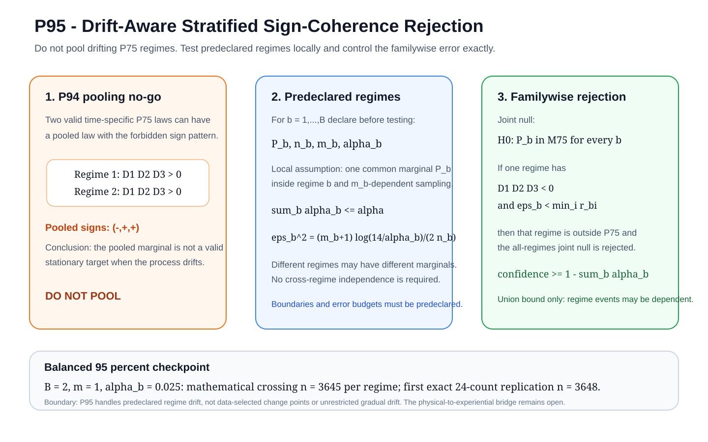

# Visual research gateway

This top-level `figures/` directory is the GitHub-facing entry point for the
visual record of the Mathematical Consciousness Bridge project. The canonical
SVG archive lives in [`docs/figures/`](../docs/figures/); this gateway is derived
from that archive by code so it cannot silently remain on an older proposition.

## Current theorem frontier: P95



Canonical figure: [`p95_drift_aware_stratified_sign_coherence.svg`](../docs/figures/p95_drift_aware_stratified_sign_coherence.svg)
Theorem: [`proposition_95_drift_aware_stratified_sign_coherence.md`](../docs/proposition_95_drift_aware_stratified_sign_coherence.md)
Equation provenance: [`p95_equation_provenance.md`](../docs/p95_equation_provenance.md)

For the full P71-P95 visual progression, open
[`CURRENT_FRONTIER.md`](CURRENT_FRONTIER.md).

## Complete reproducible figure record

[`manifest.json`](manifest.json) is generated from **every SVG under
`docs/figures/`**. Each record contains its canonical path, SHA-256 digest, byte
size, category, SVG title, and description length.

The curated human-readable index remains
[`docs/figure_catalog.md`](../docs/figure_catalog.md), and the browser-facing
atlas is [`website/visual-atlas.html`](../website/visual-atlas.html).

## Reproduce and validate

```bash
python scripts/generate_all_figures.py
python scripts/sync_figure_publication.py --check
python scripts/verify_repository.py
```

## Scientific boundary

Generated atlases, theorem diagrams, and architecture illustrations have
different evidential meanings. A figure is not empirical consciousness evidence
merely because it is visual. Its scientific status comes from the associated
theorem, assumptions, data provenance, tests, and declared evidence class.
