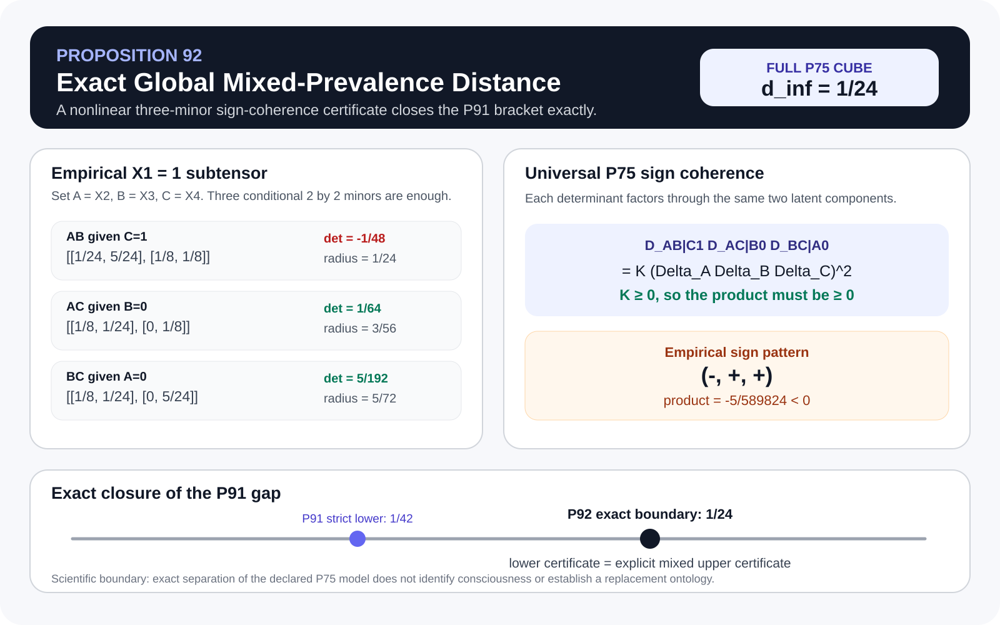
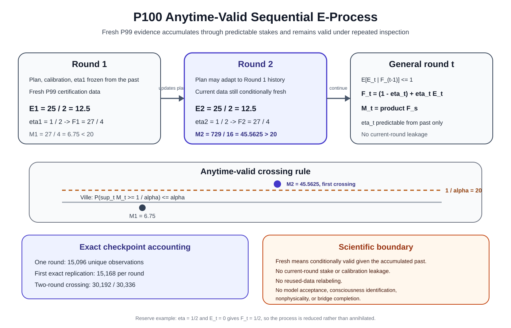

# Testing physical and computational sufficiency in consciousness science: exact model separation and anytime-valid falsification

**Manuscript type:** Research Article  
**Special issue:** Is There More to Consciousness Than Computation?  
**Running title:** Testing sufficiency in consciousness science

**Mahsa Keikha, PhD**  
Connected Care LLC, California, USA  
Correspondence: mahsa@connectioncare.net

## Abstract

Debates about computationalism and implementationism in consciousness science often ask whether a computational, functional, neural, causal, or more complete physical description is sufficient for an independently defined consciousness-related target. The empirical content of such claims is difficult to isolate because a target can be correlated with a descriptor without being determined by it, and because target construction, model selection, repeated testing, and optional stopping can create circular or invalid evidence. We formulate sufficiency as a falsifiable factorization problem. For a declared descriptor \(T\) and independently specified target \(E\), deterministic sufficiency requires \(E=B\circ T\); stochastic sufficiency requires screening-off, \(E\perp\!\!\!\perp\Omega\mid T\). We develop a theorem chain connecting this criterion to non-circular target provenance, quantum-operational specialization, exact continuous model-family separation, finite-sample rejection under dependence and drift, selection-valid cross-fitting, e-value aggregation, and anytime-valid sequential evidence. An exact synthetic four-view example yields global distance \(1/24\) from a declared two-component product-mixture family, and the sequential construction converts fresh certification rounds into a nonnegative supermartingale with Ville-valid optional stopping. The framework does not establish that consciousness is nonphysical, nor does model compatibility validate a theory. Its contribution is a reproducible method for stating what a sufficiency claim predicts, what evidence can reject it, and what remains unresolved after rejection.

**Keywords:** consciousness; computationalism; physical sufficiency; model falsification; e-values; sequential inference

## Significance statement

Claims that consciousness is fixed by computation, neural implementation, causal structure, or a complete physical description should imply testable restrictions on independently obtained target data. This work provides a mathematical route from such restrictions to exact model separation and statistically valid rejection, including protection against circular target construction, model selection, repeated analysis, and optional stopping. The framework is deliberately neutral about whether consciousness is ultimately computational or implementation-dependent. Instead, it specifies what a declared sufficiency hypothesis must predict and what observations would count against that hypothesis. This creates a common falsification language for comparing computational, physical, quantum-operational, and implementation-sensitive models without treating non-rejection as confirmation or model rejection as proof of nonphysical consciousness.

# 1. Introduction

A central dispute in consciousness science concerns what kind of description, if any, is sufficient to determine conscious experience. Computationalist positions assign the decisive role to an abstract computational or functional organization. Implementation-sensitive positions assign an essential role to aspects of the physical realization, such as neural dynamics, causal structure, recurrence, biological organization, or other substrate-dependent properties. Contemporary theories span several points in this space, and adversarial comparisons increasingly emphasize the need for discriminating predictions rather than post hoc accommodation [@sethbayne2022theories; @cogitate2025adversarial]. The unfolding argument makes the related point that causal-structure claims require careful attention to what is operationally distinguishable and what explanatory work a physical realization is actually doing [@doerig2019unfolding].

The mathematical difficulty is not simply to propose another scalar measure of consciousness. It is to state a sufficiency claim sharply enough that it can fail. If a theory says that an abstract computation is sufficient, then two systems matched on the declared computational descriptor should not differ in an independently measured target in a way the theory excludes. If a theory says that a richer physical implementation is sufficient, the same logic applies to that richer descriptor. A failure of a coarse descriptor may therefore favor refinement without implying that no physical description could ever suffice.

This distinction is especially important because correlations between neural variables and consciousness-related measures do not by themselves establish sufficiency. A predictor can be informative while omitting target-relevant variation. Conversely, a target defined from the same variables that are later claimed to explain it can satisfy a factorization relation by construction. A valid test must therefore distinguish the physical descriptor, the measured target, and the interpretation attached to that target.

The research program developed here formalizes this distinction. Let \(\Omega\) denote the underlying system state or preparation, let \(T=T(\Omega)\) be a declared physical or computational descriptor, and let \(E\) be a target defined by an independent measurement procedure. The deterministic sufficiency claim is

\[
\boxed{E=B\circ T}
\tag{1}
\]

for some bridge map \(B\). The stochastic analogue is the screening-off condition

\[
\boxed{E\perp\!\!\!\perp\Omega\mid T.}
\tag{2}
\]

For the finite-alphabet formulation used below, Eq. (2) is equivalent to

\[
\boxed{I(E;\Omega\mid T)=0.}
\tag{3}
\]

Equations (1)-(3) turn sufficiency into a mathematical constraint. They do not specify what consciousness is. They state what must be true if the declared descriptor is sufficient for the independently specified target.

The present paper consolidates a larger proposition-level research record into one journal-facing argument. The contribution has six parts. First, we state exact deterministic and stochastic criteria for descriptor sufficiency and their collision-based falsification logic. Second, we specialize the same criterion to an operationally complete finite-dimensional quantum descriptor, showing that quantum mechanics changes the physical representation but not the logical burden of a sufficiency claim. Third, we impose a non-circularity requirement on target construction and separate latent target validity from the reliability of the target-measurement channel. Fourth, we construct exact model-family separation tools, culminating in a nonlinear certificate that gives an exact \(L_\infty\) distance of \(1/24\) for a synthetic four-view witness relative to a declared two-component product-mixture family. Fifth, we propagate the rejection logic through finite sampling, finite-range dependence, predeclared drift regimes, data-dependent selection, and cross-fitting. Sixth, we convert fresh selection-valid certification rounds into e-values and then into an anytime-valid sequential e-process, so that repeated inspection and data-dependent stopping do not invalidate the declared type-I error guarantee.

The framework is deliberately asymmetric. A valid rejection shows that a declared model family is incompatible with the target law under the stated assumptions. Failure to reject is not model acceptance. Likewise, rejection of a computational descriptor does not establish implementationism unless the relevant alternatives have been specified and tested, and rejection of a physical descriptor does not establish nonphysical consciousness. Omitted physical variables, inadequate system boundaries, target-measurement error, and model misspecification remain alternative explanations. These boundaries are part of the result rather than qualifications added after the fact.

**Figure 1. Logical dependency map.** The central manuscript follows the sufficiency lineage from representation and finite-data foundations through P19, target provenance and measurement validity, exact model separation, and selection-valid sequential evidence. Separate scale, quantum, acquisition, and calibration branches provide supporting physical and computational machinery. Proposition numbers record development order, while arrows represent logical dependence.

# 2. Methods and Materials

## 2.1 Scientific status and source record

The analysis is theoretical and computational. No biological or clinical dataset is presented as evidence in this paper. Exact rational examples, generated figures, and synthetic count laws are used to prove, test, or illustrate mathematical statements. The complete proposition record, implementations, regression tests, equation provenance, and figure sources are maintained in the accompanying public repository.

Statements are separated into five evidential classes: standard mathematics, established physical theory, external empirical evidence, repository-original theorem or computation, and open hypothesis. A downstream exact theorem does not convert its modeling assumptions into empirical facts. Generated examples are not treated as biological observations. The physical-to-experiential bridge remains an open scientific target.

The present manuscript uses selected results from the P1-P100 record. The main line is P1-P24 and P71-P100. P25-P44 supply scale-aware and quantum-operational extensions. P45-P70 concern acquisition, scheduling, calibration, and integer optimization and are summarized in the supplementary material rather than reproduced in the main derivation.

## 2.2 Declared descriptor and independently specified target

Let

\[
\Omega\in\mathcal M
\]

be a state in a declared candidate state space. Let

\[
T:\mathcal M\rightarrow\mathcal Q_T
\]

be the descriptor whose sufficiency is being tested. Depending on the theory, \(T\) may encode an abstract computation, a functional organization, neural dynamics, intervention-resolved causal structure, a density operator, multiscale physical variables, or a richer composite descriptor.

Let

\[
E:\mathcal M\rightarrow\mathcal Q_E
\]

be an independently specified target. In an empirical consciousness study, \(E\) must be tied to a measurement protocol that is justified independently of the descriptor being tested. Examples could include report-based, behavior-based, perturbational, or clinically motivated target constructions, provided the operational definition and its limitations are made explicit. The theorem does not identify \(E\) with phenomenal consciousness merely because an experimenter gives it a consciousness-related interpretation.

The deterministic sufficiency question is whether there exists

\[
B_T:\operatorname{Im}(T)\rightarrow\mathcal Q_E
\]

such that Eq. (1) holds. The stochastic question asks whether the conditional law of \(E\) depends on the underlying state only through \(T\).

## 2.3 Exact deterministic sufficiency

The fundamental factorization result is elementary but decisive. A bridge map \(B_T\) satisfying \(E=B_T\circ T\) exists if and only if \(E\) is constant on every fiber of \(T\):

\[
\boxed{
T(\omega)=T(\omega')
\Longrightarrow
E(\omega)=E(\omega').
}
\tag{4}
\]

Equivalently,

\[
\boxed{\ker T\subseteq\ker E.}
\tag{5}
\]

The proof follows by defining \(B_T(t)\) as the common target value on the fiber \(T^{-1}(t)\). Consequently, a single exact collision

\[
\boxed{
T(\omega)=T(\omega'),
\qquad
E(\omega)\ne E(\omega')
}
\tag{6}
\]

rules out every deterministic bridge through that declared \(T\).

Equation (6) is a relative no-go result. It can show that a proposed descriptor is insufficient. It cannot show that no refinement \(T'\) containing additional physical information could restore factorization.

**Figure 2. Declared descriptor sufficiency.** A target factors through the declared descriptor only when it is constant on descriptor fibers. A target difference inside one descriptor fiber is an exact non-factorization witness relative to that descriptor. The figure does not imply nonphysicality.

## 2.4 Stochastic sufficiency and residual information

For random variables \((\Omega,T,E)\), stochastic sufficiency is

\[
P(E\in A\mid\Omega,T)=P(E\in A\mid T)
\]

for all measurable target events \(A\), almost surely. For finite alphabets this is equivalent to Eq. (3). We therefore define the descriptor residual

\[
\boxed{
\mathcal I_{\perp}(T;E)
:=I(E;\Omega\mid T).
}
\tag{7}
\]

with \(\mathcal I_{\perp}\ge0\). A positive population residual rejects the screening-off model for the declared descriptor. The chain-rule refinements developed in P20-P24 distinguish population insufficiency from sampling uncertainty and permit a sequence of progressively richer descriptors to be audited without treating an early rejection as an endpoint.

This formulation is useful for the computationalism debate because the mathematical object under test can be changed without changing the logic. A computationalist test chooses \(T\) to encode the theory's computational equivalence class. An implementation-sensitive test enriches \(T\) with physical realization variables. A theory that claims sufficiency commits to vanishing residuals for the descriptor it declares sufficient.

## 2.5 Quantum-operational specialization

A quantum description requires no special exemption from this logic. For preparation \(x\), let

\[
\rho_x\in\mathcal D(\mathcal H)
\]

be a density operator on a finite-dimensional Hilbert space. Assume a declared tomographically complete measurement class so that equality of all declared measurement statistics is equivalent to equality of density operators:

\[
\rho_x=\rho_{x'}
\iff
\operatorname{Tr}(M\rho_x)=\operatorname{Tr}(M\rho_{x'})
\quad\forall M\in\mathcal M_{\rm tom}.
\tag{8}
\]

For an independently defined target \(Y\), deterministic quantum-operational sufficiency requires

\[
Y(x)=g(\rho_x).
\tag{9}
\]

Hence

\[
\boxed{
\rho_x=\rho_{x'}
\quad\text{and}\quad
Y(x)\ne Y(x')
}
\tag{10}
\]

is a non-factorization witness relative to the declared density-operator description. In the stochastic finite setting, the corresponding residual is

\[
I(Y;X\mid\rho_X).
\tag{11}
\]

The role of P38 is methodological: an operationally complete quantum descriptor can be tested for target sufficiency, but failure of factorization through \(\rho\) does not establish a violation of quantum mechanics. The declared physical model may omit degrees of freedom, an environment, classical variables, preparation context, or an adequate system boundary.

## 2.6 Target provenance and non-circularity

A target must not be manufactured from the descriptor whose sufficiency is later claimed. If

\[
E=h(T),
\tag{12}
\]

then Eq. (1) holds by construction. P71 therefore separates mathematical factorization from evidential target provenance. The target must have an independent operational route if factorization is intended to carry explanatory content.

**Figure 3. Non-circular target provenance.** When the target is constructed directly from the tested descriptor, factorization is guaranteed and cannot provide independent evidence of sufficiency. A scientifically informative test requires a target whose acquisition and semantics do not presuppose the bridge under study.

The next layer distinguishes the latent target from its measurement channel. Let \(E^\star\) be an independently justified latent target and \(Y\) an observed target measurement. Under the conditional measurement assumption

\[
Y\perp\!\!\!\perp\Omega\mid(E^\star,T),
\tag{13}
\]

P72 proves the data-processing bound

\[
\boxed{
I(Y;\Omega\mid T)
\le
I(E^\star;\Omega\mid T).
}
\tag{14}
\]

Thus a positive observed residual can transfer to the latent target under the declared channel assumptions, while a zero observed residual cannot rule out latent residual information because an erasing channel can remove it.

P73-P76 then develop a concrete multi-view route to target-channel identifiability and adequacy testing. Under a declared binary latent state with three conditionally independent binary views, observable covariances and a third-order central moment identify the latent-prevalence orbit and channel-stability quantities up to the unavoidable global latent-label swap. A fourth view creates overidentifying restrictions, permitting the measurement model itself to face falsification rather than being assumed merely because its parameters can be fitted.

## 2.7 Declared four-view model family

The exact computational examples use a specific target-measurement family to make the separation problem fully auditable. Let \(S\in\{-,+\}\) be a declared binary latent target state with prevalence \(\pi\), and let four binary observed views \(X_1,\ldots,X_4\) be conditionally independent given \(S\). The observed law has the form

\[
P_\theta(x_1,x_2,x_3,x_4)
=
(1-\pi)\prod_{j=1}^{4}P(X_j=x_j\mid S=-)
+
\pi\prod_{j=1}^{4}P(X_j=x_j\mid S=+),
\tag{15}
\]

with nine continuous parameters in the unit cube. We denote the complete declared observed-law family by \(\mathcal M_{75}\).

This family is not proposed as a universal model of consciousness. It is a deliberately explicit example in which target measurement, latent mixture structure, exact algebraic constraints, finite-data uncertainty, model selection, and sequential evidence can all be audited end to end.

For four binary views, the observed distribution has 15 degrees of freedom whereas the declared latent model has nine. P75 therefore exposes six generic overidentifying degrees of freedom, together with exact covariance and higher-order consistency relations. P76 turns necessary relations into finite-sample rejection tests, while P77-P89 strengthen the analysis toward certified distance from the complete continuous family rather than from a finite list of fitted candidates.

## 2.8 Exact linear and nonlinear separation

P83-P89 construct increasingly complete parity-functional certificates. P89 removes finite coefficient and support restrictions and optimizes over every real linear functional of 11 canonical parity coordinates. On the established exact rational witness, the strongest normalized linear-parity certificate is

\[
\boxed{L_{89}=\frac{5}{168}.}
\tag{16}
\]

The significance of P89 is not the particular rational value alone. It closes the complete linear-parity envelope for the declared construction, allowing the next question to be posed sharply: can nonlinear structure separate the empirical witness farther from the full model image than every linear parity functional can?

P90-P92 answer yes for the established synthetic law. P92 uses a sign-coherence invariant of three conditional \(2\times2\) determinants. Every law in the complete two-component product-mixture family satisfies

\[
\boxed{
D_{AB\mid C=1}
D_{AC\mid B=0}
D_{BC\mid A=0}
\ge0.
}
\tag{17}
\]

The exact synthetic count law

\[
(0,1,0,2,0,2,1,3,3,1,0,5,0,3,0,3)/24
\tag{18}
\]

has determinant signs violating Eq. (17). Exact lower and upper constructions then meet at

\[
\boxed{
d_\infty(P_{\rm emp},\mathcal M_{75})=\frac1{24}.}
\tag{19}
\]

Because the convex hull of the complete P75 family is the full 16-cell probability simplex, Eq. (19) cannot be obtained from a global linear separating hyperplane for the complete model family. The certificate exploits nonlinear structure of the model image.

**Figure 4. Exact model-family distance.** For the synthetic 24-count law, a three-minor sign-coherence invariant supplies a nonlinear lower certificate, while an explicit rational model point supplies the matching upper certificate. Their equality proves an exact \(L_\infty\) distance of \(1/24\) from the complete declared P75 family. This is a generated mathematical witness, not a biological dataset.

## 2.9 Finite-sample localization, dependence, and drift

An exact population distance does not by itself provide a valid finite-data rejection rule. P93 localizes the P92 sign-coherence witness to seven cells and constructs a finite-sample gate. P94 extends that gate from independence to a declared finite-range dependence structure under one common marginal law. P95 permits a finite set of predeclared drift regimes and combines local rejection events with familywise error control.

These stages separate three logically different questions: whether the population law lies outside the model, whether the observed sample is precise enough to certify that separation, and whether dependence or drift invalidates the sampling model. A failure at the latter two stages produces an inconclusive result rather than a model acceptance.

## 2.10 Selection-valid certification

Data-dependent exploration can invalidate a nominal rejection guarantee when the same data are used both to choose a favorable analysis and certify it. P96-P98 provide three increasingly flexible protections.

P96 permits a pilot sample to select a regime plan, then freezes the selected plan before an independent holdout sample is used for certification. P97 permits same-data selection from a finite predeclared candidate family by maintaining simultaneous error accounting across the family. P98 rotates independent blocks through selection and certification roles, creating cross-fitted certification while preserving own-fold exclusion.

The general principle is that adaptivity is allowed only when the information used for selection is accounted for by the inferential design. A selected result does not inherit the validity of a fixed analysis automatically.

## 2.11 E-value aggregation

P99 converts valid cross-fitted certification events into an exact nonnegative e-value. If \(E\ge0\) satisfies

\[
\mathbb E_{H_0}[E]\le1,
\tag{20}
\]

then large observed values provide evidence against the declared null while retaining a simple expectation-based validity condition. The construction permits evidence from multiple folds to be combined without assuming that the resulting fold e-values are independent, provided the P99 conditions and weighting rules are respected [@VovkWang2021EValues].

The exact checkpoint inherited by P100 uses two folds. One of two folds rejects at threshold \(\tau=1/25\), giving

\[
E=\frac{25}{2}=12.5.
\tag{21}
\]

At level \(\alpha=0.05\), the single-round evidence remains below the direct threshold \(1/\alpha=20\). This makes it useful for demonstrating sequential accumulation without constructing a one-round decisive example.

## 2.12 Anytime-valid sequential process

Let \(\mathcal F_t\) be the information revealed through certification round \(t\), and let \(E_t\) be the P99 e-value from a fresh certification round. Before observing the current round's certification data, choose a predictable stake

\[
0\le\eta_t\le1
\]

using only \(\mathcal F_{t-1}\). Define

\[
\boxed{
F_t=(1-\eta_t)+\eta_tE_t
}
\tag{22}
\]

and

\[
\boxed{
M_t=\prod_{s=1}^{t}F_s,
\qquad M_0=1.
}
\tag{23}
\]

Under the sequential null, the required fresh-round condition is

\[
\boxed{
\mathbb E[E_t\mid\mathcal F_{t-1}]\le1.
}
\tag{24}
\]

Predictability then gives

\[
\mathbb E[F_t\mid\mathcal F_{t-1}]\le1,
\]

so \((M_t)\) is a nonnegative supermartingale. Ville's inequality therefore yields

\[
\boxed{
\Pr_{H_0}\left(
\sup_{t\ge0}M_t\ge\frac1\alpha
\right)
\le\alpha.
}
\tag{25}
\]

Thus the process may be inspected after every fresh round, and the analyst may stop at the first crossing of \(1/\alpha\), without an additional penalty for the number of inspections [@ville1939etude; @howard2021timeuniform].

The current stake cannot depend on the unseen current certification result, and past data cannot be relabeled as a fresh certification round. P100 therefore permits adaptive future planning and optional stopping without permitting current-round leakage.

## 2.13 Exact arithmetic and reproducibility

The exact certificates used for the P89-P100 computational record are represented with rational arithmetic whenever the theorem requires one-sided numerical direction. Continuous-family lower bounds are not inferred from a favorable floating-point fit. Selection, threshold, and freshness guards are encoded in regression tests. Canonical figures are regenerated and checked for zero publication drift. The repository verifier checks agreement among the theorem frontier, citations, figure manifest, reader-facing website, and reproducibility surfaces.

The manuscript treats the repository as an executable proof record rather than as a replacement for mathematical argument. Main-text equations state the scientific logic; the supplementary material maps those equations to proposition proofs, implementations, tests, and provenance.

# 3. Results

## 3.1 Sufficiency becomes a falsifiable equivalence-class claim

The first result is conceptual and exact. Any descriptor \(T\) partitions the underlying state space into equivalence classes. A deterministic target can factor through \(T\) only if it is constant within every such class. Therefore the scientific content of a sufficiency claim can be expressed without choosing a privileged consciousness measure: find states or preparations that the declared descriptor treats as equivalent, then ask whether an independently specified target also treats them as equivalent.

This reframes theory comparison. A computational descriptor can be tested on its own equivalence classes. An implementation-sensitive descriptor can refine those classes. If target differences disappear only after adding implementation variables, the data would be compatible with the richer descriptor and incompatible with the coarser one under the declared assumptions. That pattern would not prove that the added variables are uniquely explanatory, but it would identify where the coarser sufficiency claim fails.

The stochastic residual in Eq. (7) provides the analogous criterion when exact deterministic collisions are unrealistic. A positive residual means that the underlying state retains target-relevant information after conditioning on \(T\). Descriptor refinement can then be tested explicitly rather than invoked rhetorically.

## 3.2 Operational completeness does not eliminate the bridge question

The quantum specialization demonstrates a broader point. Even when a physical descriptor is operationally complete relative to a declared measurement class, target sufficiency remains an additional relation between that descriptor and the independently measured target. Tomographic completeness establishes when two preparations have the same declared density operator. It does not establish that every independently defined target must be identical across those preparations.

Accordingly, Eq. (10) would refute factorization through the declared quantum operational state if its premises were experimentally established. The interpretation would still remain relative to the declared system boundary and physical description. The framework therefore neither assumes that quantum mechanics explains consciousness nor assumes that consciousness lies outside quantum mechanics.

## 3.3 Non-circular targets are a precondition for an informative sufficiency test

P71-P76 show that target validity is not an auxiliary issue. If a target is computed from the tested descriptor, then factorization can become tautological. If the target is measured through a noisy channel, a real latent distinction may be attenuated or erased. If the measurement-channel model is just-identified, successful parameter fitting may leave no reserve constraint with which to test adequacy.

The four-view extension addresses this by creating overidentifying structure. It allows the target-measurement model itself to be rejected before the latent target is used to support a bridge claim. This ordering is essential: evidence against a physical-sufficiency model is interpretable only to the extent that the target construction and measurement model have survived their own independent checks.

## 3.4 Exact global separation requires nonlinear structure in the worked model family

The parity sequence P83-P89 establishes the complete linear-parity benchmark for the synthetic witness. P89 proves an exact normalized optimum of \(5/168\) across all real linear functionals of the 11 canonical parity coordinates. P92 then closes the complete mixed-prevalence family at the strictly larger exact full-law distance \(1/24\).

The distinction matters mathematically because the complete declared model family's convex hull fills the observable simplex. No global linear hyperplane can therefore separate the empirical law from the convex hull of the family. The P92 certificate instead exploits an invariant of the nonlinear model image: three determinant signs must be coherent for every two-component product mixture. The empirical witness violates that invariant, yielding the exact nonlinear exclusion.

This result is not evidence that any biological target violates a computational or physical theory. It is a constructive demonstration that a declared latent-measurement family can be globally and exactly falsified even when linear separation is impossible.

## 3.5 Population separation can be carried into a finite-data rejection pipeline

P93-P95 show how the exact structural result can be converted into a finite-sample decision rule without hiding dependence assumptions. The P92 witness is localized, the sampling uncertainty is bounded, finite-range dependence is handled under a declared common marginal law, and multiple predeclared drift regimes receive familywise error control.

The result is intentionally one-sided. When the finite-data lower certificate clears the sampling radius, incompatibility is certified at the declared error level. When it does not, the output is inconclusive. This preserves the distinction between lack of power and evidence of adequacy.

## 3.6 Data-dependent model selection can remain valid when the selection information is controlled

P96-P98 extend the pipeline from fixed analyses to realistic exploratory workflows. Pilot-holdout separation, simultaneous candidate-family accounting, and cross-fitted rotated blocks allow an analyst to choose among candidate regime plans without silently reusing the same evidence as if the choice had been fixed in advance.

This matters for consciousness research because theory comparison often involves substantial flexibility in preprocessing, target construction, state stratification, and model specification. The framework does not forbid adaptivity. It requires the information pathway producing that adaptivity to be represented in the validity argument.

## 3.7 Moderate evidence can accumulate without invalid optional stopping

P99 and P100 close the current theorem chain by separating within-round evidence aggregation from across-round sequential monitoring. Consider the exact P99 checkpoint with one two-fold certification round:

\[
E_t=\frac{25}{2}.
\]

At \(\alpha=0.05\), this is below the direct threshold 20. Choose a predictable half stake,

\[
\eta_t=\frac12.
\]

Then

\[
F_t
=\left(1-\frac12\right)
+\frac12\left(\frac{25}{2}\right)
=\frac{27}{4}
=6.75.
\tag{26}
\]

Two fresh rounds of the same illustrative strength give

\[
\boxed{
M_2
=\left(\frac{27}{4}\right)^2
=\frac{729}{16}
=45.5625
>20.
}
\tag{27}
\]

Thus neither round is individually decisive at the direct e-value threshold, yet the valid sequential process crosses the 5 percent anytime threshold after the second fresh round. The example demonstrates evidence accumulation, not an empirical finding about consciousness.

The half stake also illustrates reserve protection. If a future valid round returns \(E_t=0\), then \(F_t=1/2\) rather than zero. The accumulated process is reduced but not annihilated. No claim is made that \(\eta=1/2\) is optimal.

For the inherited finite-sample P99 construction, the mathematical crossing occurs at 3,774 observations per relevant accounting convention and exact denominator-24 replication occurs at 3,792. One P100 fresh sequential round therefore uses 15,096 or 15,168 unique observations under the two corresponding accounting conventions; two fresh rounds use 30,192 or 30,336. These totals belong to the exact synthetic checkpoint and should not be interpreted as a universal sample-size recommendation for consciousness experiments.

**Figure 5. Anytime-valid sequential evidence.** Fresh P99 certification rounds are converted to predictable reserve factors and multiplied into a nonnegative supermartingale. In the exact illustrative checkpoint, two rounds with \(E_t=25/2\) and \(\eta_t=1/2\) yield \(M_2=729/16>20\), crossing the \(\alpha=0.05\) Ville threshold. The guarantee depends on current-round conditional validity, predictability, and freshness.

# 4. Discussion

## 4.1 What the framework adds to the computationalism versus implementationism debate

The computationalism debate is often phrased as a choice between two broad metaphysical pictures. The framework developed here is narrower and more operational. It asks what empirical restrictions follow after a theory declares a descriptor sufficient.

If a computational theory claims that a computational equivalence class \(T_{\rm comp}\) fully determines an independently measured target, then Eq. (1) or Eq. (2) becomes a testable commitment. If an implementation-sensitive theory instead declares

\[
T_{\rm impl}=(T_{\rm comp},Z),
\]

where \(Z\) contains physical realization variables, then the richer theory commits to factorization through \(T_{\rm impl}\). A comparison can therefore ask whether residual target information persists under \(T_{\rm comp}\), whether it decreases after adding \(Z\), and whether any remaining residual survives further justified physical refinement.

This does not produce an automatic winner. A residual under \(T_{\rm comp}\) may reveal a genuinely implementation-sensitive dependence, but it may also reveal that the chosen computational descriptor was incomplete. A residual under a physical descriptor may reveal omitted physical variables rather than nonphysical experience. The framework is most informative when theories specify their equivalence classes before the critical target data are examined.

## 4.2 Relation to the unfolding problem

The unfolding argument challenges theories that assign consciousness to a particular causal structure when input-output equivalent systems can realize different internal causal organizations [@doerig2019unfolding]. The present framework does not assume the conclusion of that argument. Instead, it provides a common language for expressing the relevant empirical burden.

A theory must identify which internal variables belong to its sufficient descriptor and which interventions or measurements establish equivalence in that descriptor. An independently defined target can then be tested for constancy across the resulting equivalence classes. If different internal causal structures are declared consciousness-relevant, the theory must predict where target differences should appear. If they are declared irrelevant, the descriptor can quotient them out. In either case, the theory becomes more exposed to discriminating evidence.

## 4.3 Why model rejection is not proof of nonphysical consciousness

The strongest interpretive boundary can be stated directly:

\[
\boxed{
\text{rejection of a declared physical model}
\ne
\text{proof that consciousness is nonphysical}.
}
\tag{28}
\]

There are several reasons. The system boundary may be wrong. Relevant physical variables may be omitted. Temporal resolution may be inadequate. A target may be noisy, unstable, or semantically misidentified. A latent measurement model may be misspecified. The chosen physical theory may be only an approximation in the relevant regime.

The correct conclusion from a valid rejection is therefore local: the declared model family does not account for the independently specified target law under the stated assumptions and error control. Stronger conclusions require stronger elimination of alternative physical explanations.

This caution is equally important in the opposite direction. A compatible model is not validated merely because a rejection test lacks power. The theorem chain is designed to make both errors harder: overinterpreting rejection and overinterpreting non-rejection.

## 4.4 Implications for adversarial theory testing

Recent adversarial approaches in consciousness science emphasize preregistered contrasts and outcomes that theories evaluate differently [@cogitate2025adversarial]. The current framework complements that approach at the level of mathematical validity. It separates four tasks that can otherwise be conflated:

1. define the target independently enough to avoid circularity;
2. specify the candidate descriptor and model family before certification;
3. derive a separation statistic or model-distance certificate that applies to the complete declared family rather than a convenient fitted point;
4. preserve error guarantees through sampling, dependence, model selection, and repeated analysis.

A theory comparison that fails at any one layer can still be scientifically useful, but its conclusion should be limited to the layer that survived validation.

## 4.5 Empirical instantiation

The current paper is a mathematical and computational framework, not an empirical consciousness study. To instantiate it experimentally, a future study would need to define at least five objects.

First, the candidate descriptor \(T\) must correspond to a theory-level claim. For a computational theory this might be an equivalence class over computational transition structure. For a recurrent or causal-implementation theory it could include intervention-resolved connectivity or dynamics. For a quantum-operational proposal it could be a tomographically specified operational state.

Second, the target must be defined through an acquisition pathway that does not mathematically presuppose the descriptor's sufficiency. Depending on the scientific question, this could involve reports, no-report proxies, behavioral discrimination, perturbational measures, or clinical state labels, each with its own interpretive limits [@casali2013pci; @mashour2024anesthesia].

Third, the target-measurement channel must itself be testable. Multi-view measurements can be useful because they create overidentifying restrictions rather than forcing the latent model to fit by construction.

Fourth, the experiment must contain conditions, interventions, or natural variation capable of generating descriptor-near-equivalent states while preserving sensitivity to target differences. Without overlap or collisions in the tested descriptor, a factorization claim can be difficult to falsify even when formally well defined.

Fifth, the statistical plan must declare how exploratory choices are separated from certification and how repeated analysis will be handled. P96-P100 provide one route, but other valid selective-inference or sequential-inference methods could be substituted.

## 4.6 Relation to existing mathematical consciousness research

Mathematical approaches to consciousness have investigated state-space structure, information integration, physical organization, and formal properties of candidate theories [@tegmark2015consciousness; @kleiner2019mathematical; @kleiner2020mathematicaliit; @albantakis2023iit4]. The present program differs in emphasis. It does not begin by selecting a scalar consciousness quantity and deriving its consequences. It begins with a falsification question: given any independently specified target and a declared descriptor, what exact and finite-data consequences follow from the claim that the descriptor is sufficient?

This makes the framework compatible with several substantive theories while remaining agnostic about which, if any, supplies the correct target semantics. The same factorization language can be applied to computational, causal, dynamical, information-theoretic, or quantum-operational descriptors. The scientific burden lies in specifying the descriptor, target, and measurement process tightly enough that the implied constraints can fail.

## 4.7 Why exact arithmetic matters in the worked example

The use of rational certificates is not intended to imply that real experiments produce exact rational laws. Its purpose is to remove numerical ambiguity in a theorem-building example. When a proof requires a lower bound on distance to a continuous model family, an unconstrained numerical optimizer generally supplies a candidate upper bound, not a valid exclusion certificate. The repository therefore distinguishes feasible model points from sound lower bounds and records one-sided numerical direction explicitly.

In empirical work, exact arithmetic may be replaced by validated numerical optimization, interval methods, concentration bounds, or other certified procedures appropriate to the model. The principle is that the numerical method must support the direction of the scientific claim.

## 4.8 Sequential evidence and scientific practice

Optional stopping is common in long-running research programs even when it is not described formally. Investigators collect additional participants, refine future experiments, inspect interim results, and decide whether further rounds are worthwhile. Classical fixed-horizon p-values can become invalid under unrestricted repeated inspection.

The P100 e-process addresses a narrow version of this problem. It allows the next experiment and stake to adapt to past information, while requiring the current certification data to remain conditionally valid given that history. The mathematical protection comes from a nonnegative supermartingale rather than from pretending that the stopping rule was fixed in advance.

This is useful for an iterative theory-testing program because moderate evidence from several valid rounds can accumulate. It is not a license to recycle the same data repeatedly. Freshness and predictability are substantive design requirements, not bookkeeping labels.

## 4.9 Limitations

Several limitations define the current scope.

First, the central sufficiency results are conditional on the descriptor and target definitions. No theorem can compensate for a scientifically inadequate target or a descriptor that fails to represent the theory being tested.

Second, the most developed finite-data path uses finite alphabets and a specific four-view latent mixture as an auditable worked family. Continuous high-dimensional neural observations require additional modeling, compression, or nonparametric extensions.

Third, the P92 exact distance and P100 crossing are synthetic mathematical checkpoints. They establish that the machinery can close exactly on a nontrivial example; they do not estimate any biological effect size.

Fourth, target semantics remain external to the factorization theorem. A mathematically well-behaved target can still be a poor proxy for phenomenal experience.

Fifth, the sequential validity theorem requires conditional freshness. Dependence across laboratories, participants, devices, preprocessing pipelines, or repeated use of benchmark datasets must be modeled rather than ignored.

Sixth, the framework is primarily falsificatory. It is stronger at ruling out declared families than at assigning posterior plausibility across surviving theories. Model comparison, Bayesian synthesis, causal discovery, and experimental utility optimization remain complementary tasks.

Finally, a physical-to-experiential bridge is not derived here. The framework establishes conditions that candidate bridges must satisfy and tools that can reject insufficient declared descriptions. An additional scientifically justified bridge law would still be required for a positive theory of experience.

## 4.10 Next empirical test program

The next scientific stage is not another proposition added to the same abstract chain. It is a preregisterable empirical protocol that instantiates the chain with real measurements. A suitable study would select competing descriptors representing computational and implementation-sensitive hypotheses, define an independent multi-view target, establish target-channel adequacy, predeclare a model family and rejection metric, and reserve independent certification data.

A sequential program could then run fresh experimental rounds. Each round would produce a selection-valid e-value under its declared null. The accumulated e-process would permit adaptive continuation and stopping while preserving the global error guarantee. The scientific interpretation would remain descriptor-specific at every stage.

# 5. Summary and Conclusions

Claims that consciousness is determined by computation, neural implementation, causal structure, a quantum-operational state, or a richer physical description are scientifically strongest when they are expressed as constraints that can be violated. The factorization condition

\[
E=B\circ T
\]

and its stochastic screening-off analogue provide one such constraint. They separate the question of what a descriptor contains from the question of whether an independently specified target contains information beyond that descriptor.

The P1-P100 theorem chain develops this idea from exact equivalence-class logic to finite-data and sequential inference. P19 states the core sufficiency criterion. P38 specializes it to a tomographically complete quantum-operational descriptor without drawing an ontological conclusion. P71-P76 protect target provenance and measurement validity. P77-P92 construct increasingly complete model-family separation certificates, culminating in an exact nonlinear distance of \(1/24\) for a synthetic four-view witness. P93-P98 carry the logic through finite sampling, dependence, drift, model selection, and cross-fitting. P99-P100 aggregate valid evidence into an anytime-valid sequential process.

The resulting framework does not decide in advance whether computationalism or implementationism is correct. It provides a way to ask each position for a declared sufficient descriptor, an independently justified target, and a falsifiable prediction. When those ingredients are present, rejection can be mathematically sharp, reproducible, and properly bounded. When they are absent, the framework makes that absence explicit.

# Data and code availability

No new biological dataset is analyzed in this theoretical article. Exact synthetic laws, theorem implementations, regression tests, figures, and reproducibility scripts are maintained in the public `MahsaKeikha/mathematical-consciousness-bridge` repository. The publication source is frozen to the P100 scientific state identified in `publication/README.md`.

# Funding

Funding information to be completed before submission. No funding claim is made in this draft.

# Conflict of interest

Conflict-of-interest statement to be completed before submission.

# Acknowledgements

Acknowledgements to be completed before submission. Conceptual and scholarly provenance is recorded in the repository claim-evidence and equation-provenance documents.

# References

The manuscript citation keys resolve against [`../references.bib`](../references.bib). The final editable submission will render the bibliography in the journal-compatible reference style.
